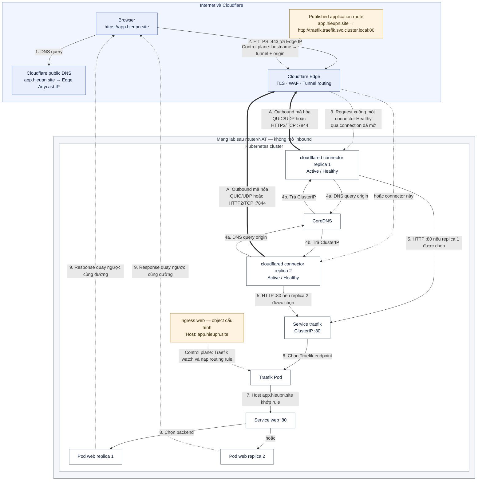
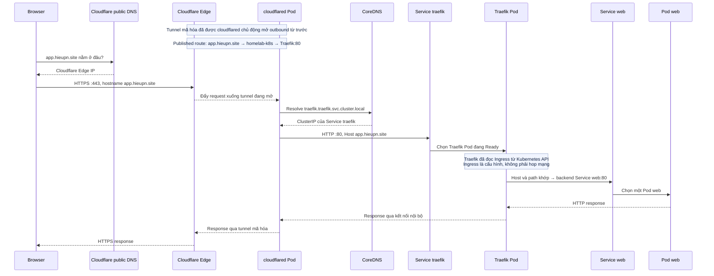

# Luồng Cloudflare Tunnel → Kubernetes qua Traefik

> Tài liệu này tách ra từ [§12.3.2 của runbook-k8s-vmware.md](../runbook-k8s-vmware.md#1232-hiểu-đầy-đủ-luồng-cloudflare-tunnel--kubernetes)
> để giữ runbook ở độ dài đọc được. Đây là phần **giải thích cơ chế**, không chứa bước thao tác:
> mọi lệnh, gate `PASS:` và thứ tự triển khai vẫn nằm trong runbook.
>
> Tham chiếu dạng `§12`, `§13`, `§12.3.1` trong bài trỏ về mục cùng số của
> [§12.3.2 của runbook-k8s-vmware.md](../runbook-k8s-vmware.md#1232-hiểu-đầy-đủ-luồng-cloudflare-tunnel--kubernetes). Tên gọi lấy đúng theo lab của runbook:
> hostname `app.hieupn.site`, tunnel `homelab-k8s`, Traefik ở namespace `traefik`, `cloudflared`
> ở namespace `cloudflare`.

Bố cục: hai sơ đồ tổng quan → bản kể lại bằng ngôn ngữ đơn giản → luồng end-to-end theo 14 bước
→ 12 mục đào sâu từng hop.

---

Điểm cốt lõi: **Cloudflare không chủ động mở một kết nối mới từ Internet vào IP của lab**. Chính các Pod `cloudflared` đang nằm trong Kubernetes đã mở kết nối outbound tới Cloudflare và giữ các kết nối đó hoạt động. Khi có request, Cloudflare truyền request xuống chính đường kết nối đã được mở sẵn.



Nét đậm `==>` là kết nối outbound do cả hai replica `cloudflared` chủ động mở và giữ; chúng đều Active/Healthy, không có replica primary/standby cố định. Nét đứt từ Edge cho biết mỗi request được đẩy xuống **một** connector Healthy qua connection đã mở sẵn. `Published application route` và `Ingress web` là control-plane/configuration, không phải hop mạng: route ánh xạ hostname public sang tunnel/origin, còn Traefik watch Ingress để nạp rule Host → Service. Response từ Pod web quay ngược qua chính chuỗi Traefik → `cloudflared` → Tunnel → Edge → Browser.

**Trình tự đầy đủ của một request và response:**



Sơ đồ tuần tự đọc từ trên xuống dưới. Mũi tên đi sang phải là chiều request vào ứng dụng; các mũi tên nét đứt quay sang trái là chiều response trở về browser. `Cloudflare public DNS` chỉ dẫn browser tới Edge, còn `CoreDNS` chỉ được Pod trong cluster dùng để tìm ClusterIP của Service Traefik.

## Cách đọc toàn bộ luồng §12 → §13 theo ngôn ngữ đơn giản

Có thể hình dung Cloudflare Edge là **cổng tiếp nhận công khai**, Tunnel là **đường hầm đã mở sẵn**, Pod `cloudflared` là **đầu đường hầm nằm trong cluster**, Traefik là **lễ tân đọc hostname để chọn ứng dụng**, Service là **địa chỉ ổn định của một nhóm backend**, còn Pod web là **server thật sự xử lý request và tạo response**.

Trước khi người dùng truy cập, §12 đã chuẩn bị năm liên kết:

1. Token gắn hai Pod `cloudflared` với tunnel `homelab-k8s`.
2. Hai Pod chủ động mở và giữ các kết nối outbound mã hóa tới Cloudflare; router/NAT của lab không mở inbound.
3. Public DNS làm cho `app.hieupn.site` được client phân giải tới Cloudflare Edge.
4. Published application route ánh xạ `app.hieupn.site` → tunnel `homelab-k8s` → origin `http://traefik.traefik.svc.cluster.local:80`.
5. Ingress làm cho Traefik nạp rule `Host: app.hieupn.site` → backend `Service web:80`.

Khi người dùng nhập `https://app.hieupn.site/`, URL cung cấp ba dữ kiện: `https` yêu cầu kết nối TLS công khai, `app.hieupn.site` là hostname dùng để chọn route, còn `/` là path gửi tới ứng dụng. Một request hoàn chỉnh đi qua các hop sau:

1. **Browser hỏi public DNS.** DNS trả một hoặc nhiều Cloudflare Anycast IP. Browser không nhận ClusterIP, Pod IP, worker IP hay IP router của lab.
2. **Browser mở HTTPS tới Cloudflare Edge trên port 443.** Cloudflare cung cấp certificate cho `app.hieupn.site`, kết thúc TLS public và nhận request mang hostname logic `Host: app.hieupn.site` (hoặc `:authority` tương đương khi dùng HTTP/2/HTTP/3).
3. **Cloudflare tra Published application route.** Hostname cho biết phải dùng tunnel `homelab-k8s` và origin nội bộ nào. Cloudflare chọn một connector `cloudflared` đang Healthy; một request bình thường không được gửi đồng thời tới cả hai replica.
4. **Cloudflare đẩy request xuống connection tunnel đã tồn tại.** Đây không phải một connection inbound mới tới IP lab. Dữ liệu đi ngược xuống chính session outbound mà Pod `cloudflared` đã chủ động mở qua router/NAT từ trước.
5. **Tunnel kết thúc tại Pod `cloudflared`.** Pod này nhận request rồi đóng vai trò reverse proxy/client để mở một connection nội bộ mới tới origin `traefik.traefik.svc.cluster.local:80`.
6. **`cloudflared` hỏi CoreDNS.** CoreDNS trả ClusterIP của Service `traefik` trong namespace `traefik`; public DNS không tham gia bước này và Cloudflare Edge cũng không thể tự phân giải tên `*.svc.cluster.local`.
7. **`cloudflared` gọi Service Traefik bằng HTTP port 80.** Kubernetes Service dataplane chuyển connection từ ClusterIP tới một Traefik Pod đang Ready. ClusterIP là địa chỉ ảo ổn định, không phải một server riêng.
8. **Traefik chọn đúng ứng dụng.** Traefik đã watch Kubernetes API và nạp rule từ Ingress trước đó. Request không đi xuyên qua object Ingress; Traefik chỉ so sánh `Host: app.hieupn.site` và path `/` với rule đã nạp. Khi khớp, backend logic là `Service web:80`.
9. **Service/backend chọn một Pod web.** Traefik/Kubernetes dùng các endpoint của Service `web` để chọn một Pod phù hợp. Pod web mới là server thực sự tạo nội dung `nginxdemos/hello`.

Response quay về trên các connection tương ứng theo chiều ngược lại:

```text
Pod web
→ Traefik
→ cloudflared
→ tunnel mã hóa
→ Cloudflare Edge
→ kết nối HTTPS
→ Browser
```

Router vẫn không nhận kết nối inbound mới: nó chỉ thấy traffic hai chiều thuộc session outbound đã được `cloudflared` thiết lập. Các chặng bảo mật cũng phải được phân biệt:

```text
Browser ── HTTPS :443 ──> Cloudflare Edge
Cloudflare Edge ══ tunnel mã hóa ══> cloudflared Pod
cloudflared Pod ── HTTP :80 nội bộ ──> Traefik → Pod web
```

Bốn lớp “route” trong chuỗi trả lời bốn câu hỏi khác nhau:

| Lớp | Câu hỏi được trả lời | Kết quả trong lab này |
| --- | --- | --- |
| Public DNS | Browser phải kết nối tới đâu? | Cloudflare Edge IP |
| Published application route | Hostname này thuộc tunnel và origin nào? | `app.hieupn.site` → `homelab-k8s` → Traefik:80 |
| Traefik Ingress rule | Request này thuộc ứng dụng nào? | Host/path khớp → `Service web:80` |
| Service/endpoints | Backend cụ thể nào nhận request? | Một Pod có label/endpoint của `web` |

Vì thế các kết quả nhìn thấy ở §13 thuộc các tầng khác nhau:

- `nslookup app.hieupn.site` trả Cloudflare Edge IP: mới chứng minh public DNS dẫn client tới đúng cổng Cloudflare.
- `curl -I https://app.hieupn.site` trả `HTTP 200`, `server: cloudflare` và `cf-ray`: chứng minh request đã đi qua Edge và chuỗi end-to-end trả được response headers; `server: cloudflare` không có nghĩa Cloudflare tạo nội dung ứng dụng.
- Body/trình duyệt hiện `Server address` và `Server name`: đây là Pod IP và tên Pod web đã xử lý request, không phải địa chỉ Cloudflare hay Traefik.

Tóm lại, request vào đúng Pod nhờ bốn lần lựa chọn liên tiếp: **hostname public → đúng Cloudflare Edge → đúng tunnel/origin → đúng Ingress/Service → đúng Pod backend**. Mười hai mục cuối tài liệu này phân tích sâu từng hop; §13 của runbook kiểm tra lần lượt DNS public, HTTPS headers và body thật của chính chuỗi này.

## Luồng end-to-end theo 14 bước

### Bước 1 — §12 chuẩn bị đường đi trước khi có request

Cloudflare tạo tunnel `homelab-k8s` và sinh token. Deployment trong namespace `cloudflare` dùng token đó để chạy hai Pod `cloudflared`. Cả hai connector đều Active/Healthy và chủ động mở các connection outbound dài hạn tới Cloudflare bằng QUIC/UDP `7844` hoặc HTTP/2/TCP `7844`.

```text
cloudflared Pod → router/NAT → Internet → Cloudflare
```

Cloudflare không mở connection mới vào master, worker hay router. Router chỉ cho phép session outbound do `cloudflared` khởi tạo; sau đó dữ liệu request và response đi hai chiều bên trong session đã tồn tại. Vì vậy lab không cần public IP cho Kubernetes, port-forward hoặc mở inbound `80`, `443`, `7844`.

§12 cũng chuẩn bị hai bảng route:

```text
Published application:
app.hieupn.site → homelab-k8s → http://traefik.traefik.svc.cluster.local:80

Kubernetes Ingress:
Host app.hieupn.site + Path / → Service web:80
```

### Bước 2 — Browser phân tích URL

Khi người dùng nhập:

```text
https://app.hieupn.site/
```

browser tách URL thành:

```text
https://  app.hieupn.site  /
│         │                 │
│         │                 └─ path gửi tới ứng dụng
│         └─ hostname dùng cho DNS, TLS và routing
└─ giao thức HTTPS
```

Browser cần tìm IP cho hostname, thiết lập TLS và gửi request cho path `/`.

### Bước 3 — Browser hỏi Cloudflare public DNS

Browser/hệ điều hành hỏi DNS: “`app.hieupn.site` nằm ở đâu?”. Vì record Tunnel ở trạng thái Proxied, DNS trả một hoặc nhiều Cloudflare Anycast IPv4/IPv6, không trả IP router, master, worker, ClusterIP hay Pod IP của lab.

```text
app.hieupn.site → Cloudflare Edge IP
```

Trong output `nslookup`, dòng `Server: 127.0.0.53` chỉ là DNS stub resolver cục bộ trên Ubuntu. Các địa chỉ trong `Non-authoritative answer` mới là kết quả phân giải hostname.

### Bước 4 — Browser mở HTTPS tới Cloudflare Edge

Browser kết nối tới Cloudflare Edge IP trên port `443`. Cloudflare đưa certificate hợp lệ cho `app.hieupn.site`, kết thúc TLS public rồi nhận request có hostname logic:

```http
GET / HTTP/1.1
Host: app.hieupn.site
```

Với HTTP/2 hoặc HTTP/3, tên trường trên wire có thể là `:authority`, nhưng ý nghĩa vẫn là hostname `app.hieupn.site`. Ở chặng này Cloudflare có thể áp dụng WAF, DDoS protection, cache và các edge rule. Browser chưa hề kết nối tới mạng lab.

### Bước 5 — Cloudflare chọn Published application route

Cloudflare đọc hostname và tìm thấy cấu hình:

```text
app.hieupn.site
→ tunnel homelab-k8s
→ origin http://traefik.traefik.svc.cluster.local:80
```

DNS chỉ đưa browser tới Cloudflare Edge. Published route mới cho Cloudflare biết request này thuộc tunnel nào và connector phải gọi origin nội bộ nào.

### Bước 6 — Cloudflare chọn một connector Healthy và đẩy request xuống tunnel

Cloudflare thấy hai connector của `homelab-k8s` đang Healthy rồi chọn một connector phù hợp cho request. Một request bình thường đi xuống một connector, không được nhân đôi tới cả hai replica.

```text
Không phải: Cloudflare → mở connection inbound mới tới IP lab

Mà là:     cloudflared → đã mở connection outbound tới Cloudflare
            Cloudflare → đẩy request xuống connection đang mở
```

Nếu một Pod `cloudflared` chết, connector còn lại tiếp tục nhận request. Hai replica tạo HA cho tunnel, không phải bộ cân bằng tải giữa các Pod web.

### Bước 7 — Tunnel kết thúc tại Pod `cloudflared`

Điểm cuối của tunnel trong lab là Pod `cloudflared`, không phải Traefik:

```text
Cloudflare Edge ══ tunnel mã hóa ══> cloudflared Pod
```

Sau khi nhận request, `cloudflared` đóng vai trò reverse proxy/client. Nó đọc Service URL của Published route rồi mở một connection HTTP nội bộ mới tới `traefik.traefik.svc.cluster.local:80`. Cloudflare Edge không trực tiếp truy cập địa chỉ `*.svc.cluster.local`.

### Bước 8 — `cloudflared` dùng CoreDNS tìm Service Traefik

Pod `cloudflared` phân giải origin qua CoreDNS của Kubernetes:

```text
traefik.traefik.svc.cluster.local:80
│       │       │   │             │
│       │       │   │             └─ Service port
│       │       │   └─ cluster domain nội bộ
│       │       └─ đối tượng Service
│       └─ namespace traefik
└─ tên Service traefik
```

CoreDNS trả ClusterIP của Service Traefik. Đây là hệ DNS nội bộ thứ hai, độc lập với Cloudflare public DNS.

### Bước 9 — Service Traefik chuyển connection tới Traefik Pod

`cloudflared` gọi:

```text
http://<Traefik-ClusterIP>:80
```

Kubernetes Service dataplane chọn một Traefik Pod đang Ready và chuyển connection tới Pod đó:

```text
cloudflared → Service traefik ClusterIP:80 → Traefik Pod
```

ClusterIP là địa chỉ ảo ổn định đại diện cho các endpoint, không phải một máy chủ riêng. Pod Traefik có thể bị tạo lại và đổi Pod IP mà Service DNS vẫn giữ nguyên.

### Bước 10 — Traefik dùng Host header để chọn đúng ứng dụng

Traefik đã watch Kubernetes API và nạp rule từ Ingress trước khi request đến. Object Ingress là cấu hình control plane, không phải một hop mà packet phải đi xuyên qua.

Hostname bắt nguồn từ URL người dùng nhập và được giữ qua từng chặng:

```text
Browser
  Host: app.hieupn.site
        ↓
Cloudflare Edge
  hostname: app.hieupn.site
        ↓ tunnel
cloudflared
  Host: app.hieupn.site
        ↓ HTTP origin request
Traefik
```

`cloudflared` kết nối mạng tới `http://<Traefik-ClusterIP>:80`, nhưng HTTP request bên trong connection vẫn mang `Host: app.hieupn.site`. ClusterIP/port giúp Kubernetes đưa connection tới Traefik Pod; Host header giúp Traefik chọn đúng Router. Vì Published application không đặt `HTTP Host Header` override nên hostname public không bị đổi thành `traefik.traefik.svc.cluster.local`.

Traefik so sánh hostname/path với rule:

```text
Host app.hieupn.site + Path /
→ backend Service web:80
```

Nếu Ingress còn dùng `app.example.com`, rule không khớp và Traefik thường trả `404`.

### Bước 11 — Service `web` chọn Pod backend

Ingress chỉ định backend logic là `Service web:80`. Traefik/Kubernetes dùng các endpoint của Service để chọn một Pod có label phù hợp, ví dụ `app=web`. Tùy cách Traefik được cấu hình, nó có thể dùng Service dataplane hoặc kết nối trực tiếp tới Pod endpoint đã lấy từ Kubernetes.

```text
Traefik → Service/endpoints web → một Pod web
```

Pod web mới là server thực sự xử lý request và tạo nội dung. Vì thế trang `nginxdemos/hello` có thể hiển thị:

```text
Server address: <Pod-IP>:80
Server name: web-<replicaset-hash>-<pod-suffix>
```

Chạy nhiều request có thể thấy Pod name/IP thay đổi do backend được chọn khác nhau.

### Bước 12 — Response quay ngược về browser

Pod web tạo HTTP response rồi trả về trên các connection tương ứng theo chiều ngược lại:

```text
Pod web
→ Traefik
→ cloudflared
→ tunnel mã hóa
→ Cloudflare Edge
→ kết nối HTTPS
→ Browser
```

Router/NAT không nhận một connection inbound mới. Nó chỉ chuyển traffic response thuộc session outbound mà `cloudflared` đã thiết lập. Ba chặng bảo mật là:

```text
Browser ── HTTPS :443 ──> Cloudflare Edge
Cloudflare Edge ══ tunnel mã hóa ══> cloudflared Pod
cloudflared Pod ── HTTP :80 nội bộ ──> Traefik → Pod web
```

Cloudflare có thể thêm các response header như `server: cloudflare` và `cf-ray`, sau đó gửi response về browser qua HTTPS. Nội dung trang vẫn do Pod web tạo ra.

### Bước 13 — §13 kiểm tra từng lớp của chuỗi

Ba phép kiểm tra có phạm vi khác nhau:

| Kiểm tra | Chứng minh được | Chưa tự chứng minh được |
| --- | --- | --- |
| `nslookup app.hieupn.site` | Public DNS dẫn client tới Cloudflare Edge | Tunnel, Traefik, Ingress và Pod còn hoạt động |
| `curl -I https://app.hieupn.site` | DNS, HTTPS/TLS, Published route, Tunnel và origin trả được headers | Nội dung body hiển thị đúng |
| `curl -sS https://app.hieupn.site` hoặc browser | Body thật đã được một Pod web xử lý và trả về | — |

`HTTP 200`, `server: cloudflare` và `cf-ray` cho biết response đã đi qua Cloudflare Edge. `Server address`/`Server name` trong body là IP và tên Pod web đã phục vụ request, không phải Cloudflare Edge hay Traefik.

### Bước 14 — Phân biệt bốn loại “route”

| Loại route | Câu hỏi nó trả lời | Ánh xạ trong lab |
| --- | --- | --- |
| **Public DNS route** | Browser phải kết nối tới đâu? | `app.hieupn.site` → Cloudflare Edge IP |
| **Published application route** | Hostname này thuộc tunnel và origin nào? | `app.hieupn.site` → `homelab-k8s` → `traefik...:80` |
| **Traefik Ingress route** | Request này thuộc ứng dụng/Service nào? | Host `app.hieupn.site`, path `/` → `Service web:80` |
| **Service/endpoint route** | Pod cụ thể nào nhận request? | `Service web` → một Pod endpoint Ready |

Bốn loại route thực hiện bốn lần lựa chọn nối tiếp, không thay thế nhau:

```text
Hostname public
→ đúng Cloudflare Edge
→ đúng tunnel và origin
→ đúng Ingress/Service
→ đúng Pod backend
```

## 1. `cloudflared` đã nằm bên trong cluster

Deployment ở §12.2 tạo hai Pod `cloudflared` trong namespace `cloudflare`. Vì là Pod Kubernetes, mỗi replica:

- dùng được mạng nội bộ của cluster;
- dùng CoreDNS để phân giải tên `*.svc.cluster.local`;
- truy cập được các Kubernetes Service;
- có egress ra Internet;
- dùng `TUNNEL_TOKEN` để đăng ký với cùng tunnel `homelab-k8s`.

Hai replica không cần hai tunnel riêng. Chúng cùng gắn vào một tunnel UUID để dự phòng: nếu một connector/worker lỗi, replica còn lại tiếp tục phục vụ. Replica `cloudflared` là cơ chế HA cho đường hầm, không phải bộ cân bằng tải backend ứng dụng; Kubernetes Service và Traefik đảm nhiệm việc phân phối request ở phía cluster. Xem [Cloudflare — Kubernetes deployment guide](https://developers.cloudflare.com/tunnel/deployment-guides/kubernetes/).

## 2. Pod chủ động mở đường outbound qua router/NAT

Khi container khởi động, `cloudflared` đọc token và mở các kết nối outbound dài hạn tới Cloudflare. Với `--protocol auto` mặc định, nó có thể dùng QUIC qua UDP `7844` hoặc HTTP/2 qua TCP `7844`. Cloudflare duy trì nhiều kết nối tới ít nhất hai data center để có dự phòng. Xem [Cloudflare Tunnel configuration](https://developers.cloudflare.com/tunnel/configuration/) và [Tunnel with firewall](https://developers.cloudflare.com/cloudflare-one/networks/connectors/cloudflare-tunnel/configure-tunnels/tunnel-with-firewall/).

Router chỉ thấy chiều khởi tạo:

```text
cloudflared Pod → router/NAT → Cloudflare
```

NAT/firewall tạo state cho session outbound. Sau khi session tồn tại, dữ liệu đi được hai chiều trong chính session đó. Cloudflare **không** quay lại mở kết nối trực tiếp tới IP riêng của master/worker, nên kiến trúc này không cần:

- IP public cho Kubernetes;
- port-forward trên router;
- mở inbound `80`, `443` hoặc `7844` vào lab;
- công bố IP worker hay ClusterIP ra Internet.

Dashboard `Healthy` với `Replicas = 2` chứng minh hai Pod đã đăng ký và giữ được đường kết nối từ cluster tới Cloudflare.

## 3. Published application là bảng ánh xạ hostname → origin nội bộ

Khai báo ở bước kế tiếp có ý nghĩa:

```text
Public hostname: app.hieupn.site
Tunnel:          homelab-k8s
Service URL:     http://traefik.traefik.svc.cluster.local:80
```

Tức là:

```text
Nếu Cloudflare nhận request cho app.hieupn.site
→ chọn tunnel homelab-k8s
→ gửi request xuống một connector Healthy
→ cloudflared gọi http://traefik.traefik.svc.cluster.local:80
```

Đây là cấu hình của **remotely-managed tunnel**, được lưu ở Cloudflare và áp dụng cho các connector của tunnel. Có thể publish nhiều hostname qua cùng một tunnel, mỗi hostname ánh xạ tới một service nội bộ khác nhau. Xem [Cloudflare — Published application routing](https://developers.cloudflare.com/tunnel/routing/).

## 4. Có hai hệ DNS độc lập

Khi lưu Published application trong Full Setup, Cloudflare tự tạo DNS record public tương đương:

```text
app.hieupn.site → <TUNNEL-UUID>.cfargotunnel.com
```

Record được proxy qua Cloudflare. Người dùng ngoài Internet nhận địa chỉ Anycast của Cloudflare, không nhận ClusterIP, Pod IP, worker IP hoặc IP router của lab.

Ở phía trong cluster, `cloudflared` lại dùng CoreDNS để phân giải origin:

| Hệ DNS               | Tên được phân giải              | Người dùng kết quả                                |
| --------------------- | ------------------------------------- | ------------------------------------------------------ |
| Cloudflare public DNS | `app.hieupn.site`                   | Browser ngoài Internet tìm tới Cloudflare Edge      |
| Kubernetes CoreDNS    | `traefik.traefik.svc.cluster.local` | Pod`cloudflared` tìm ClusterIP của Service Traefik |

Cloudflare Edge không phân giải và không truy cập trực tiếp tên `*.svc.cluster.local`; tên này chỉ có nghĩa sau khi request đã xuống Pod `cloudflared` bên trong cluster. Kubernetes định nghĩa DNS Service theo dạng `<service>.<namespace>.svc.<cluster-domain>`; xem [Kubernetes — DNS for Services and Pods](https://kubernetes.io/docs/concepts/services-networking/dns-pod-service/).

## 5. Request từ browser tới Cloudflare Edge

Khi người dùng mở:

```text
https://app.hieupn.site
```

trình duyệt thực hiện:

1. Hỏi DNS public và nhận địa chỉ Cloudflare.
2. Mở HTTPS tới Cloudflare Edge trên port `443`.
3. Nhận certificate cho `app.hieupn.site` từ Cloudflare.
4. Gửi request có HTTP Host header `app.hieupn.site`.
5. Cloudflare có thể áp dụng TLS termination, WAF, DDoS protection, cache và các rule ở edge.

Browser kết nối tới Cloudflare, **không** kết nối tới router hay worker của lab.

## 6. Cloudflare gửi request xuống đường hầm đã tồn tại

Cloudflare dùng hostname và DNS/tunnel route để xác định tunnel UUID. Nó chọn một connector đang Healthy rồi multiplex request xuống kết nối mã hóa mà connector đó đã mở từ trước:

```text
Không phải: Cloudflare → mở kết nối mới vào IP lab

Mà là:     cloudflared → mở kết nối outbound tới Cloudflare
            Cloudflare → trả request xuống kết nối đang mở
```

Nếu một Pod `cloudflared` chết, replica còn lại có thể tiếp tục. Nếu không còn connector nào Healthy nhưng DNS record vẫn tồn tại, Cloudflare không tới được origin; DNS record không tự biến mất chỉ vì tunnel dừng. Xem [Cloudflare Tunnel overview](https://developers.cloudflare.com/tunnel/) và [Cloudflare routing](https://developers.cloudflare.com/tunnel/routing/).

## 7. Tunnel kết thúc tại Pod `cloudflared`

Tunnel không kết thúc tại Traefik. Điểm cuối trong lab là Pod `cloudflared`, và Pod này tiếp tục đóng vai trò reverse proxy/client cho origin nội bộ:

```text
Cloudflare Edge ══ tunnel mã hóa ══> cloudflared Pod
cloudflared Pod ── HTTP nội bộ ──> Traefik Service
```

Service URL không phải địa chỉ mà Cloudflare Edge truy cập trực tiếp. Nó là chỉ dẫn để `cloudflared`, sau khi nhận request trong cluster, mở một connection mới tới origin.

## 8. `cloudflared` dùng CoreDNS tìm Service Traefik

Tên origin được tách như sau:

```text
traefik.traefik.svc.cluster.local:80
│       │       │   │             │
│       │       │   │             └─ Service port HTTP
│       │       │   └─ DNS domain nội bộ mặc định
│       │       └─ đối tượng Kubernetes Service
│       └─ namespace
└─ tên Service
```

CoreDNS trả ClusterIP của Service `traefik`. `cloudflared` gọi Service port `80`; cơ chế dataplane của Kubernetes chuyển connection tới một Pod Traefik đang Ready. Dùng Service DNS thay vì Pod IP giúp origin ổn định khi Pod Traefik bị tạo lại hoặc đổi IP.

## 9. Traefik dùng Host header chọn đúng ứng dụng

Request đến Traefik vẫn mang:

```http
Host: app.hieupn.site
```

Ta không đặt **HTTP Host Header override**, nên không yêu cầu `cloudflared` thay hostname gửi tới origin. Traefik so sánh Host header với Ingress đã PASS §12.3.1:

```yaml
spec:
  rules:
    - host: app.hieupn.site
      http:
        paths:
          - path: /
            backend:
              service:
                name: web
                port:
                  number: 80
```

Khi hostname khớp, Traefik chuyển request tới Service `web:80`. Nếu Ingress còn `app.example.com`, Traefik không tìm thấy Router phù hợp và thường trả `404`. Tùy chọn `httpHostHeader` chỉ cần khi muốn chủ động ghi đè Host gửi tới origin; xem [Cloudflare — Origin parameters](https://developers.cloudflare.com/tunnel/advanced/origin-parameters/).

## 10. Service `web` chọn Pod và response quay ngược lại

Service `web` chọn các Pod có label `app=web` rồi chuyển request tới một backend. Pod tạo response có thể chứa:

```text
Server address: <Pod-IP>:80
Server name: web-<replicaset-hash>-<pod-suffix>
```

Response đi ngược đúng chuỗi:

```text
Pod web
→ Service web
→ Traefik
→ cloudflared
→ tunnel mã hóa
→ Cloudflare Edge
→ Browser
```

Chạy request nhiều lần có thể thấy `Server name`/`Server address` thay đổi giữa hai Pod web; việc chọn backend thuộc tầng Kubernetes Service/Traefik, không phải hai replica `cloudflared`.

## 11. Vì sao browser dùng HTTPS nhưng Service URL dùng HTTP?

Hai trường này thuộc hai chặng khác nhau:

```text
Browser ── HTTPS ──> Cloudflare Edge
Cloudflare Edge ══ tunnel mã hóa ══> cloudflared
cloudflared ── HTTP nội bộ ──> Traefik:80
```

Cloudflare xử lý certificate và TLS public ở edge; kết nối Edge ↔ `cloudflared` được tunnel bảo vệ. `Type=HTTP` hoặc scheme `http://` chỉ mô tả chặng cuối từ Pod `cloudflared` tới Traefik bên trong cluster. Nếu threat model yêu cầu mã hóa cả chặng nội bộ, có thể cấu hình HTTPS origin riêng; lab này dùng HTTP để tránh quản lý thêm certificate nội bộ.

## 12. Ba liên kết mà bước Published application tạo ra

```text
1. Public DNS
   app.hieupn.site → Cloudflare

2. Tunnel routing
   app.hieupn.site → homelab-k8s

3. Internal origin
   homelab-k8s → http://traefik.traefik.svc.cluster.local:80
```

Điều đưa traffic từ Cloudflare vào Kubernetes là tổ hợp của **các Pod `cloudflared` nằm trong cluster**, **kết nối outbound dài hạn do chúng mở**, và **route ánh xạ hostname public tới Kubernetes Service nội bộ** — không phải port-forward hay public IP của lab.
