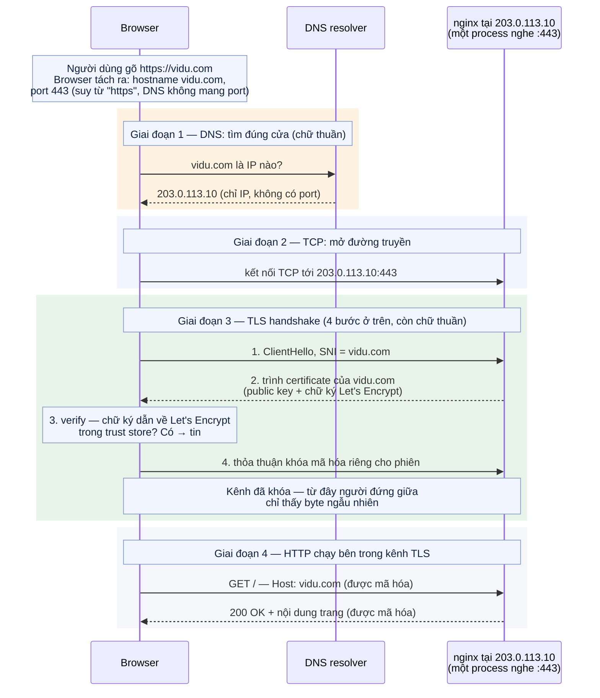
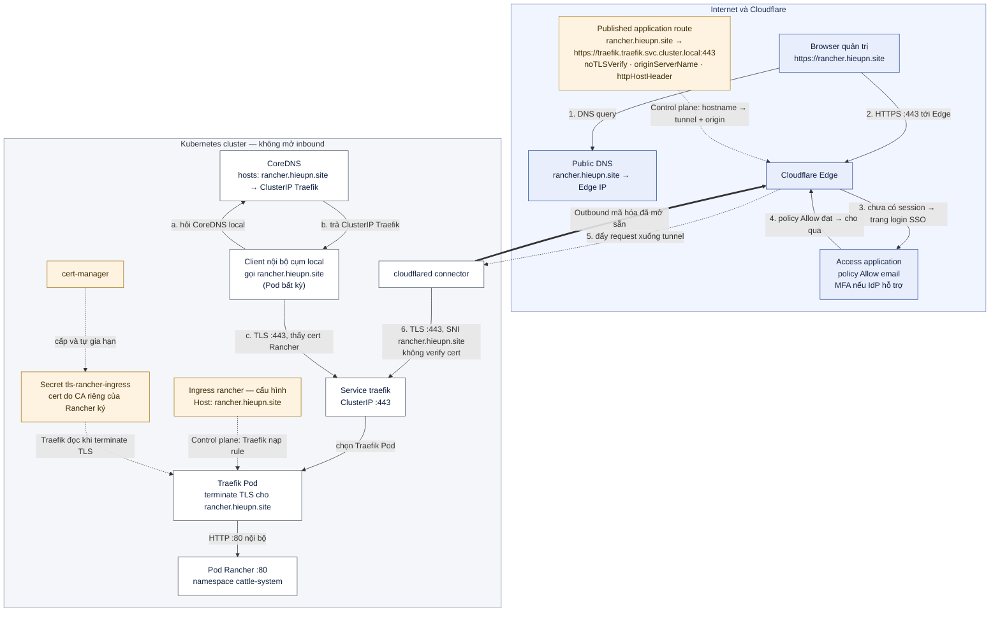
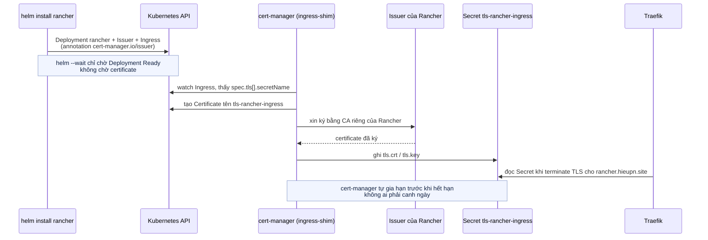

# Cơ chế cài Rancher vào cụm kubeadm — toàn cảnh §14

> Tài liệu này tách ra từ [§14 của runbook-k8s-vmware.md](../runbook-k8s-vmware.md#14-cài-rancher-2143--quản-lý-cụm)
> để giữ runbook ở độ dài đọc được. Đây là phần **giải thích cơ chế**, không chứa bước thao tác:
> mọi lệnh, gate `PASS:` và thứ tự triển khai vẫn nằm trong runbook.
>
> Tham chiếu dạng `§14.1`, `§14.5` trong bài trỏ về mục cùng số của runbook. Tên gọi lấy đúng theo
> lab: hostname `rancher.hieupn.site`, tunnel `homelab-k8s`, Traefik ở namespace `traefik`,
> `cloudflared` ở namespace `cloudflare`, Rancher ở namespace `cattle-system`.
>
> Luồng tunnel chung — Edge, connector outbound, Published application route, bốn lớp "route" —
> đã phân tích ở [`tunnel-traefik.md`](tunnel-traefik.md) cho app demo `app.hieupn.site`. Bài này
> không lặp lại phần đó; nó tập trung vào những gì Rancher **thêm vào** chuỗi: TLS nội bộ,
> hai đường vào cùng một hostname, và lớp Cloudflare Access.

Bố cục: nhìn nhanh §14 cài gì và để làm gì → có thể setup đơn giản như app demo không (chuỗi
domino từ một quyết định an ninh) → từ điển khái niệm nền (HTTP/HTTPS/TLS,
certificate/CA, terminate TLS/SNI, ví dụ tự host một web server, CRD/webhook, etcd, các vai
cluster quanh Rancher, `cattle-cluster-agent`, Server URL, origin, vì sao không mở inbound,
SSO/Access, split DNS, bảng từ nhanh) → sơ đồ toàn cảnh hai đường vào → sơ đồ tuần tự
chuỗi cấp certificate → bản kể lại §14.0 → §14.7 bằng ngôn ngữ đơn giản → nền tảng ba công cụ
Helm / cert-manager / Rancher → giải thích từng mục §14.0 → §14.7 (mỗi lệnh, mỗi flag, mỗi key
trong values) → 15 mục đào sâu từng cơ chế.

## Nhìn nhanh — §14 cài gì và để làm gì

§14 làm đúng một việc: **đưa Rancher — giao diện web quản trị Kubernetes — vào chạy ngay trong
cluster của lab, rồi mở đường truy cập tới nó một cách an toàn**. Kết quả cuối: từ browser gõ
`https://rancher.hieupn.site`, vượt qua trang đăng nhập SSO của Cloudflare, vào được UI Rancher
và thấy cluster của lab hiện tên `local` ở trạng thái Active.

Từng mục của §14 đóng góp vào kết quả đó như sau:

| Mục | Cài / tạo gì | Phục vụ điều gì |
| --- | --- | --- |
| §14.0 | Không cài gì — kiểm tra cluster rồi backup etcd + `/etc/kubernetes` | Chắc chắn cluster đủ khỏe để nhận Rancher, và có đường lui nếu §14 hỏng giữa chừng |
| §14.1 | **cert-manager** (Helm chart) | "Nhà máy" tự cấp và tự gia hạn certificate TLS — Rancher ở §14.3 sẽ giao việc cấp TLS cho nó |
| §14.2 | Một entry `hosts` trong ConfigMap CoreDNS (**split DNS**) | Client trong cluster gọi `rancher.hieupn.site` đi thẳng nội bộ, không vòng ra Internet |
| §14.3 | **Rancher** (Helm chart) | Bản thân ứng dụng quản trị: UI + API + bộ controller, chạy trong namespace `cattle-system` |
| §14.4 | Không cài gì — test HTTPS từ trong cluster | Chứng minh chuỗi nội bộ Traefik → TLS → Rancher đã thông trước khi mở ra Internet |
| §14.5 | **Access application** + **Published application route** trên Cloudflare | Mở đường từ Internet vào Rancher, với cổng gác SSO đứng chắn trước |
| §14.6 | Không cài thêm gì — đăng nhập lần đầu | Lấy bootstrap password từ trong cluster, đặt mật khẩu admin, chốt Server URL |
| §14.7 | Không cài gì — gate hoàn thành | Kiểm kê mọi thứ đúng như đã khai báo trước khi coi §14 là xong |

Vì sao "cài một web app" mà tốn tám mục? Vì Rancher là giao diện quản trị nắm quyền cao nhất
trên cluster, nên nó cần ba thứ mà app demo của §13 không cần: **HTTPS thật ngay tại origin**
(sinh ra cert-manager và CA riêng), **đường gọi nội bộ không phụ thuộc Internet** (sinh ra split
DNS), và **cổng gác danh tính trước khi lộ ra Internet** (sinh ra Cloudflare Access). Ba nhu cầu
đó đẻ ra gần hết thuật ngữ của bài; phần từ điển ngay dưới định nghĩa từng cái trước khi đi vào
cơ chế — mở đầu bằng chính cụm khó nhất vừa nêu: HTTP/HTTPS/TLS là gì, origin là gì, và
"HTTPS thật ngay tại origin" nghĩa là sao.

### Có thể setup Rancher đơn giản như app demo không?

**Câu trả lời thẳng: được, và nó sẽ chạy.** Cấu hình đó tồn tại thật (Rancher gọi là
`tls=external`): route `http://…:80`, không cert trong cluster, không Access, không split DNS.
Khi đó mọi luồng đều hoạt động:

| Luồng | Kết quả |
| --- | --- |
| Browser mở `https://rancher.hieupn.site` | ✅ Chạy — HTTPS do Edge lo bằng cert public, y như app demo |
| Đăng nhập, dùng UI | ✅ Chạy |
| Pod nội bộ gọi Server URL | ✅ Chạy — đi vòng qua Edge, cert public hợp lệ nên verify OK |
| Import downstream cluster, agent gọi về | ✅ Chạy — với `agentTLSMode: system-store`, agent tin cert public của Cloudflare |

Không có gì gãy — tức là **không có yêu cầu kỹ thuật nào ép buộc cách setup của §14 cả**.

**Lý do thật sự chỉ có một, và nó không phải kỹ thuật.** So sánh hai thứ đứng sau hai hostname:
kẻ lạ trên Internet mở `app.hieupn.site` thấy trang "hello" của nginx — hết, không có gì để
đăng nhập, không có gì để đánh cắp; phơi nó ra Internet là vô hại vì nó không cầm gì cả. Kẻ lạ
mở `rancher.hieupn.site` (bản setup đơn giản) thấy **form đăng nhập + toàn bộ API** của công cụ
đang cầm quyền `cluster-admin` — giữa kẻ đó và toàn bộ cluster chỉ còn **một lớp: mật khẩu
Rancher**. Bot quét Internet sẽ tìm ra trang này trong vài giờ, thử mật khẩu vô hạn lần, và chờ
CVE tiếp theo của Rancher (Rancher từng có lỗ hổng auth nghiêm trọng — không phải giả định).
Quyết định duy nhất của §14 là: **không chấp nhận để cả Internet nói chuyện trực tiếp với thứ
cầm chìa khóa tổng.** App demo không phải đưa ra quyết định này vì nó chẳng cầm chìa khóa nào.

**Toàn bộ phức tạp còn lại là domino đổ từ quyết định đó:**

```text
QUYẾT ĐỊNH: chặn người lạ TRƯỚC KHI họ chạm được Rancher
   ↓ hệ quả 1
Phải đặt Access ở Edge — kiểm danh tính bằng SSO (§14.5)
   ↓ hệ quả 2 (tác dụng phụ)
Access chặn luôn client dạng máy (máy không đăng nhập SSO được)
→ máy trong cụm cần một cửa riêng không đi qua Access → SPLIT DNS (§14.2)
   ↓ hệ quả 3
Cửa riêng đó phải phục vụ đúng URL https://rancher.hieupn.site
(https là yêu cầu cứng duy nhất của Rancher — Server URL không nhận http://)
→ cửa nội bộ phải tự trình cert cho tên này → CERT-MANAGER + CA RIÊNG (§14.1, §14.3)
   ↓ tùy chọn gia cố thêm
agentTLSMode: strict — khóa vòng agent về đúng một CA (§14.3)
```

Đọc ngược cũng đúng: **bỏ quyết định đầu tiên đi thì cả chuỗi domino biến mất** — không cần
Access thì không cần split DNS, không cần split DNS thì client đi vòng qua Edge dùng cert
public, không cần cert nội bộ, không cần cert-manager. Và đó *chính xác* là cấu hình của app
demo.

> Rancher không phức tạp hơn app vì kỹ thuật đòi hỏi — nó phức tạp hơn vì lab **chọn trả thêm
> bốn bước cài đặt để đổi lấy việc kẻ tấn công không bao giờ được nhìn thấy trang login của thứ
> cầm `cluster-admin`**. App demo không có gì để bảo vệ nên không phải trả gì. Chọn ngược lại
> (chạy Rancher public như app, dựa vào mật khẩu mạnh + MFA + vá nhanh) là một lựa chọn có thật
> ngoài đời — chỉ là lab này không chọn thế.

## Từ điển khái niệm nền

Mục này gom các khái niệm mà phần còn lại của bài dùng như từ đã biết, xếp theo bốn lớp:
TLS → Kubernetes → Rancher → Cloudflare, khép lại bằng split DNS (thứ nối hai thế giới), một
bảng từ nhanh và chỉ dẫn tra những từ thuộc tài liệu khác. Đọc hết một lượt trước; các phần sau
không dừng lại định nghĩa nữa.

### HTTP, HTTPS và TLS — từ kênh chữ thuần tới kênh có khóa

**HTTP (HyperText Transfer Protocol)** là giao thức hỏi–đáp giữa client và server: client gửi
request (method như `GET`/`POST`, đường dẫn, các header như `Host`), server trả response (mã
trạng thái như `200`/`404`/`502`, header, nội dung). Toàn bộ trao đổi là **chữ thuần** truyền
thẳng trên mạng: mọi thiết bị đứng giữa — WiFi, router, ISP, proxy — đều đọc được và sửa được
từng byte, và server **không phải chứng minh nó là ai** — HTTP không có khái niệm certificate.
Cổng quy ước là `:80`.

**TLS (Transport Layer Security)** là lớp bọc sửa cả hai điểm yếu đó. Trước khi byte HTTP đầu
tiên được gửi, client và server phải xong màn chào hỏi gọi là **handshake** (kể đơn giản):

1. Client chào server, khai hostname nó muốn gặp (chính là SNI — xem mục "Terminate TLS và
   SNI" bên dưới).
2. Server **trình certificate** — tấm thẻ chứa public key của server và chữ ký của CA (mục kế
   tiếp định nghĩa kỹ). Cert được trình cho *mọi* client kết nối tới, nó không phải bí mật.
3. Client đối chiếu chữ ký trên cert với danh sách CA nó tin — bước **verify**.
4. Hai bên thỏa thuận khóa mã hóa dùng riêng cho phiên này; từ đây mọi byte đi qua đều được mã
   hóa và chống sửa trộm.

**HTTPS** đơn giản là **HTTP chạy bên trong kênh TLS đó**, cổng quy ước `:443`. Nội dung
request/response không đổi; chỉ khác là người đứng giữa giờ chỉ thấy các byte ngẫu nhiên.

Toàn bộ đường đi, mô phỏng trên ví dụ tự host `https://vidu.com` (server và cấu hình của ví dụ
này được dựng đầy đủ ở mục "Ghép tất cả lại" bên dưới):



Đọc sơ đồ này cần để ý hai điều. Thứ nhất, **thứ tự là bắt buộc**: DNS phải xong mới có IP để
mở TCP, TCP phải xong mới handshake được, handshake phải xong thì byte HTTP đầu tiên mới được
gửi — vì vậy mọi thứ dùng để *chọn cert* phải nằm trong giai đoạn 3 (SNI), không thể dựa vào
thứ nằm ở giai đoạn 4 (`Host` header). Thứ hai, **ranh giới mã hóa nằm giữa giai đoạn 3 và 4**:
DNS query và ClientHello là chữ thuần, nên người đứng giữa vẫn biết bạn *kết nối tới* `vidu.com`
— nhưng không đọc được đường dẫn, nội dung trang hay dữ liệu form, vì toàn bộ HTTP đã nằm trong
kênh khóa.

Điểm hay nhầm nhất — và là chìa khóa của cả bài: **trình cert và verify cert là hai việc khác
nhau, ở hai phía khác nhau**. Server nào phục vụ HTTPS cũng trình cert (bước 2 luôn diễn ra);
khác biệt nằm ở bước 3, do client quyết định:

| Client làm gì ở bước verify | Kết quả | Ví dụ trong bài |
| --- | --- | --- |
| Verify, chữ ký dẫn về CA nó tin | Kênh vừa mã hóa vừa **biết chắc đang nói với ai** | Browser ⇄ Cloudflare Edge; agent với `agentTLSMode: strict` |
| Verify, FAIL (unknown authority) | Ngắt kết nối / báo lỗi | `cloudflared` nếu để `noTLSVerify: false` với CA riêng — lỗi `x509`, browser nhận `502` |
| Chủ động bỏ verify (`curl -k`, `noTLSVerify: true`) | Vẫn mã hóa nhưng **không biết đang nói với ai** — chống nghe lén, không chống giả mạo | Gate §14.4 và hop `cloudflared` → Traefik |

Từ đó đọc được cụm "**HTTPS thật ngay tại origin**" ở phần Nhìn nhanh. **Origin** là server
thật đứng sau Cloudflare — nơi request cuối cùng phải tới; ở lab là Traefik (định nghĩa đầy đủ
ở mục "Origin và origin parameter" bên dưới). Với app demo của §13, HTTPS chỉ tồn tại ở đoạn
browser ⇄ Cloudflare Edge; hop cuối vào cluster chạy HTTP thường — không TLS, không cert nào
được trình. Với Rancher thì khác: chính origin cũng phục vụ HTTPS với certificate riêng — client
bên trong cluster mở kết nối là được trình cert thật, và verify được nếu được phát CA. Nhu cầu
"origin phải có cert để trình" đó là thứ kéo cert-manager và CA riêng vào §14, điều app demo
không cần.

### Certificate, CA và "ký" — nền của mọi kết nối TLS

Khi client mở kết nối HTTPS, server phải trình một **certificate** (bước 2 của handshake ở mục
trên) — một file nhỏ gồm ba phần chính: tên server (hostname), public key của server, và
**chữ ký** của bên phát hành. Certificate tồn tại để trả lời câu hỏi: "server đang nói chuyện
với mình có đúng là `rancher.hieupn.site` không, hay là kẻ giả mạo đứng giữa?".

**CA (Certificate Authority — nhà phát hành certificate)** là bên giữ một private key gốc chuyên
dùng để **ký** certificate cho người khác. "Ký" là tạo chữ ký số: bất kỳ ai cầm certificate gốc
của CA (chứa public key của CA) đều tự kiểm tra được một certificate có thật do CA đó phát hành
và chưa bị sửa hay không — nhưng không ai làm giả được chữ ký nếu không có private key của CA.
Hình dung đơn giản: CA là **con dấu** — private key là con dấu thật (thứ đóng được dấu),
certificate gốc của CA là mẫu con dấu công bố cho mọi người đối chiếu.

Mỗi client (browser, `curl`, `cloudflared`, agent…) giữ một **trust store** — danh sách mẫu con
dấu mà nó công nhận. Luật duy nhất của trò chơi: client chỉ chấp nhận certificate mà chữ ký dẫn
về được một CA trong trust store **của chính nó**. OS và browser xuất xưởng với sẵn hàng trăm
**public CA** (Let's Encrypt, DigiCert…) — vì thế cert do public CA ký được "cả thế giới" tin
sẵn. Ngược lại, ai cũng tự tạo được một **private CA** (một cặp key + certificate gốc tự ký):
cert do nó ký chỉ được tin bởi client nào được chủ động phát mẫu con dấu, còn mọi client khác
đều báo "unknown authority".

### Terminate TLS và SNI — ai giữ cert, ai khai tên

**Terminate TLS** (kết thúc TLS) là điểm mà kênh mã hóa dừng lại: server tại điểm đó giữ
certificate + private key, thực hiện handshake và giải mã traffic; phía sau nó có thể là một
kênh khác. Trong lab, Traefik terminate TLS cho `rancher.hieupn.site` — cert nằm trong Secret
`tls-rancher-ingress` mà Traefik đọc, **không** nằm trong Pod Rancher — rồi nói chuyện với Pod
Rancher bằng HTTP `:80` (`ingress.servicePort: 80`). Vì thế "client thấy HTTPS" và "Rancher nghe
HTTP" không mâu thuẫn: đoạn được mã hóa kết thúc ở Traefik.

Ba chi tiết làm mô tả trên chính xác hẳn:

**1. Cert không phải thứ trực tiếp "giải mã traffic" — nó phục vụ handshake.** Trình tự chính
xác, khớp với 4 bước handshake trong mục HTTP/HTTPS/TLS ở trên:

```text
(từ trước)  Traefik đã watch Ingress/Secret và nạp sẵn cert + private key vào bộ nhớ
1. Kết nối TLS tới :443 → client khai SNI = rancher.hieupn.site
2. Traefik tra SNI, rút đúng cert (từ tls-rancher-ingress) ra trình          ← cert dùng ở ĐÂY
3. Client xử lý cert (verify hoặc bỏ qua tùy client)
4. Hai bên thỏa thuận KHÓA PHIÊN                                             ← thứ giải mã là ĐÂY
→  Từ đó mọi byte được mã hóa/giải mã bằng khóa phiên, không phải bằng cert
```

Tức là: cert + private key là "căn cước + chữ ký" để lập kênh; còn việc mã hóa/giải mã dữ liệu
chạy bằng khóa phiên sinh ra ở bước 4. Nói "lấy cert rồi giải mã" là cách nói gọn chấp nhận
được, nhưng cơ chế thật là "dùng cert để lập kênh, dùng khóa phiên để giải mã".

**2. Sau khi giải mã, Traefik không chuyển mù xuống Pod.** Nó là lễ tân, không phải ống nước:
đọc HTTP trần vừa giải mã → lấy `Host` header + path → khớp với router đã nạp từ Ingress
`rancher` → gắn thêm header như `X-Forwarded-Proto: https` (để Rancher biết client gốc dùng
HTTPS, tránh redirect-loop — mục đào sâu 10) → rồi mới mở kết nối HTTP `:80` tới Service
`rancher`, và Service chọn Pod. Nếu `Host` không khớp router nào thì trả `404` ngay tại
Traefik, Pod Rancher không bao giờ thấy request.

**3. "Kết thúc TLS" là điểm hai chiều, không chỉ giải mã chiều vào.** Response từ Pod Rancher
quay về Traefik dạng HTTP trần, và chính Traefik mã hóa nó vào cùng phiên TLS để trả cho
client. Nên chính xác hơn là: Traefik là điểm mà kênh mã hóa **bắt đầu và kết thúc về phía
cluster** — bóc phong bì chiều vào, dán phong bì chiều ra.

Lưu ý về phạm vi: cơ chế trên không chỉ áp dụng cho traffic từ tunnel gửi đến — cùng cơ chế đó
áp dụng cho **cả hai đường**: client nội bộ trong cụm gọi thẳng ClusterIP `:443` cũng được
Traefik terminate y hệt, cùng cert, cùng khóa phiên riêng của nó. Đó chính là ý "hai đường gặp
nhau tại Traefik `:443`" trong sơ đồ toàn cảnh.

**Vậy `noTLSVerify: true` tác dụng ở đâu trong trình tự này?** Đúng một chỗ duy nhất — bước 3,
dòng "Client xử lý cert":

```text
1. Client khai SNI                              ← noTLSVerify không liên quan
2. Traefik trình cert                           ← vẫn diễn ra nguyên vẹn, không bị ảnh hưởng
3. Client xử lý cert                            ← noTLSVerify: true tác dụng Ở ĐÂY:
                                                   cloudflared chọn nhánh "bỏ qua" — không
                                                   đối chiếu chữ ký về CA nào cả
4. Thỏa thuận khóa phiên                        ← vẫn diễn ra → kênh vẫn mã hóa
```

Cụ thể: khi `cloudflared` nhận cert của Traefik ở bước 2, thay vì tra chữ ký về trust store
(nơi CA riêng của Rancher không có mặt — nếu verify sẽ ra `x509: certificate signed by unknown
authority` và ngắt ngay tại đây, browser nhận `502`), nó nhảy thẳng qua bước 4. Handshake vẫn
hoàn tất, khóa phiên vẫn được thỏa thuận, kênh vẫn mã hóa — chỉ thiếu mất phần "biết chắc đang
nói với ai". Đó chính là câu "mã hóa nhưng không xác thực" của mục đào sâu 12.

Các phần còn lại hoàn toàn nằm ngoài tầm với của `noTLSVerify`:

- **Chi tiết 1, các bước 1, 2, 4** — SNI vẫn được khai (do `originServerName` quyết định),
  Traefik vẫn trình cert, khóa phiên vẫn sinh. `noTLSVerify` không làm cert "biến mất" khỏi
  handshake.
- **Chi tiết 2** — routing sau giải mã (`Host` header khớp router, `X-Forwarded-Proto`) là
  chuyện của Traefik với HTTP trần, diễn ra *sau khi* TLS đã xong, không dính gì tới verify.
- **Chi tiết 3** — chiều mã hóa response dùng khóa phiên đã thỏa thuận, cũng không liên quan.

Và giới hạn phạm vi: bước 3 đó chỉ bị `noTLSVerify` chi phối trong các phiên TLS do
`cloudflared` khởi tạo. Client nội bộ bắt tay với cùng Traefik ấy có bước 3 của riêng nó —
verify hay bỏ qua là do trust store hoặc cờ (`curl -k`) của chính client đó quyết định.

**SNI (Server Name Indication)** là trường trong bước chào của TLS handshake: client khai
hostname nó muốn nói chuyện **trước khi** có bất kỳ byte HTTP nào.

Vì sao phải khai sớm như vậy? Một server thường phục vụ **nhiều hostname trên cùng một IP và
cổng** — chính Traefik của lab là ví dụ: mọi Ingress đều đổ về một Service ClusterIP duy nhất,
cổng `:443`. Mỗi hostname có certificate riêng, và server phải chọn đúng cert để trình ngay ở
bước 2 của handshake. Nhưng tại thời điểm đó server chưa có cách nào biết client muốn gặp ai:
header `Host` — thứ vẫn dùng để phân biệt hostname — là dữ liệu HTTP, mà HTTP chỉ chạy **sau
khi** handshake xong. Thành vòng con gà – quả trứng: muốn lập kênh phải trình cert → muốn chọn
cert phải biết hostname → muốn biết hostname phải đọc HTTP → muốn đọc HTTP phải lập kênh xong.
SNI phá vòng đó bằng cách cho client khai hostname dạng chữ thuần ngay trong gói chào đầu tiên.

Ví dụ ngay trên Traefik của lab — cùng một địa chỉ, hai câu trả lời:

```text
Client A ── ClientHello, SNI = rancher.hieupn.site ──> Traefik :443
Client A <── cert của rancher.hieupn.site (Secret tls-rancher-ingress) ──

Client B ── ClientHello, không có SNI (gọi bằng IP trần) ──> cùng Traefik :443 đó
Client B <── cert default tự ký "TRAEFIK DEFAULT CERT" ──
```

Client A khai SNI nên Traefik tra được đúng cert trong Secret `tls-rancher-ingress`. Client B
gọi thẳng `https://<ClusterIP>` — kiểu gọi bằng IP không gửi SNI — nên Traefik không biết chọn
cert nào, đành trả cert default tự ký của nó. Nếu mai này cluster có thêm `grafana.hieupn.site`
với cert riêng, vẫn chỉ một cổng `:443` đó phục vụ tất cả: SNI là thứ quyết định cert nào được
rút ra trình.

Hiểu SNI thì đọc được hai chi tiết của runbook: `curl --resolve` ở §14.4 ép kết nối tới thẳng
ClusterIP nhưng **giữ nguyên hostname** để SNI vẫn đúng (gọi bằng IP trần thì chỉ nhận cert
default như Client B); và `originServerName` của route §14.5 chính là chỗ đặt SNI cho hop
`cloudflared` → Traefik (mục đào sâu 12).

### Ghép tất cả lại — ví dụ tự host một web server có domain, không K8s

Tạm quên K8s và Cloudflare. Bạn có một server với IP public `203.0.113.10`, muốn phục vụ
`https://vidu.com` bằng nginx. Bốn chỗ phải cấu hình:

1. **DNS — chỗ "config domain".** Trong trang quản lý DNS của domain (ở registrar nơi mua
   domain, hoặc dịch vụ DNS riêng), tạo **A record** `vidu.com → 203.0.113.10`. Đó là *toàn bộ*
   phần cấu hình domain: một bảng **tên → IP**, không hơn. DNS **không mang thông tin port** —
   port do browser tự suy từ scheme (`https://` → `:443`, `http://` → `:80`). Hệ quả: muốn
   người dùng chỉ gõ domain là vào được thì server phải nghe `:443`; nghe port khác vẫn chạy
   nhưng URL phải kèm `:port` tường minh (`https://vidu.com:8443`).
2. **Firewall/NAT.** Mở inbound `:80` + `:443` vào server (firewall của máy, security group,
   port-forward trên router nếu sau NAT).
3. **Web server.** Một process nginx nghe cả hai cổng — không có "service TLS" riêng nào:

   ```nginx
   server { listen 80;  server_name vidu.com; return 301 https://vidu.com$request_uri; }
   server {
       listen 443 ssl;
       server_name vidu.com;                 # khớp với SNI/Host mà client gửi
       ssl_certificate     /etc/ssl/vidu.com/fullchain.pem;
       ssl_certificate_key /etc/ssl/vidu.com/privkey.pem;
       root /var/www/vidu;
   }
   ```

4. **Certificate.** Xin từ một public CA — phổ biến là Let's Encrypt qua `certbot`. CA bắt
   chứng minh quyền sở hữu domain trước khi ký: đặt file thử thách lên `http://vidu.com`
   (HTTP-01) hoặc tạo TXT record trong DNS (DNS-01). Cert cấp **cho tên miền**, không cho IP
   hay port — vì thứ browser đối chiếu là hostname trong URL với tên trong cert.

Luồng một request sau khi xong: browser tách URL (`vidu.com`, port `:443` suy từ `https`) →
hỏi DNS, nhận `203.0.113.10` → mở TCP tới `:443` → handshake TLS với SNI `vidu.com`, nginx tra
`server_name` khớp và trình cert, browser verify chữ ký về Let's Encrypt trong trust store →
HTTP chạy bên trong kênh. Hai bảng ánh xạ **độc lập** cùng phải đúng: DNS đưa client tới
**đúng cửa** (tên → IP), còn `server_name`/SNI chọn **đúng nhà sau cửa đó** (tên → site + cert).

Lab của runbook khác ví dụ này ở đúng bước 2: VM nằm sau NAT, không có IP public, không mở
inbound — nên bước đó được thay bằng Cloudflare Tunnel (mục "Vì sao cluster không mở port nào"
bên dưới), và cert public ở bước 4 tách làm hai hệ: cert Cloudflare ở Edge + CA riêng ở origin
(mục đào sâu 4). Còn DNS, SNI và vai trò `server_name` (trong lab là rule `Host` của Ingress) —
bản chất giữ nguyên.

### "Cert do CA riêng của Rancher ký" nghĩa là gì

Values `ingress.tls.source: rancher` ở §14.3 bảo Rancher: đừng xin cert từ bên ngoài, hãy **tự
tạo một private CA ngay trong cluster**, rồi để cert-manager dùng CA đó ký certificate cho
`rancher.hieupn.site`.

Câu "cert-manager dùng CA đó ký" hiểu theo nghĩa: **người thư ký cầm con dấu của công ty để
đóng**. CA là con dấu — danh tính mà chữ ký dẫn về; cert-manager chỉ là bộ máy được giao con
dấu để thực hiện thao tác ký (qua object `Issuer` — tờ khai "con dấu nào, lấy ở đâu"). Chữ ký
có giá trị vì con dấu, không phải vì người thư ký — client verify cert chỉ thấy "CA riêng của
Rancher", hoàn toàn không biết cert-manager tồn tại.

Hệ quả chia hai phía rõ rệt:

- **Client không được phát mẫu con dấu** — browser, `curl` trên master, `cloudflared` — thấy một
  cert hợp lệ về hình thức nhưng "unknown authority": vì vậy §14.4 phải `curl -k`, và route
  §14.5 phải `noTLSVerify: true`.
- **Agent của Rancher thì verify được**: khi agent đăng ký với server, Rancher công bố CA gốc
  cho nó — đây là nền để `agentTLSMode: strict` (mục đào sâu 5) có nghĩa.

Vì sao không dùng cert public cho origin? Vì đường browser đã có cert public của Cloudflare ở
Edge (mục đào sâu 4); cert tại origin chỉ phục vụ client nội bộ và agent, nên một CA riêng sống
trọn trong cluster — không cần Internet để cấp hay gia hạn — là đủ và đơn giản hơn.

### CRD và webhook — cách cert-manager và Rancher "cắm thêm" vào Kubernetes

**CRD (CustomResourceDefinition)** là cơ chế dạy API server những kind mới ngoài bộ chuẩn: cài
CRD xong thì `Certificate`, `Issuer` (của cert-manager) hay `settings.management.cattle.io` (của
Rancher) được `kubectl get`/`apply` y như Pod hay Deployment, và controller của bên cài theo dõi
chúng để hành động. Mục đích của khái niệm này: cert-manager và Rancher không chỉ là "app chạy
trong cluster" mà là **bộ mở rộng của chính Kubernetes** — chúng ghi CRD và state vào khắp
cluster, vì thế §14.0.1 bắt buộc backup trước, và uninstall không bao giờ dọn sạch (mục đào
sâu 2).

**Webhook** (đầy đủ: admission webhook) là một service HTTP mà API server **gọi tới** trước khi
chấp nhận lưu một object, để kiểm tra hoặc sửa object đó. `cert-manager-webhook` validate mọi
`Certificate`/`Issuer` lúc tạo; `rancher-webhook` làm việc tương tự cho object của Rancher. Hệ
quả vận hành: webhook chưa Ready thì API server **từ chối tạo** các object thuộc phạm vi nó gác
— nguồn gốc của gate STOP ở §14.1 và của thứ tự "cert-manager trước, Rancher sau".

### etcd và snapshot etcd — đường lui duy nhất của §14

**etcd** là database key-value nơi API server lưu **toàn bộ** state của cluster: mọi object, mọi
Secret — và sau §14 là cả state của Rancher. **Snapshot etcd** là ảnh chụp nguyên tử toàn bộ
database tại một thời điểm; restore snapshot là quay cả cluster về đúng thời điểm đó. §14.0.1
backup snapshot etcd cộng `/etc/kubernetes` (PKI và cấu hình kubeadm) vì mọi cách rollback khác
chỉ hoàn tác được một phần rất nhỏ của những gì §14 sắp ghi; phân tích đầy đủ ở mục đào sâu 2.

### Cụm `local` và downstream cluster — vai trò, không phải loại máy

Rancher sinh ra để **một chỗ quản nhiều cluster**. Từ góc nhìn của Rancher server, mọi cluster
rơi vào một trong hai vai:

- **`local`** — chính cluster mà Rancher đang chạy bên trong. Chỉ có đúng một, tự xuất hiện
  trong UI, không cần đăng ký.
- **Downstream cluster** — mọi cluster *khác* mà Rancher quản từ xa. "Downstream" chỉ là vai trò
  trong quan hệ với Rancher; bản thân nó vẫn là một Kubernetes cluster bình thường.

Downstream lại chia theo cách nó đến với Rancher: do Rancher **dựng hộ** (provision RKE2/K3s,
hoặc tạo managed cluster qua cloud provider) hay **có sẵn rồi đăng ký vào** (nút `Import
Existing` — cluster kubeadm, EKS… đã dựng từ trước). Bảng so sánh:

| | Cụm `local` | Downstream — Rancher dựng | Downstream — import |
| --- | --- | --- | --- |
| Ai dựng cluster? | Người vận hành (kubeadm ở lab này) | Rancher | Người vận hành, độc lập với Rancher |
| Rancher điều khiển bằng gì? | Gọi thẳng API server bằng service account | Qua `cattle-cluster-agent` | Qua `cattle-cluster-agent` |
| Có `cattle-cluster-agent`? | **Không** | Có | Có |
| Cần đường mạng nào thêm? | Không — cùng cluster | Agent phải gọi ra được Server URL | Agent phải gọi ra được Server URL |
| Trong lab này? | Có — chính cụm kubeadm | Chưa có | Chưa có; §14 chưa mở đường cho nó |

Hai cột downstream giống nhau ở điểm quyết định: đều cần agent gọi ra Server URL. Đó là lý do
§14 chỉ hoàn tất cho cụm `local` — Server URL hiện bị Cloudflare Access chặn client dạng process
(mục đào sâu 14), nên muốn có downstream phải thiết kế thêm đường riêng.

### `cattle-cluster-agent` — đại diện của Rancher trong downstream cluster

`cattle-cluster-agent` là một Deployment mà Rancher server **tự cài vào downstream cluster** ở
bước đăng ký. Nhiệm vụ: từ trong downstream **chủ động mở kết nối outbound** về Server URL của
Rancher rồi giữ kết nối đó dài hạn; mọi lệnh quản trị của server đi ngược xuống qua chính kết
nối này. Nhờ vậy downstream không phải mở bất kỳ port inbound nào — đúng mô hình `cloudflared`
với Cloudflare Edge ở [`tunnel-traefik.md`](tunnel-traefik.md): bên trong gọi ra, không ai gọi
vào.

Cụm `local` **không có** agent này: Rancher chạy ngay trong cluster nên gọi API server trực
tiếp, không cần trung gian. Vì thế sau §14, không thấy `cattle-cluster-agent` trong
`cattle-system` là **kết quả đúng**, không phải cài thiếu (mục đào sâu 14). Còn tiền tố `cattle`
— tên mã của engine điều phối Rancher thời 1.x — nay vẫn còn lại trong tên namespace
`cattle-system` và tên các agent.

### Server URL — một địa chỉ cho mọi loại client

**Server URL** là địa chỉ quy ước mà mọi client dùng để gọi về Rancher server —
`https://rancher.hieupn.site`. Nó là setting phía server (`server-url` trong
`settings.management.cattle.io`), được gợi ý sẵn từ `hostname` trong values, chốt ở màn hình
đăng nhập đầu (§14.6) và được §14.7 kiểm như một gate. Điểm phải nắm: chỉ có **một** Server URL
cho mọi loại client — browser của người quản trị, Pod trong cụm `local`, và agent của downstream
cluster sau này. Vì vậy phần lớn bài toán của §14 quy về một câu hỏi lặp đi lặp lại: *"làm sao
để loại client X gọi được đúng địa chỉ này và tin được cert nó thấy?"* — browser giải bằng
Access (mục đào sâu 13), client nội bộ giải bằng split DNS (mục đào sâu 6), còn downstream agent
là bài chưa giải (mục đào sâu 14).

Vì sao không cho mỗi loại client một địa chỉ riêng cho khỏe? Vì Server URL là một setting duy
nhất phía server và được "khắc" vào khắp nơi: Rancher đưa chính giá trị này cho agent lúc đăng
ký, in nó vào link trong UI và dùng nó trong các luồng redirect. Địa chỉ chỉ có một, nên bài
toán phải giải theo chiều ngược lại: giữ nguyên một tên và làm cho **từng môi trường trả lời
tên đó theo cách phù hợp với nó**. Hệ quả: mọi client đều phải resolve và gọi được cùng cái tên
`rancher.hieupn.site` — nhưng "resolve được" không có nghĩa là resolve ra cùng một IP hay đi
cùng một đường:

| Client | Resolve bằng | Nhận về IP | Đường đi | Cert nhìn thấy |
| --- | --- | --- | --- | --- |
| Browser (Internet) | Public DNS | IP Cloudflare Edge | Edge → Access → tunnel → Traefik | Cert public của Cloudflare |
| Pod trong cụm `local` | CoreDNS — entry `hosts` của §14.2 | ClusterIP Traefik | Thẳng trong cluster, không rời ra ngoài | Cert do CA riêng của Rancher ký |
| Downstream agent (sau này) | DNS của cluster đó | Chưa giải | Chưa giải — Access chặn, cert phải khớp `strict` | Phải là cert Rancher |

Cùng một tên, ba câu trả lời tùy nơi hỏi — hàng thứ hai chính là split DNS (mục dưới). Lưu ý
phạm vi: "Pod trong cụm `local`" là một vai chứ chưa phải một thành phần đang chạy — hiện chưa
có workload thường trực nào trong cụm gọi Rancher; yêu cầu của §14.2 là đường đi phải có sẵn và
đúng **trước khi** client như vậy xuất hiện.

### Origin và origin parameter — từ vựng phía Cloudflare

Trong từ vựng Cloudflare, **origin** là server thật đứng sau Edge — nơi request cuối cùng phải
tới. Với hostname Rancher, origin là Service Traefik
(`https://traefik.traefik.svc.cluster.local:443`). **Origin parameter** là nhóm cấu hình trên
route quyết định cách `cloudflared` nói chuyện ở hop cuối với origin: có TLS không, khai SNI nào
(`originServerName`), gửi Host header nào (`httpHostHeader`), có verify cert không
(`noTLSVerify`). Tên "gate origin nội bộ" của §14.4 đọc theo nghĩa này: chứng minh origin sống
và trả lời đúng **trước khi** publish hostname; ba parameter cụ thể phân tích ở mục đào sâu 12.

Cảnh báo hai từ gần giống nhau: **Service URL** là tên *trường khai origin* trong form route của
Cloudflare (giá trị `https://traefik.traefik.svc.cluster.local:443` ở trên) — đường `cloudflared`
đi *vào* cluster. Nó khác hẳn **Server URL** của Rancher ở mục ngay trên — địa chỉ client gọi
*tới* Rancher. Bài nào nhắc "Service URL" là đang nói chuyện phía Cloudflare.

### Vì sao cluster không mở port nào mà Internet vẫn vào được

Một kết nối mạng chỉ có "chiều" ở khoảnh khắc khởi tạo; bắt tay xong thì kênh là **hai chiều
như nhau** — bên nào cũng gửi được, bên nào cũng nhận được. Router/NAT vận hành đúng theo đó:
nó chặn kết nối *khởi tạo từ ngoài vào*, nhưng ghi state cho session *từ trong gọi ra* và cho
toàn bộ dữ liệu trả về của session đó đi qua — nếu không thì duyệt web thường ngày đã không
hoạt động (browser gọi ra, cả trang web đổ về, router không cần mở port nào). Như cuộc gọi
điện thoại: ai bấm số không quyết định ai được nói; nối máy rồi thì hai bên bình đẳng.

Cloudflare Tunnel tận dụng đúng cơ chế đó, chỉ đảo vai người bấm số. `cloudflared` trong
cluster quay số **một lần lúc container khởi động**: mở mặc định bốn kết nối dài hạn tới ít
nhất hai data center Cloudflare, rồi giữ chúng sống bằng keep-alive. Nó **không** gọi ra theo
từng request — khi người dùng truy cập, Edge *ghép* (multiplex) request xuống kết nối đang mở
sẵn, nhiều request dùng chung một kết nối; `cloudflared` chỉ quay số lại khi kết nối đứt. Đổi
lại, đường public sống chết theo các kết nối này: connector chết hết là hostname mất đường về
origin dù DNS vẫn trỏ đúng. Chi tiết từng hop ở [`tunnel-traefik.md`](tunnel-traefik.md) (mục
1, 2, 6 của phần đào sâu). Mô hình "bên trong gọi ra" này cũng chính là thứ
`cattle-cluster-agent` (mục trên) vay lại cho quan hệ downstream ⇄ Rancher.

### SSO, IdP, MFA — bộ từ quanh Cloudflare Access

**SSO (single sign-on)** — đăng nhập một lần tại một nơi giữ danh tính, các ứng dụng khác tin
kết quả đó thay vì tự giữ mật khẩu riêng. **IdP (identity provider)** — chính "nơi giữ danh
tính" đó: Google, GitHub, Azure AD… hoặc mã một lần gửi qua email mà Cloudflare cung cấp sẵn.
**MFA (multi-factor authentication)** — yếu tố xác thực thứ hai ngoài mật khẩu; sơ đồ ghi "MFA
nếu IdP hỗ trợ" vì MFA diễn ra ở IdP, Access chỉ dùng kết quả. **Cloudflare Access** — cổng gác
đứng ngay tại Edge, chỉ cho request qua khi phiên SSO thỏa policy — nằm trong nhóm sản phẩm
**Zero Trust** của Cloudflare (tên nhóm menu trong dashboard ở §14.5), theo triết lý "không tin
mặc định, xác thực từng request". Mục đích với §14: lớp gác này xác thực **con người bằng danh
tính**, tách biệt hoàn toàn với đăng nhập tài khoản admin của Rancher ở §14.6 — hai lớp, hai hệ
thống, hai mật khẩu.

### Split DNS — một tên miền, hai câu trả lời

**Split DNS** (split-horizon DNS) là kỹ thuật cho cùng một hostname trả về địa chỉ khác nhau tùy
**nơi đứng hỏi**. §14.2 áp dụng nó cho `rancher.hieupn.site`:

- Hỏi từ Internet → public DNS trả IP Cloudflare Edge → đi đường tunnel, qua cổng gác Access.
- Hỏi từ Pod trong cụm `local` → CoreDNS của cluster chặn lại, trả thẳng ClusterIP Traefik →
  traffic không rời cluster.

Mục đích: client nội bộ gọi Server URL không vòng ra Internet (không phụ thuộc WAN), không đụng
trang login của Access (process không đăng nhập SSO được), và thấy đúng cert Rancher thay vì
cert Cloudflare. Cơ chế từng dòng cấu hình nằm ở mục đào sâu 6 và §14.2.1 của runbook.

### Bảng từ nhanh

Các từ xuất hiện thoáng qua trong bài, chỉ cần nghĩa ngắn và biết nó phục vụ gì:

| Từ | Nghĩa và vai trò trong §14 |
| --- | --- |
| **RBAC**, `cluster-admin` | Hệ phân quyền theo vai của Kubernetes; `cluster-admin` là vai cao nhất — §14.0 kiểm quyền này vì chart tạo CRD/RBAC toàn cụm |
| **service account** | Danh tính "máy" cấp cho process trong cluster khi gọi API server — cách Rancher điều khiển cụm `local` mà không cần agent |
| **static Pod** | Pod do kubelet chạy thẳng từ file manifest trên node, không qua Deployment — etcd và API server chạy kiểu này |
| **hostPath** | Volume gắn thẳng một đường dẫn trên disk của node vào container — cây cầu lấy snapshot etcd ra khỏi container ở §14.0.1 |
| **RKE2 / K3s** | Hai bản phân phối Kubernetes của SUSE/Rancher (K3s gọn nhẹ, RKE2 thiên bảo mật) — nền tảng host Rancher được chứng nhận, và là thứ Rancher provision cho downstream |
| **bootstrap password** | Mật khẩu dùng một lần do Rancher tự sinh cho lần đăng nhập đầu, đọc từ Secret trong cluster (§14.6, mục đào sâu 9) |
| **entrypoint** (Traefik) | Cổng nghe của Traefik: `web` = `:80`, `websecure` = `:443` — lý do route Rancher trỏ `https://…:443` (mục đào sâu 11) |
| **Gateway API** | Bộ API routing thế hệ mới bên cạnh Ingress; lab không cài CRD của nó — render gate §14.3 kiểm để chắc chart không đi nhầm nhánh (mục đào sâu 8) |
| **`/healthz`** | Endpoint HTTP quy ước để kiểm sống/chết của một service — §14.4 `curl` vào nó thay vì tải cả trang UI |
| **WebSocket** | Kết nối hai chiều giữ lâu trên nền HTTP — shell, log, event stream của Rancher đều chạy trên nó (mục đào sâu 10) |
| **`X-Forwarded-Proto`** | Header mà proxy gắn thêm để backend biết client gốc dùng `https` hay `http` — sai nó là Rancher rơi vào redirect-loop (mục đào sâu 10) |
| **MITM (man-in-the-middle)** | Kẻ chen giữa hai đầu kết nối để đọc/sửa traffic; TLS chỉ chống được khi client thực sự **verify** cert (mục đào sâu 5, 12) |
| **HA (high availability)** | Chạy nhiều bản sao để chịu lỗi — chart Rancher mặc định `replicas: 3`, lab hạ còn `1` |
| **idempotent** | Chạy lại bao nhiêu lần cũng cho cùng kết quả, không phá gì — tính chất mà các gate và block backup của runbook nhắm tới |

### Từ nào tra ở đâu

Ba nhóm từ bài này dùng nhưng cố ý không định nghĩa lại:

- **Luồng tunnel chung** — Edge, connector, tunnel, Published application route, record Proxied,
  "hai hệ DNS độc lập" — định nghĩa trọn trong [`tunnel-traefik.md`](tunnel-traefik.md).
- **Đối tượng Kubernetes phổ thông** — Pod, Deployment, Service, ClusterIP, Ingress,
  IngressClass, Secret, ConfigMap, namespace, CoreDNS — đã dùng suốt từ §9 → §13 của runbook;
  riêng đường đi của một request qua CoreDNS → Service → Traefik xem các bước 8–11 của
  [`tunnel-traefik.md`](tunnel-traefik.md).
- **Bộ ba công cụ của §14** — Helm (chart / repo / values / release), cert-manager
  (Issuer → Certificate → Secret, ingress-shim), Rancher (thành phần nào do ai tạo) — có riêng
  phần [Nền tảng](#nền-tảng--helm-cert-manager-và-rancher-thực-chất-là-gì) ngay dưới.

## Sơ đồ toàn cảnh — hai đường vào cùng một hostname

Điểm cốt lõi: **§14 phục vụ đồng thời hai loại client rất khác nhau trên cùng một hostname trong
phạm vi cụm `local`**. Browser của người quản trị đi từ Internet vào qua Cloudflare; client dạng
**process** chạy trong chính cụm `local` thì không đăng nhập SSO được và phải đi đường nội bộ.
Gần như toàn bộ độ phức tạp của §14 — cert-manager, CA riêng, split DNS, Cloudflare Access và ba
origin parameter được ghim tường minh — sinh ra từ việc hai loại client đó cần hai đường đi và hai
mô hình tin cậy khác nhau, nhưng gặp nhau tại cùng một Ingress và cùng một certificate.

Downstream cluster **không dùng được** CoreDNS hay ClusterIP Traefik của cụm `local`. Vì vậy §14
không tự tạo đường machine-to-machine cho `cattle-cluster-agent` về sau; trước khi `Import
Existing` phải thiết kế riêng một Server URL mà downstream truy cập được, không bị trang đăng
nhập tương tác của Access chặn, và trình đúng certificate mà `agentTLSMode: strict` tin cậy.



Đường **bên phải**, xuất phát từ khối "Internet và Cloudflare" theo các bước đánh số `1` → `6`,
là **đường người**: browser → public DNS → Edge → Access gác → tunnel → `cloudflared` → Traefik.
Đường **bên trái**, nằm trọn trong khối Kubernetes theo các bước đánh chữ `a` → `c`, là **đường
máy cục bộ**: client trong cụm `local` hỏi CoreDNS của chính cụm đó, nhận thẳng ClusterIP
Traefik và không rời cluster. Cụm `local` **không
có** `cattle-cluster-agent` (agent chỉ thuộc downstream cluster, xem mục đào sâu 14), nên client của đường
này là mọi Pod local gọi hostname Rancher. Hai đường gặp nhau tại Traefik `:443`, nơi cùng một
certificate trong Secret `tls-rancher-ingress` phục vụ cả hai — `cloudflared` chấp nhận nó mà
không verify (`noTLSVerify`), còn client local thấy cert do CA riêng của Rancher ký. `Access
application`, `Published application route`, `Ingress` và `Secret` là control-plane/cấu hình,
không phải hop mạng. Sơ đồ này không mô tả đường mạng của downstream cluster.

Hai chuỗi của sơ đồ, kể bằng lời — mô tả chung nhất trước khi đi vào chi tiết:

**Chuỗi ngoài cụm (browser → `cloudflared`):**

1. Browser tách `https://rancher.hieupn.site` thành hostname + port `443`, hỏi public DNS và
   nhận IP Cloudflare Edge (record Proxied).
2. Browser mở TLS `:443` tới Edge; Edge trình cert public của Cloudflare — browser verify
   thành công bằng trust store của nó.
3. Access đứng ngay tại Edge kiểm tra session SSO: chưa có thì trả trang login; policy Allow
   đạt mới cho request đi tiếp.
4. Edge tra Published application route: hostname này thuộc tunnel `homelab-k8s`, origin
   `https://traefik.traefik.svc.cluster.local:443` — rồi đẩy request xuống kết nối tunnel mà
   `cloudflared` đã mở sẵn từ trong cluster ra.

**Chuỗi trong cụm (`cloudflared` → Pod Rancher):**

1. `cloudflared` nhận request từ tunnel và từ đây đóng vai **client**: hỏi CoreDNS để resolve
   `traefik.traefik.svc.cluster.local`, nhận ClusterIP của Service `traefik`.
2. Nó tạo kết nối TLS `:443` tới ClusterIP đó (dataplane của Service chọn một Traefik Pod),
   khai SNI = `rancher.hieupn.site` theo `originServerName`.
3. **Traefik làm terminate TLS**: lấy certificate từ Secret `tls-rancher-ingress` trình về cho
   `cloudflared`; `cloudflared` **không verify** theo cấu hình `noTLSVerify: true`; hai bên
   thỏa thuận khóa phiên — kênh mã hóa hình thành.
4. `cloudflared` gửi request HTTP bên trong kênh, `Host: rancher.hieupn.site` theo
   `httpHostHeader`; Traefik giải mã bằng khóa phiên, khớp `Host` với router đã nạp từ Ingress
   `rancher`, gắn `X-Forwarded-Proto: https`, rồi mở kết nối HTTP `:80` tới Service `rancher`
   — Service chọn Pod Rancher xử lý.
5. Response đi ngược đúng chuỗi: Pod Rancher → Traefik (mã hóa vào cùng phiên TLS) →
   `cloudflared` → tunnel → Edge → browser.

**Đường máy cục bộ** dùng lại nguyên chuỗi trong cụm từ bước 2 trở đi, chỉ khác đầu vào:
client nội bộ hỏi CoreDNS bằng chính tên `rancher.hieupn.site` (entry `hosts` của §14.2 trả
thẳng ClusterIP Traefik), và ở bước 3 quyền verify thuộc về client đó — nó thấy cert do CA
riêng của Rancher ký, tin hay không tùy trust store của nó, `noTLSVerify` không can dự.

## Sơ đồ tuần tự — chuỗi cấp certificate chạy ngầm sau `helm install`



Sơ đồ này giải thích vì sao §14.4 phải có gate riêng chờ `certificate/tls-rancher-ingress`:
Certificate là resource sinh **bất đồng bộ** bởi controller khác sau khi Helm đã xong việc.

## Cách đọc toàn bộ §14 theo ngôn ngữ đơn giản

Có thể hình dung các nhân vật như sau: **Rancher Server** là ứng dụng quản trị chạy như một Pod
bình thường trong `cattle-system`; **cụm `local`** là chính cluster đang host nó — Rancher quản
nó trực tiếp, không qua agent trung gian (`cattle-cluster-agent` chỉ xuất hiện ở downstream
cluster, xem mục đào sâu 14); **cert-manager** là nhà máy cấp certificate tự động; **CA riêng của Rancher** là con dấu chỉ có
giá trị nội bộ; **Traefik** vẫn là lễ tân đọc hostname, nhưng giờ kiêm thêm việc terminate TLS
cho Rancher; **khối `hosts` trong CoreDNS** là bảng chỉ đường nội bộ; **Cloudflare Access** là
cổng gác chỉ cho người qua; **Published application route** là đường từ edge vào cluster.

Trước khi người quản trị đăng nhập lần đầu ở §14.6, §14 đã chuẩn bị sáu thứ theo đúng thứ tự:

1. **§14.0 — ảnh chụp trạng thái.** Snapshot etcd + `/etc/kubernetes`, copy ra ngoài VM, đối
   chiếu checksum. Đây là đường lui duy nhất vì cert-manager và Rancher sắp ghi CRD, webhook và
   state vào khắp cluster.
2. **§14.1 — nhà máy certificate.** cert-manager phải chạy trước, vì chart Rancher sẽ giao toàn
   bộ việc cấp TLS nội bộ cho nó; webhook của cert-manager chưa Ready thì yêu cầu cấp cert treo.
3. **§14.2 — bảng chỉ đường nội bộ của cụm `local`.** Entry `rancher.hieupn.site → ClusterIP
   Traefik` trong CoreDNS đứng trước bước cài để ngay từ đầu client trong chính cụm này gọi Server
   URL đều nhận câu trả lời nội bộ; entry đó không được downstream cluster kế thừa.
4. **§14.3 — cài Rancher.** Values chọn nhánh Ingress, ghim class/host/Secret, bật
   `agentTLSMode: strict`; render offline để soi manifest trước, rồi mới `helm install`.
5. **§14.4 — chứng minh origin sống.** Certificate Ready, Secret tồn tại, `curl --resolve` vào
   thẳng ClusterIP Traefik trả `HTTP 200` — toàn bộ chuỗi nội bộ đã thông, chưa cần tới
   Cloudflare.
6. **§14.5 — dựng cổng gác rồi mở đường.** Tạo Access application (ai được vào) trước, thêm
   Published application route (đường đi) sau, kèm ba origin parameter cho chặng TLS cuối.

Sau đó §14.6 lấy bootstrap password **từ trong cluster** để đăng nhập, và §14.7 xác nhận cấu
hình đường máy: `server-url`/`agent-tls-mode` đúng như đã pin, và inventory runtime đúng thực
tế — cụm `local` Active **mà không có** `cattle-cluster-agent` là kết quả đúng, không phải cài
thiếu (xem mục đào sâu 14).

Hai đường vào cùng một hostname khác nhau ở mọi tầng, trừ điểm cuối:

| Câu hỏi | Đường người (browser) | Đường máy (client trong cluster) |
| --- | --- | --- |
| DNS nào trả lời? | Public DNS → Cloudflare Edge IP | Khối `hosts` của CoreDNS → ClusterIP Traefik |
| Ai gác cửa? | Cloudflare Access (SSO + MFA) | Không ai — traffic không rời cluster |
| Đi qua tunnel? | Có | Không |
| TLS với Traefik do ai verify? | `cloudflared` handshake nhưng không verify (`noTLSVerify`) | Client local thấy cert do CA Rancher ký; việc client có verify CA hay không tùy trust store của nó |
| Điểm cuối | Traefik `:443` → Ingress khớp host → Pod Rancher | Cùng điểm đó |

Các chặng bảo mật của cả hai đường:

```text
Browser ── HTTPS, cert public của Cloudflare ──> Edge (Access gác trước khi cho qua)
Edge ══ tunnel mã hóa ══> cloudflared Pod
cloudflared ── TLS :443, cert Rancher, KHÔNG verify ──> Traefik
client nội bộ ── TLS :443, thấy đúng cert Rancher ──> Traefik
Traefik ── HTTP :80 nội bộ ──> Pod Rancher
```

Tóm lại: so với app demo, Rancher thêm đúng ba thứ vào chuỗi — **một CA nội bộ và certificate do
cert-manager quản** (vì server phải phục vụ HTTPS thật và chứng minh được danh tính với client
verify nghiêm ngặt), **một entry DNS nội bộ** (để client trong cluster không đi vòng), và
**một lớp Access** (vì đây là giao diện quản trị). Phần còn lại của
bài đi theo ba tầng: **nền tảng** — Helm, cert-manager và Rancher thực chất là gì; **từng mục của
§14** — mỗi lệnh làm gì và vì sao; và **15 mục đào sâu** — mỗi cơ chế một mục, đọc theo nhu cầu.

## Nền tảng — Helm, cert-manager và Rancher thực chất là gì

§14 dùng ba công cụ lồng vào nhau: Helm cài cert-manager và Rancher; cert-manager cấp TLS cho
Rancher; Rancher sau khi chạy lại tự sinh thêm thành phần mà cả Helm lẫn cert-manager đều không
biết. Nắm ba mục dưới đây thì phần lớn lệnh trong §14 trở thành hiển nhiên.

### Helm — trình quản lý gói của Kubernetes

Cài "một ứng dụng" lên Kubernetes thực chất là apply hàng chục manifest (Deployment, Service,
Ingress, ServiceAccount, RBAC…) có nội dung phải khớp nhau. Helm đóng gói việc đó bằng bốn
khái niệm:

| Khái niệm | Là gì | Trong §14 |
| --- | --- | --- |
| **Chart** | Gói template manifest + values mặc định + metadata (`Chart.yaml`) | chart `rancher` `2.14.3`, chart `cert-manager` `v1.21.1` |
| **Repo / OCI registry** | Nơi phát hành chart: repo là index HTTP, OCI là container registry | repo `rancher-stable`; `oci://quay.io/jetstack/charts/cert-manager` |
| **Values** | Tham số đè lên default của chart — chỉ ghi phần khác biệt | `rancher-values.yaml` |
| **Release** | Một lần cài chart, có tên và state được Helm lưu trong cluster | release `rancher` ở `cattle-system`, release `cert-manager` ở `cert-manager` |

Từ đó đọc được các lệnh chuẩn bị của §14.3:

- `helm repo add rancher-stable <URL> --force-update` — khai báo nguồn chart; `--force-update`
  làm lệnh idempotent: entry cùng tên đã tồn tại thì ghi đè thay vì báo lỗi.
- `helm repo update rancher-stable` — tải index mới nhất của đúng repo đó về máy; không đụng gì
  tới cluster.
- `helm show chart rancher-stable/rancher --version 2.14.3` — in `Chart.yaml` của bản pin để
  chứng minh nó tồn tại **trước khi** render/cài. Dòng PASS chứa ba con số dễ nhầm là một:
  `version: 2.14.3` là **chart version** (phiên bản của gói), `appVersion: v2.14.3` là bản
  Rancher thật bên trong (với Rancher hai số này trùng nhau, chart khác thường không trùng), còn
  `kubeVersion: < 1.36.0-0` là **ràng buộc** phiên bản Kubernetes mà chart chấp nhận.
- cert-manager không cần `repo add`: chart phát hành qua OCI registry, kéo trực tiếp bằng URL
  `oci://` + `--version`, không có bước index.

Hai cơ chế Helm còn lại mà §14 dựa vào:

- **Release state.** Helm lưu trạng thái mỗi release (values đã dùng, manifest đã render, số
  revision) trong Secret ngay tại namespace của release; `helm list`/`helm status` đọc từ đó.
  Gate §14.0 dùng chính state này để phát hiện cài đặt cũ, và "namespace tồn tại nhưng release
  không tồn tại" là trạng thái mồ côi (cài dở, xóa dở) phải điều tra thay vì cài đè.
- **`--wait` chỉ chờ được thứ chart render.** `helm install --wait --timeout 15m` theo dõi các
  resource **do chart tạo ra** tới khi Ready hoặc hết giờ. Resource mà controller khác sinh sau
  đó (Certificate của cert-manager, các thành phần runtime của Rancher) nằm ngoài tầm mắt của Helm — đây là nguồn
  gốc của gate chờ riêng ở §14.4 và cách kiểm inventory ở §14.7.

Xem [Helm — Using Helm](https://helm.sh/docs/intro/using_helm/).

### cert-manager — CRD và chuỗi cấp phát

§14.1.1 của runbook đã nói cert-manager *để làm gì*; ở đây nói *nó làm bằng cách nào*.
cert-manager mở rộng Kubernetes bằng CRD — các kind mới mà API server chấp nhận như kind chuẩn —
và một bộ controller reconcile chúng:

```text
Issuer              "CA của tôi là ai, ký bằng gì"           (khai báo, theo namespace)
  ↑ tham chiếu
Certificate         "cần cert cho tên X, lưu vào Secret Y"   (khai báo mong muốn)
  ↓ controller sinh
CertificateRequest  một lần xin ký cụ thể                    (bản ghi giao dịch)
  ↓ Issuer ký xong
Secret kubernetes.io/tls   tls.crt + tls.key                 (kết quả — thứ Traefik dùng)
```

Người dùng (hoặc chart) chỉ tạo hai tầng trên; hai tầng dưới cert-manager tự sinh và tự làm mới
trước khi cert hết hạn. Ba Deployment chia vai đúng theo chuỗi: `cert-manager` (controller —
chạy chuỗi trên), `cert-manager-webhook` (cổng validate: API server gọi nó để kiểm mọi object
`Certificate`/`Issuer` lúc tạo — nó chưa Ready thì **không ai tạo được** object nào),
`cert-manager-cainjector` (tiêm CA bundle vào cấu hình webhook để API server tin webhook).

Còn một controller con quan trọng: **ingress-shim**. Nó watch các Ingress mang annotation
`cert-manager.io/issuer` và **tự tạo** object `Certificate` theo `spec.tls[]` của Ingress. Nhờ
nó, chart Rancher không cần render Certificate — chỉ cần annotate Ingress, phần còn lại
cert-manager tự lo; chuỗi đầy đủ nằm ở sơ đồ tuần tự đầu bài. Xem
[cert-manager — Concepts](https://cert-manager.io/docs/concepts/).

### Rancher — thứ gì do chart tạo, thứ gì Rancher tự sinh

Rancher là một **management plane**: UI + API + bộ controller quản nhiều cluster từ một chỗ
(auth tập trung, RBAC, catalog app, monitoring…). Trong lab nó quản đúng một cụm — chính cụm nó
đang chạy trên đó, hiện trong UI là `local`.

Điều làm §14.6–§14.7 khó hiểu nếu không biết trước: **namespace `cattle-system` có hai đợt thành
phần, do hai "tác giả" tạo ra ở hai thời điểm khác nhau**:

| Thành phần trong `cattle-system` | Ai tạo | Khi nào |
| --- | --- | --- |
| Deployment `rancher`, Service, Ingress, `Issuer` | Helm chart | Lúc `helm install` |
| `Certificate` + Secret `tls-rancher-ingress` | cert-manager (ingress-shim) | Ngay sau install, bất đồng bộ |
| Secret `bootstrap-secret` | Rancher Server | Lần khởi động đầu tiên |
| Deployment `rancher-webhook` | Rancher Server | Sau khi server chạy |
| Deployment `cattle-cluster-agent` | Rancher Server | **Chỉ ở downstream cluster** khi đăng ký cluster đó — cụm `local` không có |
| `settings.management.cattle.io` (`server-url`, `agent-tls-mode`…) | Rancher Server | Runtime, chốt từ values và màn hình đăng nhập đầu |

Đợt một là thứ Helm biết và `--wait` chờ được. Đợt hai là thứ Rancher tự sinh **sau khi** Helm đã
báo xong — Helm không track, `helm uninstall` không dọn hết, và mọi gate liên quan phải chờ/kiểm
theo cách riêng (`wait --for=create`, xem inventory thật). Ranh giới hai đợt này là sợi chỉ xuyên
qua các mục đào sâu 9, 14 và 15.

Về cách Rancher "quản" một cluster, kiến trúc chia hai trường hợp. Với **downstream cluster**,
server không gọi vào cluster đó; `cattle-cluster-agent` chạy trong downstream **chủ động gọi ra
server** rồi giữ tunnel dài hạn, server đẩy lệnh xuống qua chính kết nối đó — đúng mô hình
`cloudflared` với Cloudflare Edge ở [`tunnel-traefik.md`](tunnel-traefik.md): bên trong gọi ra,
không ai gọi vào. Với cụm **`local`**, Rancher không cần agent: server chạy ngay trong cluster và
gọi API server trực tiếp bằng service account — vì vậy sau §14, `cattle-system` có `rancher` +
`rancher-webhook` mà **không có** `cattle-cluster-agent`, cụm `local` vẫn Active. Split DNS
(§14.2) chỉ phục vụ client trong cụm `local` gọi Server URL. `agentTLSMode: strict` (§14.3) là
setting phía server cho các agent Rancher, nhưng đường mạng để agent downstream gọi về được
server thì §14 chưa triển khai. Xem
[Rancher — Architecture](https://ranchermanager.docs.rancher.com/reference-guides/rancher-manager-architecture).

## Đi qua §14 từng mục — mỗi lệnh làm gì

Phần này bám đúng thứ tự runbook. Mục nào runbook đã giải thích sâu tại chỗ (§14.1.1, §14.2.1)
hoặc đã có mục đào sâu riêng bên dưới thì chỉ tóm và trỏ, không lặp lại.

### §14.0 — gate read-only: đo trước khi đụng

Chín lệnh, không lệnh nào thay đổi cluster; mỗi lệnh loại trừ một cách hỏng trước khi cài:

| Lệnh | Loại trừ điều gì |
| --- | --- |
| `helm version --short` | Helm dưới baseline `3.18` — Rancher yêu cầu Helm 3 tương thích |
| `kubectl version` | client/server lệch baseline `v1.35.6` của §2.1 |
| `kubectl get nodes -o wide` | node chưa `Ready` — cài lên cụm ốm là chồng lỗi lên lỗi |
| `kubectl auth can-i '*' '*' --all-namespaces` | thiếu quyền `cluster-admin` — chart tạo RBAC/CRD toàn cụm |
| `kubectl top nodes` + `describe nodes \| grep Allocated` | thiếu tài nguyên — Rancher nặng; memory requests phải còn dưới ~50% |
| `get pods,svc -n traefik` + `get ingressclass traefik` | tầng ingress chưa sẵn sàng — Ingress của Rancher sẽ vô chủ |
| `get pods -n cloudflare` | tunnel chưa sẵn sàng — §14.5 sẽ không có đường publish |
| `helm list -A \| grep …` | còn release cert-manager/Rancher cũ — quy trình này là cài mới, không phải upgrade |
| `get namespace … --ignore-not-found` | namespace mồ côi (cài dở/xóa dở) — điều tra trước, không cài đè |

### §14.0.1 — backup: cơ chế từng lệnh

- `kubectl exec` vào Pod `etcd-k8s-master` vì `etcdctl` có sẵn trong image etcd — không phải cài
  thêm gì lên node. Ba flag `--cacert/--cert/--key` trỏ vào PKI của etcd vì etcd đòi client
  chứng minh danh tính bằng TLS hai chiều; endpoint là địa chỉ localhost của etcd ngay trên node
  control plane.
- File staging ghi vào `/var/lib/etcd` vì đó là **hostPath volume** của static Pod etcd: file
  ghi bên trong container hiện ra trên disk của node — cây cầu duy nhất để lấy snapshot ra khỏi
  container mà không cần thêm công cụ copy nào.
- `cp -a /etc/kubernetes` giữ nguyên cả cây PKI + static Pod manifest + kubeconfig —
  certificate và cấu hình mà một lần restore sẽ cần để cluster nhận lại chính nó.
- Chuỗi `test -s` → `cmp -s` → `tar` → `chmod`/`stat` → `sha256sum` là chuỗi **chứng minh**, không
  phải trang trí: bản copy khác rỗng, trùng từng byte với bản gốc, đóng gói thành một file,
  quyền `700/600` (backup chứa private key và Secret), và một hash cho bước 2 đối chiếu. Không
  kiểm metadata snapshot tại chỗ được vì image etcd 3.6 đã bỏ `etcdctl snapshot status`; hash
  toàn vẹn nhúng trong snapshot sẽ được `etcdutl snapshot restore` tự kiểm lúc restore.
- Bước 2 (PowerShell + `scp`) tồn tại vì snapshot nằm cùng disk với etcd thì hỏng disk là mất cả
  hai; so hash tại đích chứng minh bản copy nguyên vẹn, và block viết dạng idempotent — chạy lại
  an toàn, file đích đã đúng hash thì PASS ngay không copy lại.

### §14.1 — cài cert-manager

Khái niệm ở phần Nền tảng và §14.1.1 của runbook. Về lệnh: `oci://quay.io/jetstack/charts/…` kéo
chart thẳng từ OCI registry; `--create-namespace` tạo namespace nếu chưa có; `--version v1.21.1`
ghim patch; `--set crds.enabled=true` bảo chart cài và quản luôn các CRD — thiếu nó thì kind
`Certificate`/`Issuer` không tồn tại, mọi thứ phía sau vô nghĩa; `--wait --timeout 10m` chờ đủ
ba Deployment. Bốn lệnh verify soi đúng bốn tầng: release (`helm status`), Deployment
(`kubectl wait --for=condition=Available`), Pod (`get pods`), CRD (`get crd | grep`). Gate STOP
theo webhook vì webhook chưa Ready thì không ai tạo được object cert-manager nào — Rancher sẽ
treo ở bước xin certificate.

### §14.2 — split DNS

Cơ chế đầy đủ ở mục đào sâu 6 và §14.2.1 của runbook. Điều cần giữ trong đầu về *vị trí*: entry
`hosts` đứng trước bước cài Rancher (§14.3) để không có khoảnh khắc nào hostname trong cluster
còn trỏ ra Cloudflare đối với client nội bộ;
`fallthrough` là dòng giữ cho phần DNS còn lại của cluster sống; test phải chạy từ trong Pod vì
chỉ Pod dùng cluster DNS.

### §14.3 — cài Rancher

Ba lệnh chuẩn bị (`repo add` / `repo update` / `show chart`) đã giải thích ở phần Nền tảng.
Values file viết bằng heredoc `<<'EOF'` — dấu nháy quanh `EOF` bảo shell **không** expand biến
hay lệnh bên trong, file được ghi nguyên văn. Ý nghĩa từng key:

| Key | Vai trò |
| --- | --- |
| `hostname` | Cái tên mọi thứ xoay quanh: host của Ingress, tên trong certificate, Server URL gợi ý ở lần đăng nhập đầu |
| `replicas: 1` | Homelab đủ tài nguyên cho 1; chart mặc định 3 (HA) |
| `agentTLSMode: strict` | Agent chỉ tin CA Rancher công bố — mục đào sâu 5 |
| `networkExposure.type: ingress` | **Mode selector** của chart 2.14: chọn nhánh render Ingress, không phải nhánh Gateway API |
| `ingress.enabled: true` | Vế thứ hai của điều kiện render Ingress — chart đòi cả hai cùng đúng |
| `ingress.includeDefaultExtraAnnotations: false` | Không render bộ annotation NGINX — Traefik không đọc chúng, mục đào sâu 10 |
| `ingress.ingressClassName: traefik` | Ghim class tường minh, không dựa vào default IngressClass |
| `ingress.servicePort: 80` | Traefik nói chuyện với Pod Rancher bằng HTTP sau khi đã terminate TLS |
| `ingress.tls.source: rancher` | Rancher tự tạo CA riêng; cert-manager cấp cert từ CA đó |
| `ingress.tls.secretName: tls-rancher-ingress` | Tên Secret mà ingress-shim sẽ tạo và Traefik sẽ dùng — mọi gate phía sau bám vào tên này |

Không có `bootstrapPassword` — cố ý, xem mục đào sâu 9. Cặp `helm template`/`helm install` và
render gate ở mục đào sâu 8. Khối gate dùng subshell `( set -e … )` + biến `RENDER_RC` +
`( exit "$RENDER_RC" )` để trả đúng mã lỗi mà không đóng phiên SSH — cùng khuôn với gate backup
§14.0.1.

### §14.4 — gate origin nội bộ

Từng lệnh bám đúng chuỗi bất đồng bộ của cert-manager:

- `wait --for=create certificate/tls-rancher-ingress` — chờ ingress-shim **tạo ra** object
  Certificate (nó chưa tồn tại ngay sau `helm install`); không dùng `--all` vì khi chưa có
  Certificate nào, lệnh đó thoát ngay với `no matching resources` thay vì đợi.
- `wait --for=condition=Ready` — chờ chuỗi ký hoàn tất: Issuer ký xong, Secret đã được ghi.
- `get issuer,certificate` + `get secret tls-rancher-ingress` — nhìn tận mắt các tầng của chuỗi
  cấp phát.
- `get ingress rancher -o jsonpath=…` — in đúng hai field class/host để so với values đã pin.
- `curl -skS --resolve "rancher.hieupn.site:443:$TRAEFIK_IP" https://…/healthz` — bài test quyết
  định: `--resolve` ép kết nối tới ClusterIP Traefik nhưng vẫn gửi SNI/Host thật, mô phỏng đúng
  cách client nội bộ và `cloudflared` sẽ gọi; `-k` vì máy master cũng không tin CA riêng (mục đào sâu 4);
  `/healthz` trả `200` chứng minh chuỗi Traefik → TLS → Ingress → Pod Rancher sống.

### §14.5 — Access rồi mới publish

Cơ chế ở mục đào sâu 11, 12, 13: hai lớp Access/route, vì sao Service URL là `https://…:443`, và
ba origin parameter làm gì ở tầng nào. Điểm còn lại đáng nhớ về *quy trình*: gate §14.5.1 tồn tại
vì UI có thể hiện modal rút gọn không lưu ba parameter — verify nghĩa là mở lại **route detail**
và thấy đủ `noTLSVerify: true`, `httpHostHeader`, `originServerName`, không phải tin vào việc đã
bấm Save.

### §14.6 — đăng nhập lần đầu

- `rollout status deployment/rancher --timeout=300s` — chốt server đã Ready; trước thời điểm này
  `bootstrap-secret` chưa chắc tồn tại.
- `wait --for=create secret/bootstrap-secret` — chờ Rancher **tự sinh** Secret lúc runtime (mục
  đào sâu 9); đọc sớm gặp `NotFound` nghĩa là "chưa sinh ra", không phải cài hỏng.
- `kubectl get secret … -o go-template='{{ .data.bootstrapPassword | base64decode }}'` — Secret
  Kubernetes lưu giá trị dạng base64; go-template decode ngay trong lệnh để in plaintext đúng
  một lần, không ghi ra file.
- Đăng nhập hai lớp đúng như kiến trúc: Access xác thực **người** trước, Rancher xác thực **tài
  khoản quản trị** sau. Bảng chẩn đoán `502` trong runbook là bảng "ba origin parameter" chiếu
  sang log — mỗi dòng log ứng với một parameter sai (mục đào sâu 12).

### §14.7 — gate hoàn thành

Các lệnh soi đúng **đợt thành phần thứ hai** (bảng ở phần Nền tảng): inventory thật của
`cattle-system` (`get pods`, `get deploy` — kỳ vọng thấy `rancher-webhook`; **không** kỳ vọng
`cattle-cluster-agent`, vì agent chỉ thuộc downstream cluster — mục đào sâu 14), và hai setting
`server-url`/`agent-tls-mode` đọc từ CRD `settings.management.cattle.io` — cấu hình phía server,
tồn tại độc lập với việc có agent hay không. Gate local cố ý không gọi log
`cattle-cluster-agent`; log đó chỉ có ý nghĩa khi chạy bằng kubeconfig của một downstream cluster
đã import và inventory tại đó xác nhận Pod tồn tại.

---

Các mục đánh số dưới đây đào sâu từng cơ chế độc lập; đọc theo nhu cầu, không cần tuần tự.

## 1. Rancher là workload trong chính cluster nó quản lý

Rancher không phải một "control plane thứ hai" đứng ngoài: nó là một Deployment bình thường trong
namespace `cattle-system`, chịu mọi luật của cluster — được schedule lên node, cần Service/Ingress
để có đường vào, cần Secret để có TLS. Cụm host nó tự xuất hiện trong UI dưới tên **`local`**,
không cần import thủ công.

Hệ quả quan trọng: **mọi thứ Rancher cần, chính cluster phải tự phục vụ**. Đường vào đi qua
Traefik của §9; DNS nội bộ do CoreDNS trả lời; TLS do cert-manager cấp. Không có thành phần nào
"bên ngoài" đỡ cho Rancher cả. Đây là lý do §14 phải lắp từng mảnh theo thứ tự phụ thuộc, và cũng
là lý do backup §14.0 quan trọng: Rancher hỏng kéo theo state nằm ngay trong etcd của cluster
đang chạy nó.

Lưu ý phạm vi hỗ trợ — support matrix có **hai bảng khác nhau**, đừng trộn: dải Kubernetes
`1.33–1.35` thuộc bảng *downstream/imported cluster* (các cụm mà Rancher sẽ quản); còn bảng nền
tảng **Rancher Manager host** được chứng nhận chỉ liệt kê RKE2, K3s và một số managed Kubernetes.
Cài Rancher lên kubeadm là dùng kubeadm làm host: tương thích về version và chạy được trong lab,
nhưng **không phải** nền tảng host được SUSE chứng nhận. Xem
[Rancher — Install on Kubernetes](https://ranchermanager.docs.rancher.com/getting-started/installation-and-upgrade/install-upgrade-on-a-kubernetes-cluster)
và [SUSE support matrix](https://www.suse.com/suse-rancher/support-matrix/all-supported-versions/).

## 2. Vì sao đường lui duy nhất là snapshot etcd

`coredns-before-rancher.yaml` của §14.2 chỉ rollback được đúng một ConfigMap. Nhưng cert-manager
và Rancher ghi vào cluster nhiều hơn thế rất nhiều: CRD mới (`cert-manager.io`,
`management.cattle.io`…), webhook, controller, và toàn bộ object mà các controller đó tự sinh ra
lúc runtime. Không có "uninstall sạch" nào đảo ngược được hết chuỗi đó một cách đáng tin.

etcd là nơi giữ **toàn bộ** state Kubernetes — mọi object, mọi Secret, và sau §14 là cả state
Rancher. Snapshot etcd vì vậy là ảnh chụp nguyên tử của cả cluster tại một thời điểm; restore nó
là quay về đúng thời điểm đó. Bản copy ngoài VM + đối chiếu checksum tồn tại vì snapshot nằm cùng
disk với etcd thì hỏng disk là mất cả hai. Xem
[Kubernetes — Operating etcd clusters](https://kubernetes.io/docs/tasks/administer-cluster/configure-upgrade-etcd/).

## 3. Vì sao cert-manager phải có mặt trước Rancher

Chart Rancher với `ingress.tls.source: rancher` **không tự cấp certificate**. Nó chỉ khai báo mong
muốn: render một `Issuer` (đại diện CA riêng của Rancher) và một Ingress mang annotation
`cert-manager.io/issuer`. Người thực thi mong muốn đó là cert-manager:

1. Controller `ingress-shim` của cert-manager watch các Ingress có annotation.
2. Thấy `spec.tls[].secretName: tls-rancher-ingress`, nó tạo object `Certificate` cùng tên.
3. cert-manager sinh key, xin `Issuer` ký, ghi kết quả vào Secret `tls-rancher-ingress`.
4. Từ đó cert-manager tự gia hạn trước khi hết hạn — không ai phải canh ngày.

Chuỗi này giải thích hai điều trong runbook. Thứ nhất, **thứ tự**: §14.1 đứng trước §14.3 vì thiếu
cert-manager thì annotation kia không ai đọc, Rancher không bao giờ có TLS nội bộ và gate §14.4
không bao giờ PASS. Thứ hai, **gate §14.4**: `helm install --wait` chỉ chờ Deployment Ready, còn
Certificate là resource sinh bất đồng bộ bởi controller khác — nên phải chờ riêng bằng
`kubectl wait --for=create` rồi `--for=condition=Ready`, và không dùng `--all` vì lệnh đó thoát
ngay khi chưa có Certificate nào thay vì đợi.

Ba Deployment của cert-manager chia vai: `cert-manager` cấp và gia hạn, `cert-manager-cainjector`
tiêm CA vào cấu hình webhook, `cert-manager-webhook` validate mọi object `Certificate`/`Issuer`
lúc tạo. Webhook chưa Ready thì mọi yêu cầu cấp cert treo — vì thế §14.1 bắt STOP khi nó chưa
Ready. Xem [cert-manager — Securing Ingress resources](https://cert-manager.io/docs/usage/ingress/).

## 4. Hai hệ certificate ở tầng ứng dụng không chạm nhau

Ở tầng HTTPS ứng dụng có **hai hệ certificate độc lập**, mỗi hệ phục vụ một đoạn. Kết nối tunnel
`cloudflared` ⇄ Cloudflare Edge là một kênh mã hóa riêng của connector, không phải một trong hai
certificate ứng dụng đang so sánh trong bảng:

| | Certificate public của Cloudflare | Certificate nội bộ của Rancher |
| --- | --- | --- |
| Ai ký? | CA công cộng (browser tin sẵn) | CA riêng do Rancher tạo, cert-manager cấp |
| Bảo vệ đoạn nào? | Browser ⇄ Cloudflare Edge | (cloudflared \| client nội bộ) ⇄ Traefik |
| Ai nhìn thấy nó? | Chỉ client ngoài Internet | Chỉ client bên trong cluster |

Browser không bao giờ thấy cert của Rancher — TLS của nó kết thúc ở Edge. Client nội bộ không
bao giờ thấy cert của Cloudflare — split DNS giữ nó trong cluster. Hai thế giới chỉ "gặp nhau" ở chỗ
`cloudflared`: sau khi nhận request từ tunnel, nó handshake với Traefik và **nhìn thấy** cert
Rancher, nhưng không có căn cứ để tin (CA riêng không nằm trong trust store của nó) — đó là nguồn
gốc của `noTLSVerify` ở mục đào sâu 12.

Hiểu ranh giới này thì đọc được các gate: `curl -k` ở §14.4 vì máy master cũng không tin CA riêng;
`nslookup` trả IP Cloudflare ở §14.5 là **đúng** cho client ngoài, trong khi cùng lệnh đó chạy
trong Pod ở §14.2 phải trả ClusterIP — hai kết quả ngược nhau, cả hai đều PASS, vì thuộc hai thế
giới khác nhau.

## 5. `agentTLSMode: strict` — lời hứa và cái giá

`strict` nghĩa là: agent **từ chối kết nối** trừ khi certificate của server xác minh được bằng
đúng CA mà Rancher công bố. Lời hứa đổi lại là vòng điều khiển agent ⇄ server không thể bị
man-in-the-middle: kẻ đứng giữa không có private key của CA riêng thì không giả được Rancher.

Cái giá là mọi đường tới server mà trình ra một cert khác — kể cả cert *hợp lệ công khai* của
Cloudflare — đều bị agent coi là giả: dù Access có cho qua, agent thấy cert Cloudflare thay vì
cert Rancher và tự ngắt (lớp chặn thứ nhất là Access, xem mục đào sâu 7).

Phạm vi cần chính xác: cụm `local` không có `cattle-cluster-agent` (mục đào sâu 14), nhưng từ đó **không
được suy ra rằng không có agent nào khác**. Rancher áp dụng `agent-tls-mode` cho `cluster-agent`,
`fleet-agent` và `system-agent`; các agent này có vòng đời và namespace khác nhau. §14.7 chỉ kiểm
**giá trị setting** qua `kubectl get settings.management.cattle.io agent-tls-mode`, không chứng
minh hành vi TLS thực tế của bất kỳ agent nào. Với downstream cluster, chỉ được coi là sẵn sàng
strict sau khi đường Server URL và trạng thái `AgentTlsStrictCheck` của cluster đó được kiểm tra.

## 6. Split DNS — cùng một tên, hai câu trả lời

Split DNS (split-horizon DNS) là kỹ thuật cho **cùng một hostname trả lời khác nhau tùy nơi
hỏi**. Ở đây: Internet hỏi `rancher.hieupn.site` nhận IP Cloudflare (record Proxied); Pod trong
cụm `local` hỏi thì khối `hosts` của CoreDNS local chặn query và trả thẳng ClusterIP Traefik.
Downstream cluster dùng DNS và network riêng, không nhìn thấy entry hay ClusterIP này.

Cơ chế nằm ở thứ tự plugin trong Corefile: query chạm `hosts` trước, khớp thì trả lời tại chỗ và
dừng; không khớp mới rơi xuống `forward . /etc/resolv.conf` ra resolver ngoài. Ba chi tiết sống
còn:

- `fallthrough` — thiếu nó, `hosts` trở thành người trả lời cuối cùng cho **mọi** tên, và mọi
  lookup không khớp bảng (toàn bộ DNS còn lại của cluster) nhận NXDOMAIN. Quên một dòng là hỏng
  DNS cả cluster.
- `ttl 60` — nếu ClusterIP Traefik đổi (xóa/tạo lại Service), câu trả lời cũ chỉ sống tối đa 60
  giây trong cache thay vì hàng giờ.
- Test phải chạy **từ trong một Pod** (`kubectl run dns-check`), vì chỉ Pod dùng cluster DNS;
  `nslookup` từ VM hay máy host hỏi resolver khác, không chứng minh được đường mà client trong
  cluster sẽ đi.

**Vì sao Rancher cần split DNS còn app demo thì không.** Trước hết phải đặt lại khung: split
DNS không "phục vụ cả đường browser" — đường browser chạy bằng **public DNS**, record do
Cloudflare tự tạo khi Save route, tồn tại sẵn và không liên quan tới §14.2. Split DNS chỉ là
**nửa còn lại**: thêm câu trả lời *nội bộ* cho cùng cái tên. Vậy câu hỏi đúng là: *app demo có
cần câu trả lời nội bộ không?* — không, vì ba lý do:

1. **Không Pod nào trong cluster cần gọi `app.hieupn.site`.** App demo là *đích đến cho người
   ngoài Internet*, không phải dịch vụ mà thành phần trong cụm gọi tới. Nếu một Pod thật sự
   muốn gọi app demo, cách chuẩn của Kubernetes là gọi bằng **tên Service nội bộ**
   `web.default.svc.cluster.local:80` — tên này CoreDNS trả lời sẵn, không cần cấu hình gì
   thêm. Hostname public chỉ là "biển hiệu ngoài phố"; trong nhà gọi nhau bằng tên nội bộ.
2. **Rancher thì khác — nó có Server URL.** `https://rancher.hieupn.site` là địa chỉ bị "khắc"
   vào khắp nơi (agent đăng ký, link trong UI, redirect — xem mục Server URL của từ điển), nên
   tồn tại một **vai** client nội bộ buộc phải gọi đúng cái tên public đó — không thay bằng tên
   Service nội bộ được, vì cert chỉ đúng cho `rancher.hieupn.site` và mọi cấu hình đều trỏ về
   tên đó. App demo không có gì tương đương: không config nào ép ai trong cụm phải dùng
   `app.hieupn.site`.
3. **Kể cả khi một Pod "lỡ" gọi `app.hieupn.site` — nó vẫn chạy được.** Không có split DNS, Pod
   resolve ra IP Cloudflare Edge và đi vòng: NAT → Edge → tunnel → về lại chính cluster. Đường
   vòng này **không hỏng** với app demo, vì hai rào cản của Rancher đều vắng mặt:

| Rào cản trên đường vòng | `rancher.hieupn.site` | `app.hieupn.site` |
| --- | --- | --- |
| Cloudflare Access | Có — process kẹt ở trang login SSO | Không có — app cố ý public |
| Certificate | Client thấy cert Cloudflare, không khớp CA Rancher (`strict` ngắt) | Cert Cloudflare là cert public hợp lệ — client verify bình thường, PASS |

Tức là với app demo, thiếu split DNS chỉ tốn một đường vòng xấu (phụ thuộc Internet, chậm hơn)
chứ không gãy chức năng. Với Rancher, đường vòng đó **gãy hẳn** — nên split DNS từ "nice to
have" trở thành bắt buộc, và §14.2 phải đứng trước cả bước cài Rancher.

Tóm gọn: split DNS tồn tại không phải vì "trong cụm có domain thì phải resolve nội bộ", mà vì
**Rancher tạo ra một loại client nội bộ buộc phải gọi tên public trong điều kiện tên đó đã bị
Access + CA riêng chặn đường vòng**. App demo không tạo ra loại client nào như vậy — ai trong
cụm cần nó thì gọi `web.default.svc.cluster.local`, ai ngoài Internet cần nó thì đi qua Edge.
Hai thế giới không giao nhau, nên không cần "một tên hai câu trả lời" (với app demo, câu hỏi
của mục đào sâu 7 — "vì sao không cho client nội bộ đi chung đường với browser" — không đặt ra
vì không có client nội bộ nào cả).

Giải thích từng lệnh và từng dòng đầy đủ nằm ở §14.2.1 của runbook. Xem
[CoreDNS — hosts plugin](https://coredns.io/plugins/hosts/).

## 7. Hai đường vào cùng một Ingress

Bảng "hai đường vào" ở phần đầu là hệ quả trực tiếp của hai mục trên. Điểm đáng dừng lại: **vì
sao không cho client nội bộ đi chung đường với browser cho đơn giản?** Vì đường browser có hai
lớp mà process không vượt được:

1. **Access chỉ cho người qua.** Xác thực của Access là SSO tương tác trong browser; client dạng
   process nhận về trang login HTML thay vì API Rancher.
2. **Client verify nghiêm ngặt chỉ tin cert Rancher.** Qua Cloudflare, client thấy cert
   Cloudflare — mục đào sâu 5.

Và một hệ quả kiến trúc: client ⇄ server của **cùng một cluster** mà đi vòng ra WAN thì vòng gọi
nội bộ phụ thuộc Internet — đứt mạng ngoài là client mất server dù hai Pod nằm cạnh nhau.
Split DNS cắt sự phụ thuộc đó: đường máy nằm trọn trong cluster, Internet chỉ còn phục vụ
đường người.

## 8. `helm template` và `helm install` nhìn thấy hai "cluster" khác nhau

Render gate §14.3 chạy `helm template` — lệnh này render **phía client, không truy vấn API
server của cluster**; nó vẫn có thể ra mạng để kéo chart từ repo nếu cache chưa có.
Khi chart khai `kubeVersion: < 1.36.0-0`, Helm phải lấy một phiên bản Kubernetes để so sánh, và
vì không hỏi cluster, nó dùng phiên bản **giả lập gắn sẵn trong binary** (bằng bản thư viện
Kubernetes mà Helm được build cùng). Nếu Helm trên máy là bản mới, phiên bản giả lập đó có thể
là `v1.36.x` → render FAIL oan dù cluster thật `v1.35.6` thỏa constraint. Flag
`--kube-version v1.35.6` bảo Helm giả lập đúng cluster của lab.

`helm install` thì ngược lại: nó nói chuyện với API server thật, thấy version thật, nên không cần
flag. Cặp lệnh này minh họa một nguyên tắc chung: **kiểm tra offline dùng giả lập thì mọi tham số
của giả lập phải được ghim theo môi trường thật**, nếu không gate sẽ trôi theo tool thay vì theo
cluster.

Render gate soi bốn thứ trong manifest: có `kind: Ingress`; đúng `ingressClassName`/`host`/
`secretName` như values đã pin; và **không có** `Gateway`/`HTTPRoute` — vì chart 2.14 có nhánh
`networkExposure.type: gateway` render tài nguyên Gateway API mà lab không cài CRD, đi nhầm nhánh
là Helm lỗi hoặc Rancher không có route. Xem
[Helm — Built-in Objects (Capabilities)](https://helm.sh/docs/chart_template_guide/builtin_objects/).

## 9. Bootstrap password không nằm trong values

Values §14.3 cố ý **không** đặt `bootstrapPassword`. Cơ chế của chart: khi giá trị này rỗng và
Secret chưa tồn tại, template không render `bootstrap-secret`; Rancher Server tự sinh mật khẩu
ngẫu nhiên trong lần khởi động đầu tiên rồi ghi vào Secret `bootstrap-secret` **lúc runtime**.

Được hai thứ: mật khẩu không nằm trong shell history / file values / manifest đã render (ba chỗ
rất dễ bị đọc lại), và không tồn tại trước khi Rancher chạy. Đổi lại một ràng buộc về thứ tự mà
§14.6 phản ánh đúng: phải chờ Deployment Ready **rồi mới** đọc Secret
(`wait --for=create secret/bootstrap-secret`); đọc sớm gặp `NotFound` chỉ có nghĩa "chưa sinh
ra", không phải bằng chứng cài đặt hỏng.

## 10. Traefik hợp Rancher mà không cần annotation NGINX

Rancher dùng WebSocket rất nhiều (shell, log, event stream) và cần `X-Forwarded-Proto` đúng để
không rơi vào redirect-loop. Traefik đáp ứng cả hai **mặc định**: WebSocket không cần annotation,
`X-Forwarded-Proto` tự set khi terminate TLS.

Values pin `ingress.includeDefaultExtraAnnotations: false` vì bộ annotation mặc định của chart
(`nginx.ingress.kubernetes.io/proxy-*-timeout`) thuộc về ingress-nginx; Traefik provider chuẩn
của §9 không diễn giải chúng — render ra chỉ tạo cảm giác sai rằng chúng có tác dụng. Nếu
Shell/Logs rớt khi idle, chỗ cần nhìn là timeout của từng hop Cloudflare và
`transport.respondingTimeouts` của entrypoint Traefik, không phải thêm annotation NGINX.

## 11. Vì sao route Rancher dùng `https://…:443` còn app demo dùng `http://…:80`

Hai Service URL trỏ tới **cùng một Service Traefik, cùng ClusterIP** — khác nhau ở entrypoint và
cách `cloudflared` nói chuyện ở hop cuối. Nguyên tắc chọn: **theo Ingress đích có terminate TLS
tại Traefik hay không**, không phải "HTTPS an toàn hơn HTTP" chung chung.

- Ingress của app demo không có khối `tls:` → Traefik phục vụ nó dạng HTTP trên entrypoint `web`
  → route trỏ `http://…:80`, không cần cấu hình gì thêm.
- Ingress của Rancher có `tls` với Secret `tls-rancher-ingress` → Traefik giữ cert và terminate
  TLS trên entrypoint `websecure` → route trỏ `https://…:443` để hop cuối đi đúng cổng TLS đó —
  cùng cổng, cùng cert mà mọi client nội bộ nhìn thấy.

Cho Rancher đi `http://…:80` **với values hiện tại** (`tls=ingress` + `source=rancher`) là phá mô
hình đã chọn: hop cuối thành plaintext, request rơi vào router HTTP và mang `X-Forwarded-Proto`
không phải `https`. Đây không phải luật tuyệt đối: Rancher hỗ trợ mô hình khác — `tls=external`,
terminate TLS bên ngoài rồi chuyển đủ `Host`/`X-Forwarded-*` header, đúng ghi chú "không trộn hai
mô hình TLS" của §14.3 — nhưng đó là kiến trúc phải chọn trọn gói ngay từ values, không phải chỉ
đổi Service URL là xong. Cho app demo đi
`https://…:443` thì Traefik không có cert nào cho `app.hieupn.site`, phải trả cert default và kéo
theo cả bộ origin parameter — tốn ba setting cho một hop nội bộ không cần bảo vệ thêm.

## 12. Ba origin parameter của route Rancher

Chặng cuối `cloudflared → Traefik :443` là một TLS handshake thật. Runbook **chủ động ghim ba
origin parameter** để cấu hình tường minh và gate có thể kiểm tra bằng mắt; đây không phải khẳng
định rằng giao thức luôn bắt buộc đủ cả ba trong mọi topology:

| Parameter | Tầng | Việc nó làm |
| --- | --- | --- |
| `originServerName` | TLS handshake | Đặt SNI = `rancher.hieupn.site` để Traefik chọn đúng cert trong Secret `tls-rancher-ingress` thay vì cert default |
| `httpHostHeader` | HTTP sau handshake | Giữ `Host: rancher.hieupn.site` để Traefik khớp đúng router của Ingress Rancher |
| `noTLSVerify` | TLS handshake | Cho phép `cloudflared` chấp nhận cert do CA riêng ký — CA đó không nằm trong trust store của nó |

Ba tham số không ánh xạ 1-1 sang ba lỗi; bảng `502` ở §14.6 đọc theo chiều **chẩn đoán** (thấy
triệu chứng trong log → nghi tham số tương ứng), không phải chiều "thiếu X thì chắc chắn gây Y".
Ví dụ khi `noTLSVerify: true` đã tắt verification, thiếu `originServerName` thường **không** gây
lỗi thấy được: SNI lúc đó lấy theo hostname trong Service URL, Traefik trả cert default,
`cloudflared` vẫn chấp nhận, và routing vẫn đúng nhờ Host header — pin đủ ba tham số là để cấu
hình tường minh và verify được bằng mắt ở gate §14.5.1, không phải vì thiếu một cái là chắc chắn
sập. Ngược lại, để `noTLSVerify` là `false` (mặc định) với CA riêng thì chết tất định:
`x509: certificate signed by unknown authority` → browser nhận Cloudflare `502`.

`noTLSVerify: true` nghĩa là **mã hóa nhưng không xác thực**: chống nghe lén thụ động trên hop
đó, không chống MITM chủ động. Trong trình tự terminate ở mục từ điển "Terminate TLS và SNI",
nó chỉ thay đổi đúng bước 3 (client xử lý cert) của các session do `cloudflared` khởi tạo —
các bước còn lại nguyên vẹn, và bước 3 của client nội bộ không bị ảnh hưởng. `cloudflared` không có kênh **tự động** nhận CA riêng của Rancher
như agent (agent được Rancher công bố CA lúc đăng ký), nhưng có đường thủ công: Cloudflare hỗ trợ
`caPool` — đường dẫn tới file CA bundle cục bộ — nên production có thể mount CA của Rancher vào
Pod `cloudflared` rồi khai `caPool` để verify thật thay vì tắt verify; ngoài ra có
`matchSNItoHost` để lấy SNI theo hostname của request thay vì ghim `originServerName` tĩnh. Xem
[Cloudflare — Origin parameters](https://developers.cloudflare.com/tunnel/advanced/origin-parameters/).

## 13. Access application và Published application route — hai lớp, hai câu hỏi

Sáu bước đầu §14.5 nằm trọn trong Zero Trust → Access và chỉ tạo **một** đối tượng: Access
application cho `rancher.hieupn.site` kèm policy. Bảng route ngay sau đó thuộc về **tunnel**. Hai
lớp trả lời hai câu hỏi khác nhau:

- **Published application route**: request tới hostname này đi *đường nào* vào cluster?
- **Access application**: *ai được phép* gửi request tới đó, quyết định ngay tại edge?

Bước khai báo Subdomain/Domain trong Access dễ nhầm là tạo route, nhưng nó không tạo routing nào
— chỉ gắn cổng gác vào hostname. App demo có route mà không có Access (cố ý public); về lý thuyết
một hostname cũng có thể có Access mà chưa có route (gác một cánh cửa chưa mở).

Thứ tự "Access trước, publish sau" là chủ đích: route được Save là hostname public hoạt động ngay
lập tức, nên cổng gác phải đứng đó **trước** khoảnh khắc ấy — không có giây nào Rancher phơi ra
Internet không người gác. Đây cũng là lý do gate §14.5 kỳ vọng `curl` **không** nhận `200`:
nhận `302/401/403` từ Access mới là thành công — ngược hẳn với gate của app demo ở §13. Xem
[Cloudflare — Access policies](https://developers.cloudflare.com/cloudflare-one/policies/access/).

## 14. `cattle-cluster-agent` — chỉ dành cho downstream cluster

Deployment `cattle-cluster-agent` **không nằm trong Helm chart**, và với cụm `local` nó **không
xuất hiện**. Kiến trúc Rancher đặt agent này ở **downstream cluster**: agent chạy trong cluster
được quản, mở tunnel outbound về cluster controller trong Rancher server để server điều khiển
cluster đó từ xa. Cụm `local` thì không cần trung gian — Rancher chạy ngay trong cluster và gọi
API server trực tiếp bằng service account. Vì vậy sau §14, inventory `cattle-system` gồm
`rancher` + `rancher-webhook` (Rancher tự cài lúc runtime) mà **không có** agent, và cụm `local`
vẫn Active — đó là kết quả đúng, không phải cài thiếu.

Hệ quả cho cách verify ở §14.7: gate của cụm `local` chỉ xem inventory (`get deploy`, `get pods`)
và không chạy `logs deploy/cattle-cluster-agent`. Log agent là bài test riêng, chỉ chạy bằng
kubeconfig của downstream cluster **khi agent thực sự hiện diện trong inventory tại đó**. Hai
setting `server-url` và `agent-tls-mode` đọc từ `settings.management.cattle.io` thì luôn kiểm
được: đó là cấu hình phía server, tồn tại độc lập với việc có agent hay không. Xem
[Rancher — Rancher agents](https://ranchermanager.docs.rancher.com/how-to-guides/new-user-guides/launch-kubernetes-with-rancher/about-rancher-agents).

Không được suy từ split DNS của §14.2 rằng downstream agent đã có đường về server. Agent nằm ở
downstream cluster và phải tự mở tunnel tới Server URL từ network/DNS của cluster đó. Với cấu
hình hiện tại, hostname public bị Cloudflare Access bảo vệ bằng đăng nhập tương tác; Cloudflare
service token lại yêu cầu client gửi header xác thực riêng, trong khi runbook không cấu hình
Rancher agent gửi các header này. Vì vậy `Import Existing` nằm ngoài phạm vi hoàn tất của §14:
trước khi import phải thiết kế và kiểm tra riêng endpoint machine-to-machine, DNS/network reachability
và certificate khớp CA của chế độ `strict`. Xem
[Rancher — Communicating with Downstream User Clusters](https://ranchermanager.docs.rancher.com/reference-guides/rancher-manager-architecture/communicating-with-downstream-user-clusters),
[Rancher — TLS Settings](https://ranchermanager.docs.rancher.com/getting-started/installation-and-upgrade/installation-references/tls-settings) và
[Cloudflare — Service tokens](https://developers.cloudflare.com/cloudflare-one/access-controls/service-credentials/service-tokens/).

## 15. Mỗi gate chứng minh được gì — và không chứng minh được gì

§14 nhiều gate vì mỗi gate chỉ phủ một đoạn của chuỗi; PASS một gate không thay được gate khác:

| Gate | Chứng minh được | Chưa chứng minh được |
| --- | --- | --- |
| Render gate §14.3 | Manifest đúng nhánh Ingress, đúng host/class/Secret, không lạc sang Gateway | Chart chạy được trên cluster thật |
| `helm install --wait` | Deployment Rancher Ready | Certificate đã cấp (sinh bất đồng bộ); đường vào hoạt động |
| §14.4 `curl --resolve /healthz` | Chuỗi nội bộ Traefik → TLS → Ingress → Pod Rancher sống | Đường public: tunnel, route, Access |
| §14.5 `curl` nhận `302/401/403` | DNS public → Edge → Access hoạt động | Chặng tunnel → origin (response sinh ở Access, **trước khi** request xuống tunnel) |
| §14.6 đăng nhập UI | End-to-end **đường người**, gồm cả origin parameters | Cấu hình phía client nội bộ |
| §14.7 inventory + settings | `server-url`/`agent-tls-mode` đúng như pin; inventory runtime đúng thực tế (cụm `local` không có `cattle-cluster-agent`) | Hành vi TLS của `fleet-agent`/`system-agent`; reachability và hành vi thật của downstream agent |

Đọc bảng này theo chiều ngược cũng ra sơ đồ chẩn đoán: lỗi ở gate nào thì khoanh vùng vào đúng
đoạn gate đó phủ. Ví dụ §14.5 PASS mà đăng nhập ra `502 Bad gateway` nghĩa là đoạn duy nhất chưa
được gate nào phủ — `cloudflared` → Traefik — có vấn đề, và đó chính là lúc soi ba origin
parameter theo bảng log ở §14.6.
