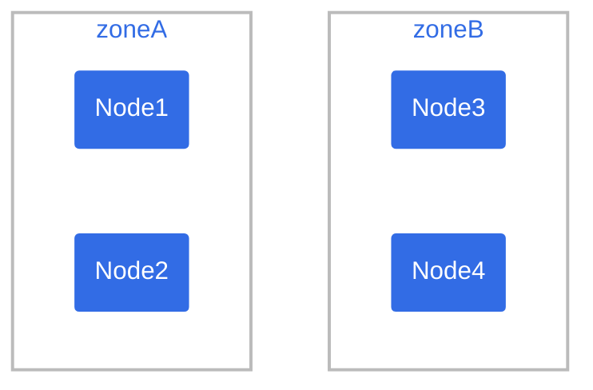
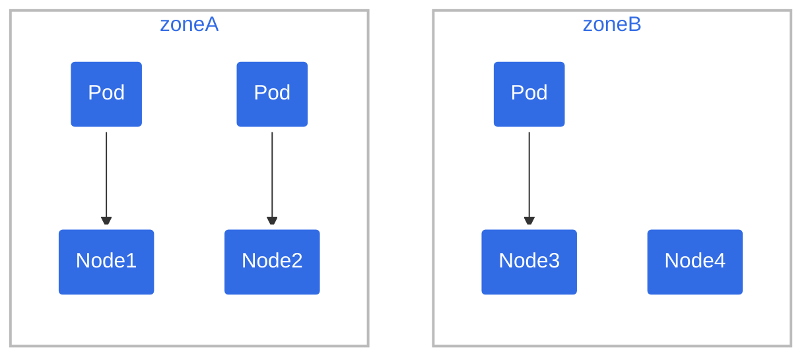
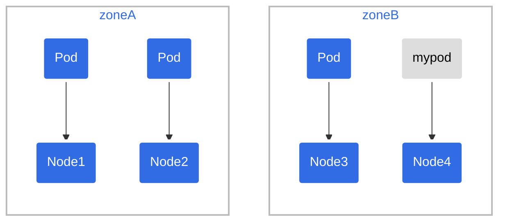
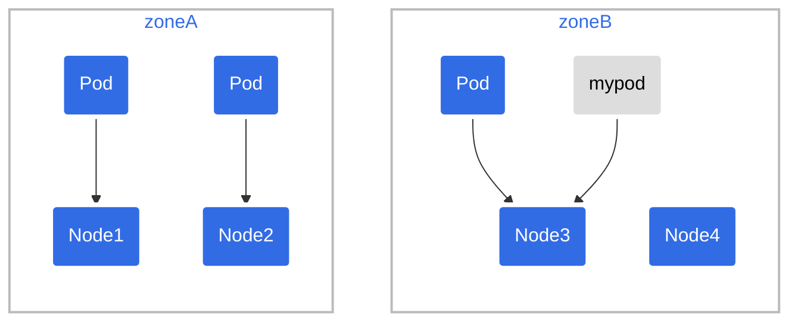
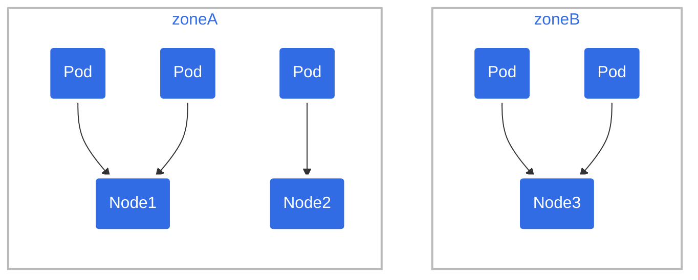
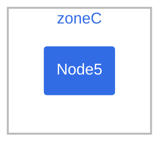

# Ràng buộc phân bố Pod theo topology (Pod Topology Spread Constraints)

> Bản dịch tiếng Việt của trang: <https://kubernetes.io/docs/concepts/scheduling-eviction/topology-spread-constraints/>

---

## Đọc bài này thế nào

> Phần này không có trong trang gốc. Nó cho biết ở lần đọc này bạn cần hiểu sâu tới đâu và
> phần nào để dành cho giai đoạn sau. Xem [lộ trình](00-ALO-TRINH-ADMIN.md).

**Vị trí:** Giai đoạn 7 → nhóm [7a](00-ALO-TRINH-ADMIN.md#7a-scheduling-và-eviction), bài 5/13 ·
Kiểm chứng ở Lab 7a (chưa viết, xem [bản đồ lab](labs/README.md#4-bản-đồ-lab)).

Bài này là **bản nâng cấp của `podAntiAffinity`**: thay vì "một miền tối đa một Pod" hoặc
"không ép được gì cả", nó cho bạn chỉnh mức lệch được phép bằng một con số. Toàn bộ ví dụ dùng
cluster 4–5 node chia zone A/B/C; cluster lab chỉ có hai worker và **không node nào mang label
zone**, nên hãy đọc mọi ví dụ với `topologyKey: zone` như thể nó là
`topologyKey: kubernetes.io/hostname` — logic không đổi, chỉ đổi miền topology.

Ba mục cần đọc chậm là *Định nghĩa ràng buộc phân bố*, *Các quy ước ngầm định* và *Các hạn chế
đã biết*. Phần lớn lỗi thực tế nằm ở hai mục sau, không nằm ở cú pháp.

**Phải hiểu ở lần đọc này:**

- **Miền (domain)** là một cặp `<key, value>` của label node; `topologyKey` quyết định bạn
  đang trải Pod theo chiều nào. Scheduler cố đặt số Pod cân bằng vào mỗi miền.
- `maxSkew` là chênh lệch tối đa cho phép giữa số Pod khớp trong miền đích và **mức tối thiểu
  toàn cục**. `whenUnsatisfiable: DoNotSchedule` giữ Pod ở `Pending` khi không thỏa;
  `ScheduleAnyway` vẫn lập lịch nhưng ưu tiên miền ít Pod hơn.
- `labelSelector` quyết định **Pod nào được đếm**. Mục *Các hạn chế đã biết* cảnh báo: Pod
  không khớp chính selector của mình trở thành "pod ma" — nó không tự tính vào phép đo phân
  bố, nên ràng buộc chạy sai kỳ vọng.
- Mục *Các quy ước ngầm định*: chỉ Pod **cùng namespace** mới được đếm; và scheduler **bỏ qua
  hoàn toàn** node thiếu bất kỳ `topologyKey` nào được nêu — Pod trên node đó không được tính,
  đồng thời Pod mới cũng không có cơ hội lên node đó.
- Nhiều ràng buộc được **AND** với nhau. Giao của chúng có thể rỗng, và khi đó Pod kẹt ở
  `Pending` — đúng như mục *ví dụ các ràng buộc phân bố theo topology xung đột nhau*.

**Đọc lướt, chưa cần hiểu:**

| Phần | Vì sao hoãn | Sẽ hiểu ở |
| --- | --- | --- |
| `minDomains` | chỉ có nghĩa khi số miền hợp lệ ít hơn kỳ vọng, gắn với node pool co giãn | giai đoạn 12, bài [171](171-node-autoscaling-vi.md) |
| `matchLabelKeys` và `pod-template-hash` | dành cho workload có nhiều revision cùng tồn tại | bài [63](63-deployment-vi.md) |
| `nodeAffinityPolicy`, `nodeTaintsPolicy` | tinh chỉnh node nào được đưa vào phép tính skew | Lab 7a |
| *Ràng buộc mặc định ở cấp cluster* và *Ràng buộc mặc định tích hợp sẵn* | phải sửa `KubeSchedulerConfiguration` | bài [147](147-scheduling-framework-vi.md) |
| Hạn chế về cluster autoscaling khi node pool co về 0 | cluster lab không co giãn node | giai đoạn 12, bài [171](171-node-autoscaling-vi.md) |
| Các sơ đồ zoneA/zoneB/zoneC và ví dụ `two-constraints.yaml` | cluster lab không có label zone | Lab 7a, thay `zone` bằng `kubernetes.io/hostname` |

---

Bạn có thể dùng _ràng buộc phân bố theo topology_ (topology spread constraints) để kiểm soát
cách các Pod được phân bố trên cluster của bạn giữa các miền lỗi (failure-domain)
như region, zone, node và các miền topology khác do người dùng tự định nghĩa.
Điều này có thể giúp đạt được tính sẵn sàng cao (high availability) cũng như
sử dụng tài nguyên một cách hiệu quả.

Bạn có thể đặt [ràng buộc mặc định ở cấp cluster](#cluster-level-default-constraints),
hoặc cấu hình ràng buộc phân bố theo topology cho từng workload riêng lẻ.

## Động lực (Motivation)

Hãy hình dung bạn có một cluster gồm tối đa hai mươi node, và bạn muốn chạy một
workload tự động điều chỉnh số lượng replica mà nó sử dụng. Số Pod có thể ít nhất
là hai và nhiều nhất là mười lăm. Khi chỉ có hai Pod, bạn sẽ không muốn cả hai Pod đó
chạy trên cùng một node: bạn sẽ gặp rủi ro là chỉ một node gặp sự cố cũng đủ khiến
workload của bạn ngừng hoạt động.

Ngoài cách dùng cơ bản này, còn có một số ví dụ sử dụng nâng cao giúp workload
của bạn hưởng lợi về tính sẵn sàng cao và hiệu suất sử dụng cluster.

Khi bạn mở rộng quy mô (scale up) và chạy nhiều Pod hơn, một mối quan tâm khác trở nên
quan trọng. Hãy hình dung bạn có ba node, mỗi node chạy năm Pod. Các node có đủ
dung lượng để chạy chừng đó replica; tuy nhiên, các client tương tác với workload này
lại nằm rải rác ở ba datacenter (hoặc ba zone hạ tầng) khác nhau. Lúc này bạn ít lo hơn
về việc một node đơn lẻ gặp sự cố, nhưng bạn nhận thấy độ trễ (latency) cao hơn mong muốn,
và bạn đang phải trả các chi phí mạng phát sinh từ việc gửi lưu lượng mạng
giữa các zone khác nhau.

Bạn quyết định rằng trong điều kiện vận hành bình thường, bạn muốn số lượng replica
được [lập lịch](./136-scheduling-eviction-vi.md) vào mỗi zone hạ tầng là tương đương nhau,
và bạn muốn cluster có khả năng tự phục hồi (self-heal) khi có sự cố xảy ra.

Ràng buộc phân bố Pod theo topology cung cấp cho bạn một cách khai báo (declarative)
để cấu hình điều đó.

## Trường `topologySpreadConstraints` {#topologyspreadconstraints-field}

API của Pod có một trường là `spec.topologySpreadConstraints`. Cách sử dụng trường này
trông như sau:

```yaml
---
apiVersion: v1
kind: Pod
metadata:
  name: example-pod
spec:
  # Cấu hình một ràng buộc phân bố theo topology
  topologySpreadConstraints:
    - maxSkew: <integer>
      minDomains: <integer> # tùy chọn
      topologyKey: <string>
      whenUnsatisfiable: <string>
      labelSelector: <object>
      matchLabelKeys: <list> # tùy chọn; beta từ v1.27
      nodeAffinityPolicy: [Honor|Ignore] # tùy chọn; beta từ v1.26
      nodeTaintsPolicy: [Honor|Ignore] # tùy chọn; beta từ v1.26
  ### các trường khác của Pod đặt ở đây
```

> **Ghi chú:** Chỉ có thể có một `topologySpreadConstraint` cho mỗi cặp giá trị `topologyKey`
> và `whenUnsatisfiable`. Ví dụ, nếu bạn đã định nghĩa một `topologySpreadConstraint` dùng
> `topologyKey` "kubernetes.io/hostname" và giá trị `whenUnsatisfiable` "DoNotSchedule",
> bạn chỉ có thể thêm một `topologySpreadConstraint` khác cho `topologyKey`
> "kubernetes.io/hostname" nếu bạn dùng một giá trị `whenUnsatisfiable` khác.

Bạn có thể đọc thêm về trường này bằng cách chạy `kubectl explain Pod.spec.topologySpreadConstraints`
hoặc tham khảo mục [scheduling](https://kubernetes.io/docs/reference/kubernetes-api/workload-resources/pod-v1/#scheduling)
trong tài liệu tham chiếu API của Pod.

### Định nghĩa ràng buộc phân bố (Spread constraint definition)

Bạn có thể định nghĩa một hoặc nhiều mục `topologySpreadConstraints` để hướng dẫn
kube-scheduler cách đặt mỗi Pod mới đến trong mối tương quan với các Pod hiện có
trên cluster của bạn. Các trường đó là:

- **maxSkew** mô tả mức độ mà các Pod được phép phân bố không đều. Bạn bắt buộc phải
  chỉ định trường này và giá trị phải lớn hơn 0. Ngữ nghĩa của nó khác nhau
  tùy theo giá trị của `whenUnsatisfiable`:

  - nếu bạn chọn `whenUnsatisfiable: DoNotSchedule`, thì `maxSkew` định nghĩa
    mức chênh lệch tối đa được phép giữa số pod khớp trong topology đích
    và _mức tối thiểu toàn cục_ (global minimum)
    (số pod khớp tối thiểu trong một miền hợp lệ, hoặc bằng 0 nếu số miền hợp lệ nhỏ hơn MinDomains).
    Ví dụ, nếu bạn có 3 zone với lần lượt 2, 2 và 1 pod khớp,
    `MaxSkew` được đặt là 1 thì mức tối thiểu toàn cục là 1.
  - nếu bạn chọn `whenUnsatisfiable: ScheduleAnyway`, scheduler sẽ ưu tiên cao hơn
    cho các topology giúp giảm bớt độ lệch (skew).

- **minDomains** chỉ ra số lượng tối thiểu các miền hợp lệ (eligible domain). Trường này là tùy chọn.
  Một miền (domain) là một thực thể cụ thể của một topology. Miền hợp lệ là miền có
  các node khớp với node selector.

  > **Ghi chú:** Trước Kubernetes v1.30, trường `minDomains` chỉ khả dụng nếu
  > [feature gate](https://kubernetes.io/docs/reference/command-line-tools-reference/feature-gates-removed/)
  > `MinDomainsInPodTopologySpread` được bật (mặc định bật từ v1.28). Trong các cluster
  > Kubernetes cũ hơn, nó có thể bị tắt tường minh hoặc trường này có thể không khả dụng.

  - Giá trị của `minDomains`, khi được chỉ định, phải lớn hơn 0.
    Bạn chỉ có thể chỉ định `minDomains` cùng với `whenUnsatisfiable: DoNotSchedule`.
  - Khi số lượng miền hợp lệ có topology key khớp nhỏ hơn `minDomains`,
    cơ chế phân bố Pod theo topology coi mức tối thiểu toàn cục là 0, sau đó mới thực hiện
    việc tính `skew`. Mức tối thiểu toàn cục là số Pod khớp tối thiểu trong một miền hợp lệ,
    hoặc bằng 0 nếu số miền hợp lệ nhỏ hơn `minDomains`.
  - Khi số lượng miền hợp lệ có topology key khớp bằng hoặc lớn hơn
    `minDomains`, giá trị này không ảnh hưởng đến việc lập lịch.
  - Nếu bạn không chỉ định `minDomains`, ràng buộc hoạt động như thể `minDomains` bằng 1.

- **topologyKey** là khóa (key) của [nhãn node](#node-labels). Các node có nhãn với khóa này
  và giá trị giống hệt nhau được coi là thuộc cùng một topology.
  Chúng ta gọi mỗi thực thể của một topology (nói cách khác, một cặp <key, value>) là một miền (domain).
  Scheduler sẽ cố gắng đặt số lượng pod cân bằng vào mỗi miền.
  Ngoài ra, chúng ta định nghĩa miền hợp lệ là miền có các node thỏa mãn yêu cầu của
  nodeAffinityPolicy và nodeTaintsPolicy.

- **whenUnsatisfiable** chỉ ra cách xử lý một Pod nếu nó không thỏa mãn ràng buộc phân bố:
  - `DoNotSchedule` (mặc định) yêu cầu scheduler không lập lịch cho Pod đó.
  - `ScheduleAnyway` yêu cầu scheduler vẫn lập lịch cho Pod nhưng ưu tiên các node giúp giảm thiểu độ lệch.

- **labelSelector** được dùng để tìm các Pod khớp. Các Pod
  khớp với label selector này sẽ được đếm để xác định
  số lượng Pod trong miền topology tương ứng của chúng.
  Xem [Label Selectors](18-labels-vi.md#label-selectors)
  để biết thêm chi tiết.

- **matchLabelKeys** là danh sách các khóa nhãn (label key) của pod, dùng để chọn nhóm pod
  mà độ lệch phân bố sẽ được tính trên đó. Khi một pod được tạo,
  kube-apiserver dùng các khóa này để tra giá trị từ nhãn của pod mới đến,
  và các nhãn key-value đó sẽ được gộp (merge) với `labelSelector` hiện có.
  Không được phép có cùng một khóa tồn tại trong cả `matchLabelKeys` lẫn `labelSelector`.
  Không thể đặt `matchLabelKeys` khi chưa đặt `labelSelector`.
  Các khóa không tồn tại trong nhãn của pod sẽ bị bỏ qua.
  Danh sách null hoặc rỗng có nghĩa là chỉ khớp theo `labelSelector`.

  > **Thận trọng:** Không nên dùng `matchLabelKeys` với các nhãn có thể bị cập nhật trực tiếp trên pod.
  > Ngay cả khi bạn sửa **trực tiếp** nhãn của pod được chỉ định trong `matchLabelKeys`
  > (tức là bạn sửa Pod chứ không phải Deployment),
  > kube-apiserver cũng không phản ánh thay đổi nhãn đó vào `labelSelector` đã gộp.

  Với `matchLabelKeys`, bạn không cần cập nhật `pod.spec` giữa các revision khác nhau.
  Controller/operator chỉ cần đặt các giá trị khác nhau cho cùng một khóa nhãn ở các revision
  khác nhau. Ví dụ, nếu bạn đang cấu hình một Deployment, bạn có thể dùng nhãn với khóa
  [pod-template-hash](./63-deployment-vi.md#pod-template-hash-label), vốn được
  Deployment controller tự động thêm vào, để phân biệt các revision khác nhau
  trong cùng một Deployment.

  ```yaml
      topologySpreadConstraints:
          - maxSkew: 1
            topologyKey: kubernetes.io/hostname
            whenUnsatisfiable: DoNotSchedule
            labelSelector:
              matchLabels:
                app: foo
            matchLabelKeys:
              - pod-template-hash
  ```

  > **Ghi chú:** Trường `matchLabelKeys` là trường ở mức beta và được bật mặc định từ 1.27.
  > Bạn có thể tắt nó bằng cách tắt [feature gate](https://kubernetes.io/docs/reference/command-line-tools-reference/feature-gates/)
  > `MatchLabelKeysInPodTopologySpread`.
  >
  > Trước v1.34, `matchLabelKeys` được xử lý một cách ngầm định.
  > Từ v1.34, các nhãn key-value tương ứng với `matchLabelKeys` được gộp tường minh vào `labelSelector`.
  > Bạn có thể tắt điều này và quay về hành vi trước đó bằng cách tắt
  > [feature gate](https://kubernetes.io/docs/reference/command-line-tools-reference/feature-gates/)
  > `MatchLabelKeysInPodTopologySpreadSelectorMerge` của kube-apiserver.

- **nodeAffinityPolicy** chỉ ra cách chúng ta xử lý nodeAffinity/nodeSelector của Pod
  khi tính độ lệch phân bố pod theo topology. Các tùy chọn là:
  - Honor: chỉ các node khớp nodeAffinity/nodeSelector mới được đưa vào tính toán.
  - Ignore: nodeAffinity/nodeSelector bị bỏ qua. Tất cả các node đều được đưa vào tính toán.

  Nếu giá trị này là null, hành vi tương đương với chính sách Honor.

  > **Ghi chú:** `nodeAffinityPolicy` trở thành beta ở 1.26 và lên GA (ổn định chính thức) ở 1.33.
  > Nó được bật mặc định ở giai đoạn beta; bạn có thể tắt bằng cách tắt
  > [feature gate](https://kubernetes.io/docs/reference/command-line-tools-reference/feature-gates/)
  > `NodeInclusionPolicyInPodTopologySpread`.

- **nodeTaintsPolicy** chỉ ra cách chúng ta xử lý taint của node khi tính
  độ lệch phân bố pod theo topology. Các tùy chọn là:
  - Honor: các node không có taint, cùng với các node có taint mà Pod mới đến
    có toleration tương ứng, sẽ được đưa vào.
  - Ignore: taint của node bị bỏ qua. Tất cả các node đều được đưa vào.

  Nếu giá trị này là null, hành vi tương đương với chính sách Ignore.

  > **Ghi chú:** `nodeTaintsPolicy` trở thành beta ở 1.26 và lên GA (ổn định chính thức) ở 1.33.
  > Nó được bật mặc định ở giai đoạn beta; bạn có thể tắt bằng cách tắt
  > [feature gate](https://kubernetes.io/docs/reference/command-line-tools-reference/feature-gates/)
  > `NodeInclusionPolicyInPodTopologySpread`.

Khi một Pod định nghĩa nhiều hơn một `topologySpreadConstraint`, các ràng buộc đó được
kết hợp bằng phép AND logic: kube-scheduler tìm một node cho Pod mới đến
sao cho thỏa mãn tất cả các ràng buộc đã cấu hình.

### Nhãn node (Node labels) {#node-labels}

Ràng buộc phân bố theo topology dựa vào nhãn của node để nhận diện (các) miền topology
mà mỗi node thuộc về.
Ví dụ, một node có thể có các nhãn:

```yaml
  region: us-east-1
  zone: us-east-1a
```

> **Ghi chú:** Để ngắn gọn, ví dụ này không dùng các khóa nhãn
> [chuẩn (well-known)](https://kubernetes.io/docs/reference/labels-annotations-taints/)
> `topology.kubernetes.io/zone` và `topology.kubernetes.io/region`. Tuy vậy,
> các khóa nhãn đã đăng ký đó vẫn được khuyến nghị sử dụng thay cho các khóa nhãn riêng
> (không định danh đầy đủ — unqualified) `region` và `zone` được dùng ở đây.
>
> Bạn không thể đưa ra giả định đáng tin cậy nào về ý nghĩa của một khóa nhãn riêng
> giữa các ngữ cảnh khác nhau.

Giả sử bạn có một cluster 4 node với các nhãn sau:

```
NAME    STATUS   ROLES    AGE     VERSION   LABELS
node1   Ready    <none>   4m26s   v1.16.0   node=node1,zone=zoneA
node2   Ready    <none>   3m58s   v1.16.0   node=node2,zone=zoneA
node3   Ready    <none>   3m17s   v1.16.0   node=node3,zone=zoneB
node4   Ready    <none>   2m43s   v1.16.0   node=node4,zone=zoneB
```

Khi đó cluster được nhìn nhận một cách logic như sau:



## Tính nhất quán (Consistency)

Bạn nên đặt cùng một bộ ràng buộc phân bố Pod theo topology cho tất cả các pod trong một nhóm.

Thông thường, nếu bạn dùng một workload controller như Deployment, pod template
sẽ lo việc này cho bạn. Nếu bạn trộn lẫn các ràng buộc phân bố khác nhau thì Kubernetes
vẫn tuân theo định nghĩa API của trường này; tuy nhiên, hành vi nhiều khả năng sẽ trở nên
khó hiểu và việc xử lý sự cố (troubleshooting) kém trực quan hơn.

Bạn cần một cơ chế đảm bảo rằng tất cả các node trong một miền topology (chẳng hạn một
region của nhà cung cấp cloud) được gán nhãn một cách nhất quán.
Để tránh việc bạn phải gán nhãn node thủ công, hầu hết các cluster tự động
điền các nhãn chuẩn như `kubernetes.io/hostname`. Hãy kiểm tra xem
cluster của bạn có hỗ trợ điều này không.

## Các ví dụ về ràng buộc phân bố theo topology (Topology spread constraint examples)

### Ví dụ: một ràng buộc phân bố theo topology (Example: one topology spread constraint) {#example-one-topologyspreadconstraint}

Giả sử bạn có một cluster 4 node, trong đó 3 Pod mang nhãn `foo: bar` nằm lần lượt trên
node1, node2 và node3:



Nếu bạn muốn một Pod mới đến được phân bố đều với các Pod hiện có giữa các zone, bạn
có thể dùng một manifest tương tự như:

```yaml
kind: Pod
apiVersion: v1
metadata:
  name: mypod
  labels:
    foo: bar
spec:
  topologySpreadConstraints:
  - maxSkew: 1
    topologyKey: zone
    whenUnsatisfiable: DoNotSchedule
    labelSelector:
      matchLabels:
        foo: bar
  containers:
  - name: pause
    image: registry.k8s.io/pause:3.1
```

Từ manifest đó, `topologyKey: zone` ngụ ý rằng việc phân bố đều chỉ được áp dụng
cho các node có nhãn `zone: <giá trị bất kỳ>` (các node không có nhãn `zone`
sẽ bị bỏ qua). Trường `whenUnsatisfiable: DoNotSchedule` yêu cầu scheduler giữ
Pod mới đến ở trạng thái pending nếu scheduler không tìm được cách thỏa mãn ràng buộc.

Nếu scheduler đặt Pod mới đến này vào zone `A`, phân bố Pod sẽ trở thành
`[3, 1]`. Điều đó nghĩa là độ lệch thực tế khi đó là 2 (tính bằng `3 - 1`),
vi phạm `maxSkew: 1`. Để thỏa mãn các ràng buộc và bối cảnh của ví dụ này,
Pod mới đến chỉ có thể được đặt lên một node trong zone `B`:



HOẶC



Bạn có thể tinh chỉnh spec của Pod để đáp ứng nhiều loại yêu cầu khác nhau:

- Đổi `maxSkew` thành một giá trị lớn hơn - chẳng hạn `2` - để Pod mới đến cũng có thể
  được đặt vào zone `A`.
- Đổi `topologyKey` thành `node` để phân bố các Pod đều giữa các node
  thay vì giữa các zone. Trong ví dụ trên, nếu `maxSkew` vẫn là `1`, Pod mới đến
  chỉ có thể được đặt lên node `node4`.
- Đổi `whenUnsatisfiable: DoNotSchedule` thành `whenUnsatisfiable: ScheduleAnyway`
  để đảm bảo Pod mới đến luôn có thể được lập lịch (giả sử các API lập lịch khác
  đều được thỏa mãn). Tuy nhiên, Pod vẫn được ưu tiên đặt vào miền topology
  có ít Pod khớp hơn. (Hãy lưu ý rằng mức ưu tiên này được chuẩn hóa chung
  với các độ ưu tiên lập lịch nội bộ khác, chẳng hạn tỷ lệ sử dụng tài nguyên).

### Ví dụ: nhiều ràng buộc phân bố theo topology (Example: multiple topology spread constraints) {#example-multiple-topologyspreadconstraints}

Ví dụ này xây dựng tiếp trên ví dụ trước. Giả sử bạn có một cluster 4 node, trong đó 3
Pod hiện có mang nhãn `foo: bar` nằm lần lượt trên node1, node2 và node3:


Bạn có thể kết hợp hai ràng buộc phân bố theo topology để kiểm soát việc phân bố Pod
theo cả node lẫn zone:

```yaml
kind: Pod
apiVersion: v1
metadata:
  name: mypod
  labels:
    foo: bar
spec:
  topologySpreadConstraints:
  - maxSkew: 1
    topologyKey: zone
    whenUnsatisfiable: DoNotSchedule
    labelSelector:
      matchLabels:
        foo: bar
  - maxSkew: 1
    topologyKey: node
    whenUnsatisfiable: DoNotSchedule
    labelSelector:
      matchLabels:
        foo: bar
  containers:
  - name: pause
    image: registry.k8s.io/pause:3.1
```

Trong trường hợp này, để khớp ràng buộc thứ nhất, Pod mới đến chỉ có thể được đặt lên
các node trong zone `B`; trong khi xét theo ràng buộc thứ hai, Pod mới đến chỉ có thể được
lập lịch lên node `node4`. Scheduler chỉ xem xét các phương án thỏa mãn tất cả
các ràng buộc đã định nghĩa, nên vị trí hợp lệ duy nhất là node `node4`.

### Ví dụ: các ràng buộc phân bố theo topology xung đột nhau (Example: conflicting topology spread constraints) {#example-conflicting-topologyspreadconstraints}

Nhiều ràng buộc có thể dẫn đến xung đột. Giả sử bạn có một cluster 3 node trải trên 2 zone:



Nếu bạn áp dụng
[`two-constraints.yaml`](https://raw.githubusercontent.com/kubernetes/website/main/content/en/examples/pods/topology-spread-constraints/two-constraints.yaml)
(manifest từ ví dụ trước)
vào cluster **này**, bạn sẽ thấy Pod `mypod` bị kẹt ở trạng thái `Pending`.
Điều này xảy ra vì: để thỏa mãn ràng buộc thứ nhất, Pod `mypod` chỉ có thể
được đặt vào zone `B`; trong khi xét theo ràng buộc thứ hai, Pod `mypod`
chỉ có thể được lập lịch lên node `node2`. Giao của hai ràng buộc trả về
một tập rỗng, và scheduler không thể đặt được Pod.

Để vượt qua tình huống này, bạn có thể tăng giá trị `maxSkew` hoặc sửa
một trong hai ràng buộc để dùng `whenUnsatisfiable: ScheduleAnyway`. Tùy hoàn cảnh,
bạn cũng có thể quyết định xóa thủ công một Pod hiện có - ví dụ,
khi bạn đang tìm hiểu vì sao một đợt rollout bản sửa lỗi (bug-fix) không tiến triển.

#### Tương tác với node affinity và node selector (Interaction with node affinity and node selectors)

Scheduler sẽ bỏ qua các node không khớp khỏi việc tính toán độ lệch nếu
Pod mới đến có định nghĩa `spec.nodeSelector` hoặc `spec.affinity.nodeAffinity`.

### Ví dụ: ràng buộc phân bố theo topology kết hợp node affinity (Example: topology spread constraints with node affinity) {#example-topologyspreadconstraints-with-nodeaffinity}

Giả sử bạn có một cluster 5 node trải từ zone A đến C:




và bạn biết rằng zone `C` phải bị loại trừ. Trong trường hợp này, bạn có thể soạn một manifest
như dưới đây, để Pod `mypod` được đặt vào zone `B` thay vì zone `C`.
Tương tự, Kubernetes cũng tôn trọng `spec.nodeSelector`.

```yaml
kind: Pod
apiVersion: v1
metadata:
  name: mypod
  labels:
    foo: bar
spec:
  topologySpreadConstraints:
  - maxSkew: 1
    topologyKey: zone
    whenUnsatisfiable: DoNotSchedule
    labelSelector:
      matchLabels:
        foo: bar
  affinity:
    nodeAffinity:
      requiredDuringSchedulingIgnoredDuringExecution:
        nodeSelectorTerms:
        - matchExpressions:
          - key: zone
            operator: NotIn
            values:
            - zoneC
  containers:
  - name: pause
    image: registry.k8s.io/pause:3.1
```

## Các quy ước ngầm định (Implicit conventions)

Có một số quy ước ngầm định đáng lưu ý ở đây:

- Chỉ những Pod thuộc cùng namespace với Pod mới đến mới có thể là ứng viên khớp.

- Scheduler chỉ xem xét những node có đầy đủ tất cả các `topologySpreadConstraints[*].topologyKey` cùng lúc.
  Các node thiếu bất kỳ `topologyKey` nào trong số đó sẽ bị bỏ qua. Điều này ngụ ý rằng:

  1. mọi Pod nằm trên các node bị bỏ qua đó không ảnh hưởng đến việc tính `maxSkew` - trong
     [ví dụ](#example-conflicting-topologyspreadconstraints) ở trên, giả sử node `node1`
     không có nhãn "zone", thì 2 Pod đó sẽ
     không được tính, do đó Pod mới đến sẽ được lập lịch vào zone `A`.
  2. Pod mới đến không có cơ hội được lập lịch lên loại node như vậy -
     trong ví dụ trên, giả sử có node `node5` mang nhãn bị **gõ sai** `zone-typo: zoneC`
     (và không đặt nhãn `zone` nào). Sau khi node `node5` gia nhập cluster, nó sẽ bị bỏ qua và
     các Pod của workload này không được lập lịch vào đó.

- Hãy lưu ý điều gì sẽ xảy ra nếu `topologySpreadConstraints[*].labelSelector` của
  Pod mới đến không khớp với chính các nhãn của nó. Trong ví dụ trên, nếu bạn bỏ
  các nhãn của Pod mới đến, nó vẫn có thể được đặt lên các node trong zone `B`,
  vì các ràng buộc vẫn được thỏa mãn. Tuy nhiên, sau lần đặt đó, mức độ mất cân bằng
  của cluster vẫn không thay đổi - vẫn là zone `A` có 2 Pod mang nhãn `foo: bar`,
  và zone `B` có 1 Pod mang nhãn `foo: bar`. Nếu đây không phải điều bạn mong đợi,
  hãy cập nhật `topologySpreadConstraints[*].labelSelector` của workload
  cho khớp với các nhãn trong pod template.

## Ràng buộc mặc định ở cấp cluster (Cluster-level default constraints) {#cluster-level-default-constraints}

Bạn có thể đặt các ràng buộc phân bố theo topology mặc định cho một cluster. Các ràng buộc
phân bố theo topology mặc định chỉ được áp dụng cho một Pod khi và chỉ khi:

- Pod đó không định nghĩa bất kỳ ràng buộc nào trong `.spec.topologySpreadConstraints` của nó.
- Pod đó thuộc về một Service, ReplicaSet, StatefulSet hoặc ReplicationController.

Các ràng buộc mặc định có thể được đặt như một phần tham số của plugin `PodTopologySpread`
trong một [scheduling profile](https://kubernetes.io/docs/reference/scheduling/config/#profiles).
Các ràng buộc được chỉ định bằng chính [API ở trên](#topologyspreadconstraints-field), ngoại trừ việc
`labelSelector` phải để trống. Các selector được suy ra từ Service,
ReplicaSet, StatefulSet hoặc ReplicationController mà Pod thuộc về.

Một cấu hình ví dụ có thể trông như sau:

```yaml
apiVersion: kubescheduler.config.k8s.io/v1
kind: KubeSchedulerConfiguration

profiles:
  - schedulerName: default-scheduler
    pluginConfig:
      - name: PodTopologySpread
        args:
          defaultConstraints:
            - maxSkew: 1
              topologyKey: topology.kubernetes.io/zone
              whenUnsatisfiable: ScheduleAnyway
          defaultingType: List
```

### Ràng buộc mặc định tích hợp sẵn (Built-in default constraints) {#internal-default-constraints}

**TRẠNG THÁI TÍNH NĂNG:** `Kubernetes v1.24 [stable]`

Nếu bạn không cấu hình bất kỳ ràng buộc mặc định cấp cluster nào cho việc phân bố pod theo topology,
thì kube-scheduler hoạt động như thể bạn đã chỉ định các ràng buộc topology mặc định sau:

```yaml
defaultConstraints:
  - maxSkew: 3
    topologyKey: "kubernetes.io/hostname"
    whenUnsatisfiable: ScheduleAnyway
  - maxSkew: 5
    topologyKey: "topology.kubernetes.io/zone"
    whenUnsatisfiable: ScheduleAnyway
```

Ngoài ra, plugin cũ `SelectorSpread`, vốn cung cấp hành vi tương đương,
bị tắt theo mặc định.

> **Ghi chú:** Plugin `PodTopologySpread` không chấm điểm các node không có
> các topology key được chỉ định trong các ràng buộc phân bố. Điều này có thể dẫn đến
> hành vi mặc định khác so với plugin cũ `SelectorSpread` khi
> dùng các ràng buộc topology mặc định.
>
> Nếu các node của bạn không được kỳ vọng có **cả hai** nhãn `kubernetes.io/hostname` và
> `topology.kubernetes.io/zone`, hãy định nghĩa các ràng buộc của riêng bạn
> thay vì dùng các giá trị mặc định của Kubernetes.

Nếu bạn không muốn dùng các ràng buộc phân bố Pod mặc định cho cluster của mình,
bạn có thể tắt các giá trị mặc định đó bằng cách đặt `defaultingType` thành `List` và để trống
`defaultConstraints` trong cấu hình plugin `PodTopologySpread`:

```yaml
apiVersion: kubescheduler.config.k8s.io/v1
kind: KubeSchedulerConfiguration

profiles:
  - schedulerName: default-scheduler
    pluginConfig:
      - name: PodTopologySpread
        args:
          defaultConstraints: []
          defaultingType: List
```

## So sánh với podAffinity và podAntiAffinity (Comparison with podAffinity and podAntiAffinity) {#comparison-with-podaffinity-podantiaffinity}

Trong Kubernetes, [affinity và anti-affinity giữa các Pod](138-assign-pod-node-vi.md#inter-pod-affinity-and-anti-affinity)
kiểm soát cách các Pod được lập lịch trong mối tương quan với nhau - hoặc dồn lại
gần nhau hơn, hoặc phân tán ra xa hơn.

`podAffinity`
: thu hút các Pod; bạn có thể thử dồn bao nhiêu Pod tùy ý vào
  (các) miền topology đủ điều kiện.

`podAntiAffinity`
: đẩy các Pod ra xa nhau. Nếu bạn đặt chế độ `requiredDuringSchedulingIgnoredDuringExecution` thì
  chỉ một Pod duy nhất có thể được lập lịch vào một miền topology; còn nếu bạn chọn
  `preferredDuringSchedulingIgnoredDuringExecution` thì bạn mất khả năng cưỡng chế
  ràng buộc đó.

Để kiểm soát tinh vi hơn, bạn có thể chỉ định các ràng buộc phân bố theo topology để phân tán
các Pod giữa các miền topology khác nhau - nhằm đạt tính sẵn sàng cao hoặc
tiết kiệm chi phí. Điều này cũng có thể giúp việc rolling update workload và scale out
replica diễn ra mượt mà.

Để hiểu thêm bối cảnh, xem mục
[Motivation](https://github.com/kubernetes/enhancements/tree/master/keps/sig-scheduling/895-pod-topology-spread#motivation)
của đề xuất cải tiến (enhancement proposal) về ràng buộc phân bố Pod theo topology.

## Các hạn chế đã biết (Known limitations)

- Không có gì đảm bảo các ràng buộc vẫn được thỏa mãn khi các Pod bị xóa. Ví dụ,
  việc scale down một Deployment có thể dẫn đến phân bố Pod mất cân bằng.

  Bạn có thể dùng một công cụ như [Descheduler](https://github.com/kubernetes-sigs/descheduler)
  để tái cân bằng phân bố Pod.
- Các Pod khớp nằm trên các node có taint vẫn được tôn trọng (tính đến).
  Xem [Issue 80921](https://github.com/kubernetes/kubernetes/issues/80921).
- Scheduler không biết trước tất cả các zone hoặc các miền topology khác
  mà một cluster có. Chúng được xác định từ các node hiện có trong
  cluster. Điều này có thể gây ra vấn đề trong các cluster có autoscaling, khi một node pool (hoặc
  node group) bị scale về 0 node trong khi bạn kỳ vọng cluster sẽ scale up,
  bởi vì trong trường hợp đó, các miền topology đó sẽ không được xem xét cho đến khi
  có ít nhất một node trong chúng.

  Bạn có thể khắc phục điều này bằng cách dùng một Node autoscaler nhận biết được
  ràng buộc phân bố Pod theo topology và đồng thời nhận biết được toàn bộ tập các
  miền topology.
- Các Pod không khớp với chính labelSelector của mình tạo ra các "pod ma" (ghost pod). Nếu nhãn
  của một pod không khớp với `labelSelector` trong ràng buộc phân bố theo topology của nó, pod đó
  sẽ không tự tính mình vào các phép tính phân bố. Điều này có nghĩa là:
  - Nhiều pod như vậy có thể cứ dồn tích trên cùng một topology (cho đến khi các pod khớp được tạo mới/xóa đi) vì việc lập lịch các pod đó không làm thay đổi kết quả tính toán phân bố.
  - Ràng buộc phân bố hoạt động theo cách ngoài ý muốn, nhiều khả năng không đúng như bạn kỳ vọng.

  Hãy đảm bảo nhãn của pod khớp với `labelSelector` trong các ràng buộc phân bố của bạn.
  Thông thường, một pod nên khớp với selector trong ràng buộc phân bố theo topology của chính nó.

## Tiếp theo (What's next)

- Bài blog [Introducing PodTopologySpread](https://kubernetes.io/blog/2020/05/introducing-podtopologyspread/)
  giải thích khá chi tiết về `maxSkew`, đồng thời đề cập một số ví dụ sử dụng nâng cao.
- Đọc mục [scheduling](https://kubernetes.io/docs/reference/kubernetes-api/workload-resources/pod-v1/#scheduling) trong
  tài liệu tham chiếu API của Pod.

---

## Tự kiểm tra

> Phần này không có trong trang gốc.

Trả lời được các câu sau mà không nhìn lại bài là đủ cho lần đọc ở giai đoạn 7:

1. Cluster lab có hai node nhận Pod thường. Bạn đặt một ràng buộc `maxSkew: 1`,
   `topologyKey: kubernetes.io/hostname`, `whenUnsatisfiable: DoNotSchedule`, rồi scale
   Deployment lên 5 replica. Phân bố Pod cuối cùng ra sao?
2. Vẫn cluster đó, bạn đổi `topologyKey` thành `topology.kubernetes.io/zone` — label mà không
   node nào của bạn có. Pod sẽ được trải đều trên hai worker, hay chuyện gì khác xảy ra?
3. `podAntiAffinity` loại `requiredDuringSchedulingIgnoredDuringExecution` và một ràng buộc
   phân bố theo topology khác nhau thế nào về mức độ cưỡng chế?
4. Pod template gắn label `app: web`, nhưng `labelSelector` trong ràng buộc phân bố lại khớp
   `app: api`. Ràng buộc còn tác dụng gì không, và hiện tượng đó tên là gì?
5. Ràng buộc đang được thỏa mãn. Bạn scale down Deployment. Kubernetes có tự sắp lại Pod để
   giữ phân bố cân bằng không?

<details>
<summary>Đáp án — chỉ mở sau khi đã tự trả lời</summary>

1. **3 Pod trên một worker và 2 Pod trên worker kia** (không xác định trước worker nào nhận 3).
   Mỗi node là một miền của `kubernetes.io/hostname`; độ lệch thực tế là `3 - 2 = 1`, đúng bằng
   `maxSkew: 1` nên hợp lệ. Phân bố 4/1 sẽ cho độ lệch 3 và bị từ chối.
2. **Không Pod nào được lập lịch — tất cả kẹt ở `Pending`.** Mục *Các quy ước ngầm định* nói:
   scheduler **chỉ xem xét những node có đầy đủ tất cả các `topologyKey`** được nêu, node
   thiếu bất kỳ key nào sẽ **bị bỏ qua**, và **Pod mới đến không có cơ hội được lập lịch lên
   loại node như vậy**. Đây đúng là bẫy "gõ sai tên label `zone-typo`" mà bài nêu: cluster
   trông vẫn khỏe, node vẫn `Ready`, mà Pod thì không đi đâu được. Trực giác "không có miền nào
   thì ràng buộc coi như vô hiệu" là sai — ngược lại, nó loại sạch node.
3. `podAntiAffinity` `required` là **nhị phân**: một miền topology chỉ chứa được **đúng một
   Pod**; muốn nới thì phải chuyển sang `preferred` và khi đó **mất hẳn khả năng cưỡng chế**.
   Ràng buộc phân bố theo topology cho bạn **mức trung gian định lượng được** bằng `maxSkew`, và
   vẫn giữ được cưỡng chế qua `DoNotSchedule`. Đó là lý do mục *So sánh với podAffinity và
   podAntiAffinity* gọi nó là "kiểm soát tinh vi hơn".
4. **Ràng buộc vẫn chạy nhưng đo nhầm đối tượng, và các Pod của bạn trở thành "pod ma"**. Vì
   nhãn của pod không khớp `labelSelector` trong ràng buộc của chính nó, **pod đó không tự tính
   mình vào các phép tính phân bố** — nên nhiều pod như vậy cứ dồn tích lên cùng một topology
   mà kết quả tính toán không đổi. Bài kết luận thẳng: hãy đảm bảo nhãn của pod khớp với
   `labelSelector` trong ràng buộc phân bố.
5. **Không.** Mục *Các hạn chế đã biết* nói rõ: **không có gì đảm bảo các ràng buộc vẫn được
   thỏa mãn khi các Pod bị xóa**, và việc scale down một Deployment có thể dẫn tới phân bố mất
   cân bằng. Ràng buộc chỉ được đánh giá **lúc lập lịch**. Muốn tái cân bằng thì cần một công
   cụ ngoài như Descheduler.

</details>

Câu nào chưa trả lời được thì quay lại đúng mục tương ứng trước khi đọc bài sau.
