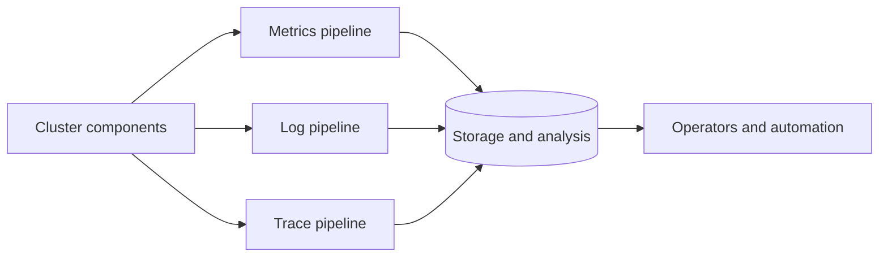
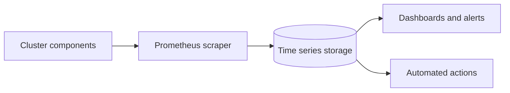
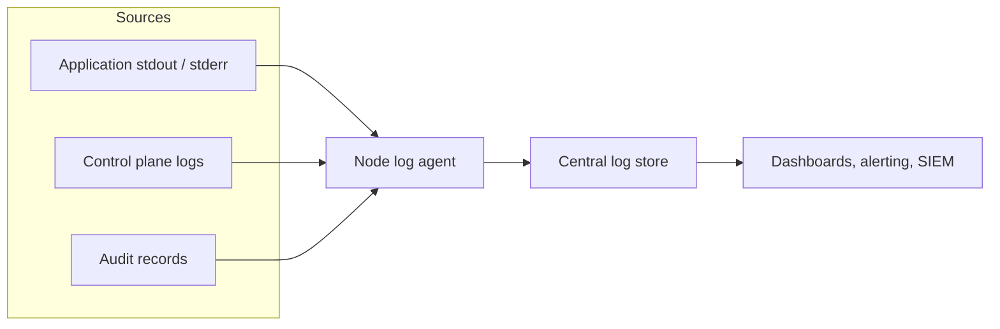
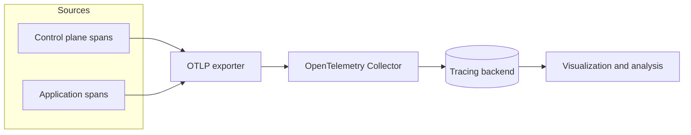

# Khả năng quan sát (Observability)

> Bản dịch tiếng Việt của trang: https://kubernetes.io/docs/concepts/cluster-administration/observability/
>
> Hiểu cách đạt được khả năng nhìn thấy đầu-cuối (end-to-end visibility) một cluster Kubernetes thông qua việc thu thập metrics, logs và traces.

---

## Đọc bài này thế nào

> Phần này không có trong trang gốc. Nó cho biết ở lần đọc này bạn cần hiểu sâu tới đâu và
> phần nào để dành cho giai đoạn sau. Xem [lộ trình](LO-TRINH-ADMIN.md).

**Vị trí:** [Giai đoạn 11](LO-TRINH-ADMIN.md#giai-đoạn-11--observability), bài 1/6 · Kiểm chứng
ở Lab 11a (chưa viết, xem [bản đồ lab](labs/README.md#4-bản-đồ-lab)).

Đây là **trang bản đồ**, cố ý nông. Mỗi trụ cột nó nhắc tới đều có một bài riêng ngay sau
trong giai đoạn này. Nhiệm vụ của lần đọc này là biết ba loại tín hiệu tồn tại, mỗi loại trả
lời câu hỏi gì và ai sinh ra chúng — không phải đọc kỹ từng dòng.

**Phải hiểu ở lần đọc này:**

- Ba trụ cột **metrics, logs, traces** trả lời ba câu khác nhau: số đo theo thời gian, bản ghi
  sự kiện theo trình tự thời gian, và độ trễ cùng quan hệ giữa các thao tác.
- Metric do chính các thành phần phát ra ở endpoint `/metrics` theo định dạng Prometheus;
  kubelet còn có thêm `/metrics/cadvisor`, `/metrics/resource` và `/metrics/probes`.
- **kube-state-metrics là add-on**, không phải thành phần core: nó làm giàu tín hiệu control
  plane bằng trạng thái của các đối tượng Kubernetes.
- Đường đi của log container: container runtime bắt `stdout`/`stderr` → chuẩn hóa qua *định
  dạng log CRI* → kubelet phục vụ qua `kubectl logs`. Thành phần hệ thống chia hai loại: chạy
  trong container thì ghi file `.log` ở `/var/log`, không chạy trong container thì ghi journald.
- Hình dạng chung của một pipeline: nguồn phát → bộ thu thập (scraper / node log agent /
  OTLP exporter) → kho lưu trữ → dashboard, cảnh báo, tự động hóa.

**Đọc lướt, chưa cần hiểu:**

| Phần | Vì sao hoãn | Sẽ hiểu ở |
| --- | --- | --- |
| Chi tiết endpoint và mức ổn định của metric trong mục *Metrics* | ở đây mới là danh sách tên | bài [160](160-system-metrics-vi.md) |
| Xoay vòng log và agent ghi log cấp node trong mục *Logs* | mới gói trong một câu | bài [158](158-logging-vi.md), [159](159-system-logs-vi.md) |
| OpenTelemetry Collector, sampling và che dữ liệu trong mục *Traces* | cần cấu hình tracing thật trên thành phần | bài [161](161-system-traces-vi.md) |
| Ghi log kiểm toán (audit logging) | audit policy và backend là chủ đề riêng | CP7 audit và mã hóa dữ liệu |
| *Các công cụ quan sát phổ biến* — Cortex, Thanos, Loki, Jaeger… | danh mục bên thứ ba, chỉ tra khi đã phải chọn công cụ | CP8 giám sát và cảnh báo |
| Các khối *Xem thêm (See also)* và *Tiếp theo* | trỏ sang nhánh `/docs/tasks/` chưa dịch | CP8 giám sát và cảnh báo |

Giai đoạn này là chỗ cluster lab thay đổi hạ tầng: **Lab 11a cài metrics-server và chụp
snapshot `04-metrics-ready`**. Ngay sau đó **Lab 11b trả nợ phần thực hành HPA/VPA** mà bạn chỉ
mới đọc lý thuyết ở giai đoạn 4 qua bài [72](72-horizontal-pod-autoscale-vi.md) và
[73](73-vertical-pod-autoscale-vi.md) — xem [sổ nợ lab](labs/README.md#5-sổ-nợ-lab). Đọc bài
này với ý thức đó: từ đây trở đi cluster mới có nguồn metric để autoscaling dựa vào.

---

Trong Kubernetes, khả năng quan sát (observability) là quá trình thu thập và phân tích metrics, logs và traces — thường được gọi là ba trụ cột của khả năng quan sát — nhằm hiểu rõ hơn về trạng thái bên trong, hiệu năng và tình trạng của cluster.

Các thành phần control plane của Kubernetes, cũng như nhiều add-on, sinh ra và phát ra các tín hiệu này. Bằng cách tổng hợp và đối chiếu chúng, bạn có thể có được một bức tranh thống nhất về control plane, các add-on và các ứng dụng trên toàn cluster.

Hình 1 phác họa cách các thành phần của cluster phát ra ba loại tín hiệu chính.

*Hình 1. Các tín hiệu ở mức tổng quan do các thành phần của cluster phát ra và các bên tiêu thụ chúng.*

## Metrics

Các thành phần của Kubernetes phát ra metrics theo [định dạng Prometheus](https://prometheus.io/docs/instrumenting/exposition_formats/) từ endpoint `/metrics` của chúng, bao gồm:

- kube-controller-manager
- kube-proxy
- kube-apiserver
- kube-scheduler
- kubelet

kubelet cũng expose metrics tại `/metrics/cadvisor`, `/metrics/resource` và `/metrics/probes`, và các add-on như [kube-state-metrics](./163-kube-state-metrics-vi.md) làm giàu các tín hiệu control plane đó bằng trạng thái của các đối tượng Kubernetes.

Một pipeline metrics điển hình của Kubernetes định kỳ thu thập (scrape) các endpoint này và lưu các mẫu (sample) vào một cơ sở dữ liệu chuỗi thời gian (time series database) — ví dụ với Prometheus.

Xem [hướng dẫn về metrics hệ thống](https://kubernetes.io/docs/concepts/cluster-administration/system-metrics/) để biết chi tiết và các tùy chọn cấu hình.

Hình 2 phác họa một pipeline metrics phổ biến của Kubernetes.

*Hình 2. Các thành phần của một pipeline metrics điển hình trong Kubernetes.*

Để có khả năng nhìn thấy trên nhiều cluster hoặc nhiều đám mây (multi-cloud), các cơ sở dữ liệu chuỗi thời gian phân tán (ví dụ Thanos hoặc Cortex) có thể bổ trợ cho Prometheus.

Xem [Các công cụ quan sát phổ biến - công cụ metrics](#metrics-tools) để biết các công cụ scrape metrics và các cơ sở dữ liệu chuỗi thời gian.

#### Xem thêm (See also)

- [Metrics hệ thống cho các thành phần Kubernetes](https://kubernetes.io/docs/concepts/cluster-administration/system-metrics/)
- [Giám sát mức sử dụng tài nguyên với metrics-server](https://kubernetes.io/docs/tasks/debug/debug-cluster/resource-usage-monitoring/)
- [Khái niệm kube-state-metrics](./163-kube-state-metrics-vi.md)
- [Tổng quan về pipeline metrics tài nguyên](https://kubernetes.io/docs/tasks/debug/debug-cluster/resource-metrics-pipeline/)

## Logs

Logs cung cấp bản ghi theo trình tự thời gian về các sự kiện bên trong ứng dụng, các thành phần hệ thống của Kubernetes, và các hoạt động liên quan đến bảo mật như ghi log kiểm toán (audit logging).

Container runtime bắt lấy đầu ra của ứng dụng chạy trong container từ các luồng đầu ra chuẩn (`stdout`) và lỗi chuẩn (`stderr`). Mặc dù mỗi runtime hiện thực điều này theo cách khác nhau, việc tích hợp với kubelet được chuẩn hóa thông qua _định dạng log CRI (CRI logging format)_, và kubelet cung cấp các log này thông qua `kubectl logs`.

*Hình 3a. Kiến trúc ghi log ở cấp node.*

Log của các thành phần hệ thống ghi lại các sự kiện của cluster và thường hữu ích cho việc gỡ lỗi (debug) và xử lý sự cố (troubleshooting). Các thành phần này được phân loại theo hai cách khác nhau: loại chạy trong container và loại không chạy trong container. Ví dụ, `kube-scheduler` và `kube-proxy` thường chạy trong container, trong khi `kubelet` và container runtime chạy trực tiếp trên máy chủ (host).

- Trên các máy có `systemd`, kubelet và container runtime ghi vào journald. Nếu không, chúng ghi vào các file `.log` trong thư mục `/var/log`.
- Các thành phần hệ thống chạy bên trong container luôn ghi vào các file `.log` trong `/var/log`, bỏ qua cơ chế ghi log mặc định của container.

Log của thành phần hệ thống và log của container lưu dưới `/var/log` cần được xoay vòng log (log rotation) để tránh tăng trưởng không kiểm soát. Một số script cấp phát (provision) cluster cài đặt sẵn cơ chế xoay vòng log theo mặc định; hãy kiểm tra môi trường của bạn và điều chỉnh khi cần. Xem [tài liệu tham khảo về log hệ thống](https://kubernetes.io/docs/concepts/cluster-administration/system-logs/) để biết chi tiết về vị trí, định dạng và các tùy chọn cấu hình.

Hầu hết các cluster chạy một agent ghi log ở cấp node (ví dụ Fluent Bit hoặc Fluentd) theo dõi (tail) các file này và chuyển tiếp các bản ghi đến một kho log tập trung. [Hướng dẫn về kiến trúc logging](https://kubernetes.io/docs/concepts/cluster-administration/logging/) giải thích cách thiết kế các pipeline như vậy, áp dụng chính sách lưu giữ (retention), và đưa luồng log đến các backend.

Hình 3 phác họa một pipeline tổng hợp log phổ biến.

*Hình 3. Các thành phần của một pipeline logs điển hình trong Kubernetes.*

Xem [Các công cụ quan sát phổ biến - công cụ logging](#logging-tools) để biết các agent ghi log và các kho log tập trung.

#### Xem thêm (See also)

- [Kiến trúc logging](https://kubernetes.io/docs/concepts/cluster-administration/logging/)
- [Log hệ thống](https://kubernetes.io/docs/concepts/cluster-administration/system-logs/)
- [Các tác vụ và hướng dẫn về logging](https://kubernetes.io/docs/tasks/debug/logging/)
- [Cấu hình ghi log kiểm toán](https://kubernetes.io/docs/tasks/debug/debug-cluster/audit/)

## Traces

Traces ghi lại cách các request di chuyển qua các thành phần Kubernetes và các ứng dụng, liên kết độ trễ (latency), thời gian và mối quan hệ giữa các thao tác. Bằng cách thu thập traces, bạn có thể trực quan hóa luồng request đầu-cuối, chẩn đoán các vấn đề hiệu năng, và xác định các điểm nghẽn (bottleneck) hoặc các tương tác không mong đợi trong control plane, các add-on hoặc các ứng dụng.

Kubernetes v1.36 có thể xuất các span qua [OpenTelemetry Protocol](https://kubernetes.io/docs/concepts/cluster-administration/system-traces/) (OTLP), hoặc trực tiếp thông qua các bộ xuất (exporter) gRPC tích hợp sẵn, hoặc bằng cách chuyển tiếp chúng qua một OpenTelemetry Collector.

OpenTelemetry Collector nhận các span từ các thành phần và ứng dụng, xử lý chúng (ví dụ bằng cách áp dụng lấy mẫu (sampling) hoặc che bớt dữ liệu (redaction)), và chuyển tiếp chúng đến một backend tracing để lưu trữ và phân tích.

Hình 4 phác họa một pipeline tracing phân tán điển hình.

*Hình 4. Các thành phần của một pipeline traces điển hình trong Kubernetes.*

Xem [Các công cụ quan sát phổ biến - công cụ tracing](#tracing-tools) để biết các collector và backend tracing.

#### Xem thêm (See also)

- [Traces hệ thống cho các thành phần Kubernetes](https://kubernetes.io/docs/concepts/cluster-administration/system-traces/)
- [Hướng dẫn bắt đầu với OpenTelemetry Collector](https://opentelemetry.io/docs/collector/getting-started/)
- [Các tác vụ giám sát và tracing](https://kubernetes.io/docs/tasks/debug/monitoring/)

## Các công cụ quan sát phổ biến (Common observability tools) {#common-observability-tools}

> **Ghi chú:** Mục này đề cập đến các sản phẩm hoặc dự án bên thứ ba cung cấp chức năng mà Kubernetes cần. Các tác giả của dự án Kubernetes không chịu trách nhiệm về những sản phẩm hoặc dự án bên thứ ba đó. Xem [hướng dẫn trên website của CNCF](https://github.com/cncf/foundation/blob/master/website-guidelines.md) để biết thêm chi tiết.

Ghi chú: Mục này liên kết đến các dự án bên thứ ba cung cấp các khả năng quan sát mà Kubernetes cần. Các tác giả của dự án Kubernetes không chịu trách nhiệm về những dự án này; chúng được liệt kê theo thứ tự bảng chữ cái. Để thêm một dự án vào danh sách này, hãy đọc [hướng dẫn nội dung](https://kubernetes.io/docs/contribute/style/content-guide/) trước khi gửi thay đổi.

### Công cụ metrics (Metrics tools) {#metrics-tools}

- [Cortex](https://cortexmetrics.io/) cung cấp kho lưu trữ Prometheus dài hạn, có khả năng mở rộng theo chiều ngang.
- [Grafana Mimir](https://grafana.com/oss/mimir/) là một dự án của Grafana Labs cung cấp kho lưu trữ tương thích Prometheus, hỗ trợ đa người thuê (multi-tenant) và mở rộng theo chiều ngang.
- [Prometheus](https://prometheus.io/) là hệ thống giám sát thực hiện thu thập (scrape) và lưu trữ metrics từ các thành phần Kubernetes.
- [Thanos](https://thanos.io/) mở rộng Prometheus với khả năng truy vấn toàn cục, giảm mẫu (downsampling) và hỗ trợ lưu trữ đối tượng (object storage).

### Công cụ logging (Logging tools) {#logging-tools}

- [Elasticsearch](https://www.elastic.co/elasticsearch/) mang lại khả năng đánh chỉ mục và tìm kiếm log phân tán.
- [Fluent Bit](https://fluentbit.io/) thu thập và chuyển tiếp log của container và node với mức tiêu thụ tài nguyên thấp.
- [Fluentd](https://www.fluentd.org/) định tuyến và biến đổi log đến nhiều đích khác nhau.
- [Grafana Loki](https://grafana.com/oss/loki/) lưu trữ log theo định dạng dựa trên nhãn (label), lấy cảm hứng từ Prometheus.
- [OpenSearch](https://opensearch.org/) cung cấp giải pháp mã nguồn mở để đánh chỉ mục và tìm kiếm log, tương thích với các API của Elasticsearch.

### Công cụ tracing (Tracing tools) {#tracing-tools}

- [Grafana Tempo](https://grafana.com/oss/tempo/) cung cấp kho lưu trữ tracing phân tán có khả năng mở rộng với chi phí thấp.
- [Jaeger](https://www.jaegertracing.io/) thu thập và trực quan hóa các trace phân tán cho microservices.
- [OpenTelemetry Collector](https://opentelemetry.io/docs/collector/) nhận, xử lý và xuất dữ liệu telemetry, bao gồm cả traces.
- [Zipkin](https://zipkin.io/) cung cấp khả năng thu thập và trực quan hóa tracing phân tán.

## Tiếp theo (What's next)

- Tìm hiểu cách [thu thập metrics về mức sử dụng tài nguyên với metrics-server](https://kubernetes.io/docs/tasks/debug/debug-cluster/resource-usage-monitoring/)
- Khám phá [các tác vụ và hướng dẫn về logging](https://kubernetes.io/docs/tasks/debug/logging/)
- Làm theo [các hướng dẫn tác vụ giám sát và tracing](https://kubernetes.io/docs/tasks/debug/monitoring/)
- Xem lại [hướng dẫn về metrics hệ thống](https://kubernetes.io/docs/concepts/cluster-administration/system-metrics/) để biết các endpoint của từng thành phần và mức độ ổn định của chúng
- Xem lại mục [các công cụ quan sát phổ biến](#common-observability-tools) để biết các lựa chọn bên thứ ba đã được thẩm định

---

## Tự kiểm tra

> Phần này không có trong trang gốc.

Trả lời được các câu sau mà không nhìn lại bài là đủ cho lần đọc ở giai đoạn 11:

1. Một Pod trên `k8s-worker2` khởi động lại lúc 2 giờ sáng. Trong ba trụ cột, trụ cột nào cho
   bạn biết **việc đó đã xảy ra và xảy ra bao nhiêu lần**, trụ cột nào cho bạn biết **ứng dụng
   đã in ra gì ngay trước đó**?
2. Trên cluster lab, những thành phần nào phát metric ở endpoint `/metrics` của chính chúng?
   Ngoài `/metrics`, kubelet còn expose metric ở những endpoint nào?
3. **Câu bẫy.** Bạn cần biết một Deployment đang có bao nhiêu replica ở trạng thái sẵn sàng.
   Con số đó đến từ metric của kubelet hay từ kube-state-metrics? Vì sao?
4. Khi bạn chạy `kubectl logs`, ai là bên đã bắt lấy output của ứng dụng ngay từ đầu, và cái gì
   khiến kubelet đọc được log của mọi container runtime theo cùng một cách?

Đáp án — chỉ mở sau khi đã tự trả lời

1. **Metrics** cho biết sự kiện đã xảy ra và đếm được nó theo thời gian — đó là các số đo được
   thu thập định kỳ rồi lưu vào cơ sở dữ liệu chuỗi thời gian. **Logs** cho biết ứng dụng đã in
   ra gì, vì log là "bản ghi theo trình tự thời gian về các sự kiện bên trong ứng dụng". Traces
   không trả lời câu này: chúng ghi độ trễ và quan hệ giữa các thao tác của một request.
2. **kube-controller-manager, kube-proxy, kube-apiserver, kube-scheduler và kubelet** — đúng
   danh sách bài liệt kê, và trên cluster lab thì bốn thành phần đầu nằm ở `k8s-master` (trừ
   kube-proxy chạy trên cả ba node), còn kubelet chạy trên cả ba. Kubelet expose thêm
   **`/metrics/cadvisor`, `/metrics/resource` và `/metrics/probes`**.
3. Từ **kube-state-metrics**. Kubelet phát metric về *tài nguyên và container đang chạy trên
   node của nó*; còn kube-state-metrics là **add-on kết nối tới API server** và sinh metric **từ
   trạng thái của các đối tượng Kubernetes** — đúng loại thông tin "Deployment này có mấy replica
   sẵn sàng". Trực giác sai ở chỗ tưởng cứ là metric thì kubelet phát hết; bài nói rõ
   kube-state-metrics *làm giàu* các tín hiệu control plane, tức là nó bù vào phần còn thiếu.
4. **Container runtime** bắt output từ luồng `stdout` và `stderr` của ứng dụng. Mỗi runtime hiện
   thực khác nhau, nhưng phần tích hợp với kubelet được chuẩn hóa bằng **định dạng log CRI**, nên
   kubelet phục vụ log cho `kubectl logs` theo cùng một cách bất kể runtime nào bên dưới.

Câu nào chưa trả lời được thì quay lại đúng mục tương ứng trước khi đọc bài sau.
