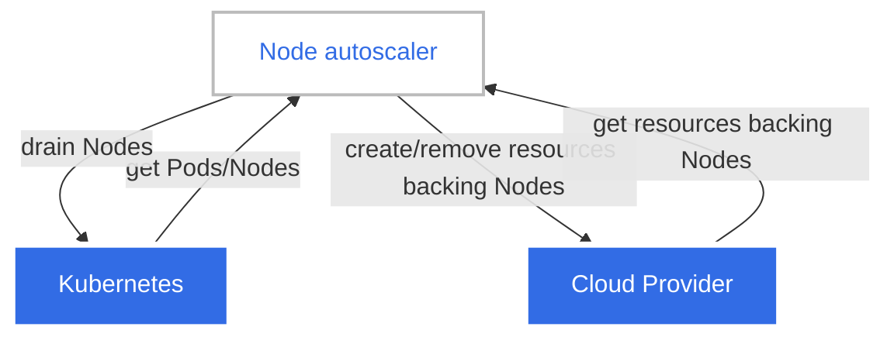

# Tự động mở rộng Node (Node Autoscaling)

> Bản dịch tiếng Việt của trang: <https://kubernetes.io/docs/concepts/cluster-administration/node-autoscaling/>
>
> Tự động cấp phát (provision) và hợp nhất (consolidate) các Node trong cluster của bạn
> để thích ứng với nhu cầu và tối ưu chi phí.

---

## Đọc bài này thế nào

> Phần này không có trong trang gốc. Nó cho biết ở lần đọc này bạn cần hiểu sâu tới đâu và
> phần nào để dành cho giai đoạn sau. Xem [lộ trình](00-ALO-TRINH-ADMIN.md).

**Vị trí:** [Giai đoạn 12](00-ALO-TRINH-ADMIN.md#giai-đoạn-12--quản-trị-cluster-nâng-cao), bài 4/8 ·
Kiểm chứng ở Lab 12 (chưa viết, xem [bản đồ lab](labs/README.md#4-bản-đồ-lab)).

Bài này **không kiểm chứng được trên cluster lab**, và đó chính là bài học đầu tiên: autoscaling
Node cần một cloud provider để tạo và xóa máy đứng sau Node, còn ba VM của bạn là cố định. Đọc để
nắm **mô hình** — nó phản ứng theo cái gì, quyết định dựa trên con số nào — chứ không để cấu hình
gì. Nửa sau bài so sánh hai sản phẩm cụ thể; phần đó chỉ có nghĩa khi bạn thực sự chạy trên cloud.

**Phải hiểu ở lần đọc này:**

- Hai thao tác đối xứng: **cấp phát** (provisioning, trước gọi là *scale-up*) khi có Pod không
  lập lịch được, và **hợp nhất** (consolidation, trước gọi là *scale-down*) khi Node đang dùng
  dưới mức. Nhớ cả tên cũ vì tài liệu và log của Cluster Autoscaler vẫn dùng chúng.
- **Cả hai chỉ xét resource request của Pod, không xét mức sử dụng thực tế.** Request đặt sai thì
  autoscaler quyết định sai — request quá thấp thì cấp Node mới cũng không cứu được Pod, request
  quá cao thì chặn nhầm việc hợp nhất Node.
- Autoscaler phải nói chuyện với **API của nhà cung cấp đám mây** để tạo/xóa tài nguyên đứng sau
  Node, nên nó cần **tích hợp tường minh với từng cloud**. Đây là lý do cluster VM tự dựng không
  có autoscaling Node.
- Định nghĩa Node **rỗng**: chỉ còn Pod DaemonSet và static Pod chạy trên đó. Loại bỏ Node rỗng
  đơn giản; loại bỏ Node **không rỗng** thì gây gián đoạn — Pod bị terminate và phải được tạo lại,
  dù thông thường không Pod nào rơi vào pending vì việc hợp nhất.
- Cách kết hợp: **autoscaling workload theo chiều ngang** tạo thêm Pod theo tải, autoscaling Node
  cấp Node để chứa chúng; **theo chiều dọc** sửa lại request cho đúng, nhờ đó quyết định của
  autoscaler chính xác — nhưng **không dùng cho Pod DaemonSet**, vì autoscaler phải dự đoán được
  Pod DaemonSet chiếm bao nhiêu trên một Node mới.

**Đọc lướt, chưa cần hiểu:**

| Phần | Vì sao hoãn | Sẽ hiểu ở |
| --- | --- | --- |
| *Các ràng buộc Node do cấu hình autoscaler áp đặt* và *Tự động cấp phát* | phụ thuộc hoàn toàn vào sản phẩm autoscaler bạn chọn | không cần |
| *Cluster Autoscaler*, *Karpenter* và *So sánh các hiện thực* | chọn hiện thực chỉ có nghĩa khi cluster thật sự chạy trên cloud | không cần |
| *Descheduler* trong *Các thành phần liên quan* | là add-on riêng, hợp nhất theo chính sách tùy chỉnh | giai đoạn 16 vòng đời node |
| *Autoscaler cho workload dựa trên kích thước cluster* | co giãn theo số Node, không thuộc autoscaling Node | không cần |

---

Để chạy các workload trong cluster, bạn cần có các Node. Các Node trong cluster có thể
được _tự động mở rộng_ (autoscaled) — được [_cấp phát_](#provisioning) hoặc
[_hợp nhất_](#consolidation) một cách linh hoạt nhằm cung cấp năng lực (capacity) cần thiết
đồng thời tối ưu chi phí. Việc tự động mở rộng được thực hiện bởi các
[_autoscaler_](#autoscalers) cho Node.

## Cấp phát Node (Node provisioning) {#provisioning}

Nếu trong cluster có các Pod không thể được lập lịch (schedule) lên các Node hiện có,
các Node mới có thể được tự động thêm vào cluster — tức _cấp phát_ — để chứa các Pod đó.
Điều này đặc biệt hữu ích khi số lượng Pod thay đổi theo thời gian, ví dụ như kết quả của việc
[kết hợp autoscaling workload theo chiều ngang với autoscaling Node](#horizontal-workload-autoscaling).

Các autoscaler cấp phát Node bằng cách tạo và xóa các tài nguyên của nhà cung cấp đám mây
(cloud provider) đứng sau các Node đó. Phổ biến nhất, tài nguyên đứng sau các Node là các
máy ảo (Virtual Machine).

Mục tiêu chính của việc cấp phát là làm cho tất cả các Pod đều lập lịch được. Mục tiêu này
không phải lúc nào cũng đạt được do nhiều hạn chế khác nhau, bao gồm việc chạm tới các giới
hạn cấp phát đã cấu hình, cấu hình cấp phát không tương thích với một nhóm pod cụ thể, hoặc
nhà cung cấp đám mây thiếu năng lực. Trong khi cấp phát, các autoscaler Node thường cố gắng
đạt thêm những mục tiêu khác (ví dụ giảm thiểu chi phí của các Node được cấp phát, hoặc cân
bằng số lượng Node giữa các miền lỗi (failure domain)).

Có hai đầu vào chính cho một autoscaler Node khi xác định các Node cần cấp phát —
[các ràng buộc lập lịch của Pod](#provisioning-pod-constraints), và
[các ràng buộc Node do cấu hình autoscaler áp đặt](#provisioning-node-constraints).

Cấu hình autoscaler cũng có thể bao gồm các điều kiện kích hoạt cấp phát Node khác
(ví dụ số lượng Node giảm xuống dưới giới hạn tối thiểu đã cấu hình).

> **Ghi chú:**
> Cấp phát (provisioning) trước đây được gọi là _scale-up_ trong Cluster Autoscaler.

### Các ràng buộc lập lịch của Pod (Pod scheduling constraints) {#provisioning-pod-constraints}

Pod có thể khai báo các [ràng buộc lập lịch](138-assign-pod-node-vi.md)
để áp đặt giới hạn về loại Node mà chúng có thể được lập lịch lên. Các autoscaler Node xét
đến những ràng buộc này để đảm bảo rằng các Pod đang chờ (pending) có thể được lập lịch lên
các Node được cấp phát.

Loại ràng buộc lập lịch phổ biến nhất là các yêu cầu tài nguyên (resource request) do các
container của Pod chỉ định. Các autoscaler sẽ bảo đảm rằng các Node được cấp phát có đủ tài
nguyên để thỏa mãn các yêu cầu đó. Tuy nhiên, chúng không trực tiếp xét đến mức sử dụng tài
nguyên thực tế của các Pod sau khi chúng bắt đầu chạy. Để tự động mở rộng Node dựa trên mức
sử dụng tài nguyên thực tế của workload, bạn có thể kết hợp
[autoscaling workload theo chiều ngang](#horizontal-workload-autoscaling) với autoscaling Node.

Các ràng buộc lập lịch phổ biến khác của Pod bao gồm
[Node affinity](138-assign-pod-node-vi.md#node-affinity),
[affinity giữa các Pod](138-assign-pod-node-vi.md#inter-pod-affinity-and-anti-affinity),
hoặc yêu cầu về một [volume lưu trữ](91-volumes-vi.md) cụ thể.

### Các ràng buộc Node do cấu hình autoscaler áp đặt (Node constraints imposed by autoscaler configuration) {#provisioning-node-constraints}

Các đặc tính cụ thể của những Node được cấp phát (ví dụ lượng tài nguyên, sự hiện diện của
một label nhất định) phụ thuộc vào cấu hình autoscaler. Các autoscaler có thể chọn chúng từ
một tập cấu hình Node định nghĩa sẵn, hoặc dùng [tự động cấp phát](#autoprovisioning).

### Tự động cấp phát (Auto-provisioning) {#autoprovisioning}

Tự động cấp phát Node (auto-provisioning) là một chế độ cấp phát trong đó người dùng không
phải cấu hình đầy đủ các đặc tính của những Node có thể được cấp phát. Thay vào đó,
autoscaler tự động chọn cấu hình Node dựa trên các Pod đang chờ mà nó đang phản ứng, cũng
như các ràng buộc được cấu hình trước (ví dụ lượng tài nguyên tối thiểu hoặc nhu cầu về một
label nhất định).

## Hợp nhất Node (Node consolidation) {#consolidation}

Mối quan tâm chính khi vận hành một cluster là đảm bảo tất cả các pod lập lịch được đều đang
chạy, đồng thời giữ chi phí của cluster thấp nhất có thể. Để đạt được điều này, các yêu cầu
tài nguyên của Pod nên tận dụng tối đa tài nguyên của các Node. Từ góc nhìn này, mức sử dụng
Node tổng thể trong cluster có thể được dùng như một chỉ báo gián tiếp cho việc cluster có
hiệu quả về chi phí hay không.

> **Ghi chú:**
> Việc thiết lập đúng các yêu cầu tài nguyên cho Pod của bạn quan trọng đối với hiệu quả
> chi phí tổng thể của cluster không kém gì việc tối ưu mức sử dụng Node.
> Kết hợp autoscaling Node với [autoscaling workload theo chiều dọc](#vertical-workload-autoscaling)
> có thể giúp bạn đạt được điều này.

Các Node trong cluster của bạn có thể được tự động _hợp nhất_ (consolidate) nhằm cải thiện
mức sử dụng Node tổng thể, và từ đó cải thiện hiệu quả chi phí của cluster. Việc hợp nhất
diễn ra thông qua loại bỏ một nhóm Node đang sử dụng dưới mức (underutilized) khỏi cluster.
Tùy chọn, một nhóm Node khác có thể được [cấp phát](#provisioning) để thay thế chúng.

Việc hợp nhất, giống như cấp phát, chỉ xét đến các yêu cầu tài nguyên của Pod chứ không xét
mức sử dụng tài nguyên thực tế khi ra quyết định.

Đối với mục đích hợp nhất, một Node được coi là _rỗng_ (empty) nếu nó chỉ có các Pod
DaemonSet và static Pod đang chạy trên đó. Loại bỏ các Node rỗng trong quá trình hợp nhất
đơn giản hơn so với các Node không rỗng, và các autoscaler thường có những tối ưu được thiết
kế riêng cho việc hợp nhất các Node rỗng.

Loại bỏ các Node không rỗng trong quá trình hợp nhất gây gián đoạn — các Pod đang chạy trên
đó sẽ bị kết thúc (terminate), và có thể phải được tạo lại (ví dụ bởi một Deployment). Tuy
nhiên, tất cả các Pod được tạo lại như vậy đáng ra phải lập lịch được lên các Node hiện có
trong cluster, hoặc lên các Node thay thế được cấp phát như một phần của quá trình hợp nhất.
__Thông thường, không Pod nào bị rơi vào trạng thái pending do hậu quả của việc hợp nhất.__

> **Ghi chú:**
> Các autoscaler dự đoán một Pod được tạo lại nhiều khả năng sẽ được lập lịch như thế nào
> sau khi một Node được cấp phát hoặc hợp nhất, nhưng chúng không kiểm soát việc lập lịch
> thực tế. Vì vậy, một số Pod có thể rơi vào trạng thái pending do hậu quả của việc hợp
> nhất — ví dụ nếu một Pod hoàn toàn mới xuất hiện trong khi việc hợp nhất đang diễn ra.

Cấu hình autoscaler cũng có thể cho phép kích hoạt việc hợp nhất theo những điều kiện khác
(ví dụ thời gian đã trôi qua kể từ khi một Node được tạo), nhằm tối ưu các thuộc tính khác
nhau (ví dụ tuổi thọ tối đa của các Node trong cluster).

Chi tiết về cách thực hiện việc hợp nhất phụ thuộc vào cấu hình của từng autoscaler.

> **Ghi chú:**
> Hợp nhất (consolidation) trước đây được gọi là _scale-down_ trong Cluster Autoscaler.

## Các autoscaler (Autoscalers) {#autoscalers}

Các chức năng được mô tả trong những phần trước được cung cấp bởi các _autoscaler_ cho Node.
Ngoài Kubernetes API, các autoscaler còn cần tương tác với API của nhà cung cấp đám mây để
cấp phát và hợp nhất Node. Điều này có nghĩa là chúng cần được tích hợp tường minh với từng
nhà cung cấp đám mây được hỗ trợ. Hiệu năng và tập tính năng của một autoscaler nhất định có
thể khác nhau giữa các bản tích hợp nhà cung cấp đám mây.

### Các hiện thực autoscaler (Autoscaler implementations)

[Cluster Autoscaler](https://github.com/kubernetes/autoscaler/tree/master/cluster-autoscaler)
và [Karpenter](https://github.com/kubernetes-sigs/karpenter) là hai autoscaler Node hiện đang
được [SIG Autoscaling](https://github.com/kubernetes/community/tree/main/sig-autoscaling)
bảo trợ.

Từ góc nhìn của người dùng cluster, cả hai autoscaler đều nên mang lại trải nghiệm tự động
mở rộng Node tương tự nhau. Cả hai đều sẽ cấp phát Node mới cho các Pod không lập lịch được,
và cả hai đều sẽ hợp nhất những Node không còn được sử dụng một cách tối ưu.

Các autoscaler khác nhau cũng có thể cung cấp các tính năng nằm ngoài phạm vi tự động mở
rộng Node được mô tả trên trang này, và những tính năng bổ sung đó có thể khác nhau giữa
chúng.

Hãy tham khảo các phần bên dưới, cùng tài liệu được liên kết của từng autoscaler, để quyết
định autoscaler nào phù hợp hơn với trường hợp sử dụng của bạn.

#### Cluster Autoscaler

Cluster Autoscaler thêm hoặc bớt Node vào các _nhóm Node_ (Node group) được cấu hình sẵn.
Các nhóm Node thường ánh xạ tới một dạng nhóm tài nguyên nào đó của nhà cung cấp đám mây
(phổ biến nhất là nhóm máy ảo). Một thực thể (instance) Cluster Autoscaler duy nhất có thể
quản lý đồng thời nhiều nhóm Node. Khi cấp phát, Cluster Autoscaler sẽ thêm Node vào nhóm
phù hợp nhất với yêu cầu của các Pod đang chờ. Khi hợp nhất, Cluster Autoscaler luôn chọn
các Node cụ thể để loại bỏ, thay vì chỉ thay đổi kích thước của nhóm tài nguyên nhà cung cấp
đám mây bên dưới.

Ngữ cảnh bổ sung:

* [Tổng quan tài liệu](https://github.com/kubernetes/autoscaler/blob/master/cluster-autoscaler/README.md)
* [Các tích hợp nhà cung cấp đám mây](https://github.com/kubernetes/autoscaler/blob/master/cluster-autoscaler/README.md#faqdocumentation)
* [Cluster Autoscaler FAQ](https://github.com/kubernetes/autoscaler/blob/master/cluster-autoscaler/FAQ.md)
* [Liên hệ](https://github.com/kubernetes/community/tree/main/sig-autoscaling#contact)

#### Karpenter

Karpenter tự động cấp phát Node dựa trên các cấu hình
[NodePool](https://karpenter.sh/docs/concepts/nodepools/) do người vận hành cluster cung
cấp. Karpenter xử lý mọi khía cạnh của vòng đời node, không chỉ riêng việc tự động mở rộng.
Điều này bao gồm tự động làm mới (refresh) các Node khi chúng đạt đến một tuổi thọ nhất
định, và tự động nâng cấp Node khi có các image mới cho worker Node được phát hành. Nó làm
việc trực tiếp với từng tài nguyên riêng lẻ của nhà cung cấp đám mây (phổ biến nhất là từng
máy ảo riêng lẻ), và không dựa vào các nhóm tài nguyên của nhà cung cấp đám mây.

Ngữ cảnh bổ sung:

* [Tài liệu](https://karpenter.sh/)
* [Các tích hợp nhà cung cấp đám mây](https://github.com/kubernetes-sigs/karpenter?tab=readme-ov-file#karpenter-implementations)
* [Karpenter FAQ](https://karpenter.sh/docs/faq/)
* [Liên hệ](https://github.com/kubernetes-sigs/karpenter#community-discussion-contribution-and-support)

#### So sánh các hiện thực (Implementation comparison)

Những khác biệt chính giữa Cluster Autoscaler và Karpenter:

* Cluster Autoscaler cung cấp các tính năng chỉ liên quan đến tự động mở rộng Node.
  Karpenter có phạm vi rộng hơn, và cũng cung cấp các tính năng nhằm quản lý toàn bộ vòng
  đời Node (ví dụ tận dụng cơ chế gián đoạn (disruption) để tự động tạo lại Node khi chúng
  đạt đến một tuổi thọ nhất định, hoặc tự động nâng cấp chúng lên các phiên bản mới).
* Cluster Autoscaler không hỗ trợ tự động cấp phát (auto-provisioning), các nhóm Node mà nó
  có thể cấp phát từ đó phải được cấu hình sẵn. Karpenter hỗ trợ tự động cấp phát, do đó
  người dùng chỉ phải cấu hình một tập ràng buộc cho các Node được cấp phát, thay vì cấu
  hình đầy đủ các nhóm đồng nhất.
* Cluster Autoscaler cung cấp trực tiếp các tích hợp nhà cung cấp đám mây, nghĩa là chúng
  là một phần của dự án Kubernetes. Với Karpenter, dự án Kubernetes phát hành Karpenter như
  một thư viện mà các nhà cung cấp đám mây có thể tích hợp để xây dựng autoscaler Node.
* Cluster Autoscaler cung cấp tích hợp với rất nhiều nhà cung cấp đám mây, bao gồm cả các
  nhà cung cấp nhỏ và ít phổ biến hơn. Có ít nhà cung cấp đám mây tích hợp với Karpenter
  hơn, bao gồm [AWS](https://github.com/aws/karpenter-provider-aws), và
  [Azure](https://github.com/Azure/karpenter-provider-azure).

## Kết hợp autoscaling workload và Node (Combine workload and Node autoscaling)

### Autoscaling workload theo chiều ngang (Horizontal workload autoscaling) {#horizontal-workload-autoscaling}

Tự động mở rộng Node thường hoạt động để phản ứng với các Pod — nó cấp phát Node mới để chứa
các Pod không lập lịch được, rồi hợp nhất các Node khi chúng không còn cần thiết.

[Autoscaling workload theo chiều ngang](71-autoscaling-vi.md#scaling-workloads-horizontally)
tự động điều chỉnh số lượng bản sao (replica) của workload nhằm duy trì mức sử dụng tài
nguyên trung bình mong muốn trên các bản sao. Nói cách khác, nó tự động tạo các Pod mới để
phản ứng với tải của ứng dụng, rồi loại bỏ các Pod khi tải giảm xuống.

Bạn có thể dùng autoscaling Node cùng với autoscaling workload theo chiều ngang để tự động
mở rộng các Node trong cluster dựa trên mức sử dụng tài nguyên thực tế trung bình của các
Pod.

Nếu tải của ứng dụng tăng lên, mức sử dụng trung bình của các Pod của nó cũng sẽ tăng theo,
khiến autoscaling workload tạo các Pod mới. Khi đó autoscaling Node sẽ cấp phát các Node mới
để chứa các Pod mới này.

Khi tải của ứng dụng giảm xuống, autoscaling workload sẽ loại bỏ các Pod không cần thiết.
Autoscaling Node, đến lượt nó, sẽ hợp nhất các Node không còn cần thiết.

Nếu được cấu hình đúng, mô hình này đảm bảo rằng ứng dụng của bạn luôn có đủ năng lực Node
để xử lý các đợt tăng đột biến về tải khi cần, nhưng bạn không phải trả tiền cho năng lực đó
khi không cần đến.

### Autoscaling workload theo chiều dọc (Vertical workload autoscaling) {#vertical-workload-autoscaling}

Khi dùng autoscaling Node, điều quan trọng là thiết lập đúng các yêu cầu tài nguyên của Pod.
Nếu yêu cầu của một Pod nào đó quá thấp, việc cấp phát một Node mới cho nó có thể không giúp
Pod thực sự chạy được. Nếu yêu cầu của một Pod nào đó quá cao, nó có thể ngăn cản một cách
sai lầm việc hợp nhất Node của nó.

[Autoscaling workload theo chiều dọc](71-autoscaling-vi.md#scaling-workloads-vertically)
tự động điều chỉnh các yêu cầu tài nguyên của Pod dựa trên mức sử dụng tài nguyên trong quá
khứ của chúng.

Bạn có thể dùng autoscaling Node cùng với autoscaling workload theo chiều dọc để điều chỉnh
yêu cầu tài nguyên của các Pod trong khi vẫn bảo toàn khả năng tự động mở rộng Node trong
cluster của bạn.

> **Thận trọng:**
> Khi dùng autoscaling Node, không khuyến nghị thiết lập autoscaling workload theo chiều
> dọc cho các Pod DaemonSet. Các autoscaler phải dự đoán các Pod DaemonSet trên một Node
> mới sẽ trông như thế nào để dự đoán tài nguyên khả dụng của Node. Autoscaling workload
> theo chiều dọc có thể làm cho các dự đoán này trở nên không đáng tin cậy, dẫn đến các
> quyết định mở rộng sai.

## Các thành phần liên quan (Related components)

Phần này mô tả các thành phần cung cấp chức năng liên quan đến tự động mở rộng Node.

### Descheduler

[Descheduler](https://github.com/kubernetes-sigs/descheduler) là một thành phần cung cấp
chức năng hợp nhất Node dựa trên các chính sách (policy) tùy chỉnh, cũng như các tính năng
khác liên quan đến tối ưu Node và Pod (ví dụ xóa các Pod khởi động lại thường xuyên).

### Autoscaler cho workload dựa trên kích thước cluster (Workload autoscalers based on cluster size)

[Cluster Proportional Autoscaler](https://github.com/kubernetes-sigs/cluster-proportional-autoscaler)
và [Cluster Proportional Vertical Autoscaler](https://github.com/kubernetes-sigs/cluster-proportional-vertical-autoscaler)
cung cấp autoscaling workload theo chiều ngang và chiều dọc dựa trên số lượng Node trong
cluster. Bạn có thể đọc thêm trong
[autoscaling dựa trên kích thước cluster](71-autoscaling-vi.md#autoscaling-based-on-cluster-size).

## Tiếp theo (What's next)

- Đọc về [autoscaling ở cấp độ workload](71-autoscaling-vi.md)

---

## Tự kiểm tra

> Phần này không có trong trang gốc.

Trả lời được các câu sau mà không nhìn lại bài là đủ cho lần đọc ở giai đoạn 12:

1. Cluster lab có đúng ba VM cố định do bạn tự dựng. Chạy được autoscaling Node ở đây không?
   Thiếu chính xác thứ gì, chứ không phải "thiếu cấu hình"?
2. **Câu bẫy.** Một Pod khai `requests.cpu: 2` nhưng thực tế chỉ tiêu thụ `50m`. Autoscaler cấp
   phát và hợp nhất dựa trên con số nào trong hai con số đó? Điều gì xảy ra với Node đang chạy
   Pod này khi autoscaler cân nhắc hợp nhất?
3. Một Node chỉ còn Pod của DaemonSet và static Pod. Autoscaler coi nó là rỗng hay không rỗng, và
   vì sao ranh giới đó lại đáng nhớ?
4. Tải ứng dụng tăng vọt, cluster có cả autoscaling workload theo chiều ngang lẫn autoscaling
   Node. Kể lại thứ tự sự kiện: cái nào phản ứng trước, cái nào phản ứng theo?

Đáp án — chỉ mở sau khi đã tự trả lời

1. **Không.** Thiếu **một nhà cung cấp đám mây có tích hợp autoscaler**. Bài nói rõ autoscaler
   cấp phát Node bằng cách **tạo và xóa các tài nguyên của cloud provider đứng sau Node** (phổ
   biến nhất là máy ảo), và vì vậy chúng **cần được tích hợp tường minh với từng cloud provider
   được hỗ trợ**. Ba VM bạn tự tạo không có API nào để autoscaler gọi, nên đây là giới hạn về bản
   chất chứ không phải thiếu một dòng cấu hình.
2. Dựa trên **`requests.cpu: 2`**. Bài nhấn hai lần: loại ràng buộc lập lịch phổ biến nhất là
   resource request của container, và **việc hợp nhất, giống như cấp phát, chỉ xét yêu cầu tài
   nguyên của Pod chứ không xét mức sử dụng thực tế**. Hệ quả với Node này: yêu cầu quá cao **có
   thể ngăn cản một cách sai lầm việc hợp nhất Node của nó** — Node trông "đầy" trong khi thực tế
   gần như rỗi, và bạn trả tiền cho nó. Trực giác sai ở chỗ tưởng autoscaler nhìn mức tải thật;
   nó nhìn con số bạn khai.
3. **Rỗng.** Bài định nghĩa: một Node được coi là rỗng nếu **chỉ có Pod DaemonSet và static Pod**
   chạy trên đó. Ranh giới này đáng nhớ vì loại bỏ Node rỗng **đơn giản hơn nhiều** và các
   autoscaler thường có tối ưu riêng cho nó, còn loại bỏ Node không rỗng **gây gián đoạn**: Pod bị
   terminate và phải được tạo lại ở nơi khác.
4. **Autoscaling workload phản ứng trước.** Tải tăng → mức sử dụng trung bình của các Pod tăng →
   autoscaling workload theo chiều ngang **tạo Pod mới**. Các Pod mới này có thể không lập lịch
   được → **autoscaling Node cấp phát Node mới** để chứa chúng. Khi tải giảm, trình tự đảo lại:
   autoscaling workload xóa bớt Pod, rồi autoscaling Node **hợp nhất** những Node không còn cần.
   Nói cách khác, autoscaling Node luôn **phản ứng theo Pod**, không phản ứng trực tiếp theo tải.

Câu nào chưa trả lời được thì quay lại đúng mục tương ứng trước khi đọc bài sau.
