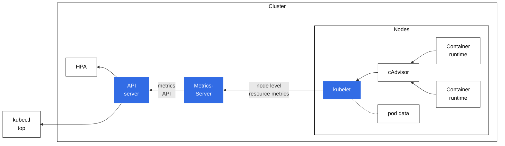

# Pipeline metrics tài nguyên (Resource metrics pipeline)

> Bản dịch tiếng Việt của trang: <https://kubernetes.io/docs/tasks/debug/debug-cluster/resource-metrics-pipeline/>

Đối với Kubernetes, _Metrics API_ cung cấp một tập metrics cơ bản nhằm hỗ trợ việc tự động
co giãn (autoscaling) và các trường hợp sử dụng tương tự. API này cung cấp thông tin về mức sử
dụng tài nguyên của node và pod, bao gồm metrics về CPU và bộ nhớ (memory). Nếu bạn triển khai
Metrics API vào cluster của mình, các client của Kubernetes API sau đó có thể truy vấn thông
tin này, và bạn có thể dùng các cơ chế kiểm soát truy cập (access control) của Kubernetes để
quản lý quyền thực hiện việc đó.

[HorizontalPodAutoscaler](72-horizontal-pod-autoscale-vi.md) (HPA) và
[VerticalPodAutoscaler](73-vertical-pod-autoscale-vi.md) (VPA)
sử dụng dữ liệu từ Metrics API để điều chỉnh số bản sao (replica) và tài nguyên của workload
nhằm đáp ứng nhu cầu của khách hàng.

Bạn cũng có thể xem metrics tài nguyên bằng lệnh
[`kubectl top`](https://kubernetes.io/docs/reference/generated/kubectl/kubectl-commands#top).

> **Ghi chú:** Metrics API, và pipeline metrics mà nó mang lại, chỉ cung cấp các metrics CPU
> và bộ nhớ ở mức tối thiểu để cho phép tự động co giãn bằng HPA và/hoặc VPA.
> Nếu bạn muốn cung cấp một tập metrics đầy đủ hơn, bạn có thể bổ sung cho Metrics API đơn giản
> này bằng cách triển khai thêm một
> [pipeline metrics](312-resource-usage-monitoring-vi.md#full-metrics-pipeline)
> thứ hai sử dụng _Custom Metrics API_.

Hình 1 minh họa kiến trúc của pipeline metrics tài nguyên.



*Hình 1. Pipeline metrics tài nguyên*

Các thành phần kiến trúc, tính từ phải sang trái trong hình, bao gồm:

* [cAdvisor](https://github.com/google/cadvisor): Daemon thu thập, tổng hợp và cung cấp
  metrics của container, được tích hợp sẵn trong kubelet.
* [kubelet](22-architecture-vi.md#kubelet): Agent trên node dùng
  để quản lý tài nguyên container. Metrics tài nguyên có thể truy cập qua các endpoint API
  `/metrics/resource` và `/stats` của kubelet.
* [Metrics tài nguyên mức node](https://kubernetes.io/docs/reference/instrumentation/node-metrics):
  API do kubelet cung cấp để khám phá và truy xuất số liệu thống kê tổng hợp theo từng node,
  có sẵn qua endpoint `/metrics/resource`.
* [metrics-server](#metrics-server): Thành phần addon của cluster, thu thập và tổng hợp
  metrics tài nguyên được kéo (pull) từ từng kubelet. API server phục vụ Metrics API cho HPA,
  VPA và lệnh `kubectl top` sử dụng. Metrics Server là bản triển khai tham chiếu (reference
  implementation) của Metrics API.
* [Metrics API](#metrics-api): API của Kubernetes hỗ trợ truy cập mức sử dụng CPU và bộ nhớ
  dùng cho việc tự động co giãn workload. Để API này hoạt động trong cluster của bạn, bạn cần
  một API extension server cung cấp Metrics API.

  > **Ghi chú:** cAdvisor hỗ trợ đọc metrics từ cgroups, cơ chế này hoạt động với các container
  > runtime thông dụng trên Linux. Nếu bạn dùng một container runtime sử dụng cơ chế cô lập
  > tài nguyên khác, ví dụ ảo hóa (virtualization), thì container runtime đó phải hỗ trợ
  > [CRI Container Metrics](https://github.com/kubernetes/community/blob/main/contributors/devel/sig-node/cri-container-stats.md)
  > để metrics có thể sẵn sàng cho kubelet.

## Metrics API

**TRẠNG THÁI TÍNH NĂNG:** `Kubernetes v1.8 [beta]`

metrics-server triển khai Metrics API. API này cho phép bạn truy cập mức sử dụng CPU và bộ nhớ
của các node và pod trong cluster của bạn. Vai trò chính của nó là cung cấp metrics mức sử dụng
tài nguyên cho các thành phần autoscaler của K8s.

Dưới đây là một ví dụ về yêu cầu Metrics API cho một node `minikube`, được chuyển qua `jq` để
dễ đọc hơn:

```shell
kubectl get --raw "/apis/metrics.k8s.io/v1beta1/nodes/minikube" | jq '.'
```

Đây là cùng lời gọi API đó nhưng dùng `curl`:

```shell
curl http://localhost:8080/apis/metrics.k8s.io/v1beta1/nodes/minikube
```

Phản hồi mẫu:

```json
{
  "kind": "NodeMetrics",
  "apiVersion": "metrics.k8s.io/v1beta1",
  "metadata": {
    "name": "minikube",
    "selfLink": "/apis/metrics.k8s.io/v1beta1/nodes/minikube",
    "creationTimestamp": "2022-01-27T18:48:43Z"
  },
  "timestamp": "2022-01-27T18:48:33Z",
  "window": "30s",
  "usage": {
    "cpu": "487558164n",
    "memory": "732212Ki"
  }
}
```

Dưới đây là một ví dụ về yêu cầu Metrics API cho pod `kube-scheduler-minikube` nằm trong
namespace `kube-system`, được chuyển qua `jq` để dễ đọc hơn:

```shell
kubectl get --raw "/apis/metrics.k8s.io/v1beta1/namespaces/kube-system/pods/kube-scheduler-minikube" | jq '.'
```

Đây là cùng lời gọi API đó nhưng dùng `curl`:

```shell
curl http://localhost:8080/apis/metrics.k8s.io/v1beta1/namespaces/kube-system/pods/kube-scheduler-minikube
```

Phản hồi mẫu:

```json
{
  "kind": "PodMetrics",
  "apiVersion": "metrics.k8s.io/v1beta1",
  "metadata": {
    "name": "kube-scheduler-minikube",
    "namespace": "kube-system",
    "selfLink": "/apis/metrics.k8s.io/v1beta1/namespaces/kube-system/pods/kube-scheduler-minikube",
    "creationTimestamp": "2022-01-27T19:25:00Z"
  },
  "timestamp": "2022-01-27T19:24:31Z",
  "window": "30s",
  "containers": [
    {
      "name": "kube-scheduler",
      "usage": {
        "cpu": "9559630n",
        "memory": "22244Ki"
      }
    }
  ]
}
```

Metrics API được định nghĩa trong repository [k8s.io/metrics](https://github.com/kubernetes/metrics).
Bạn phải bật [tầng tổng hợp API (API aggregation layer)](374-configure-aggregation-layer-vi.md)
và đăng ký một [APIService](https://kubernetes.io/docs/reference/kubernetes-api/cluster-resources/api-service-v1/)
cho API `metrics.k8s.io`.

Để tìm hiểu thêm về Metrics API, xem
[thiết kế resource metrics API](https://git.k8s.io/design-proposals-archive/instrumentation/resource-metrics-api.md),
[repository metrics-server](https://github.com/kubernetes-sigs/metrics-server) và
[resource metrics API](https://github.com/kubernetes/metrics#resource-metrics-api).

> **Ghi chú:** Bạn phải triển khai metrics-server hoặc một adapter thay thế có phục vụ
> Metrics API thì mới có thể truy cập API này.

## Đo lường mức sử dụng tài nguyên (Measuring resource usage)

### CPU

CPU được báo cáo dưới dạng mức sử dụng lõi (core) trung bình, đo bằng đơn vị cpu. Một cpu,
trong Kubernetes, tương đương với 1 vCPU/Core đối với các nhà cung cấp cloud, và 1 hyper-thread
trên các bộ xử lý Intel bare-metal.

Giá trị này được suy ra bằng cách lấy tốc độ biến thiên (rate) trên một bộ đếm CPU tích lũy do
kernel cung cấp (ở cả kernel Linux và Windows). Cửa sổ thời gian dùng để tính CPU được hiển thị
trong trường window của Metrics API.

Để tìm hiểu thêm về cách Kubernetes cấp phát và đo lường tài nguyên CPU, xem
[ý nghĩa của CPU](110-manage-resources-containers-vi.md#meaning-of-cpu).

### Bộ nhớ (Memory)

Bộ nhớ được báo cáo dưới dạng working set, đo bằng byte, tại thời điểm metric được thu thập.

Trong một thế giới lý tưởng, "working set" là lượng bộ nhớ đang được sử dụng mà không thể giải
phóng khi có áp lực bộ nhớ (memory pressure). Tuy nhiên, cách tính working set thay đổi tùy
theo hệ điều hành của máy chủ (host OS), và nhìn chung phải dùng nhiều phương pháp ước lượng
(heuristic) để đưa ra một con số ước tính.

Mô hình của Kubernetes cho working set của một container kỳ vọng rằng container runtime sẽ tính
cả bộ nhớ ẩn danh (anonymous memory) gắn với container đang xét. Metric working set thường cũng
bao gồm một phần bộ nhớ được cache (file-backed), vì host OS không phải lúc nào cũng có thể thu
hồi (reclaim) các trang nhớ đó.

Để tìm hiểu thêm về cách Kubernetes cấp phát và đo lường tài nguyên bộ nhớ, xem
[ý nghĩa của memory](110-manage-resources-containers-vi.md#meaning-of-memory).

## Metrics Server

metrics-server lấy metrics tài nguyên từ các kubelet và đưa chúng lên Kubernetes API server
thông qua Metrics API để HPA và VPA sử dụng. Bạn cũng có thể xem các metrics này bằng lệnh
`kubectl top`.

metrics-server dùng Kubernetes API để theo dõi các node và pod trong cluster của bạn.
metrics-server truy vấn từng node qua HTTP để lấy metrics. metrics-server cũng xây dựng một góc
nhìn nội bộ về metadata của pod, và giữ một cache về tình trạng sức khỏe của pod. Thông tin sức
khỏe pod được cache đó có sẵn qua extension API mà metrics-server cung cấp.

Ví dụ với một truy vấn của HPA, metrics-server cần xác định những pod nào thỏa mãn các label
selector trong deployment.

metrics-server gọi API của
[kubelet](https://kubernetes.io/docs/reference/command-line-tools-reference/kubelet/)
để thu thập metrics từ từng node. Tùy theo phiên bản metrics-server, nó sử dụng:

* Endpoint metrics tài nguyên `/metrics/resource` ở phiên bản v0.6.0 trở lên, hoặc
* Endpoint Summary API `/stats/summary` ở các phiên bản cũ hơn

## Tiếp theo (What's next)

Để tìm hiểu thêm về metrics-server, xem
[repository metrics-server](https://github.com/kubernetes-sigs/metrics-server).

Bạn cũng có thể xem thêm:

* [Thiết kế metrics-server](https://git.k8s.io/design-proposals-archive/instrumentation/metrics-server.md)
* [FAQ của metrics-server](https://github.com/kubernetes-sigs/metrics-server/blob/master/FAQ.md)
* [Các vấn đề đã biết của metrics-server](https://github.com/kubernetes-sigs/metrics-server/blob/master/KNOWN_ISSUES.md)
* [Các bản phát hành metrics-server](https://github.com/kubernetes-sigs/metrics-server/releases)
* [Horizontal Pod Autoscaling](https://kubernetes.io/docs/tasks/run-application/horizontal-pod-autoscale/)

Để tìm hiểu cách kubelet phục vụ metrics của node, và cách bạn có thể truy cập chúng qua
Kubernetes API, hãy đọc [Dữ liệu metrics của Node](https://kubernetes.io/docs/reference/instrumentation/node-metrics).
