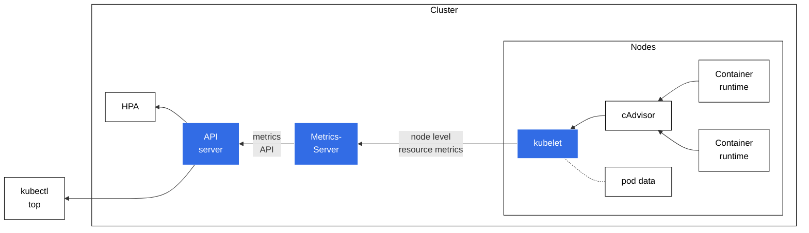

# Pipeline metrics tài nguyên (Resource metrics pipeline)

> Bản dịch tiếng Việt của trang: <https://kubernetes.io/docs/tasks/debug/debug-cluster/resource-metrics-pipeline/>

---

## Đọc bài này thế nào

> Phần này không có trong trang gốc. Nó cho biết ở lần đọc này bạn cần hiểu sâu tới đâu và
> phần nào để dành cho giai đoạn sau. Xem [lộ trình](00-ALO-TRINH-ADMIN.md).

**Vị trí:** [Phần II — Vận hành cluster](00-ALO-TRINH-ADMIN.md#phần-ii--vận-hành-cluster)
→ [Giai đoạn 23 — Giám sát và cảnh báo](00-ALO-TRINH-ADMIN.md#giai-đoạn-23--giám-sát-và-cảnh-báo),
bài 1/3 · Giai đoạn này của Phần II không có lab riêng: thực hành trực tiếp trên cluster lab ở mốc
`04-metrics-ready` (xem [bản đồ lab](labs/README.md#4-bản-đồ-lab)), tự chấm bằng Checkpoint ghi ở
cuối mục giai đoạn trong lộ trình.

Bạn **đã có metrics-server** trên cluster này: nó được cài ở
[Lab 11a B5](labs/LAB-11A-OBSERVABILITY.md#b5-cài-metrics-server-và-chữa-lỗi-certificate), và
`kubectl top` đã chạy ở
[Lab 11a B6](labs/LAB-11A-OBSERVABILITY.md#b6-kubectl-top-và-ranh-giới-của-metrics-server). Vì vậy
đây **không phải bài cài đặt**. Phần mới nằm ở bản đồ kiến trúc: con số mà `kubectl top` in ra đã
đi qua những chặng nào, ai kéo dữ liệu từ ai, và vì sao Metrics API chỉ có đúng CPU với memory.

**Phải hiểu ở lần đọc này:**

- **Chiều đi của dữ liệu** trong Hình 1 và danh sách thành phần ngay dưới hình: container runtime →
  cAdvisor (nằm sẵn trong kubelet) → kubelet phơi ra ở `/metrics/resource` → metrics-server kéo về
  và tổng hợp → API server phục vụ Metrics API → HPA, VPA và `kubectl top` tiêu thụ. Nhớ được chuỗi
  này thì mới khoanh được `kubectl top` hỏng ở chặng nào.
- Mục *Metrics API*: `metrics.k8s.io` **không phải API lõi**. Nó là extension API — phải bật
  [tầng tổng hợp API](374-configure-aggregation-layer-vi.md), phải đăng ký một APIService, và phải
  có metrics-server (hoặc một adapter thay thế) đứng sau thì mới có dữ liệu. Kiểm chứng thẳng bằng
  `kubectl get --raw "/apis/metrics.k8s.io/v1beta1/nodes/<tên node>"`.
- **Ranh giới của pipeline này**, nêu ngay ở ghi chú đầu bài: Metrics API chỉ cung cấp CPU và
  memory ở mức **tối thiểu đủ cho HPA và VPA**. Muốn tập metric đầy đủ hơn thì phải dựng thêm một
  pipeline thứ hai dùng Custom Metrics API. Đây chính là chất liệu cho câu "khác Prometheus ở điểm
  nào" mà Checkpoint giai đoạn 23 hỏi.
- Mục *Đo lường mức sử dụng tài nguyên*, phần CPU: con số CPU là **mức sử dụng lõi trung bình**,
  suy ra bằng tốc độ biến thiên trên một bộ đếm tích lũy của kernel — không phải giá trị tức thời.
  Cửa sổ thời gian dùng để tính nằm ở trường `window` của phản hồi.
- Cũng mục đó, phần Bộ nhớ: memory được báo cáo là **working set**, gồm bộ nhớ ẩn danh của
  container **và** thường cả một phần bộ nhớ cache file-backed mà host OS không phải lúc nào cũng
  thu hồi được. Cách tính working set còn thay đổi theo host OS và phải dùng heuristic.

**Đọc lướt, chưa cần hiểu:**

| Phần | Vì sao hoãn | Sẽ hiểu ở |
| --- | --- | --- |
| Hai khối JSON `NodeMetrics` và `PodMetrics` của cluster `minikube` | chỉ là minh họa định dạng phản hồi; cluster lab có tên node khác | Checkpoint [giai đoạn 23](00-ALO-TRINH-ADMIN.md#giai-đoạn-23--giám-sát-và-cảnh-báo) — chạy lại đúng hai lệnh đó với tên node của bạn |
| VerticalPodAutoscaler đọc Metrics API | VPA là add-on ngoài Kubernetes, không có trong baseline của [Lab 00](labs/LAB-00-MOI-TRUONG-1.35.7.md) | **chưa trả**: nợ #1 phần VPA vẫn treo, xem [sổ nợ lộ trình](00-ALO-TRINH-ADMIN.md#sổ-nợ-lộ-trình); phần HPA đã trả ở [Lab 11b](labs/LAB-11B-HPA-VA-VPA.md) |
| Ghi chú về container runtime dùng cơ chế cô lập khác (ảo hóa) và CRI Container Metrics | ba VM lab chạy containerd trên cgroup Linux, đúng đường mà cAdvisor đọc được | bài [00](00-container-runtimes-vi.md) đã đọc ở [giai đoạn 2](00-ALO-TRINH-ADMIN.md#giai-đoạn-2--container-và-runtime) |
| Cách cấu hình tầng tổng hợp API và đối tượng APIService | ở đây chỉ cần biết Metrics API bắt buộc đăng ký qua tầng đó | bài [374](374-configure-aggregation-layer-vi.md) ở [giai đoạn 28](00-ALO-TRINH-ADMIN.md#giai-đoạn-28--mở-rộng-kubernetes) |

---

Đối với Kubernetes, _Metrics API_ cung cấp một tập metrics cơ bản nhằm hỗ trợ việc tự động
co giãn (autoscaling) và các trường hợp sử dụng tương tự. API này cung cấp thông tin về mức sử
dụng tài nguyên của node và pod, bao gồm metrics về CPU và bộ nhớ (memory). Nếu bạn triển khai
Metrics API vào cluster của mình, các client của Kubernetes API sau đó có thể truy vấn thông
tin này, và bạn có thể dùng các cơ chế kiểm soát truy cập (access control) của Kubernetes để
quản lý quyền thực hiện việc đó.

[HorizontalPodAutoscaler](72-horizontal-pod-autoscale-vi.md) (HPA) và
[VerticalPodAutoscaler](73-vertical-pod-autoscale-vi.md) (VPA)
sử dụng dữ liệu từ Metrics API để điều chỉnh số bản sao (replica) và tài nguyên của workload
nhằm đáp ứng nhu cầu của khách hàng.

Bạn cũng có thể xem metrics tài nguyên bằng lệnh
[`kubectl top`](https://kubernetes.io/docs/reference/generated/kubectl/kubectl-commands#top).

> **Ghi chú:** Metrics API, và pipeline metrics mà nó mang lại, chỉ cung cấp các metrics CPU
> và bộ nhớ ở mức tối thiểu để cho phép tự động co giãn bằng HPA và/hoặc VPA.
> Nếu bạn muốn cung cấp một tập metrics đầy đủ hơn, bạn có thể bổ sung cho Metrics API đơn giản
> này bằng cách triển khai thêm một
> [pipeline metrics](312-resource-usage-monitoring-vi.md#full-metrics-pipeline)
> thứ hai sử dụng _Custom Metrics API_.

Hình 1 minh họa kiến trúc của pipeline metrics tài nguyên.



*Hình 1. Pipeline metrics tài nguyên*

Các thành phần kiến trúc, tính từ phải sang trái trong hình, bao gồm:

* [cAdvisor](https://github.com/google/cadvisor): Daemon thu thập, tổng hợp và cung cấp
  metrics của container, được tích hợp sẵn trong kubelet.
* [kubelet](22-architecture-vi.md#kubelet): Agent trên node dùng
  để quản lý tài nguyên container. Metrics tài nguyên có thể truy cập qua các endpoint API
  `/metrics/resource` và `/stats` của kubelet.
* [Metrics tài nguyên mức node](https://kubernetes.io/docs/reference/instrumentation/node-metrics):
  API do kubelet cung cấp để khám phá và truy xuất số liệu thống kê tổng hợp theo từng node,
  có sẵn qua endpoint `/metrics/resource`.
* [metrics-server](#metrics-server): Thành phần addon của cluster, thu thập và tổng hợp
  metrics tài nguyên được kéo (pull) từ từng kubelet. API server phục vụ Metrics API cho HPA,
  VPA và lệnh `kubectl top` sử dụng. Metrics Server là bản triển khai tham chiếu (reference
  implementation) của Metrics API.
* [Metrics API](#metrics-api): API của Kubernetes hỗ trợ truy cập mức sử dụng CPU và bộ nhớ
  dùng cho việc tự động co giãn workload. Để API này hoạt động trong cluster của bạn, bạn cần
  một API extension server cung cấp Metrics API.

  > **Ghi chú:** cAdvisor hỗ trợ đọc metrics từ cgroups, cơ chế này hoạt động với các container
  > runtime thông dụng trên Linux. Nếu bạn dùng một container runtime sử dụng cơ chế cô lập
  > tài nguyên khác, ví dụ ảo hóa (virtualization), thì container runtime đó phải hỗ trợ
  > [CRI Container Metrics](https://github.com/kubernetes/community/blob/main/contributors/devel/sig-node/cri-container-stats.md)
  > để metrics có thể sẵn sàng cho kubelet.

## Metrics API

**TRẠNG THÁI TÍNH NĂNG:** `Kubernetes v1.8 [beta]`

metrics-server triển khai Metrics API. API này cho phép bạn truy cập mức sử dụng CPU và bộ nhớ
của các node và pod trong cluster của bạn. Vai trò chính của nó là cung cấp metrics mức sử dụng
tài nguyên cho các thành phần autoscaler của K8s.

Dưới đây là một ví dụ về yêu cầu Metrics API cho một node `minikube`, được chuyển qua `jq` để
dễ đọc hơn:

```shell
kubectl get --raw "/apis/metrics.k8s.io/v1beta1/nodes/minikube" | jq '.'
```

Đây là cùng lời gọi API đó nhưng dùng `curl`:

```shell
curl http://localhost:8080/apis/metrics.k8s.io/v1beta1/nodes/minikube
```

Phản hồi mẫu:

```json
{
  "kind": "NodeMetrics",
  "apiVersion": "metrics.k8s.io/v1beta1",
  "metadata": {
    "name": "minikube",
    "selfLink": "/apis/metrics.k8s.io/v1beta1/nodes/minikube",
    "creationTimestamp": "2022-01-27T18:48:43Z"
  },
  "timestamp": "2022-01-27T18:48:33Z",
  "window": "30s",
  "usage": {
    "cpu": "487558164n",
    "memory": "732212Ki"
  }
}
```

Dưới đây là một ví dụ về yêu cầu Metrics API cho pod `kube-scheduler-minikube` nằm trong
namespace `kube-system`, được chuyển qua `jq` để dễ đọc hơn:

```shell
kubectl get --raw "/apis/metrics.k8s.io/v1beta1/namespaces/kube-system/pods/kube-scheduler-minikube" | jq '.'
```

Đây là cùng lời gọi API đó nhưng dùng `curl`:

```shell
curl http://localhost:8080/apis/metrics.k8s.io/v1beta1/namespaces/kube-system/pods/kube-scheduler-minikube
```

Phản hồi mẫu:

```json
{
  "kind": "PodMetrics",
  "apiVersion": "metrics.k8s.io/v1beta1",
  "metadata": {
    "name": "kube-scheduler-minikube",
    "namespace": "kube-system",
    "selfLink": "/apis/metrics.k8s.io/v1beta1/namespaces/kube-system/pods/kube-scheduler-minikube",
    "creationTimestamp": "2022-01-27T19:25:00Z"
  },
  "timestamp": "2022-01-27T19:24:31Z",
  "window": "30s",
  "containers": [
    {
      "name": "kube-scheduler",
      "usage": {
        "cpu": "9559630n",
        "memory": "22244Ki"
      }
    }
  ]
}
```

Metrics API được định nghĩa trong repository [k8s.io/metrics](https://github.com/kubernetes/metrics).
Bạn phải bật [tầng tổng hợp API (API aggregation layer)](374-configure-aggregation-layer-vi.md)
và đăng ký một [APIService](https://kubernetes.io/docs/reference/kubernetes-api/cluster-resources/api-service-v1/)
cho API `metrics.k8s.io`.

Để tìm hiểu thêm về Metrics API, xem
[thiết kế resource metrics API](https://git.k8s.io/design-proposals-archive/instrumentation/resource-metrics-api.md),
[repository metrics-server](https://github.com/kubernetes-sigs/metrics-server) và
[resource metrics API](https://github.com/kubernetes/metrics#resource-metrics-api).

> **Ghi chú:** Bạn phải triển khai metrics-server hoặc một adapter thay thế có phục vụ
> Metrics API thì mới có thể truy cập API này.

## Đo lường mức sử dụng tài nguyên (Measuring resource usage)

### CPU

CPU được báo cáo dưới dạng mức sử dụng lõi (core) trung bình, đo bằng đơn vị cpu. Một cpu,
trong Kubernetes, tương đương với 1 vCPU/Core đối với các nhà cung cấp cloud, và 1 hyper-thread
trên các bộ xử lý Intel bare-metal.

Giá trị này được suy ra bằng cách lấy tốc độ biến thiên (rate) trên một bộ đếm CPU tích lũy do
kernel cung cấp (ở cả kernel Linux và Windows). Cửa sổ thời gian dùng để tính CPU được hiển thị
trong trường window của Metrics API.

Để tìm hiểu thêm về cách Kubernetes cấp phát và đo lường tài nguyên CPU, xem
[ý nghĩa của CPU](110-manage-resources-containers-vi.md#meaning-of-cpu).

### Bộ nhớ (Memory)

Bộ nhớ được báo cáo dưới dạng working set, đo bằng byte, tại thời điểm metric được thu thập.

Trong một thế giới lý tưởng, "working set" là lượng bộ nhớ đang được sử dụng mà không thể giải
phóng khi có áp lực bộ nhớ (memory pressure). Tuy nhiên, cách tính working set thay đổi tùy
theo hệ điều hành của máy chủ (host OS), và nhìn chung phải dùng nhiều phương pháp ước lượng
(heuristic) để đưa ra một con số ước tính.

Mô hình của Kubernetes cho working set của một container kỳ vọng rằng container runtime sẽ tính
cả bộ nhớ ẩn danh (anonymous memory) gắn với container đang xét. Metric working set thường cũng
bao gồm một phần bộ nhớ được cache (file-backed), vì host OS không phải lúc nào cũng có thể thu
hồi (reclaim) các trang nhớ đó.

Để tìm hiểu thêm về cách Kubernetes cấp phát và đo lường tài nguyên bộ nhớ, xem
[ý nghĩa của memory](110-manage-resources-containers-vi.md#meaning-of-memory).

## Metrics Server

metrics-server lấy metrics tài nguyên từ các kubelet và đưa chúng lên Kubernetes API server
thông qua Metrics API để HPA và VPA sử dụng. Bạn cũng có thể xem các metrics này bằng lệnh
`kubectl top`.

metrics-server dùng Kubernetes API để theo dõi các node và pod trong cluster của bạn.
metrics-server truy vấn từng node qua HTTP để lấy metrics. metrics-server cũng xây dựng một góc
nhìn nội bộ về metadata của pod, và giữ một cache về tình trạng sức khỏe của pod. Thông tin sức
khỏe pod được cache đó có sẵn qua extension API mà metrics-server cung cấp.

Ví dụ với một truy vấn của HPA, metrics-server cần xác định những pod nào thỏa mãn các label
selector trong deployment.

metrics-server gọi API của
[kubelet](https://kubernetes.io/docs/reference/command-line-tools-reference/kubelet/)
để thu thập metrics từ từng node. Tùy theo phiên bản metrics-server, nó sử dụng:

* Endpoint metrics tài nguyên `/metrics/resource` ở phiên bản v0.6.0 trở lên, hoặc
* Endpoint Summary API `/stats/summary` ở các phiên bản cũ hơn

## Tiếp theo (What's next)

Để tìm hiểu thêm về metrics-server, xem
[repository metrics-server](https://github.com/kubernetes-sigs/metrics-server).

Bạn cũng có thể xem thêm:

* [Thiết kế metrics-server](https://git.k8s.io/design-proposals-archive/instrumentation/metrics-server.md)
* [FAQ của metrics-server](https://github.com/kubernetes-sigs/metrics-server/blob/master/FAQ.md)
* [Các vấn đề đã biết của metrics-server](https://github.com/kubernetes-sigs/metrics-server/blob/master/KNOWN_ISSUES.md)
* [Các bản phát hành metrics-server](https://github.com/kubernetes-sigs/metrics-server/releases)
* [Horizontal Pod Autoscaling](https://kubernetes.io/docs/tasks/run-application/horizontal-pod-autoscale/)

Để tìm hiểu cách kubelet phục vụ metrics của node, và cách bạn có thể truy cập chúng qua
Kubernetes API, hãy đọc [Dữ liệu metrics của Node](https://kubernetes.io/docs/reference/instrumentation/node-metrics).

---

## Tự kiểm tra

> Phần này không có trong trang gốc.

Trả lời được các câu sau mà không nhìn lại bài là đủ cho lần đọc ở giai đoạn 23:

1. Trên `lab-k8s-master` bạn gõ `kubectl top node lab-k8s-worker2` và nhận được một con số CPU.
   Kể lại đường đi của con số đó theo đúng chiều của Hình 1, từ container đang chạy trên worker
   cho tới màn hình của bạn. Trong cả chuỗi đó, chặng nào là thứ **không đi kèm** Kubernetes mà
   bạn phải cài thêm?
2. **Câu bẫy.** `kubectl top pod` báo một Pod đang dùng 300 MiB, trong khi ứng dụng bên trong
   khẳng định nó chỉ cấp phát khoảng 120 MiB. Con số nào sai, và vì sao?
3. Bạn xóa Deployment `metrics-server` trong namespace `kube-system`. Lệnh
   `kubectl get --raw "/apis/metrics.k8s.io/v1beta1/nodes"` còn trả về dữ liệu không? Một
   HorizontalPodAutoscaler đang chạy mất thứ gì?
4. Phản hồi Metrics API cho một node có `"window": "30s"` và `"cpu": "487558164n"`. Hai giá trị đó
   liên hệ với nhau thế nào? Một đợt tăng vọt CPU kéo dài hai giây có hiện ra thành đỉnh nhọn
   trong con số này không?

<details>
<summary>Đáp án — chỉ mở sau khi đã tự trả lời</summary>

1. Container runtime trên `lab-k8s-worker2` → **cAdvisor**, vốn được tích hợp sẵn trong kubelet,
   thu thập và tổng hợp metrics của container → **kubelet** phơi số liệu tổng hợp theo node tại
   endpoint `/metrics/resource` → **metrics-server** kéo (pull) qua HTTP từ từng kubelet và tổng
   hợp lại → **API server** phục vụ Metrics API `metrics.k8s.io` → `kubectl top` gọi API đó.
   Chặng phải cài thêm là **metrics-server**: bài gọi nó là *thành phần addon của cluster*, và nói
   rõ phải triển khai nó hoặc một adapter thay thế thì mới truy cập được Metrics API. Mọi chặng
   còn lại đã nằm sẵn trong kubelet và API server.
2. **Không con số nào sai — chúng đo hai thứ khác nhau.** Bài định nghĩa memory ở đây là
   **working set**, và mô hình của Kubernetes kỳ vọng working set gồm bộ nhớ ẩn danh của container
   **cộng thêm** một phần bộ nhớ được cache (file-backed), vì host OS không phải lúc nào cũng thu
   hồi được các trang nhớ đó. Ứng dụng chỉ đếm phần nó tự cấp phát. Bài còn nói thẳng rằng cách
   tính working set thay đổi theo host OS và phải dùng heuristic để ước lượng, nên đừng coi con số
   `top` là số liệu cấp phát của ứng dụng.
3. **Không còn.** Bài ghi rõ: bạn phải triển khai metrics-server hoặc một adapter thay thế có phục
   vụ Metrics API thì mới có thể truy cập API này — bản thân `metrics.k8s.io` chỉ là một extension
   API được đăng ký qua tầng tổng hợp, không có dữ liệu của riêng nó. HPA mất đúng thứ mà bài nói
   là vai trò chính của Metrics API: **nguồn metrics mức sử dụng tài nguyên** để tính ra cần điều
   chỉnh số replica thế nào.
4. `window` là **cửa sổ thời gian dùng để tính giá trị CPU**, và bài nói rõ CPU được báo cáo dưới
   dạng **mức sử dụng lõi trung bình**, suy ra bằng tốc độ biến thiên trên một bộ đếm CPU tích lũy
   của kernel. Vậy `487558164n` là trung bình trong 30 giây đó, không phải số đo tức thời.
   **Không** — đợt tăng vọt hai giây bị hòa vào trung bình của cả cửa sổ.

</details>

Câu nào chưa trả lời được thì quay lại đúng mục tương ứng trước khi đọc bài sau.
