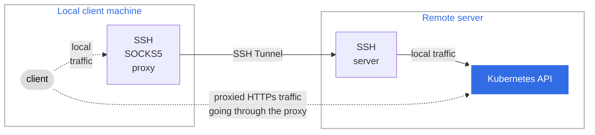

# Dùng SOCKS5 Proxy để truy cập Kubernetes API (Use a SOCKS5 Proxy to Access the Kubernetes API)

> Bản dịch tiếng Việt của trang: <https://kubernetes.io/docs/tasks/extend-kubernetes/socks5-proxy-access-api/>
>
> Trang này hướng dẫn cách dùng một SOCKS5 proxy để truy cập API của một cluster Kubernetes
> ở xa.

---

## Đọc bài này thế nào

> Phần này không có trong trang gốc. Nó cho biết ở lần đọc này bạn cần hiểu sâu tới đâu và
> phần nào để dành cho giai đoạn sau. Xem [lộ trình](00-ALO-TRINH-ADMIN.md).

**Vị trí:**
[Phần II — Vận hành cluster](00-ALO-TRINH-ADMIN.md#phần-ii--vận-hành-cluster)
→ [Giai đoạn 28 — Mở rộng Kubernetes](00-ALO-TRINH-ADMIN.md#giai-đoạn-28--mở-rộng-kubernetes), bài 9/11 ·
Phần II không có lab riêng: bạn thực hành thẳng trên cluster VM của
[Lab 00](labs/LAB-00-MOI-TRUONG-1.35.7.md) rồi tự chấm bằng **Checkpoint** của
[giai đoạn 28](00-ALO-TRINH-ADMIN.md#giai-đoạn-28--mở-rộng-kubernetes).

**Bài giữa của cụm ba bài về trung gian.** Cả bài này lẫn
[379](379-http-proxy-access-api-vi.md) ngay trước nó đều là công cụ **của client**: trung gian
nằm trên máy bạn, và chiều đi là *client → API server*. Khác biệt giữa hai bài nằm ở thứ đi qua
đường ống: `kubectl proxy` phơi ra một endpoint HTTP cục bộ cho `curl` và trình duyệt, còn ở đây
đường hầm **chở nguyên lưu lượng HTTPS** giữa `kubectl` và API server. Bài 10/11 sau đó,
[Konnectivity](381-setup-konnectivity-vi.md), là loại thứ ba và đi **chiều ngược lại** — hãy giữ
ba mốc này tách bạch từ đầu.

**Phải hiểu ở lần đọc này:**

- Bài toán mà bài này giải, nêu ngay ở đoạn mở đầu: cluster **không expose API trực tiếp ra
  internet công cộng**, nên bạn đi vòng qua một SSH server ở xa (bài lấy ví dụ một bastion host).
  Mục *Bối cảnh của bài thực hành* đặt tên hai đầu: máy *local* nơi bạn tạo request, và server ở
  xa nơi có Kubernetes API.
- Ba lớp lồng nhau, đọc từ gạch đầu dòng thứ ba của mục *Bối cảnh*: **lưu lượng HTTPS** giữa
  client và Kubernetes API đi trong **đường hầm SOCKS5**, và đường hầm SOCKS5 lại được truyền
  qua **SSH**. TLS không bị bóc ra ở giữa.
- Lệnh dựng đường hầm và ý nghĩa từng cờ ở mục *Dùng ssh để tạo một SOCKS5 proxy*:
  `ssh -D 1080 -q -N username@host` — `-D 1080` mở SOCKS proxy trên port local `1080`, `-N`
  không thực thi lệnh nào trên máy ở xa. Lệnh chạy ở foreground và **là** cái đường hầm; đóng nó
  là mất đường.
- Hai cách trỏ `kubectl` vào proxy, và ranh giới giữa chúng nằm ở Ghi chú cuối mục *Cấu hình
  phía client*: biến môi trường `HTTPS_PROXY` ảnh hưởng **mọi context** và cả những chương trình
  khác có hỗ trợ SOCKS như `curl`; thuộc tính `proxy-url` trong mục `cluster` của kubeconfig chỉ
  áp cho **đúng context tương ứng**.
- `socks5` so với `socks5h`, cũng ở Ghi chú đó: `socks5h` bắt **proxy server** phân giải tên miền
  của API server thay vì máy đang chạy `kubectl`, để chống rò rỉ DNS. Kèm cái bẫy đi liền: với
  `socks5h`, `https://localhost:6443/api` là `localhost` **theo cách hiểu của proxy server**,
  không phải máy local của bạn.

**Đọc lướt, chưa cần hiểu:**

| Phần | Vì sao hoãn | Sẽ hiểu ở |
| --- | --- | --- |
| Các trường `certificate-authority-data`, `client-certificate-data`, `client-key-data` trong kubeconfig mẫu | bài rút gọn chúng cho dễ đọc và không giải thích gì; trong khối YAML đó chỉ có hai dòng thuộc về bài này là `server` và `proxy-url` | danh tính client bằng certificate là [giai đoạn 18](00-ALO-TRINH-ADMIN.md#giai-đoạn-18--vòng-đời-chứng-chỉ), bài [397](397-certificate-issue-client-csr-vi.md) |
| Ghi chú "trước `kubectl` 1.24, hầu hết lệnh hoạt động được trừ `kubectl exec`" | đó là ghi chú lịch sử về client cũ, không mô tả hành vi bạn sẽ gặp | [bảng A1.3 của Lab 00](labs/LAB-00-MOI-TRUONG-1.35.7.md#a13-phiên-bản-được-khóa) khóa phiên bản mới hơn mốc đó, nên trường hợp này không xảy ra trên cluster của bạn |

---

**TRẠNG THÁI TÍNH NĂNG:** `Kubernetes v1.24 [stable]`

Trang này hướng dẫn cách dùng một SOCKS5 proxy để truy cập API của một cluster Kubernetes ở xa.
Cách làm này hữu ích khi cluster mà bạn muốn truy cập không expose API của nó trực tiếp ra
internet công cộng.

## Trước khi bạn bắt đầu (Before you begin)

Bạn cần có một cluster Kubernetes, và công cụ dòng lệnh kubectl phải được cấu hình để giao
tiếp với cluster của bạn. Bạn nên chạy hướng dẫn này trên một cluster có ít nhất hai node
không đóng vai trò control plane host. Nếu bạn chưa có cluster, bạn có thể tạo một cluster
bằng [minikube](https://minikube.sigs.k8s.io/docs/tutorials/multi_node/) hoặc dùng một trong
các sân chơi (playground) Kubernetes sau:

* [iximiuz Labs](https://labs.iximiuz.com/playgrounds?category=kubernetes&filter=all)
* [Killercoda](https://killercoda.com/playgrounds/scenario/kubernetes)
* [KodeKloud](https://kodekloud.com/public-playgrounds)

Phiên bản Kubernetes server của bạn phải bằng hoặc mới hơn v1.24. Để kiểm tra phiên bản, nhập
`kubectl version`.

Bạn cần có phần mềm SSH client (công cụ `ssh`), và một dịch vụ SSH đang chạy trên server ở xa.
Bạn phải đăng nhập được vào dịch vụ SSH trên server ở xa đó.

## Bối cảnh của bài thực hành (Task context)

> **Ghi chú:**
> Ví dụ này tạo đường hầm (tunnel) cho lưu lượng bằng SSH, trong đó SSH client và SSH server
> đóng vai trò một SOCKS proxy. Bạn cũng có thể dùng bất kỳ loại proxy
> [SOCKS5](https://en.wikipedia.org/wiki/SOCKS#SOCKS5) nào khác.

Hình 1 mô tả những gì bạn sẽ đạt được trong bài thực hành này.

* Bạn có một máy client, được gọi là *local* trong các bước phía sau, đây là nơi bạn sẽ tạo
  các request để nói chuyện với Kubernetes API.
* Kubernetes server/API được đặt trên một server ở xa.
* Bạn sẽ dùng phần mềm SSH client và SSH server để tạo một đường hầm SOCKS5 an toàn giữa máy
  local và server ở xa. Lưu lượng HTTPS giữa client và Kubernetes API sẽ đi qua đường hầm
  SOCKS5 này, và bản thân đường hầm SOCKS5 lại được truyền qua SSH.



*Hình 1. Các thành phần trong hướng dẫn SOCKS5.*

## Dùng ssh để tạo một SOCKS5 proxy (Using ssh to create a SOCKS5 proxy)

Lệnh sau khởi động một SOCKS5 proxy giữa máy client của bạn và SOCKS server ở xa:

```shell
# Đường hầm SSH tiếp tục chạy ở foreground sau khi bạn chạy lệnh này
ssh -D 1080 -q -N username@kubernetes-remote-server.example
```

SOCKS5 proxy cho phép bạn kết nối tới API server của cluster dựa trên cấu hình sau:
* `-D 1080`: mở một SOCKS proxy trên port local :1080.
* `-q`: chế độ im lặng (quiet mode). Làm cho phần lớn các thông báo cảnh báo và chẩn đoán bị
  chặn lại, không hiển thị.
* `-N`: Không thực thi lệnh nào trên máy ở xa. Hữu ích khi chỉ cần forward port.
* `username@kubernetes-remote-server.example`: SSH server ở xa mà đằng sau nó cluster
  Kubernetes đang chạy (ví dụ: một bastion host).

## Cấu hình phía client (Client configuration)

Để truy cập Kubernetes API server qua proxy, bạn phải hướng dẫn `kubectl` gửi các truy vấn
qua `SOCKS` proxy mà chúng ta đã tạo ở trên. Hãy làm điều này bằng cách đặt biến môi trường
phù hợp, hoặc qua thuộc tính `proxy-url` trong file kubeconfig. Dùng biến môi trường:

```shell
export HTTPS_PROXY=socks5://localhost:1080
```

Để luôn dùng thiết lập này cho một context `kubectl` cụ thể, hãy khai báo thuộc tính
`proxy-url` trong mục `cluster` tương ứng bên trong file `~/.kube/config`. Ví dụ:

```yaml
apiVersion: v1
clusters:
- cluster:
    certificate-authority-data: LRMEMMW2 # được rút gọn cho dễ đọc
    server: https://<API_SERVER_IP_ADDRESS>:6443  # server "Kubernetes API", nói cách khác là địa chỉ IP của kubernetes-remote-server.example
    proxy-url: socks5://localhost:1080   # "SSH SOCKS5 proxy" trong sơ đồ ở trên
  name: default
contexts:
- context:
    cluster: default
    user: default
  name: default
current-context: default
kind: Config
preferences: {}
users:
- name: default
  user:
    client-certificate-data: LS0tLS1CR== # được rút gọn cho dễ đọc
    client-key-data: LS0tLS1CRUdJT=      # được rút gọn cho dễ đọc
```

Sau khi đã tạo đường hầm bằng lệnh ssh nêu ở trên, và đã định nghĩa biến môi trường hoặc
thuộc tính `proxy-url`, bạn có thể tương tác với cluster của mình qua proxy đó. Ví dụ:

```shell
kubectl get pods
```

```console
NAMESPACE     NAME                                     READY   STATUS      RESTARTS   AGE
kube-system   coredns-85cb69466-klwq8                  1/1     Running     0          5m46s
```

> **Ghi chú:**
> - Trước `kubectl` 1.24, hầu hết các lệnh `kubectl` đều hoạt động được khi dùng socks proxy,
>   ngoại trừ `kubectl exec`.
> - `kubectl` hỗ trợ cả biến môi trường `HTTPS_PROXY` lẫn `https_proxy`. Các biến này cũng
>   được những chương trình khác có hỗ trợ SOCKS sử dụng, chẳng hạn `curl`. Vì vậy trong một
>   số trường hợp, sẽ tốt hơn nếu bạn định nghĩa biến môi trường ngay trên dòng lệnh:
>   ```shell
>   HTTPS_PROXY=socks5://localhost:1080 kubectl get pods
>   ```
> - Khi dùng `proxy-url`, proxy chỉ được áp dụng cho context `kubectl` tương ứng, trong khi
>   biến môi trường sẽ ảnh hưởng tới mọi context.
> - Hostname của k8s API server có thể được bảo vệ thêm khỏi rò rỉ DNS (DNS leakage) bằng
>   cách dùng tên giao thức `socks5h` thay cho `socks5` phổ biến hơn được nêu ở trên. Trong
>   trường hợp đó, `kubectl` sẽ yêu cầu proxy server (chẳng hạn một ssh bastion) phân giải tên
>   miền của k8s API server, thay vì phân giải nó trên chính hệ thống đang chạy `kubectl`.
>   Cũng lưu ý rằng với `socks5h`, một URL k8s API server như `https://localhost:6443/api`
>   không trỏ tới máy client local của bạn. Thay vào đó, nó trỏ tới `localhost` theo cách hiểu
>   của proxy server (ví dụ ssh bastion).

## Dọn dẹp (Clean up)

Dừng tiến trình port-forwarding của ssh bằng cách nhấn `CTRL+C` trên terminal nơi nó đang chạy.

Gõ `unset https_proxy` trong một terminal để ngừng chuyển tiếp lưu lượng http qua proxy.

## Đọc thêm (Further reading)

* [OpenSSH remote login client](https://man.openbsd.org/ssh)

---

## Tự kiểm tra

> Phần này không có trong trang gốc.

Trả lời được các câu sau mà không nhìn lại bài là đủ cho lần đọc ở giai đoạn 28:

1. Đường hầm nằm giữa hai máy nào, và ba lớp lưu lượng lồng nhau theo thứ tự nào? Lưu lượng
   giữa `kubectl` và API server có bị bóc TLS ở giữa không?
2. `HTTPS_PROXY` và `proxy-url` cùng làm một việc. Chọn cái nào khi bạn có nhiều context trong
   `~/.kube/config` và chỉ muốn một context đi qua đường hầm? Vì sao?
3. **Câu bẫy.** Bạn đổi `socks5://localhost:1080` thành `socks5h://localhost:1080` và đặt
   `server: https://localhost:6443`. `localhost` trong `server` bây giờ là máy nào? Việc đổi
   sang `socks5h` giải quyết vấn đề gì?
4. Coi `lab-k8s-master` là server ở xa đang chạy dịch vụ SSH, còn máy host chạy ba VM là máy
   *local*. Viết lệnh `ssh` dựng đường hầm, nói rõ phải thêm gì ở phía client để `kubectl` trên
   máy host đi qua nó, và cho biết trên ba VM `lab-k8s-master`, `lab-k8s-worker1`,
   `lab-k8s-worker2` phải sửa những gì.

<details>
<summary>Đáp án — chỉ mở sau khi đã tự trả lời</summary>

1. Giữa **máy local** (nơi bạn tạo request) và **server ở xa** đứng trước Kubernetes API — bài
   lấy ví dụ một bastion host. Thứ tự lồng nhau, đọc đúng câu của bài: **lưu lượng HTTPS** giữa
   client và Kubernetes API đi qua **đường hầm SOCKS5**, và bản thân đường hầm SOCKS5 lại được
   truyền qua **SSH**. Vậy **không**: HTTPS nằm ở lớp trong cùng, đường hầm chỉ chở nó đi.
2. Chọn **`proxy-url`**. Bài nói thẳng ở phần Ghi chú: khi dùng `proxy-url`, proxy **chỉ được áp
   dụng cho context `kubectl` tương ứng**, còn biến môi trường **ảnh hưởng tới mọi context**.
   Thêm một lý do nữa: `HTTPS_PROXY` cũng bị các chương trình khác có hỗ trợ SOCKS đọc, ví dụ
   `curl` — nên nếu vẫn muốn dùng biến môi trường thì bài khuyên đặt nó ngay trên dòng lệnh,
   dạng `HTTPS_PROXY=socks5://localhost:1080 kubectl get pods`.
3. **Là `localhost` theo cách hiểu của proxy server**, tức của chính ssh bastion — **không phải**
   máy local của bạn. Đây đúng là chỗ trực giác sai: cùng một chuỗi `localhost` nhưng ai phân
   giải nó mới quyết định nó là máy nào. Việc đổi sang `socks5h` là để **chống rò rỉ DNS**: nó
   yêu cầu proxy server phân giải tên miền của API server, thay vì phân giải trên hệ thống đang
   chạy `kubectl`.
4. Lệnh dựng đường hầm: **`ssh -D 1080 -q -N <username>@lab-k8s-master`**, chạy trên máy host và
   để nguyên ở foreground. Phía client cần thêm **một trong hai**: `export
   HTTPS_PROXY=socks5://localhost:1080`, hoặc `proxy-url: socks5://localhost:1080` trong mục
   `cluster` của `~/.kube/config` trên máy host — với `server` trỏ tới địa chỉ API server của
   `lab-k8s-master`. Trên ba VM: **không sửa gì cả.** Toàn bộ bài này là cấu hình phía client
   cộng một dịch vụ SSH vốn đã có; không object nào trong cluster bị đụng tới.

</details>

Câu nào chưa trả lời được thì quay lại đúng mục tương ứng trước khi đọc bài sau.
