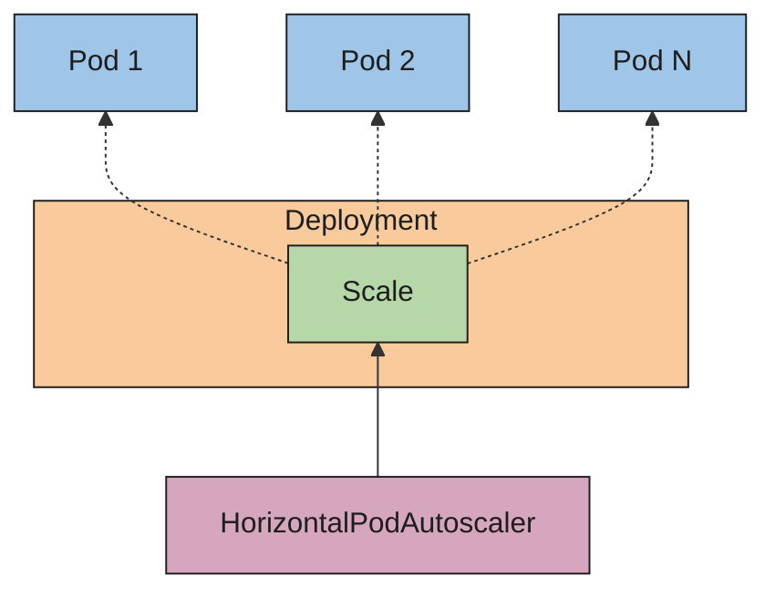

# Tự động co giãn Pod theo chiều ngang (Horizontal Pod Autoscaling)

> Bản dịch tiếng Việt của trang: <https://kubernetes.io/docs/concepts/workloads/autoscaling/horizontal-pod-autoscale/>
>
> Trong Kubernetes, HorizontalPodAutoscaler tự động cập nhật một tài nguyên workload
> (chẳng hạn Deployment hoặc StatefulSet), với mục tiêu tự động co giãn năng lực xử lý
> cho khớp với nhu cầu.

---

## Đọc bài này thế nào

> Phần này không có trong trang gốc. Nó cho biết ở lần đọc này bạn cần hiểu sâu tới đâu và
> phần nào để dành cho giai đoạn sau. Xem [lộ trình](LO-TRINH-ADMIN.md).

**Vị trí:** [Giai đoạn 4](LO-TRINH-ADMIN.md#giai-đoạn-4--workload-controller), bài 12/14 ·
Kiểm chứng ở Lab 4 (chưa viết, xem [bản đồ lab](labs/README.md#4-bản-đồ-lab)).

**Ở đây bạn chỉ đọc lý thuyết.** HPA cần metrics-server để có API `metrics.k8s.io`, mà
metrics-server thuộc **giai đoạn 11** — cluster baseline chưa có nó. Vì vậy toàn bộ phần
thực hành HPA là [nợ lab](labs/README.md#5-sổ-nợ-lab), trả ở **Lab 11b**, sau khi Lab 11a
tạo mốc `04-metrics-ready`. **Đừng cài metrics-server sớm để "chạy thử"**: làm vậy là nhảy
cóc hạ tầng của giai đoạn sau, và Lab 4 sẽ không còn trả cluster về đúng snapshot đầu vào.
Lần đọc này, mục tiêu là hiểu **HPA quyết định số replica như thế nào**, để khi tới Lab 11b
bạn đã biết mình đang nhìn cái gì.

**Phải hiểu ở lần đọc này:**

- HPA là một **vòng lặp điều khiển chạy theo chu kỳ**, không phải tiến trình liên tục — chu
  kỳ đặt bằng `--horizontal-pod-autoscaler-sync-period` của kube-controller-manager, mặc định
  15 giây. Mỗi chu kỳ nó tìm `scaleTargetRef`, chọn Pod theo `.spec.selector` của đối tượng
  đích, lấy metric, rồi ghi số replica mới qua subresource **`scale`**.
- Công thức cốt lõi:
  `desiredReplicas = ceil(currentReplicas × currentMetricValue / desiredMetricValue)`, và
  control plane **bỏ qua mọi hành động co giãn nếu tỷ lệ đủ gần 1.0** — trong phạm vi dung
  sai, mặc định 0.1.
- `Utilization` được tính theo **phần trăm so với `requests`** của container. Hệ quả bài nêu
  thẳng: nếu một số container không đặt resource request tương ứng, mức sử dụng CPU của Pod
  đó **không xác định được** và autoscaler **không hành động** theo metric đó.
- Vì sao mở rộng nhanh mà thu hẹp chậm: khuyến nghị co giãn được ghi lại và controller lấy
  **giá trị cao nhất trong cửa sổ ổn định**; mặc định cửa sổ thu hẹp là 300 giây
  (`--horizontal-pod-autoscaler-downscale-stabilization`) còn mở rộng là 0 giây.
- Hai ranh giới sử dụng: HPA **không áp dụng cho đối tượng không co giãn được** (bài lấy ví
  dụ DaemonSet); và khi HPA quản lý một Deployment hay StatefulSet thì **đừng để `spec.replicas`
  trong manifest**, nếu không mỗi lần `kubectl apply` sẽ kéo số Pod về giá trị đó và gây
  thrashing.

**Đọc lướt, chưa cần hiểu:**

| Phần | Vì sao hoãn | Sẽ hiểu ở |
| --- | --- | --- |
| Toàn bộ phần thao tác thật — `kubectl autoscale`, `kubectl get hpa` | cần metrics-server của giai đoạn 11 | [nợ lab](labs/README.md#5-sổ-nợ-lab), trả ở Lab 11b |
| *Trạng thái sẵn sàng của Pod và các metric tự động co giãn* — hai tùy chọn dòng lệnh | chỉ đặt được ở phạm vi toàn cluster, phải sửa kube-controller-manager | giai đoạn 11 |
| *Co giãn dựa trên metric tùy chỉnh*, *Co giãn dựa trên nhiều metric*, *Hỗ trợ các API metric* | cần adapter metric của bên thứ ba | giai đoạn 11 |
| *Metric tài nguyên theo container* | tinh chỉnh dựng trên metric theo Pod | giai đoạn 11 |
| *Hành vi co giãn có thể cấu hình* — `policies`, `selectPolicy`, `tolerance` và bốn ví dụ | chỉ chỉnh được khi đã có một HPA chạy thật | Lab 11b |
| *Chuyển Deployment và StatefulSet sang tự động co giãn theo chiều ngang* — quy trình client-side / server-side apply | là thao tác di trú, cần HPA thật | Lab 11b |
| Khối `math` chi tiết về metric bị thiếu và Pod chưa-sẵn-sàng | là phần hiệu chỉnh thận trọng quanh công thức chính | giai đoạn 11 |

---

Trong Kubernetes, một _HorizontalPodAutoscaler_ tự động cập nhật một tài nguyên workload
(chẳng hạn một Deployment hoặc StatefulSet), với mục tiêu tự động co giãn năng lực xử lý
(capacity) cho khớp với nhu cầu.

Co giãn ngang (horizontal scaling) có nghĩa là phản ứng trước tải tăng lên bằng cách
triển khai thêm nhiều Pod.
Điều này khác với co giãn _dọc_ (vertical scaling) — với Kubernetes, co giãn dọc nghĩa là
gán thêm tài nguyên (ví dụ: bộ nhớ hoặc CPU) cho các Pod đang chạy sẵn của workload.

Nếu tải giảm xuống, và số lượng Pod đang cao hơn mức tối thiểu đã cấu hình,
HorizontalPodAutoscaler sẽ chỉ thị cho tài nguyên workload (Deployment, StatefulSet,
hoặc tài nguyên tương tự khác) thu hẹp (scale down) trở lại.

Tự động co giãn Pod theo chiều ngang không áp dụng cho các đối tượng không thể co giãn
(ví dụ: một DaemonSet).

HorizontalPodAutoscaler được hiện thực dưới dạng một tài nguyên API Kubernetes và một
controller.
Tài nguyên quyết định hành vi của controller.
Controller tự động co giãn Pod theo chiều ngang, chạy bên trong control plane của
Kubernetes, định kỳ điều chỉnh quy mô (scale) mong muốn của đối tượng đích (ví dụ một
Deployment) sao cho khớp với các metric quan sát được, chẳng hạn mức sử dụng CPU trung bình,
mức sử dụng bộ nhớ trung bình, hoặc bất kỳ metric tùy chỉnh nào khác mà bạn chỉ định.

Có một [ví dụ thực hành từng bước](https://kubernetes.io/docs/tasks/run-application/horizontal-pod-autoscale-walkthrough/)
về việc sử dụng tự động co giãn Pod theo chiều ngang.

## HorizontalPodAutoscaler hoạt động như thế nào? (How does a HorizontalPodAutoscaler work?)



_Hình 1. HorizontalPodAutoscaler điều khiển quy mô của một Deployment và ReplicaSet của nó_

Kubernetes hiện thực tự động co giãn Pod theo chiều ngang dưới dạng một vòng lặp điều khiển
(control loop) chạy theo chu kỳ (không phải một tiến trình liên tục). Chu kỳ này được đặt
bằng tham số `--horizontal-pod-autoscaler-sync-period` của
[`kube-controller-manager`](https://kubernetes.io/docs/reference/command-line-tools-reference/kube-controller-manager/)
(chu kỳ mặc định là 15 giây).

Trong mỗi chu kỳ, controller manager truy vấn mức sử dụng tài nguyên dựa trên các metric
được chỉ định trong từng định nghĩa HorizontalPodAutoscaler. Controller manager
tìm tài nguyên đích được định nghĩa bởi `scaleTargetRef`,
sau đó chọn các Pod dựa trên các label `.spec.selector` của tài nguyên đích,
và lấy metric từ API resource metrics (đối với metric tài nguyên theo từng Pod),
hoặc từ API custom metrics (đối với mọi metric khác).

- Với các metric tài nguyên theo từng Pod (như CPU), controller lấy metric
  từ API resource metrics cho từng Pod mà HorizontalPodAutoscaler nhắm đến.
  Sau đó, nếu một giá trị mức sử dụng mục tiêu (target utilization) được đặt, controller
  tính giá trị mức sử dụng theo tỷ lệ phần trăm so với
  [yêu cầu tài nguyên (resource request)](https://kubernetes.io/docs/concepts/configuration/manage-resources-containers/#requests-and-limits)
  tương ứng trên các container trong mỗi Pod. Nếu một giá trị thô mục tiêu (target raw value)
  được đặt, các giá trị metric thô được dùng trực tiếp.
  Controller sau đó lấy trung bình của mức sử dụng hoặc giá trị thô (tùy loại mục tiêu
  đã chỉ định) trên tất cả các Pod đích, và tạo ra một tỷ lệ dùng để co giãn
  số lượng replica mong muốn.

  Lưu ý rằng nếu một số container của Pod không đặt yêu cầu tài nguyên liên quan,
  mức sử dụng CPU của Pod đó sẽ không được xác định và autoscaler sẽ
  không thực hiện hành động nào đối với metric đó. Xem mục
  [chi tiết thuật toán](#algorithm-details) bên dưới để biết thêm về cách
  thuật toán tự động co giãn hoạt động.

- Với các metric tùy chỉnh theo từng Pod, controller hoạt động tương tự như với metric
  tài nguyên theo từng Pod, chỉ khác là nó làm việc với giá trị thô, không phải giá trị
  mức sử dụng.

- Với metric theo đối tượng (object metrics) và metric bên ngoài (external metrics),
  một metric duy nhất được lấy về, mô tả đối tượng đang xét. Metric này được so sánh
  với giá trị mục tiêu, để tạo ra một tỷ lệ như trên. Trong phiên bản API
  `autoscaling/v2`, giá trị này có thể tùy chọn được chia cho số lượng Pod trước khi
  thực hiện phép so sánh.

Cách dùng phổ biến của HorizontalPodAutoscaler là cấu hình nó lấy metric từ
các API tổng hợp (aggregated APIs)
(`metrics.k8s.io`, `custom.metrics.k8s.io`, hoặc `external.metrics.k8s.io`). API `metrics.k8s.io`
thường được cung cấp bởi một add-on tên là Metrics Server, cần được khởi chạy riêng.
Để biết thêm thông tin về metric tài nguyên, xem
[Metrics Server](https://kubernetes.io/docs/tasks/debug/debug-cluster/resource-metrics-pipeline/#metrics-server).

[Hỗ trợ các API metric](#support-for-metrics-apis) giải thích các đảm bảo về độ ổn định
và trạng thái hỗ trợ của những API khác nhau này.

Controller HorizontalPodAutoscaler truy cập các tài nguyên workload tương ứng có hỗ trợ
co giãn (chẳng hạn Deployment và StatefulSet). Mỗi tài nguyên này có một subresource
tên là `scale`, một giao diện cho phép bạn thiết lập động số lượng replica và xem xét
trạng thái hiện tại của từng replica.
Để biết thông tin chung về subresource trong API Kubernetes, xem
[Các khái niệm API Kubernetes](https://kubernetes.io/docs/reference/using-api/api-concepts/).

### Chi tiết thuật toán (Algorithm details) {#algorithm-details}

Ở góc nhìn cơ bản nhất, controller HorizontalPodAutoscaler
hoạt động dựa trên tỷ lệ giữa giá trị metric mong muốn và giá trị metric
hiện tại:

```math
\begin{equation*}
desiredReplicas = ceil\left\lceil currentReplicas \times \frac{currentMetricValue}{desiredMetricValue} \right\rceil
\end{equation*}
```

Ví dụ, nếu giá trị metric hiện tại là `200m`, và giá trị mong muốn
là `100m`, số lượng replica sẽ được nhân đôi, vì
$200.0 \div 100.0 = 2.0$.
Nếu giá trị hiện tại thay vào đó là `50m`, bạn sẽ giảm một nửa số lượng
replica, vì $50.0 \div 100.0 = 0.5$. Control plane bỏ qua mọi hành động
co giãn nếu tỷ lệ này đủ gần 1.0 (trong phạm vi một
[dung sai có thể cấu hình](#tolerance), mặc định là 0.1).

Khi một `targetAverageValue` hoặc `targetAverageUtilization` được chỉ định,
`currentMetricValue` được tính bằng cách lấy trung bình của metric đó
trên tất cả các Pod trong đối tượng đích co giãn của HorizontalPodAutoscaler.

Trước khi kiểm tra dung sai và quyết định các giá trị cuối cùng, control plane
cũng xem xét liệu có metric nào bị thiếu hay không, và có bao nhiêu Pod đang
[`Ready`](./47-pod-lifecycle-vi.md#pod-conditions).
Với metric tài nguyên theo từng Pod, tất cả các Pod có deletion timestamp
(các đối tượng có deletion timestamp là những đối tượng đang trong quá trình
bị tắt / xóa bỏ) đều bị bỏ qua, và tất cả các Pod thất bại (failed) đều bị loại bỏ.
Với metric bên ngoài và metric theo đối tượng, số lượng replica được tính dựa trên
số Pod đang Running và Ready; các Pod đang kết thúc (terminating) mà vẫn Ready
vẫn tiếp tục được tính vào tổng đó.

Nếu một Pod cụ thể bị thiếu metric, nó được để riêng ra xử lý sau; các Pod
thiếu metric sẽ được dùng để điều chỉnh mức co giãn cuối cùng.

Khi co giãn theo CPU, nếu có Pod nào chưa sẵn sàng (vẫn đang
khởi tạo, hoặc có thể đang không khỏe mạnh) _hoặc_ điểm metric gần nhất của
Pod đó nằm trước thời điểm nó trở nên sẵn sàng, Pod đó cũng được để riêng ra.

Do các ràng buộc kỹ thuật, controller HorizontalPodAutoscaler
không thể xác định chính xác thời điểm đầu tiên một Pod trở nên sẵn sàng khi
quyết định có để riêng một số metric CPU nào đó hay không. Thay vào đó, nó
coi một Pod là "chưa sẵn sàng" (not yet ready) nếu Pod đó đang unready và chuyển sang
ready trong một khoảng thời gian ngắn, có thể cấu hình, kể từ khi nó khởi động.
Giá trị này được cấu hình bằng tùy chọn dòng lệnh
`--horizontal-pod-autoscaler-initial-readiness-delay`,
và mặc định là 30 giây.
Một khi Pod đã trở nên sẵn sàng, nó coi bất kỳ lần chuyển sang
ready nào là lần đầu tiên nếu lần chuyển đó xảy ra trong một khoảng thời gian dài hơn,
có thể cấu hình, kể từ khi Pod khởi động. Giá trị này được cấu hình bằng tùy chọn
dòng lệnh `--horizontal-pod-autoscaler-cpu-initialization-period`,
và mặc định là 5 phút.

Tỷ lệ co giãn cơ sở $currentMetricValue \over desiredMetricValue$ sau đó được
tính toán, sử dụng các Pod còn lại chưa bị để riêng hoặc loại bỏ ở trên.

Nếu có bất kỳ metric nào bị thiếu, control plane tính lại giá trị trung bình một cách
thận trọng hơn, giả định rằng những Pod đó đang tiêu thụ 100% giá trị mong muốn
trong trường hợp thu hẹp (scale down), và 0% trong trường hợp mở rộng (scale up).
Điều này làm giảm biên độ của bất kỳ đợt co giãn tiềm năng nào.

Hơn nữa, nếu có bất kỳ Pod chưa-sẵn-sàng nào, và workload lẽ ra sẽ được
mở rộng nếu không tính đến các metric bị thiếu hoặc các Pod chưa-sẵn-sàng,
controller sẽ giả định một cách thận trọng rằng các Pod chưa-sẵn-sàng đang tiêu thụ 0%
metric mong muốn, càng làm giảm thêm biên độ của một đợt mở rộng.

Sau khi tính đến các Pod chưa-sẵn-sàng và các metric bị thiếu,
controller tính lại tỷ lệ sử dụng. Nếu tỷ lệ mới đảo ngược chiều
co giãn, hoặc nằm trong phạm vi dung sai, controller không thực hiện hành động
co giãn nào. Trong các trường hợp khác, tỷ lệ mới được dùng để quyết định mọi thay đổi
đối với số lượng Pod.

Lưu ý rằng giá trị _gốc_ của mức sử dụng trung bình được báo cáo
lại qua status của HorizontalPodAutoscaler, mà không tính đến các
Pod chưa-sẵn-sàng hay metric bị thiếu, ngay cả khi tỷ lệ sử dụng mới
được dùng.

Nếu nhiều metric được chỉ định trong một HorizontalPodAutoscaler, phép tính
này được thực hiện cho từng metric, sau đó giá trị lớn nhất trong các số lượng
replica mong muốn được chọn. Nếu bất kỳ metric nào trong số này không thể chuyển đổi
thành số lượng replica mong muốn (ví dụ do lỗi khi lấy metric
từ các API metric) và các metric lấy được lại đề xuất thu hẹp,
thì việc co giãn bị bỏ qua. Điều này có nghĩa là HPA vẫn có khả năng
mở rộng nếu một hoặc nhiều metric cho ra `desiredReplicas` lớn hơn
giá trị hiện tại.

Cuối cùng, ngay trước khi HPA co giãn đối tượng đích, khuyến nghị co giãn (scale
recommendation) được ghi lại. Controller xem xét tất cả các khuyến nghị trong một
cửa sổ thời gian có thể cấu hình và chọn khuyến nghị cao nhất trong cửa sổ đó.
Bạn có thể cấu hình giá trị này bằng tùy chọn dòng lệnh
`--horizontal-pod-autoscaler-downscale-stabilization`, mặc định là 5 phút.
Điều này có nghĩa là các đợt thu hẹp sẽ diễn ra từ từ, làm mượt tác động của
các giá trị metric biến động nhanh.

## Trạng thái sẵn sàng của Pod và các metric tự động co giãn (Pod readiness and autoscaling metrics)

Controller HorizontalPodAutoscaler (HPA) có hai tùy chọn dòng lệnh ảnh hưởng đến cách metric CPU được thu thập từ các Pod trong quá trình khởi động:

1. `--horizontal-pod-autoscaler-cpu-initialization-period` (mặc định: 5 phút)

   Tùy chọn này định nghĩa khoảng thời gian sau khi một Pod khởi động mà trong đó **mức sử dụng CPU của Pod bị bỏ qua**, trừ khi:
     - Pod đang ở trạng thái `Ready` **và**
     - Mẫu metric được lấy hoàn toàn trong khoảng thời gian Pod đang `Ready`.

   Tùy chọn dòng lệnh này giúp **loại trừ mức sử dụng CPU cao gây hiểu lầm** từ các Pod đang khởi tạo (ví dụ: các ứng dụng Java đang "khởi động nóng" (warming up)) khỏi các quyết định co giãn của HPA.

1. `--horizontal-pod-autoscaler-initial-readiness-delay` (mặc định: 30 giây)

   Tùy chọn này định nghĩa một khoảng trễ ngắn sau khi Pod khởi động, trong đó controller HPA coi các Pod hiện đang `Unready` là vẫn đang khởi tạo, **ngay cả khi trước đó chúng đã từng chuyển sang `Ready` trong chốc lát**.

   Nó được thiết kế để:
     - Tránh tính đến các Pod dao động nhanh giữa `Ready` và `Unready` trong quá trình khởi động.
     - Đảm bảo tính ổn định của tín hiệu sẵn sàng ban đầu trước khi HPA coi metric của chúng là hợp lệ.

Bạn chỉ có thể đặt các tùy chọn dòng lệnh này ở phạm vi toàn cluster.

### Các hành vi chính đối với trạng thái sẵn sàng của Pod (Key behaviors for pod readiness) {#pod-readiness-key-behaviors}

- Nếu một Pod đang `Ready` và duy trì trạng thái `Ready`, nó có thể được tính là đang đóng góp metric ngay cả trong khoảng trễ.
- Nếu một Pod dao động nhanh giữa `Ready` và `Unready`, metric của nó bị bỏ qua cho đến khi nó được coi là `Ready` một cách ổn định.

### Thực hành tốt cho trạng thái sẵn sàng của Pod (Good practice for pod readiness) {#pod-readiness-good-practices}

- Cấu hình một `startupProbe` không vượt qua (pass) cho đến khi giai đoạn sử dụng CPU cao đã qua, hoặc
- Đảm bảo `readinessProbe` của bạn chỉ báo `Ready` **sau khi** đợt tăng vọt CPU lắng xuống, bằng cách dùng `initialDelaySeconds`.

Và lý tưởng nhất là cũng đặt `--horizontal-pod-autoscaler-cpu-initialization-period` sao cho **bao trùm cả khoảng thời gian khởi động**.

## Đối tượng API (API object)

HorizontalPodAutoscaler là một kind API trong nhóm API
`autoscaling` của Kubernetes. Phiên bản ổn định (stable) hiện tại nằm trong
phiên bản API `autoscaling/v2`, bao gồm hỗ trợ co giãn theo
bộ nhớ và metric tùy chỉnh. Các trường mới được giới thiệu trong
`autoscaling/v2` được bảo toàn dưới dạng annotation khi làm việc với
`autoscaling/v1`.

Khi tạo một đối tượng API HorizontalPodAutoscaler, hãy đảm bảo tên được chỉ định là một
[tên DNS subdomain](./17-names-vi.md) hợp lệ.
Chi tiết thêm về đối tượng API này có tại
[Đối tượng HorizontalPodAutoscaler](https://kubernetes.io/docs/reference/generated/kubernetes-api/v1.36/#horizontalpodautoscaler-v2-autoscaling).

## Tính ổn định của quy mô workload (Stability of workload scale) {#flapping}

Khi quản lý quy mô của một nhóm replica bằng HorizontalPodAutoscaler,
số lượng replica có thể liên tục biến động thường xuyên do tính chất
động của các metric được đánh giá. Hiện tượng này đôi khi được gọi là _thrashing_
(giật cục), hay _flapping_ (chập chờn). Nó tương tự khái niệm _hysteresis_ (độ trễ)
trong điều khiển học (cybernetics).

## Tự động co giãn trong khi rolling update (Autoscaling during rolling update)

Kubernetes cho phép bạn thực hiện rolling update (cập nhật cuốn chiếu) trên một Deployment.
Trong trường hợp đó, Deployment quản lý các ReplicaSet bên dưới thay cho bạn.
Khi bạn cấu hình tự động co giãn cho một Deployment, bạn gắn một
HorizontalPodAutoscaler với một Deployment duy nhất. HorizontalPodAutoscaler
quản lý trường `replicas` của Deployment. Deployment controller chịu trách nhiệm
đặt `replicas` cho các ReplicaSet bên dưới sao cho tổng của chúng là một con số phù hợp
trong quá trình rollout và cả sau đó.

Nếu bạn thực hiện rolling update trên một StatefulSet có số lượng replica được
tự động co giãn, StatefulSet quản lý trực tiếp tập Pod của nó (không có tài nguyên
trung gian tương tự như ReplicaSet).

## Hỗ trợ metric tài nguyên (Support for resource metrics)

Bất kỳ đối tượng đích nào của HPA cũng có thể được co giãn dựa trên mức sử dụng tài nguyên
của các Pod trong đối tượng đích đó. Khi định nghĩa đặc tả Pod, các yêu cầu tài nguyên
(resource requests) như `cpu` và `memory` nên được chỉ định. Chúng được dùng để xác định
mức sử dụng tài nguyên và được controller HPA dùng để mở rộng hay thu hẹp đối tượng đích.
Để dùng co giãn dựa trên mức sử dụng tài nguyên, hãy chỉ định một nguồn metric
như sau:

```yaml
type: Resource
resource:
  name: cpu
  target:
    type: Utilization
    averageUtilization: 60
```

Với metric này, controller HPA sẽ giữ mức sử dụng trung bình của các Pod trong đối tượng
đích co giãn ở mức 60%. Mức sử dụng (utilization) là tỷ lệ giữa lượng tài nguyên đang dùng
hiện tại so với lượng tài nguyên được yêu cầu của Pod. Xem [Thuật toán](#algorithm-details)
để biết thêm chi tiết về cách mức sử dụng được tính toán và lấy trung bình.

> **Ghi chú:**
> Vì mức sử dụng tài nguyên của tất cả các container được cộng gộp lại, tổng mức sử dụng
> của Pod có thể không phản ánh chính xác mức sử dụng tài nguyên của từng container riêng lẻ.
> Điều này có thể dẫn đến tình huống một container đơn lẻ đang chạy với mức sử dụng cao
> nhưng HPA sẽ không mở rộng vì mức sử dụng tổng thể của Pod vẫn nằm trong giới hạn
> chấp nhận được.

### Metric tài nguyên theo container (Container resource metrics)

**TRẠNG THÁI TÍNH NĂNG:** `Kubernetes v1.30 [stable]`

API HorizontalPodAutoscaler cũng hỗ trợ nguồn metric theo container, cho phép HPA theo dõi
mức sử dụng tài nguyên của từng container riêng lẻ trên một tập các Pod, để co giãn
tài nguyên đích. Điều này cho phép bạn cấu hình ngưỡng co giãn cho những container quan trọng
nhất trong một Pod cụ thể. Ví dụ, nếu bạn có một ứng dụng web và một sidecar container
cung cấp chức năng ghi log, bạn có thể co giãn dựa trên mức sử dụng tài nguyên của
ứng dụng web, bỏ qua sidecar container và mức sử dụng tài nguyên của nó.

Nếu bạn sửa đổi tài nguyên đích để có một đặc tả Pod mới với một tập container khác,
bạn nên sửa lại spec của HPA nếu container mới thêm đó cũng cần được dùng cho việc
co giãn. Nếu container được chỉ định trong nguồn metric không tồn tại hoặc chỉ tồn tại
trong một tập con của các Pod, những Pod đó sẽ bị bỏ qua và khuyến nghị sẽ được tính toán lại.
Xem [Thuật toán](#algorithm-details) để biết thêm chi tiết về phép tính. Để dùng
tài nguyên container cho việc tự động co giãn, hãy định nghĩa một nguồn metric
như sau:

```yaml
type: ContainerResource
containerResource:
  name: cpu
  container: application
  target:
    type: Utilization
    averageUtilization: 60
```

Trong ví dụ trên, controller HPA co giãn đối tượng đích sao cho mức sử dụng trung bình
của cpu trong container `application` của tất cả các Pod là 60%.

> **Ghi chú:**
> Nếu bạn đổi tên một container mà HorizontalPodAutoscaler đang theo dõi, bạn có thể
> thực hiện thay đổi đó theo một thứ tự cụ thể để đảm bảo việc co giãn vẫn khả dụng
> và hiệu quả trong khi thay đổi đang được áp dụng. Trước khi cập nhật tài nguyên
> định nghĩa container (chẳng hạn một Deployment), bạn nên cập nhật HPA liên quan để
> theo dõi cả tên container mới lẫn cũ. Bằng cách này, HPA có thể tính toán khuyến nghị
> co giãn trong suốt quá trình cập nhật.
>
> Sau khi bạn đã triển khai xong việc đổi tên container cho tài nguyên workload, hãy dọn dẹp
> bằng cách gỡ tên container cũ khỏi đặc tả HPA.

## Co giãn dựa trên metric tùy chỉnh (Scaling on custom metrics)

**TRẠNG THÁI TÍNH NĂNG:** `Kubernetes v1.23 [stable]`

(phiên bản API `autoscaling/v2beta2` trước đây từng cung cấp khả năng này dưới dạng tính năng beta)

Miễn là bạn dùng phiên bản API `autoscaling/v2`, bạn có thể cấu hình một HorizontalPodAutoscaler
để co giãn dựa trên một metric tùy chỉnh (không có sẵn trong Kubernetes hay bất kỳ thành phần
Kubernetes nào). Controller HorizontalPodAutoscaler sau đó truy vấn các metric tùy chỉnh này
từ API Kubernetes.

Xem [Hỗ trợ các API metric](#support-for-metrics-apis) để biết các yêu cầu.

## Co giãn dựa trên nhiều metric (Scaling on multiple metrics)

**TRẠNG THÁI TÍNH NĂNG:** `Kubernetes v1.23 [stable]`

(phiên bản API `autoscaling/v2beta2` trước đây từng cung cấp khả năng này dưới dạng tính năng beta)

Miễn là bạn dùng phiên bản API `autoscaling/v2`, bạn có thể chỉ định nhiều metric để một
HorizontalPodAutoscaler co giãn theo. Khi đó, controller HorizontalPodAutoscaler đánh giá
từng metric, và đề xuất một quy mô mới dựa trên metric đó. HorizontalPodAutoscaler lấy
quy mô lớn nhất được khuyến nghị cho từng metric và đặt workload về kích thước đó
(miễn là không lớn hơn mức tối đa tổng thể mà bạn đã cấu hình).

## Hỗ trợ các API metric (Support for metrics APIs) {#support-for-metrics-apis}

Theo mặc định, controller HorizontalPodAutoscaler lấy metric từ một loạt các API.
Để nó có thể truy cập các API này, quản trị viên cluster phải đảm bảo rằng:

- [Tầng tổng hợp API (API aggregation layer)](https://kubernetes.io/docs/tasks/extend-kubernetes/configure-aggregation-layer/) được bật.

- Các API tương ứng đã được đăng ký:

  - Với metric tài nguyên, đó là [API](https://kubernetes.io/docs/reference/external-api/metrics.v1beta1/) `metrics.k8s.io`,
    thường được cung cấp bởi [metrics-server](https://github.com/kubernetes-sigs/metrics-server).
    Nó có thể được khởi chạy như một add-on của cluster.

  - Với metric tùy chỉnh, đó là [API](https://kubernetes.io/docs/reference/external-api/custom-metrics.v1beta2/) `custom.metrics.k8s.io`.
    Nó được cung cấp bởi các API server "adapter" do các nhà cung cấp giải pháp metric phát hành.
    Hãy kiểm tra với pipeline metric của bạn xem có sẵn một Kubernetes metrics adapter hay không.

  - Với metric bên ngoài, đó là [API](https://kubernetes.io/docs/reference/external-api/external-metrics.v1beta1/) `external.metrics.k8s.io`.
    Nó có thể được cung cấp bởi các adapter metric tùy chỉnh nêu trên.

Để biết thêm thông tin về các đường dẫn metric khác nhau này và sự khác biệt giữa chúng,
xem các đề xuất thiết kế (design proposal) liên quan:
[HPA V2](https://git.k8s.io/design-proposals-archive/autoscaling/hpa-v2.md),
[custom.metrics.k8s.io](https://git.k8s.io/design-proposals-archive/instrumentation/custom-metrics-api.md)
và [external.metrics.k8s.io](https://git.k8s.io/design-proposals-archive/instrumentation/external-metrics-api.md).

Để xem ví dụ về cách sử dụng chúng, xem
[hướng dẫn thực hành dùng metric tùy chỉnh](https://kubernetes.io/docs/tasks/run-application/horizontal-pod-autoscale-walkthrough/#autoscaling-on-multiple-metrics-and-custom-metrics)
và [hướng dẫn thực hành dùng metric bên ngoài](https://kubernetes.io/docs/tasks/run-application/horizontal-pod-autoscale-walkthrough/#autoscaling-on-metrics-not-related-to-kubernetes-objects).

## Hành vi co giãn có thể cấu hình (Configurable scaling behavior)

**TRẠNG THÁI TÍNH NĂNG:** `Kubernetes v1.23 [stable]`

(phiên bản API `autoscaling/v2beta2` trước đây từng cung cấp khả năng này dưới dạng tính năng beta)

Nếu dùng API HorizontalPodAutoscaler `v2`, bạn có thể dùng trường `behavior`
(xem [tài liệu tham khảo API](https://kubernetes.io/docs/reference/kubernetes-api/workload-resources/horizontal-pod-autoscaler-v2/#HorizontalPodAutoscalerSpec))
để cấu hình các hành vi mở rộng (scale-up) và thu hẹp (scale-down) riêng biệt.
Bạn chỉ định các hành vi này bằng cách đặt `scaleUp` và / hoặc `scaleDown`
bên trong trường `behavior`.

Các chính sách co giãn (scaling policies) cho phép bạn kiểm soát tốc độ thay đổi
số replica trong khi co giãn. Ngoài ra, hai thiết lập có thể được dùng để ngăn hiện tượng
[flapping](#flapping): bạn có thể chỉ định một _cửa sổ ổn định_ (stabilization window)
để làm mượt số lượng replica, và một dung sai (tolerance) để bỏ qua các biến động metric
nhỏ dưới một ngưỡng nhất định.

### Các chính sách co giãn (Scaling policies)

Một hoặc nhiều chính sách co giãn có thể được chỉ định trong phần `behavior` của spec.
Khi nhiều chính sách được chỉ định, chính sách cho phép mức thay đổi lớn nhất
là chính sách được chọn theo mặc định. Ví dụ sau minh họa hành vi này
khi đang thu hẹp:

```yaml
behavior:
  scaleDown:
    policies:
    - type: Pods
      value: 4
      periodSeconds: 60
    - type: Percent
      value: 10
      periodSeconds: 60
```

`periodSeconds` cho biết khoảng thời gian trong quá khứ mà chính sách phải được thỏa mãn.
Giá trị tối đa bạn có thể đặt cho `periodSeconds` là 1800 (nửa giờ).
Chính sách thứ nhất _(Pods)_ cho phép thu hẹp tối đa 4 replica trong một phút. Chính sách
thứ hai _(Percent)_ cho phép thu hẹp tối đa 10% số replica hiện tại trong một phút.

Vì theo mặc định chính sách cho phép mức thay đổi lớn nhất được chọn, chính sách thứ hai
chỉ được dùng khi số lượng Pod replica lớn hơn 40. Với 40 replica trở xuống, chính sách
thứ nhất sẽ được áp dụng. Ví dụ, nếu có 80 replica và đối tượng đích cần được thu hẹp
xuống 10 replica, thì trong bước đầu tiên 8 replica sẽ bị giảm. Ở vòng lặp tiếp theo,
khi số replica là 72, 10% số Pod là 7.2 nhưng con số này được làm tròn lên thành 8.
Ở mỗi vòng lặp của controller autoscaler, số lượng Pod cần thay đổi được tính lại dựa trên
số replica hiện tại. Khi số replica giảm xuống dưới 40, chính sách thứ nhất _(Pods)_
được áp dụng và mỗi lần 4 replica sẽ bị giảm.

Việc chọn chính sách có thể được thay đổi bằng cách chỉ định trường `selectPolicy` cho một
chiều co giãn. Đặt giá trị là `Min` sẽ chọn chính sách cho phép
mức thay đổi nhỏ nhất về số lượng replica. Đặt giá trị là `Disabled` sẽ tắt hoàn toàn
việc co giãn theo chiều đó.

### Cửa sổ ổn định (Stabilization window)

Cửa sổ ổn định được dùng để hạn chế hiện tượng [flapping](#flapping) của
số lượng replica khi các metric dùng để co giãn liên tục biến động. Thuật toán tự động
co giãn dùng cửa sổ này để suy ra trạng thái mong muốn trước đó và tránh các thay đổi
không mong muốn đối với quy mô workload.

Ví dụ, trong đoạn cấu hình mẫu sau, một cửa sổ ổn định được chỉ định cho `scaleDown`.

```yaml
behavior:
  scaleDown:
    stabilizationWindowSeconds: 300
```

Khi các metric cho thấy đối tượng đích nên được thu hẹp, thuật toán sẽ nhìn
vào các trạng thái mong muốn đã tính trước đó, và dùng giá trị cao nhất trong
khoảng thời gian được chỉ định. Trong ví dụ trên, tất cả các trạng thái mong muốn
trong 5 phút vừa qua sẽ được xem xét.

Cách này xấp xỉ một phép lấy giá trị lớn nhất trượt (rolling maximum), và tránh việc
thuật toán co giãn thường xuyên xóa các Pod đi rồi ngay sau đó lại phải tạo lại một Pod
tương đương chỉ trong chốc lát.

### Dung sai (Tolerance) {#tolerance}

**TRẠNG THÁI TÍNH NĂNG:** `Kubernetes v1.35 [beta]`

Trường `tolerance` cấu hình một ngưỡng cho các biến động metric, ngăn không cho
autoscaler co giãn đối với các thay đổi dưới giá trị đó.

Dung sai này được định nghĩa là mức biến động quanh giá trị metric mong muốn mà
dưới mức đó sẽ không có hành động co giãn nào xảy ra. Ví dụ, xét một HorizontalPodAutoscaler
được cấu hình với mức tiêu thụ bộ nhớ mục tiêu là 100MiB và dung sai mở rộng là 5%:

```yaml
behavior:
  scaleUp:
    tolerance: 0.05 # dung sai 5% cho việc mở rộng
```

Với cấu hình này, thuật toán HPA sẽ chỉ xem xét mở rộng nếu mức tiêu thụ bộ nhớ
cao hơn 105MiB (tức là: cao hơn mục tiêu 5%).

Nếu bạn không đặt trường này, HPA áp dụng dung sai mặc định toàn cluster là 10%. Giá trị
mặc định này có thể được cập nhật cho cả mở rộng lẫn thu hẹp bằng đối số dòng lệnh
`--horizontal-pod-autoscaler-tolerance` của
[kube-controller-manager](https://kubernetes.io/docs/reference/command-line-tools-reference/kube-controller-manager/).
(Bạn không thể dùng API Kubernetes để cấu hình giá trị mặc định này.)

### Hành vi mặc định (Default behavior)

Để dùng co giãn tùy chỉnh, không phải tất cả các trường đều phải được chỉ định. Chỉ những
giá trị cần tùy chỉnh mới cần được chỉ định. Các giá trị tùy chỉnh này được hợp nhất (merge)
với các giá trị mặc định. Các giá trị mặc định khớp với hành vi hiện có trong thuật toán HPA.

```yaml
behavior:
  scaleDown:
    stabilizationWindowSeconds: 300
    policies:
    - type: Percent
      value: 100
      periodSeconds: 15
  scaleUp:
    stabilizationWindowSeconds: 0
    policies:
    - type: Percent
      value: 100
      periodSeconds: 15
    - type: Pods
      value: 4
      periodSeconds: 15
    selectPolicy: Max
```

Đối với thu hẹp, cửa sổ ổn định là _300_ giây (hoặc giá trị của tùy chọn dòng lệnh
`--horizontal-pod-autoscaler-downscale-stabilization` nếu được cung cấp). Chỉ có một
chính sách duy nhất cho việc thu hẹp, cho phép gỡ bỏ 100% số replica đang chạy hiện tại,
nghĩa là đối tượng đích co giãn có thể được thu hẹp xuống mức replica tối thiểu được phép.
Đối với mở rộng, không có cửa sổ ổn định. Khi các metric cho thấy đối tượng đích nên được
mở rộng, nó được mở rộng ngay lập tức. Có 2 chính sách, theo đó tối đa 4 Pod hoặc 100% số
replica đang chạy hiện tại có thể được thêm vào mỗi 15 giây cho đến khi HPA đạt trạng thái
ổn định.

### Ví dụ: thay đổi cửa sổ ổn định khi thu hẹp (Example: change downscale stabilization window)

Để cung cấp một cửa sổ ổn định thu hẹp tùy chỉnh là 1 phút, hành vi sau
sẽ được thêm vào HPA:

```yaml
behavior:
  scaleDown:
    stabilizationWindowSeconds: 60
```

### Ví dụ: giới hạn tốc độ thu hẹp (Example: limit scale down rate)

Để giới hạn tốc độ gỡ bỏ Pod bởi HPA ở mức 10% mỗi phút, hành vi sau
sẽ được thêm vào HPA:

```yaml
behavior:
  scaleDown:
    policies:
    - type: Percent
      value: 10
      periodSeconds: 60
```

Để đảm bảo không quá 5 Pod bị gỡ bỏ mỗi phút, bạn có thể thêm một chính sách thu hẹp
thứ hai với kích thước cố định là 5, và đặt `selectPolicy` là minimum. Đặt `selectPolicy`
là `Min` nghĩa là autoscaler chọn chính sách ảnh hưởng đến số lượng Pod nhỏ nhất:

```yaml
behavior:
  scaleDown:
    policies:
    - type: Percent
      value: 10
      periodSeconds: 60
    - type: Pods
      value: 5
      periodSeconds: 60
    selectPolicy: Min
```

### Ví dụ: tắt thu hẹp (Example: disable scale down)

Giá trị `selectPolicy` bằng `Disabled` sẽ tắt việc co giãn theo chiều đã cho.
Vì vậy, để ngăn việc thu hẹp, chính sách sau sẽ được dùng:

```yaml
behavior:
  scaleDown:
    selectPolicy: Disabled
```

## Hỗ trợ HorizontalPodAutoscaler trong kubectl (Support for HorizontalPodAutoscaler in kubectl)

HorizontalPodAutoscaler, giống như mọi tài nguyên API khác, được `kubectl` hỗ trợ theo cách
tiêu chuẩn.
Bạn có thể tạo một autoscaler mới bằng lệnh `kubectl create`.
Bạn có thể liệt kê các autoscaler bằng `kubectl get hpa` hoặc xem mô tả chi tiết bằng
`kubectl describe hpa`.
Cuối cùng, bạn có thể xóa một autoscaler bằng `kubectl delete hpa`.

Ngoài ra, có một lệnh đặc biệt `kubectl autoscale` để tạo một đối tượng HorizontalPodAutoscaler.
Ví dụ, thực thi `kubectl autoscale rs foo --min=2 --max=5 --cpu=80%`
sẽ tạo một autoscaler cho ReplicaSet _foo_, với mức sử dụng CPU mục tiêu đặt là `80%`
và số lượng replica trong khoảng từ 2 đến 5.

## Ngừng kích hoạt ngầm theo kiểu chế độ bảo trì (Implicit maintenance-mode deactivation)

Bạn có thể ngầm ngừng kích hoạt HPA cho một đối tượng đích mà không cần
thay đổi chính cấu hình của HPA. Nếu số replica mong muốn của đối tượng đích
được đặt về 0, và số replica tối thiểu của HPA lớn hơn 0, HPA sẽ
ngừng điều chỉnh đối tượng đích (và đặt Condition `ScalingActive` trên chính nó
về `false`) cho đến khi bạn kích hoạt lại bằng cách chỉnh thủ công số replica mong muốn
của đối tượng đích hoặc số replica tối thiểu của HPA.

### Chuyển Deployment và StatefulSet sang tự động co giãn theo chiều ngang (Migrating Deployments and StatefulSets to horizontal autoscaling)

Khi HPA được bật, khuyến nghị là gỡ bỏ giá trị `spec.replicas` của
Deployment và / hoặc StatefulSet khỏi các manifest của chúng. Nếu không làm vậy, mỗi khi
một thay đổi lên đối tượng đó được áp dụng, ví dụ qua `kubectl apply -f
deployment.yaml`, Kubernetes sẽ được chỉ thị co giãn số lượng Pod hiện tại
về giá trị của khóa `spec.replicas`. Điều này có thể không
mong muốn và có thể gây rắc rối khi một HPA đang hoạt động, dẫn đến hành vi thrashing
hoặc flapping.

Hãy lưu ý rằng việc gỡ bỏ `spec.replicas` có thể gây ra một lần suy giảm
số lượng Pod, vì giá trị mặc định của khóa này là 1 (tham khảo
[Replicas của Deployment](./63-deployment-vi.md#replicas)).
Khi cập nhật, tất cả các Pod trừ 1 sẽ bắt đầu quy trình kết thúc (termination) của chúng.
Mọi lần triển khai sau đó sẽ hoạt động bình thường và tôn trọng cấu hình rolling update
như mong muốn. Bạn có thể tránh sự suy giảm này bằng cách chọn một trong hai
phương pháp sau, tùy theo cách bạn đang chỉnh sửa các deployment của mình:

#### Client Side Apply (đây là cách mặc định)

1. `kubectl apply edit-last-applied deployment/<deployment_name>`
2. Trong trình soạn thảo, gỡ bỏ `spec.replicas`. Khi bạn lưu và thoát trình soạn thảo, `kubectl`
   sẽ áp dụng bản cập nhật. Không có thay đổi nào về số lượng Pod xảy ra ở bước này.
3. Bây giờ bạn có thể gỡ `spec.replicas` khỏi manifest. Nếu bạn dùng quản lý mã nguồn,
   hãy commit các thay đổi hoặc thực hiện các bước phù hợp khác để sửa mã nguồn,
   tùy theo cách bạn theo dõi các bản cập nhật.
4. Từ đây trở đi, bạn có thể chạy `kubectl apply -f deployment.yaml`

#### Server Side Apply

Khi dùng [Server-Side Apply](https://kubernetes.io/docs/reference/using-api/server-side-apply/),
bạn có thể làm theo hướng dẫn
[chuyển giao quyền sở hữu (transferring ownership)](https://kubernetes.io/docs/reference/using-api/server-side-apply/#transferring-ownership),
trong đó đề cập đúng trường hợp sử dụng này.

## Tiếp theo (What's next)

Nếu bạn cấu hình tự động co giãn trong cluster của mình, bạn cũng có thể cân nhắc dùng
[tự động co giãn node (node autoscaling)](https://kubernetes.io/docs/concepts/cluster-administration/node-autoscaling/)
để đảm bảo bạn đang chạy đúng số lượng node.
Bạn cũng có thể đọc thêm về [tự động co giãn Pod theo chiều _dọc_ (vertical Pod autoscaling)](https://kubernetes.io/docs/concepts/workloads/autoscaling/vertical-pod-autoscale/).

Để biết thêm thông tin về HorizontalPodAutoscaler:

- Đọc một [ví dụ thực hành từng bước](https://kubernetes.io/docs/tasks/run-application/horizontal-pod-autoscale-walkthrough/) về tự động co giãn Pod theo chiều ngang.
- Đọc tài liệu về [`kubectl autoscale`](https://kubernetes.io/docs/reference/generated/kubectl/kubectl-commands/#autoscale).
- Nếu bạn muốn viết adapter metric tùy chỉnh của riêng mình, hãy xem
  [boilerplate](https://github.com/kubernetes-sigs/custom-metrics-apiserver) để bắt đầu.
- Đọc [tài liệu tham khảo API](https://kubernetes.io/docs/reference/kubernetes-api/workload-resources/horizontal-pod-autoscaler-v2/) cho HorizontalPodAutoscaler.

---

## Tự kiểm tra

> Phần này không có trong trang gốc.

Trả lời được các câu sau mà không nhìn lại bài là đủ cho lần đọc ở giai đoạn 4. Đây là bài
chỉ đọc lý thuyết; phần thực hành nằm ở [Lab 11b](labs/README.md#5-sổ-nợ-lab).

1. Một HPA giữ mức sử dụng CPU trung bình mục tiêu 60%. Hiện có 4 replica và mức đo được là
   90%. Theo công thức trong bài, HPA đặt bao nhiêu replica? Nếu mức đo được là 63% thì sao?
2. **Câu bẫy.** Bạn tạo HPA theo `type: Utilization` cho một Deployment mà container không
   khai báo `resources.requests.cpu`. HPA có co giãn không? Vì sao?
3. Vì sao HPA mở rộng gần như tức thì nhưng thu hẹp thì chậm? Cơ chế nào tạo ra sự bất đối
   xứng đó?
4. Trên cluster lab của bạn (1 control plane + 2 worker, **chưa có metrics-server**), bạn
   apply một Deployment có `spec.replicas: 3` kèm một HPA `min=2 max=10`. Hai vấn đề nào sẽ
   xảy ra?
5. Bạn muốn HPA tự tăng số Pod Flannel khi mạng bận. Được không?

<details>
<summary>Đáp án — chỉ mở sau khi đã tự trả lời</summary>

1. **6 replica**: `ceil(4 × 90 / 60) = ceil(6.0) = 6`. Với mức đo 63% thì **giữ nguyên 4** —
   tỷ lệ là `63/60 = 1.05`, nằm trong **dung sai mặc định 0.1**, và bài nói "control plane bỏ
   qua mọi hành động co giãn nếu tỷ lệ này đủ gần 1.0". Đây là lý do HPA không rung theo từng
   dao động nhỏ của metric.
2. **Không.** Bài nói thẳng: "nếu một số container của Pod không đặt yêu cầu tài nguyên liên
   quan, mức sử dụng CPU của Pod đó sẽ **không được xác định** và autoscaler sẽ **không thực
   hiện hành động nào** đối với metric đó". Trực giác sai là nghĩ HPA đo mức tiêu thụ tuyệt
   đối; với `type: Utilization` nó đo **tỷ lệ giữa lượng đang dùng và lượng được `requests`**,
   nên không có mẫu số thì không có phép chia. Đây là lỗi cấu hình kinh điển: HPA hiện diện,
   `kubectl get hpa` hiện `<unknown>`, và không có gì xảy ra cả.
3. Vì **cửa sổ ổn định** áp dụng bất đối xứng. Trước khi co giãn, khuyến nghị được ghi lại;
   controller xem tất cả khuyến nghị trong một cửa sổ thời gian và **chọn khuyến nghị cao
   nhất** trong đó. Mặc định cửa sổ cho thu hẹp là **300 giây** (`scaleDown.stabilizationWindowSeconds`,
   hay `--horizontal-pod-autoscaler-downscale-stabilization`), còn cho mở rộng là **0 giây**.
   Lấy giá trị cao nhất trong 5 phút gần nhất tức là một đợt tải cao vừa qua vẫn "giữ" số Pod
   ở mức cũ — bài mô tả đó là một phép **lấy giá trị lớn nhất trượt**, tránh việc xóa Pod đi
   rồi phải tạo lại ngay sau đó. Chiều mở rộng không có cửa sổ nên phản ứng ngay lập tức.
4. Thứ nhất, **HPA không lấy được metric**: bài nói controller lấy metric tài nguyên từ API
   `metrics.k8s.io`, "thường được cung cấp bởi metrics-server", và quản trị viên phải bảo đảm
   API đó đã được đăng ký. Chưa có metrics-server thì HPA không tính được `desiredReplicas` và
   không hành động. Thứ hai, **để `spec.replicas` trong manifest sẽ đánh nhau với HPA**: bài
   khuyến nghị gỡ `spec.replicas` khỏi manifest của Deployment và StatefulSet khi bật HPA, vì
   mỗi lần `kubectl apply -f deployment.yaml` Kubernetes lại được chỉ thị kéo số Pod về giá
   trị đó, "dẫn đến hành vi thrashing hoặc flapping".
5. **Không.** Flannel chạy dưới dạng DaemonSet, và bài nói rõ ngay đầu: "Tự động co giãn Pod
   theo chiều ngang **không áp dụng cho các đối tượng không thể co giãn** (ví dụ: một
   DaemonSet)". DaemonSet không có subresource `scale` để HPA ghi vào — số Pod của nó do số
   node quyết định, không phải do một trường `replicas`.

</details>

Câu nào chưa trả lời được thì quay lại đúng mục tương ứng trước khi đọc bài sau.
