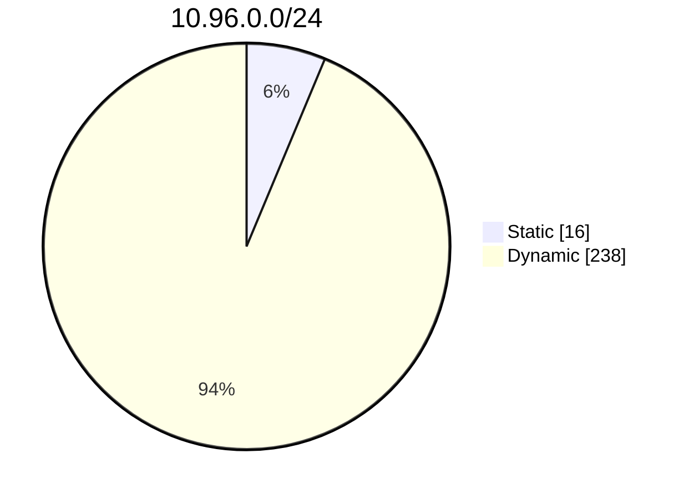
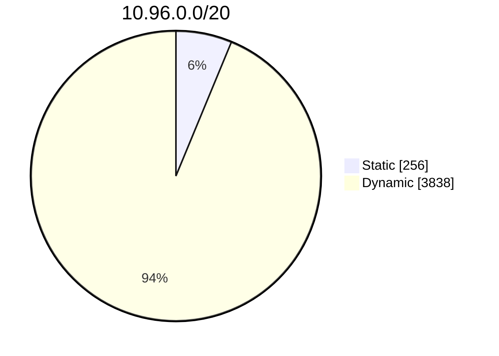
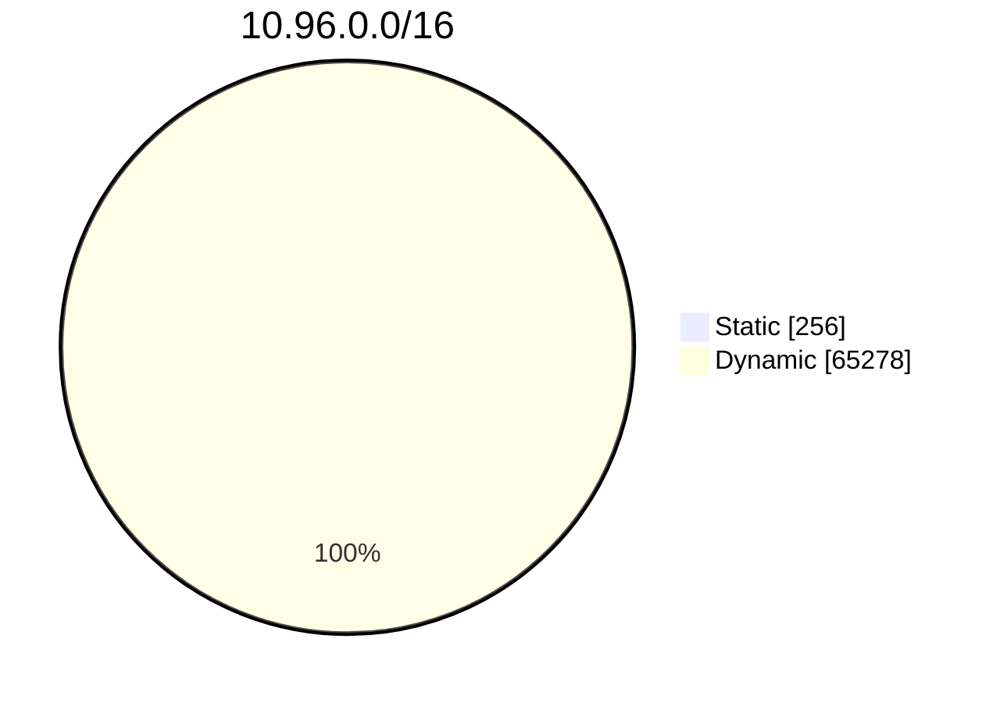

# Cấp phát ClusterIP cho Service (Service ClusterIP allocation)

> Bản dịch tiếng Việt của trang: <https://kubernetes.io/docs/concepts/services-networking/cluster-ip-allocation/>

---

## Đọc bài này thế nào

> Phần này không có trong trang gốc. Nó cho biết ở lần đọc này bạn cần hiểu sâu tới đâu và
> phần nào để dành cho giai đoạn sau. Xem [lộ trình](00-ALO-TRINH-ADMIN.md).

**Vị trí:** [Giai đoạn 5](00-ALO-TRINH-ADMIN.md#giai-đoạn-5--mạng-nền-tảng), bài 9/16 · Kiểm chứng ở
[Lab 5a](labs/LAB-5A-SERVICE-ENDPOINTSLICE-VA-DNS.md).

Đây là bài cuối trước Lab 5a. Nó trả lời một câu hỏi rất cụ thể: **con số cluster IP ở đâu ra**,
và vì sao DNS service của cluster luôn nằm ở một địa chỉ đoán trước được. Bài ngắn, nhưng phần
công thức chia băng cần đọc kỹ vì bạn sẽ dùng lại nó mỗi khi phải xin một ClusterIP tĩnh.

**Phải hiểu ở lần đọc này:**

- Hai cách gán ClusterIP: **động** — control plane chọn một IP còn trống trong dải đã cấu hình;
  và **tĩnh** — bạn tự chỉ định một IP nằm trong dải đó. Mỗi ClusterIP phải **duy nhất trên toàn
  cluster**, xin trùng thì trả về lỗi.
- Vì sao cần địa chỉ đoán trước được: một số Service phải nằm ở IP "well-known" để thành phần
  khác dùng — ví dụ điển hình là DNS Service của cluster, theo **quy ước không chính thức** lấy
  địa chỉ IP thứ 10 trong dải Service.
- Công thức chia băng: độ lệch băng = `min(max(16, cidrSize / 16), 256)` — *không bao giờ nhỏ
  hơn 16 hoặc lớn hơn 256*.
- Cấp phát động **mặc định dùng băng trên**, chỉ dùng tới băng dưới khi băng trên cạn. Vì vậy
  hãy đặt các cấp phát tĩnh ở **băng dưới** để hạ rủi ro va chạm.
- Đọc được ba ví dụ để tự tính băng tĩnh cho một dải cụ thể của mình.

**Đọc lướt, chưa cần hiểu:**

| Phần | Vì sao hoãn | Sẽ hiểu ở |
| --- | --- | --- |
| Các trường trong manifest `kube-dns` mẫu (label `kubernetes.io/cluster-service`, hai port `dns`/`dns-tcp`) | là chi tiết của addon DNS, không phải của cơ chế cấp phát IP | giai đoạn 8 |
| Ba biểu đồ tròn ở mục *Các ví dụ* | chỉ vẽ lại đúng con số vừa tính bằng công thức | không cần |

---

Trong Kubernetes, [Service](82-service-vi.md) là một cách trừu tượng để expose một ứng dụng đang chạy trên một tập các Pod. Service có thể có một địa chỉ IP ảo phạm vi cluster (dùng Service với `type: ClusterIP`). Client có thể kết nối bằng địa chỉ IP ảo đó, và Kubernetes sau đó cân bằng tải lưu lượng tới Service đó qua các Pod backend khác nhau.

## ClusterIP của Service được cấp phát như thế nào? (How Service ClusterIPs are allocated?)

Khi Kubernetes cần gán một địa chỉ IP ảo cho một Service, việc gán đó diễn ra theo một trong hai cách:

*động (dynamically)*
: control plane của cluster tự động chọn một địa chỉ IP còn trống từ dải IP đã cấu hình cho các Service `type: ClusterIP`.

*tĩnh (statically)*
: bạn chỉ định một địa chỉ IP theo ý mình, nằm trong dải IP đã cấu hình cho các Service.

Trên toàn bộ cluster của bạn, mỗi `ClusterIP` của Service phải là duy nhất. Việc cố tạo một Service với một `ClusterIP` cụ thể đã được cấp phát sẽ trả về lỗi.

## Tại sao bạn cần dành riêng các Cluster IP cho Service? (Why do you need to reserve Service Cluster IPs?)

Đôi khi bạn muốn có các Service chạy ở những địa chỉ IP được biết trước (well-known), để các thành phần và người dùng khác trong cluster có thể sử dụng chúng.

Ví dụ điển hình nhất là DNS Service của cluster. Theo một quy ước không chính thức, một số trình cài đặt Kubernetes gán địa chỉ IP thứ 10 trong dải IP của Service cho DNS service. Giả sử bạn cấu hình cluster với dải IP của Service là 10.96.0.0/16 và bạn muốn IP của DNS Service là 10.96.0.10, bạn sẽ phải tạo một Service như sau:

```yaml
apiVersion: v1
kind: Service
metadata:
  labels:
    k8s-app: kube-dns
    kubernetes.io/cluster-service: "true"
    kubernetes.io/name: CoreDNS
  name: kube-dns
  namespace: kube-system
spec:
  clusterIP: 10.96.0.10
  ports:
  - name: dns
    port: 53
    protocol: UDP
    targetPort: 53
  - name: dns-tcp
    port: 53
    protocol: TCP
    targetPort: 53
  selector:
    k8s-app: kube-dns
  type: ClusterIP
```

Nhưng, như đã giải thích ở trên, địa chỉ IP 10.96.0.10 chưa hề được dành riêng. Nếu các Service khác được tạo trước đó hoặc song song bằng cấp phát động, có khả năng chúng sẽ chiếm mất IP này. Khi đó, bạn sẽ không thể tạo DNS Service vì nó sẽ thất bại với lỗi xung đột (conflict).

## Làm thế nào để tránh xung đột ClusterIP của Service? (How can you avoid Service ClusterIP conflicts?) {#avoid-ClusterIP-conflict}

Chiến lược cấp phát được hiện thực trong Kubernetes để cấp phát ClusterIP cho các Service giúp giảm nguy cơ va chạm (collision).

Dải `ClusterIP` được chia dựa trên công thức `min(max(16, cidrSize / 16), 256)`, mô tả bằng lời là *không bao giờ nhỏ hơn 16 hoặc lớn hơn 256, với bước tăng dần ở giữa hai giá trị này*.

Cấp phát IP động mặc định sử dụng băng trên (upper band); khi băng này cạn kiệt, nó sẽ dùng đến dải dưới. Điều này cho phép người dùng thực hiện cấp phát tĩnh trên băng dưới (lower band) với nguy cơ va chạm thấp.

## Các ví dụ (Examples) {#allocation-examples}

### Ví dụ 1 (Example 1) {#allocation-example-1}

Ví dụ này dùng dải địa chỉ IP: 10.96.0.0/24 (ký hiệu CIDR) cho các địa chỉ IP của Service.

Kích thước dải: 2<sup>8</sup> - 2 = 254  
Độ lệch băng (Band Offset): `min(max(16, 256/16), 256)` = `min(16, 256)` = 16  
Điểm bắt đầu băng tĩnh: 10.96.0.1  
Điểm kết thúc băng tĩnh: 10.96.0.16  
Điểm kết thúc dải: 10.96.0.254



### Ví dụ 2 (Example 2) {#allocation-example-2}

Ví dụ này dùng dải địa chỉ IP: 10.96.0.0/20 (ký hiệu CIDR) cho các địa chỉ IP của Service.

Kích thước dải: 2<sup>12</sup> - 2 = 4094  
Độ lệch băng (Band Offset): `min(max(16, 4096/16), 256)` = `min(256, 256)` = 256  
Điểm bắt đầu băng tĩnh: 10.96.0.1  
Điểm kết thúc băng tĩnh: 10.96.1.0  
Điểm kết thúc dải: 10.96.15.254



### Ví dụ 3 (Example 3) {#allocation-example-3}

Ví dụ này dùng dải địa chỉ IP: 10.96.0.0/16 (ký hiệu CIDR) cho các địa chỉ IP của Service.

Kích thước dải: 2<sup>16</sup> - 2 = 65534  
Độ lệch băng (Band Offset): `min(max(16, 65536/16), 256)` = `min(4096, 256)` = 256  
Điểm bắt đầu băng tĩnh: 10.96.0.1  
Điểm kết thúc băng tĩnh: 10.96.1.0  
Điểm kết thúc dải: 10.96.255.254



## Tiếp theo (What's next)

* Đọc về [Chính sách lưu lượng bên ngoài của Service (Service External Traffic Policy)](364-create-external-load-balancer-vi.md#preserving-the-client-source-ip)
* Đọc về [Kết nối ứng dụng với Service (Connecting Applications with Services)](https://kubernetes.io/docs/tutorials/services/connect-applications-service/)
* Đọc về [Service](82-service-vi.md)

---

## Tự kiểm tra

> Phần này không có trong trang gốc.

Trả lời được các câu sau mà không nhìn lại bài là đủ cho lần đọc ở giai đoạn 5:

1. Cluster lab cấu hình dải Service là `10.96.0.0/12`. Áp công thức trong bài: độ lệch băng
   bằng bao nhiêu, băng tĩnh chạy từ đâu đến đâu, và bạn nên xin ClusterIP tĩnh ở vùng nào?
2. Chiến lược chia băng có **bảo đảm** rằng một địa chỉ trong băng tĩnh sẽ không bị Service khác
   chiếm mất không?
3. Hai cách một Service nhận ClusterIP là gì, và điều gì xảy ra nếu bạn xin một `clusterIP` đã
   được cấp phát cho Service khác?
4. Việc DNS Service của cluster nằm ở địa chỉ IP thứ 10 của dải Service là quy định của
   Kubernetes hay không?

<details>
<summary>Đáp án — chỉ mở sau khi đã tự trả lời</summary>

1. `/12` có kích thước dải 2<sup>20</sup>, nên độ lệch băng là
   `min(max(16, 1048576/16), 256)` = `min(65536, 256)` = **256**. Băng tĩnh chạy từ **`10.96.0.1`
   đến `10.96.1.0`**, phần còn lại của dải là băng động. **Xin ClusterIP tĩnh trong băng dưới
   đó**, vì cấp phát động mặc định dùng băng trên. Đây cũng là lý do `10.96.0.10` — địa chỉ quen
   thuộc của DNS service — rơi đúng vào băng tĩnh.
2. **Không.** Bài mở đầu bằng đúng vấn đề đó: địa chỉ `10.96.0.10` "chưa hề được dành riêng".
   Chiến lược chia băng chỉ **giảm nguy cơ va chạm**: cấp phát động ưu tiên băng trên, **nhưng
   khi băng trên cạn kiệt nó sẽ dùng đến dải dưới**. Không có cơ chế đặt chỗ thật sự, nên vẫn có
   thể xảy ra xung đột.
3. **Động** (control plane tự chọn một IP còn trống trong dải đã cấu hình) và **tĩnh** (bạn chỉ
   định một IP nằm trong dải đó). Mỗi ClusterIP phải duy nhất trên toàn cluster, nên việc cố tạo
   một Service với một `ClusterIP` đã được cấp phát **sẽ trả về lỗi** — đúng kịch bản làm DNS
   Service không tạo được mà bài mô tả.
4. **Không phải quy định.** Bài gọi đó là một **quy ước không chính thức** mà *một số trình cài
   đặt Kubernetes* dùng. Đừng viết code hay tài liệu dựa trên giả định địa chỉ đó luôn đúng;
   hãy đọc từ Service `kube-dns` thật.

</details>

Trả lời trôi chảy cả bốn câu nghĩa là bạn đã đủ nền cho [**Lab 5a — Service, EndpointSlice và
DNS**](labs/LAB-5A-SERVICE-ENDPOINTSLICE-VA-DNS.md). Câu nào còn vướng thì quay lại
đúng mục tương ứng — kể cả ở các bài [82](82-service-vi.md), [83](83-endpoint-slices-vi.md),
[10](10-dns-pod-service-vi.md) — trước khi bắt đầu lab.
