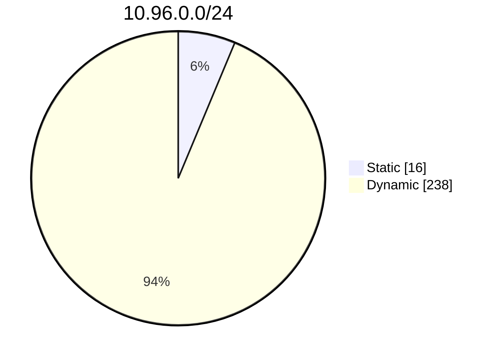
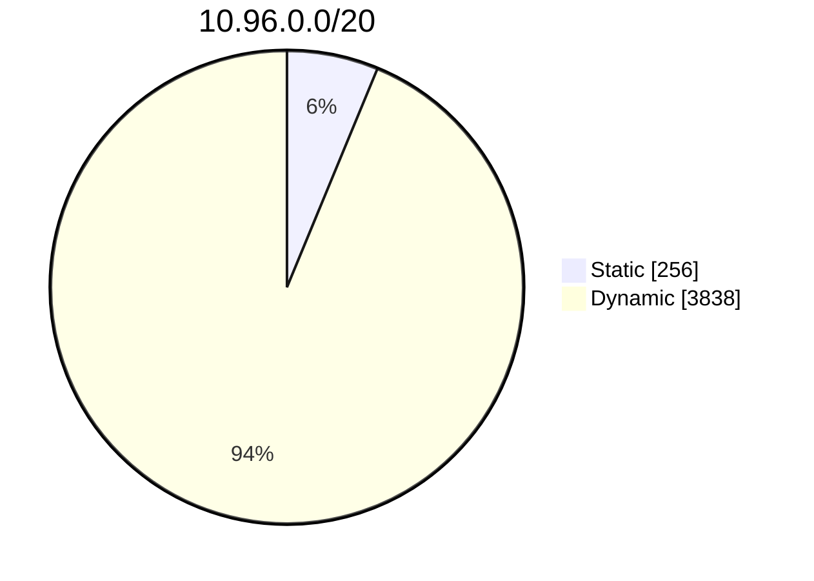
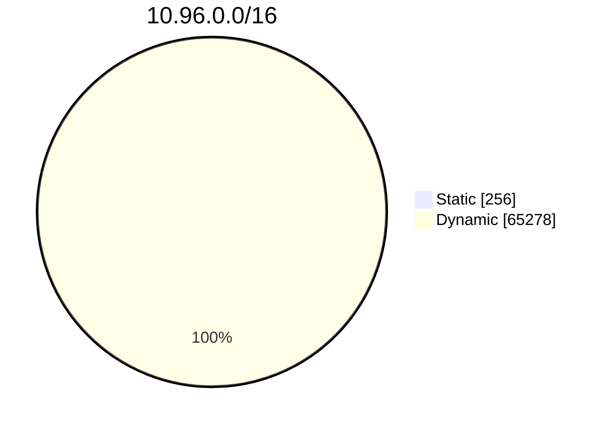

# Cấp phát ClusterIP cho Service (Service ClusterIP allocation)

> Bản dịch tiếng Việt của trang: <https://kubernetes.io/docs/concepts/services-networking/cluster-ip-allocation/>

Trong Kubernetes, [Service](https://kubernetes.io/docs/concepts/services-networking/service/) là một cách trừu tượng để expose một ứng dụng đang chạy trên một tập các Pod. Service có thể có một địa chỉ IP ảo phạm vi cluster (dùng Service với `type: ClusterIP`). Client có thể kết nối bằng địa chỉ IP ảo đó, và Kubernetes sau đó cân bằng tải lưu lượng tới Service đó qua các Pod backend khác nhau.

## ClusterIP của Service được cấp phát như thế nào? (How Service ClusterIPs are allocated?)

Khi Kubernetes cần gán một địa chỉ IP ảo cho một Service, việc gán đó diễn ra theo một trong hai cách:

*động (dynamically)*
: control plane của cluster tự động chọn một địa chỉ IP còn trống từ dải IP đã cấu hình cho các Service `type: ClusterIP`.

*tĩnh (statically)*
: bạn chỉ định một địa chỉ IP theo ý mình, nằm trong dải IP đã cấu hình cho các Service.

Trên toàn bộ cluster của bạn, mỗi `ClusterIP` của Service phải là duy nhất. Việc cố tạo một Service với một `ClusterIP` cụ thể đã được cấp phát sẽ trả về lỗi.

## Tại sao bạn cần dành riêng các Cluster IP cho Service? (Why do you need to reserve Service Cluster IPs?)

Đôi khi bạn muốn có các Service chạy ở những địa chỉ IP được biết trước (well-known), để các thành phần và người dùng khác trong cluster có thể sử dụng chúng.

Ví dụ điển hình nhất là DNS Service của cluster. Theo một quy ước không chính thức, một số trình cài đặt Kubernetes gán địa chỉ IP thứ 10 trong dải IP của Service cho DNS service. Giả sử bạn cấu hình cluster với dải IP của Service là 10.96.0.0/16 và bạn muốn IP của DNS Service là 10.96.0.10, bạn sẽ phải tạo một Service như sau:

```yaml
apiVersion: v1
kind: Service
metadata:
  labels:
    k8s-app: kube-dns
    kubernetes.io/cluster-service: "true"
    kubernetes.io/name: CoreDNS
  name: kube-dns
  namespace: kube-system
spec:
  clusterIP: 10.96.0.10
  ports:
  - name: dns
    port: 53
    protocol: UDP
    targetPort: 53
  - name: dns-tcp
    port: 53
    protocol: TCP
    targetPort: 53
  selector:
    k8s-app: kube-dns
  type: ClusterIP
```

Nhưng, như đã giải thích ở trên, địa chỉ IP 10.96.0.10 chưa hề được dành riêng. Nếu các Service khác được tạo trước đó hoặc song song bằng cấp phát động, có khả năng chúng sẽ chiếm mất IP này. Khi đó, bạn sẽ không thể tạo DNS Service vì nó sẽ thất bại với lỗi xung đột (conflict).

## Làm thế nào để tránh xung đột ClusterIP của Service? (How can you avoid Service ClusterIP conflicts?) {#avoid-ClusterIP-conflict}

Chiến lược cấp phát được hiện thực trong Kubernetes để cấp phát ClusterIP cho các Service giúp giảm nguy cơ va chạm (collision).

Dải `ClusterIP` được chia dựa trên công thức `min(max(16, cidrSize / 16), 256)`, mô tả bằng lời là *không bao giờ nhỏ hơn 16 hoặc lớn hơn 256, với bước tăng dần ở giữa hai giá trị này*.

Cấp phát IP động mặc định sử dụng băng trên (upper band); khi băng này cạn kiệt, nó sẽ dùng đến dải dưới. Điều này cho phép người dùng thực hiện cấp phát tĩnh trên băng dưới (lower band) với nguy cơ va chạm thấp.

## Các ví dụ (Examples) {#allocation-examples}

### Ví dụ 1 (Example 1) {#allocation-example-1}

Ví dụ này dùng dải địa chỉ IP: 10.96.0.0/24 (ký hiệu CIDR) cho các địa chỉ IP của Service.

Kích thước dải: 2<sup>8</sup> - 2 = 254  
Độ lệch băng (Band Offset): `min(max(16, 256/16), 256)` = `min(16, 256)` = 16  
Điểm bắt đầu băng tĩnh: 10.96.0.1  
Điểm kết thúc băng tĩnh: 10.96.0.16  
Điểm kết thúc dải: 10.96.0.254



### Ví dụ 2 (Example 2) {#allocation-example-2}

Ví dụ này dùng dải địa chỉ IP: 10.96.0.0/20 (ký hiệu CIDR) cho các địa chỉ IP của Service.

Kích thước dải: 2<sup>12</sup> - 2 = 4094  
Độ lệch băng (Band Offset): `min(max(16, 4096/16), 256)` = `min(256, 256)` = 256  
Điểm bắt đầu băng tĩnh: 10.96.0.1  
Điểm kết thúc băng tĩnh: 10.96.1.0  
Điểm kết thúc dải: 10.96.15.254



### Ví dụ 3 (Example 3) {#allocation-example-3}

Ví dụ này dùng dải địa chỉ IP: 10.96.0.0/16 (ký hiệu CIDR) cho các địa chỉ IP của Service.

Kích thước dải: 2<sup>16</sup> - 2 = 65534  
Độ lệch băng (Band Offset): `min(max(16, 65536/16), 256)` = `min(4096, 256)` = 256  
Điểm bắt đầu băng tĩnh: 10.96.0.1  
Điểm kết thúc băng tĩnh: 10.96.1.0  
Điểm kết thúc dải: 10.96.255.254



## Tiếp theo (What's next)

* Đọc về [Chính sách lưu lượng bên ngoài của Service (Service External Traffic Policy)](https://kubernetes.io/docs/tasks/access-application-cluster/create-external-load-balancer/#preserving-the-client-source-ip)
* Đọc về [Kết nối ứng dụng với Service (Connecting Applications with Services)](https://kubernetes.io/docs/tutorials/services/connect-applications-service/)
* Đọc về [Service](https://kubernetes.io/docs/concepts/services-networking/service/)
