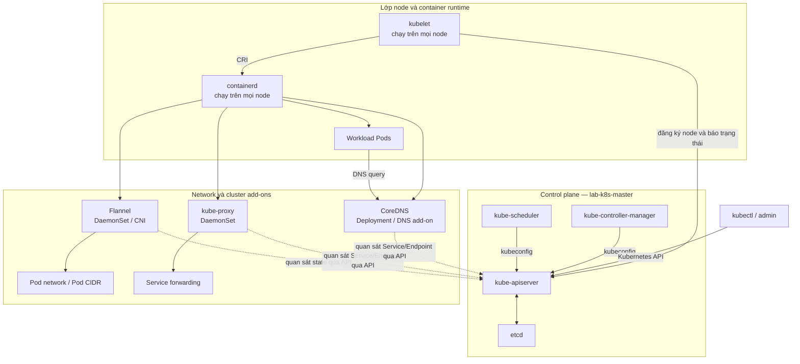

# Lab 1a — Kiến trúc và mô hình điều khiển Kubernetes

> **Điểm bắt đầu:** snapshot `01-cluster-ready` — xem [Lab 00 — Môi trường](LAB-00-MOI-TRUONG-1.35.7.md).
> **Điểm kết thúc:** cleanup trả cluster về đúng `01-cluster-ready`, không tạo snapshot mới.
>
> **Cập nhật và đối chiếu phiên bản:** 05/08/2026.

Lab này đi cùng mục [1a. Kiến trúc và mô hình điều khiển](../LO-TRINH-ADMIN.md#1a-kiến-trúc-và-mô-hình-điều-khiển).

Trước khi bắt đầu, chạy [quy trình mở đầu ở A5.5](LAB-00-MOI-TRUONG-1.35.7.md#a55-quy-trình-mở-đầu-mỗi-lab)
và xác nhận gate `01-cluster-ready` PASS. Toàn bộ phần dựng VM, cài container runtime,
kubeadm và CNI nằm ở Lab 00 và **không** thuộc phạm vi bài này; nội dung cài đặt sẽ được học
tại giai đoạn 2, 5 và 8.

Nội dung A5.5, chép lại để chạy ngay tại chỗ:

1. Bật ba VM theo thứ tự master → worker 1 → worker 2.
2. Chạy **gate ngắn** dưới đây trên master.
3. Chỉ khi gate PASS mới sang phần nội dung của lab.

Gate ngắn, không tạo resource nào:

```bash
kubectl wait --for=condition=Ready node --all --timeout=180s
test "$(kubectl get --raw='/readyz')" = 'ok' && echo 'PASS: readyz ok'
kubectl get pods -A --field-selector=status.phase!=Running,status.phase!=Succeeded
kubectl -n kube-system get deployment coredns
kubectl get pods -n default
```

**PASS:** ba node `Ready`; dòng `PASS: readyz ok` xuất hiện; lệnh `--field-selector` trả
`No resources found`; CoreDNS đủ replica `READY`; namespace `default` không còn Pod nào.

Chạy **toàn bộ bảy tầng của [A5.4](LAB-00-MOI-TRUONG-1.35.7.md#a54-gate-01-cluster-ready)**
trong ba trường hợp: lần đầu dựng cluster, sau khi restore snapshot mà gate ngắn không PASS,
và khi lab trước đó đã đụng vào mạng hoặc CNI. Ngoài ba trường hợp đó, gate ngắn là đủ.

Nếu gate fail và không sửa được trong vài phút, tắt và restore **cả ba VM** về snapshot đầu
vào rồi chạy lại. Không debug một cluster đã lệch state — thời gian đó nên dành cho bài học.

---

## 1. Kết quả phải đạt

Hoàn thành lab khi có thể tự chứng minh và giải thích được:

- Kubernetes tự động hóa việc gì và không thay thế những gì.
- Thành phần nào thuộc control plane, thành phần nào chạy trên node.
- `kube-apiserver`, `etcd`, `kube-scheduler`, `kube-controller-manager`, `kubelet`,
  container runtime, CNI, CoreDNS và `kube-proxy` nằm ở đâu.
- Một object có `metadata`, `spec`, `status`; `spec` là trạng thái mong muốn còn `status`
  phản ánh trạng thái quan sát được.
- Cách khám phá core API, named API groups, resource và version qua API server.
- Node đăng ký với cluster như thế nào; `Condition`, `Capacity`, `Allocatable` và heartbeat
  thể hiện ở đâu.
- Chiều `kubectl → API server`, `kubelet → API server` và `API server → kubelet`.
- Controller là vòng lặp quan sát, so sánh và hành động để đưa trạng thái thực tế về trạng
  thái mong muốn.

### 1.1. Ánh xạ tài liệu sang bài thực hành

| Bài trong 1a | Phần lab kiểm chứng |
| --- | --- |
| Tổng quan | B1 — Từ nhu cầu đến khả năng Kubernetes |
| Các thành phần của Kubernetes | B2 — Kiểm kê component |
| Kiến trúc cluster | B2 và B3 — Vị trí, process và static Pod |
| Các đối tượng trong Kubernetes | B4 — Đọc object và `spec/status` |
| Kubernetes API | B5 — Discovery, group, version và validation |
| Các Node | B6 — Node status, đăng ký và heartbeat |
| Giao tiếp giữa Node và Control Plane | B7 — Quan sát ba chiều giao tiếp |
| Các Controller | B8 — Reconciliation thật |

Lab này **không** dạy label selector, namespace ở mức chi tiết, kubeconfig, quản lý object
imperative/declarative hay field selector. Toàn bộ nhóm đó thuộc
[Lab 1b](README.md#4-bản-đồ-lab).

### 1.2. Thời lượng

Khoảng 2–3 giờ, tính từ lúc cluster đã `Ready`.

---

## 2. Quy ước và an toàn

- Chỉ chạy fault injection trên `lab-k8s-worker2`.
- Không dừng `kube-apiserver`, `etcd` hoặc sửa manifest control plane trong lab 1a.
- Mở ít nhất ba terminal SSH: master, worker 1 và worker 2.
- Các lệnh không ghi rõ node được chạy trên `lab-k8s-master` bằng user quản trị có kubeconfig.
- Dòng bắt đầu bằng `PASS:` mô tả điều kiện phải đạt; không tiếp tục nếu gate tương ứng fail.
- Bằng chứng của lab ghi vào `~/lab-evidence/1a/`.

**Ranh giới fault injection:** trong lab này, “fault injection” là chủ động dừng riêng
`kubelet` trên `lab-k8s-worker2` để tạo tình huống mất heartbeat có kiểm soát. Worker 2 được
chọn nhằm giữ control plane trên master và worker 1 không bị tác động, nhờ đó vẫn còn đường
quản trị để quan sát và phục hồi. Không áp dụng thao tác này cho `lab-k8s-master`, không dừng
`kube-apiserver`/`etcd`, không sửa static Pod manifest và không mở rộng lỗi sang worker 1.
Phục hồi duy nhất trong luồng này nằm ở B6.3: khởi động lại kubelet và chờ Node trở lại `Ready`.
Xem [Nodes — heartbeat và Node controller](https://v1-35.docs.kubernetes.io/docs/concepts/architecture/nodes/)
và [Leases — Node heartbeat](https://v1-35.docs.kubernetes.io/docs/concepts/architecture/leases/).

---

# Phần B — Thực hành kiến thức 1a

## B0. Chuẩn bị terminal và thư mục bằng chứng

**Mục đích:** tạo nơi lưu bằng chứng và xác nhận ba điều kiện đầu vào: `kubectl` đang dùng đúng
context, API server có thể truy cập và cả ba Node đang hoạt động.

Trên master:

```bash
mkdir -p ~/lab-evidence/1a
kubectl config current-context
kubectl cluster-info
kubectl get nodes
```

**Ý nghĩa:** `mkdir -p` tạo `~/lab-evidence/1a` cùng thư mục cha còn thiếu và không lỗi nếu đã
tồn tại. `kubectl config current-context` đọc context đang chọn trong kubeconfig;
`kubectl cluster-info` hỏi cluster và hiển thị endpoint control plane; `kubectl get nodes` đọc
các Node object qua API server. Chỉ `mkdir` ghi filesystem; ba lệnh `kubectl` không sửa object.
Xem [`mkdir -p`](https://www.gnu.org/software/coreutils/manual/html_node/mkdir-invocation.html),
[`current-context`](https://v1-35.docs.kubernetes.io/docs/reference/kubectl/generated/kubectl_config/kubectl_config_current-context/)
và [`kubectl get`](https://v1-35.docs.kubernetes.io/docs/reference/kubectl/generated/kubectl_get/).

**PASS:** context trỏ cluster lab, API server phản hồi, cả ba node `Ready`.

## B1. Từ nhu cầu đến khả năng Kubernetes

**Mục đích:** chụp ảnh toàn cảnh các máy và Pod hệ thống để phân biệt phần hạ tầng đang được
quản lý với khả năng orchestration mà Kubernetes cung cấp.

Chạy:

```bash
kubectl get nodes -o wide | tee ~/lab-evidence/1a/01-nodes.txt
kubectl get pods -A -o wide | tee ~/lab-evidence/1a/01-system-pods.txt
```

**Ý nghĩa:** `kubectl get nodes` đọc các máy đã đăng ký; `kubectl get pods -A` đọc Pod ở mọi
namespace (`-A`, tức `--all-namespaces`). `-o wide` bổ sung IP, node và runtime. Dấu `|` chuyển
output sang `tee`; `tee` vừa hiển thị vừa ghi đè file evidence. Các lệnh chỉ đọc cluster nhưng
tạo hoặc thay thế hai file trên master. Xem [`kubectl get`](https://v1-35.docs.kubernetes.io/docs/reference/kubectl/generated/kubectl_get/)
và [GNU `tee`](https://www.gnu.org/software/coreutils/manual/html_node/tee-invocation.html).

Từ output, ghi vào `~/lab-evidence/1a/01-overview.md` câu trả lời cho bốn câu hỏi:

1. Kubernetes đang quản lý những máy nào?
2. Những component nào Kubernetes giữ chạy mà không cần bạn khởi động thủ công từng
   container?
3. Kubernetes tự động hóa deployment/scaling/recovery/configuration ở mức orchestration;
   việc nào vẫn thuộc về người quản trị, ví dụ chọn ứng dụng, policy, backup và capacity?
4. Vì sao ba VM không tự trở thành cluster chỉ vì đã cài container runtime?

Tham khảo nội dung trả lời hoàn chỉnh tại
[`lab-evidence/1a/01-overview.md`](lab-evidence/1a/01-overview.md).

**PASS:** câu trả lời phân biệt được container runtime với orchestrator và không tuyên bố
Kubernetes tự xây ứng dụng, tự chọn policy kinh doanh hoặc tự bảo đảm backup.

## B2. Kiểm kê component

**Mục đích:** quan sát cùng một cluster qua ba lớp: object do API server công bố, container do
runtime cục bộ chạy và service hệ điều hành duy trì kubelet/containerd. So sánh master với
worker 1 để thấy static control-plane Pod chỉ nằm trên master, còn node service có trên mọi node.

Trên master:

```bash
kubectl -n kube-system get pods -o wide \
  | tee ~/lab-evidence/1a/02-kube-system.txt
kubectl -n kube-flannel get pods -o wide \
  | tee ~/lab-evidence/1a/02-flannel.txt
sudo crictl ps \
  | tee ~/lab-evidence/1a/02-master-cri.txt
sudo ls -la /etc/kubernetes/manifests \
  | tee ~/lab-evidence/1a/02-static-manifests.txt
systemctl is-active kubelet containerd
```

**Ý nghĩa trên master:** `-n` giới hạn namespace, `-o wide` cho biết Pod nằm ở node/IP nào và
`tee` lưu bằng chứng. `crictl ps` hỏi trực tiếp CRI runtime trên master. `ls -la` kiểm kê static
Pod manifest mà kubelet theo dõi. `systemctl is-active` chỉ đọc trạng thái hiện tại, không bật
hay tắt service. Xem [Kubernetes components](https://v1-35.docs.kubernetes.io/docs/concepts/architecture/),
[`crictl`](https://v1-35.docs.kubernetes.io/docs/tasks/debug/debug-cluster/crictl/),
[static Pods](https://v1-35.docs.kubernetes.io/docs/tasks/configure-pod-container/static-pod/)
và [`systemctl`](https://manpages.ubuntu.com/manpages/noble/man1/systemctl.1.html).

Trên worker 1:

```bash
sudo crictl ps
sudo find /etc/kubernetes/manifests -maxdepth 1 -type f -print
systemctl is-active kubelet containerd
```

**Ý nghĩa trên worker 1:** `crictl ps` kiểm tra container cục bộ. `find` chỉ tìm ngay trong
`/etc/kubernetes/manifests`: `-maxdepth 1` không đi xuống thư mục con, `-type f` chỉ chọn file
thường và `-print` in đường dẫn. Output rỗng hoặc chỉ có
`/etc/kubernetes/manifests/.kubelet-keep` đều phù hợp: `.kubelet-keep` là file placeholder ẩn,
kubelet bỏ qua file bắt đầu bằng dấu chấm và file này không tạo Static Pod. Worker không được có
manifest static control plane như `kube-apiserver.yaml`, `etcd.yaml`, `kube-scheduler.yaml` hoặc
`kube-controller-manager.yaml`. Xem
[GNU Findutils](https://www.gnu.org/software/findutils/manual/html_mono/find.html),
[static Pods](https://v1-35.docs.kubernetes.io/docs/tasks/configure-pod-container/static-pod/)
và [CRI](https://v1-35.docs.kubernetes.io/docs/concepts/containers/cri/).

Điền bảng sau vào ghi chú:

| Component | Nơi quan sát được | Vai trò tối thiểu phải giải thích |
| --- | --- | --- |
| kube-apiserver | Static Pod trên master | Cổng vào duy nhất của Kubernetes API |
| etcd | Static Pod trên master | Lưu state bền vững của API |
| kube-scheduler | Static Pod trên master | Chọn node cho Pod chưa được gán node |
| kube-controller-manager | Static Pod trên master | Chạy nhiều control loop |
| kubelet | systemd service trên mọi node | Agent của node; đăng ký và báo trạng thái |
| containerd | systemd service trên mọi node | Thực thi container qua CRI |
| kube-proxy | DaemonSet/Pod trên mọi node | Cài đặt cơ chế chuyển tiếp Service |
| Flannel | DaemonSet/Pod trên mọi node | CNI/pod network của lab |
| CoreDNS | Deployment/Pod trong cluster | DNS add-on của cluster |

**PASS:** trên worker 1, `find` không hiển thị manifest Static Pod/control-plane; output được phép
rỗng hoặc chỉ chứa `.kubelet-keep`. Không gọi kubelet/containerd là control plane; không gọi
CoreDNS/CNI là thành phần bắt buộc của chính control plane; biết cloud-controller-manager không
xuất hiện vì lab không tích hợp cloud provider.

## B3. Ghép thành kiến trúc cluster

**Mục đích:** đọc cấu hình tiến trình control plane để chứng minh đường kết nối thực tế: API
server nối trực tiếp tới etcd, còn scheduler và controller-manager dùng kubeconfig gọi API server.

Trên master:

```bash
sudo grep -n -- '--etcd-servers' /etc/kubernetes/manifests/kube-apiserver.yaml
sudo grep -n -- '--kubeconfig' /etc/kubernetes/manifests/kube-scheduler.yaml
sudo grep -n -- '--kubeconfig' /etc/kubernetes/manifests/kube-controller-manager.yaml
sudo crictl pods --name kube
```

**Ý nghĩa:** `grep -n` in nội dung khớp kèm số dòng; `--` kết thúc option để chuỗi bắt đầu bằng
`--` được coi là dữ liệu tìm kiếm. `--etcd-servers` khai báo endpoint etcd của API server; các
flag `--kubeconfig` cung cấp thông tin kết nối API cho scheduler/controller-manager.
`crictl pods --name kube` hỏi runtime cục bộ và lọc Pod sandbox theo tên. Toàn bộ block chỉ đọc.
Xem [`kube-apiserver`](https://v1-35.docs.kubernetes.io/docs/reference/command-line-tools-reference/kube-apiserver/),
[`kube-scheduler`](https://v1-35.docs.kubernetes.io/docs/reference/command-line-tools-reference/kube-scheduler/)
và [GNU grep](https://www.gnu.org/software/grep/manual/grep.html).

Chứng minh chỉ API server được cấu hình kết nối etcd trực tiếp:

```bash
sudo grep -R -n -- '--etcd-servers' /etc/kubernetes/manifests
```

`-R` tìm đệ quy trong toàn bộ thư mục manifest. Kết quả mong đợi là chỉ kube-apiserver chứa
chuỗi này; nếu manifest khác cũng khớp thì kiến trúc thực tế không khớp giả định và phải dừng.

**PASS:** chỉ manifest `kube-apiserver.yaml` chứa `--etcd-servers`; scheduler và controller
manager dùng kubeconfig để nói chuyện với API server.

Đối chiếu kết quả kiểm tra với sơ đồ kiến trúc sau. Tùy chọn: chép sơ đồ bằng Markdown vào
`~/lab-evidence/1a/03-architecture.md` nếu muốn lưu thêm evidence; file này không phải điều kiện
PASS của B3.



**PASS:** chỉ kube-apiserver kết nối trực tiếp tới etcd; sơ đồ không vẽ kubectl, kubelet,
scheduler hoặc controller-manager kết nối trực tiếp tới etcd. Flannel và kube-proxy nằm ở lớp
node/network; CoreDNS nằm ở lớp cluster add-on, không phải control plane.

## B4. Object, desired state và observed state

Lab dùng Namespace chỉ như vùng cô lập; chi tiết namespace sẽ học ở lab 1b.

**Mục đích:** tạo object tối thiểu để đọc cấu trúc API, rồi dùng Node object có dữ liệu phong
phú để đối chiếu `metadata`, trạng thái mong muốn trong `spec` và trạng thái quan sát trong
`status`. Namespace `lab-1a` được giữ tới cleanup B9.

```bash
kubectl create namespace lab-1a
kubectl get namespace lab-1a -o yaml \
  | tee ~/lab-evidence/1a/04-namespace.yaml

kubectl get node lab-k8s-worker1 -o jsonpath='{"metadata.name: "}{.metadata.name}{"\n"}{"spec.podCIDR: "}{.spec.podCIDR}{"\n"}{"status.capacity.cpu: "}{.status.capacity.cpu}{"\n"}{"status.allocatable.cpu: "}{.status.allocatable.cpu}{"\n"}{"status.nodeInfo.kubeletVersion: "}{.status.nodeInfo.kubeletVersion}{"\n"}'

kubectl get node lab-k8s-worker1 -o jsonpath='{range .status.conditions[*]}{.type}{"\t"}{.status}{"\t"}{.reason}{"\n"}{end}'
```

**Ý nghĩa:** `kubectl create namespace` tạo Namespace qua API server. `-o yaml` đọc object đã
lưu và `tee` giữ evidence. JSONPath dùng dấu chấm để đi theo cây field, `[?()]` để lọc phần tử
mảng và `range ... end` để lặp conditions; `\t`/`\n` định dạng output. Các lệnh JSONPath chỉ
đọc Node. Xem [Kubernetes objects](https://v1-35.docs.kubernetes.io/docs/concepts/overview/working-with-objects/),
[Node API v1.35](https://v1-35.docs.kubernetes.io/docs/reference/generated/kubernetes-api/v1.35/#node-v1-core)
và [`kubectl` JSONPath](https://v1-35.docs.kubernetes.io/docs/reference/kubectl/jsonpath/).

Trả lời:

- `apiVersion`, `kind`, `metadata` giúp API server nhận diện object ra sao?
- Trường nào ở Node do cấu hình/cluster gán trong `spec`?
- Trường nào do kubelet và control plane quan sát rồi công bố trong `status`?
- Tại sao client không nên tự ghi tùy ý vào `status`?

Đáp án tham khảo:

1. Trong output này, `apiVersion: v1` cho biết Namespace thuộc core API group, version `v1`;
   `kind: Namespace` cho biết loại object; `metadata.name: lab-1a` định danh Namespace cụ thể.
   Namespace là resource cluster-scoped nên không có `metadata.namespace`. Với resource
   namespaced, `metadata.namespace` kết hợp với `metadata.name` để định danh object trong phạm vi
   namespace đó.

2. Trong các Node field đang quan sát, `spec.podCIDR` là field thuộc `spec`; giá trị
   `10.244.1.0/24` được cluster gán cho `lab-k8s-worker1`. Không phải object nào cũng có nhiều
   field trong `spec`; Namespace vừa tạo chỉ có phần `spec` rất nhỏ với `finalizers`.

3. Với Node `lab-k8s-worker1`, `status.capacity`, `status.allocatable`, `status.nodeInfo` và
   `status.conditions` thuộc observed state. Output cho thấy CPU capacity/allocatable đều là `2`,
   kubelet là `v1.35.7`, `Ready=True`, `NetworkUnavailable=False` và các pressure condition đều
   `False`. `status.phase: Active` trong YAML là status của Namespace, không phải status của
   master hay của Node worker1.

4. Client không nên tự ghi tùy ý vào `status` vì đây là observed state do kubelet và các
   control-plane component chịu trách nhiệm công bố. API server xác thực, phân quyền và trung
   gian request, nhưng điều đó không làm client trở thành chủ sở hữu status. Ghi tùy ý có thể
   làm sai trạng thái quan sát, xung đột với component quản lý status hoặc bị vòng lặp
   reconciliation ghi đè ở lần cập nhật tiếp theo.

**PASS:** chỉ đúng `spec.podCIDR` thuộc spec; `capacity`, `allocatable`, `conditions` và
`nodeInfo` thuộc status. Hiểu rằng không phải mọi object đều có nhiều field trong `spec`.

## B5. Kubernetes API: discovery, group, version và validation

### B5.1. API server là cổng vào

**Mục đích:** gọi trực tiếp các discovery endpoint qua cùng kubeconfig, TLS và quyền mà
`kubectl` đang dùng để thấy API server là cổng chung cho version, core API và named groups.

```bash
kubectl get --raw /version | tee ~/lab-evidence/1a/05-api-version.json
kubectl get --raw /api | tee ~/lab-evidence/1a/05-core-api.json
kubectl get --raw /apis | head -c 1000
echo
```

**Ý nghĩa:** `kubectl get --raw URI` gửi HTTP request tới URI của API server và trả nguyên
response body. `/version` trả version server; `/api` discovery core API; `/apis` discovery các
named API group. `tee` lưu hai response đầu; `head -c 1000` chỉ hiển thị 1000 byte đầu của
response lớn và `echo` thêm xuống dòng. Các request chỉ đọc API.
Xem [`kubectl get --raw`](https://v1-35.docs.kubernetes.io/docs/reference/kubectl/generated/kubectl_get/),
[Kubernetes API](https://v1-35.docs.kubernetes.io/docs/concepts/overview/kubernetes-api/)
và [GNU `head`](https://www.gnu.org/software/coreutils/manual/html_node/head-invocation.html).

**Kết quả mong đợi:** `/version` là JSON version; `/api` liệt kê version core group; `/apis`
bắt đầu liệt kê named groups. Đây là expected output, không phải gate `PASS:` mới.

`/api/v1` là core group; `/apis/<group>/<version>` là named API group.

### B5.2. Discovery và maturity level

**Mục đích:** chuyển từ endpoint thô sang discovery có cấu trúc: liệt kê group/version mà
server phục vụ, resource trong từng group và schema field từ OpenAPI.

```bash
kubectl api-versions | tee ~/lab-evidence/1a/05-api-versions.txt
kubectl api-resources --api-group='' | head -n 20
kubectl api-resources --api-group=apps
kubectl get --raw /apis/apps/v1 | head -c 1000
echo
kubectl explain node.spec
kubectl explain node.status.conditions
```

**Ý nghĩa:** `kubectl api-versions` liệt kê API version được phục vụ. Với `api-resources`,
`--api-group=''` chọn core group còn `--api-group=apps` chọn named group `apps`. Raw path
`/apis/apps/v1` trả discovery document của đúng group/version. `head -n 20` giới hạn dòng,
`head -c 1000` giới hạn byte. `kubectl explain` đọc mô tả field từ OpenAPI schema và không sửa
object. Xem [`api-versions`](https://v1-35.docs.kubernetes.io/docs/reference/kubectl/generated/kubectl_api-versions/),
[`api-resources`](https://v1-35.docs.kubernetes.io/docs/reference/kubectl/generated/kubectl_api-resources/)
và [`kubectl explain`](https://v1-35.docs.kubernetes.io/docs/reference/kubectl/generated/kubectl_explain/).

Trong output `api-versions`, tìm ví dụ:

```bash
grep -E '(^v1$|/v1$|v1beta[0-9]+$|v1alpha[0-9]+$)' \
  ~/lab-evidence/1a/05-api-versions.txt
```

`grep -E` dùng extended regular expression. Các nhánh phân cách bằng `|` tìm core `v1`, named
group kết thúc `/v1`, hoặc version alpha/beta; `^`/`$` neo đầu/cuối dòng và `[0-9]+` yêu cầu
ít nhất một chữ số. Lệnh chỉ lọc file evidence. Xem [GNU grep](https://www.gnu.org/software/grep/manual/grep.html).

**Kết quả mong đợi:** chỉ ra được ít nhất một stable version và, nếu cluster công bố, một
alpha/beta version. Đây không phải gate mới.

Giải thích quy ước: `v1alphaN` có thể thay đổi mạnh, `v1betaN` đã chín hơn nhưng vẫn có
thể đổi, còn `v1` là stable/GA. Version là theo từng API group, không phải toàn cluster có
một maturity level duy nhất.

### B5.3. Server-side field validation

**Mục đích:** gửi một object cố ý sai schema qua chính pipeline validation của API server để
chứng minh server từ chối field không hợp lệ và không lưu object.

Lệnh sau **phải lỗi** và không tạo object:

```bash
kubectl apply --dry-run=server --validate=strict -f - <<'EOF'
apiVersion: v1
kind: Namespace
metadata:
  name: lab-1a-invalid
spec:
  fieldThatDoesNotExist: true
EOF
```

**Ý nghĩa:** `kubectl apply -f -` đọc YAML từ standard input. Heredoc `<<'EOF'` cung cấp nguyên
khối và ngăn shell expand nội dung. `--dry-run=server` vẫn gửi request qua xử lý server nhưng
không persist object; `--validate=strict` buộc unknown/duplicate field làm request fail. Vì
`fieldThatDoesNotExist` không thuộc schema Namespace, lỗi là kết quả mong đợi.
Xem [`kubectl apply`](https://v1-35.docs.kubernetes.io/docs/reference/kubectl/generated/kubectl_apply/),
[dry-run và field validation](https://v1-35.docs.kubernetes.io/docs/reference/using-api/api-concepts/)
và [Bash heredoc](https://www.gnu.org/software/bash/manual/bash.html#Here-Documents).

Verify:

```bash
if kubectl get namespace lab-1a-invalid >/dev/null 2>&1; then
  echo 'FAIL: invalid object was created'
else
  echo 'PASS: invalid object does not exist'
fi

kubectl get apiservices | head -n 20
```

Block `if` dùng `kubectl get` kiểm chứng hậu điều kiện. `>/dev/null 2>&1` bỏ stdout/stderr;
nhánh `then` chỉ chạy nếu object bất ngờ tồn tại, còn `else` xác nhận không tồn tại.
`kubectl get apiservices` liệt kê APIService của aggregation layer; block không cài extension.
Xem [Bash conditional/redirection](https://www.gnu.org/software/bash/manual/bash.html)
và [API aggregation](https://v1-35.docs.kubernetes.io/docs/concepts/extend-kubernetes/api-extension/apiserver-aggregation/).

**PASS:** strict validation báo unknown field; namespace không tồn tại. Biết APIService là
điểm quan sát aggregation layer, nhưng lab chưa cài extension API server nên chỉ cần nhận
diện cơ chế này.

## B6. Node registration, status, condition và heartbeat

### B6.1. Quan sát Node object

**Mục đích:** chụp baseline của worker 2 trước khi gây lỗi: danh tính Node, địa chỉ, tài nguyên,
condition và thời điểm heartbeat trong Lease.

```bash
kubectl describe node lab-k8s-worker2 \
  | tee ~/lab-evidence/1a/06-worker2-describe.txt

kubectl get node lab-k8s-worker2 -o jsonpath='{"UID: "}{.metadata.uid}{"\n"}{"PodCIDR: "}{.spec.podCIDR}{"\n"}{"InternalIP: "}{.status.addresses[?(@.type=="InternalIP")].address}{"\n"}{"Capacity CPU: "}{.status.capacity.cpu}{"\n"}{"Allocatable CPU: "}{.status.allocatable.cpu}{"\n"}{"Kubelet: "}{.status.nodeInfo.kubeletVersion}{"\n"}'

kubectl get node lab-k8s-worker2 -o jsonpath='{range .status.conditions[*]}{.type}{"\t"}{.status}{"\t"}{.lastHeartbeatTime}{"\t"}{.reason}{"\n"}{end}'

kubectl -n kube-node-lease get lease lab-k8s-worker2 -o yaml \
  | tee ~/lab-evidence/1a/06-worker2-lease-before.yaml
```

**Ý nghĩa:** `kubectl describe node` tổng hợp field và event dễ đọc. JSONPath lấy UID, PodCIDR,
InternalIP, Capacity, Allocatable, kubelet version và conditions; filter chọn đúng phần tử trong
mảng addresses. Lệnh Lease đọc object cùng tên Node trong `kube-node-lease`; YAML giữ
`spec.renewTime` làm mốc trước fault. Tất cả chỉ đọc API và ghi evidence trên master.
Xem [Nodes](https://v1-35.docs.kubernetes.io/docs/concepts/architecture/nodes/),
[Leases](https://v1-35.docs.kubernetes.io/docs/concepts/architecture/leases/)
và [`kubectl describe`](https://v1-35.docs.kubernetes.io/docs/reference/kubectl/generated/kubectl_describe/).

**Kết quả mong đợi:** worker 2 đang `Ready=True` và Lease có `renewTime` hiện hành. Gate chính
vẫn ở B6.2/B6.3; không tạo gate mới tại đây.

Node registration do kubelet thực hiện khi join; API server lưu Node object. Heartbeat nhanh
được cập nhật qua Lease, còn Node status mang Conditions và thông tin tài nguyên.

### B6.2. Fault injection: dừng kubelet trên worker 2

**Mục đích và tác động dự kiến:** dừng riêng kubelet trên worker 2 để cắt nguồn cập nhật Node
status/Lease, trong khi API server, etcd, worker 1 và container runtime không bị dừng. Control
plane trên master phải còn dùng được để quan sát Lease ngừng đổi và `Ready` rời `True`. Không
chạy block worker 2 trên master/worker 1; đạt gate xong phải chuyển ngay sang B6.3.

Terminal 1 trên master:

```bash
kubectl -n kube-node-lease get lease lab-k8s-worker2 -w
```

Terminal 2 trên worker 2:

```bash
sudo systemctl stop kubelet
systemctl is-active kubelet
```

Terminal 3 trên master:

```bash
for i in {1..18}; do
  READY="$(kubectl get node lab-k8s-worker2 -o jsonpath='{.status.conditions[?(@.type=="Ready")].status}')"
  printf '%s Ready=%s\n' "$(date -Is)" "$READY"
  if [ "$READY" != 'True' ]; then
    echo 'PASS: control plane detected missing heartbeat'
    break
  fi
  sleep 10
done

test "$READY" != 'True'
kubectl describe node lab-k8s-worker2 | sed -n '/Conditions:/,/Addresses:/p'
```

**Ý nghĩa:** `-w` watch cập nhật Lease liên tục. `systemctl stop kubelet` dừng service;
`is-active` phải in `inactive` và thường trả exit code khác 0 — đây là lỗi được tạo có chủ đích.
Vòng lặp thử tối đa 18 lần: command substitution gán condition vào `READY`, `date -Is` tạo
timestamp, `break` thoát khi không còn `True`, `sleep 10` chờ giữa lần đọc. `test` hậu kiểm bằng
exit status; `sed -n` chỉ in đoạn Conditions–Addresses. Xem [`kubectl` watch](https://v1-35.docs.kubernetes.io/docs/reference/kubectl/generated/kubectl_get/),
[`systemctl`](https://manpages.ubuntu.com/manpages/noble/man1/systemctl.1.html),
[Bash loops/tests](https://www.gnu.org/software/bash/manual/bash.html)
và [GNU sed](https://www.gnu.org/software/sed/manual/sed.html).

Nếu mất quyền truy cập API server, master/worker 1 bị ảnh hưởng hoặc không thể chuyển sang
recovery, phải STOP; không mở rộng fault để thử thêm.

**PASS:** `renewTime` của Lease ngừng thay đổi; sau khoảng một phút Node controller đổi
Ready khỏi `True` (thường là `Unknown`, reason `NodeStatusUnknown`). Không dùng đúng số giây
như một cam kết SLA; giá trị phụ thuộc cấu hình controller.

### B6.3. Phục hồi

**Mục đích:** khôi phục đúng thành phần vừa dừng và chứng minh service cục bộ cùng trạng thái
cluster đã hội tụ trở lại.

Trên worker 2:

```bash
sudo systemctl start kubelet
systemctl is-active kubelet
journalctl -u kubelet --since '-5 minutes' --no-pager | tail -n 50
```

Trên master:

```bash
kubectl wait --for=condition=Ready node/lab-k8s-worker2 --timeout=120s
kubectl get node lab-k8s-worker2
kubectl -n kube-node-lease get lease lab-k8s-worker2 -o jsonpath='{.spec.renewTime}{"\n"}'
```

**Ý nghĩa:** `systemctl start` khởi động kubelet và `is-active` phải trả `active`.
`journalctl -u kubelet` chỉ đọc log unit; `--since` giới hạn thời gian, `--no-pager` in trực tiếp,
`tail -n 50` giữ 50 dòng cuối. Trên master, `kubectl wait` chờ Node `Ready=True` tối đa 120 giây;
các lệnh sau xác nhận Node và Lease lại cập nhật. Xem [`journalctl`](https://manpages.ubuntu.com/manpages/noble/man1/journalctl.1.html),
[`kubectl wait`](https://v1-35.docs.kubernetes.io/docs/reference/kubectl/generated/kubectl_wait/)
và [Leases](https://v1-35.docs.kubernetes.io/docs/concepts/architecture/leases/).

**PASS:** kubelet `active`, worker 2 trở lại `Ready`, `renewTime` tiếp tục tăng.

## B7. Giao tiếp giữa Node và Control Plane

### B7.1. kubectl → API server

**Mục đích:** quan sát request phía client để chứng minh `kubectl` kết nối API server qua
HTTPS:6443, thay vì nói trực tiếp với etcd hoặc component khác.

```bash
kubectl -v=8 get --raw /version 2>&1 \
  | tee ~/lab-evidence/1a/07-kubectl-to-apiserver.txt
```

**Ý nghĩa:** `get --raw /version` đọc endpoint version. `-v=8` bật client log chi tiết để hiện
request/endpoint; verbose log chủ yếu ở stderr nên `2>&1` gộp stderr vào stdout trước khi pipe
sang `tee`. Evidence chứa trace và response; phải che credential nếu môi trường thực tế in dữ
liệu nhạy cảm. Xem [`kubectl --v`](https://v1-35.docs.kubernetes.io/docs/reference/kubectl/generated/kubectl_get/),
[Bash redirection](https://www.gnu.org/software/bash/manual/bash.html#Redirections)
và [Ports and Protocols](https://v1-35.docs.kubernetes.io/docs/reference/networking/ports-and-protocols/).

**PASS:** log verbose cho thấy request HTTPS tới endpoint port `6443`; response là version
API server. `kubectl` không nói trực tiếp với etcd, scheduler hay kubelet cho thao tác này.

### B7.2. kubelet → API server

**Mục đích:** ghép bằng chứng cấu hình, log/socket cục bộ và Lease phía API để chứng minh kubelet
là phía chủ động kết nối tới API server.

Trên worker 1:

```bash
sudo grep -n 'server:' /etc/kubernetes/kubelet.conf
sudo journalctl -u kubelet --since '-15 minutes' --no-pager \
  | grep -E 'node status|lease|registered|apiserver' \
  | tail -n 30 || true
sudo ss -tnp | grep ':6443' || true
```

**Ý nghĩa trên worker 1:** `grep -n 'server:'` chỉ lấy endpoint từ kubelet kubeconfig, không in
toàn bộ credential. `journalctl --since` đọc log gần đây; `grep -E` lọc từ khóa và `tail` giữ
30 dòng cuối. `ss -tnp` hiển thị TCP socket, không resolve tên và kèm process rồi lọc port 6443.
`|| true` cho phép tiếp tục khi log/socket không có dòng khớp, nên đây là bằng chứng hỗ trợ.
Xem [`journalctl`](https://manpages.ubuntu.com/manpages/noble/man1/journalctl.1.html),
[`ss`](https://man7.org/linux/man-pages/man8/ss.8.html) và [GNU grep](https://www.gnu.org/software/grep/manual/grep.html).

Trên master, xác nhận Lease của worker 1 đổi theo thời gian:

```bash
kubectl -n kube-node-lease get lease lab-k8s-worker1 \
  -o jsonpath='{.spec.renewTime}{"\n"}'
sleep 12
kubectl -n kube-node-lease get lease lab-k8s-worker1 \
  -o jsonpath='{.spec.renewTime}{"\n"}'
```

**Ý nghĩa trên master:** lần đầu đọc `renewTime`, `sleep 12` tạo khoảng quan sát, lần hai đọc
lại cùng field. Giá trị mới hơn chứng minh kubelet tiếp tục gửi heartbeat qua API server.
Xem [Leases](https://v1-35.docs.kubernetes.io/docs/concepts/architecture/leases/)
và [GNU `sleep`](https://www.gnu.org/software/coreutils/manual/html_node/sleep-invocation.html).

**PASS:** kubelet.conf trỏ endpoint API server; `renewTime` lần hai mới hơn lần một. Đây là
chiều node chủ động kết nối tới control plane.

### B7.3. API server → kubelet

**Mục đích:** kiểm tra chiều ngược lại, nơi API server proxy một request đã xác thực tới kubelet
trên worker 1 mà client không kết nối trực tiếp vào node.

Từ master, yêu cầu API server proxy tới health endpoint của kubelet trên worker 1:

```bash
kubectl get --raw '/api/v1/nodes/lab-k8s-worker1/proxy/healthz'
```

**Ý nghĩa:** đây là node proxy subresource. `kubectl` gửi request đã xác thực tới API server;
API server chuyển request tới kubelet trên worker 1. Output `ok` chứng minh toàn bộ đường đi,
không có nghĩa client kết nối trực tiếp worker. Xem [Control plane–node communication](https://v1-35.docs.kubernetes.io/docs/concepts/architecture/control-plane-node-communication/)
và [kubelet port 10250](https://v1-35.docs.kubernetes.io/docs/reference/networking/ports-and-protocols/).

**PASS:** output là `ok`. Request đi `kubectl → API server → kubelet`; client không mở
kết nối trực tiếp đến port kubelet. Cùng hướng giao tiếp này được dùng cho các thao tác như
logs, attach, exec và port-forward, sẽ thực hành sâu hơn sau khi học Pod.

### B7.4. Kết luận đường đi

Ghi ba đường đi vào `~/lab-evidence/1a/07-communication.md`:

```text
kubectl ------HTTPS:6443------> kube-apiserver
kubelet ------HTTPS:6443------> kube-apiserver
kube-apiserver --HTTPS:10250--> kubelet
```

Thêm ghi chú: trong control plane mặc định, API server là thành phần nói trực tiếp với etcd;
node và Pod không kết nối trực tiếp tới etcd. Lab không triển khai Konnectivity service nên
chỉ cần biết đó là một lựa chọn tunnel/proxy cho đường API server tới node.

## B8. Controller và reconciliation

Để không đưa Deployment/ReplicaSet của giai đoạn sau vào quá sớm, bài này dùng controller
có sẵn trong `kube-controller-manager`: ServiceAccount controller bảo đảm mỗi namespace
active có một ServiceAccount tên `default`.

### B8.1. Quan sát trạng thái ban đầu

**Mục đích:** ghi object `default` hiện tại và UID làm baseline. UID định danh duy nhất một lần
tồn tại của object, nên object được tạo lại cùng tên sẽ có UID khác.

```bash
kubectl get serviceaccount default -n lab-1a -o yaml \
  | tee ~/lab-evidence/1a/08-default-sa-before.yaml

OLD_UID="$(kubectl get serviceaccount default -n lab-1a \
  -o jsonpath='{.metadata.uid}')"
echo "old UID: $OLD_UID"
test -n "$OLD_UID"
```

**Ý nghĩa:** `kubectl get ... -o yaml` đọc ServiceAccount và `tee` lưu evidence. Command
substitution lấy `.metadata.uid` vào `OLD_UID`; `echo` hiển thị; `test -n` thành công khi biến
không rỗng. Block không sửa object; `OLD_UID` là đầu vào bắt buộc của B8.2.
Xem [ServiceAccounts](https://v1-35.docs.kubernetes.io/docs/concepts/security/service-accounts/),
[ObjectMeta/UID](https://v1-35.docs.kubernetes.io/docs/reference/generated/kubernetes-api/v1.35/#objectmeta-v1-meta)
và [Bash command substitution](https://www.gnu.org/software/bash/manual/bash.html#Command-Substitution).

### B8.2. Tạo sai lệch có chủ đích

**Mục đích:** xóa trạng thái thực tế mà controller phải bảo đảm, rồi quan sát controller tạo lại
object để đưa cluster về quy tắc mong muốn.

```bash
kubectl delete serviceaccount default -n lab-1a

NEW_UID=''
for i in {1..30}; do
  NEW_UID="$(kubectl get serviceaccount default -n lab-1a \
    -o jsonpath='{.metadata.uid}' 2>/dev/null || true)"
  if [ -n "$NEW_UID" ] && [ "$NEW_UID" != "$OLD_UID" ]; then
    break
  fi
  sleep 1
done

echo "old UID: $OLD_UID"
echo "new UID: $NEW_UID"
test -n "$NEW_UID"
test "$NEW_UID" != "$OLD_UID"
```

**Ý nghĩa:** `delete` xóa ServiceAccount `default`. `NEW_UID=''` khởi tạo biến rỗng. Vòng lặp
tối đa 30 lần đọc UID; `2>/dev/null || true` che NotFound tạm thời và không làm vòng dừng;
`-n` yêu cầu object đã xuất hiện, so sánh `!=` yêu cầu UID mới. Khi đủ, `break` thoát; nếu chưa,
`sleep 1`. Hai `test` cuối là hậu kiểm. Không chạy create thủ công vì sẽ phá bằng chứng controller
reconcile. Xem [ServiceAccount controller](https://v1-35.docs.kubernetes.io/docs/reference/access-authn-authz/service-accounts-admin/#serviceaccount-controller),
[Controllers](https://v1-35.docs.kubernetes.io/docs/concepts/architecture/controller/)
và [`kubectl delete`](https://v1-35.docs.kubernetes.io/docs/reference/kubectl/generated/kubectl_delete/).

**Tác động mong đợi:** tên `default` biến mất ngắn hạn rồi xuất hiện với UID mới; object ngoài
namespace `lab-1a` không bị tác động.

**PASS:** object `default` xuất hiện lại với UID mới mà người học không chạy lệnh create.

Ánh xạ quan sát vào control loop:

| Bước | Điều vừa xảy ra |
| --- | --- |
| Watch/observe | Controller xem object trong API server |
| Compare | Quy tắc mong muốn có `default`; trạng thái thực tế vừa bị xóa |
| Act | Controller gửi create request tới API server |
| Repeat | Object mới có UID khác; vòng lặp tiếp tục quan sát |

Điểm phải hiểu: controller không phải một script chỉ chạy một lần; nó liên tục làm cho state
hội tụ. Controller thường thao tác qua API server. Một số controller tích hợp hạ tầng ngoài
cluster có thể gọi cloud/provider API, nhưng vẫn dùng Kubernetes API để quan sát/cập nhật
object liên quan.

## B9. Cleanup và gate cuối

Xóa duy nhất namespace của lab:

**Mục đích:** xóa toàn bộ object tạm bằng cách xóa namespace `lab-1a`, rồi chứng minh cluster
đã quay lại baseline `01-cluster-ready`.

```bash
kubectl delete namespace lab-1a --wait=true --timeout=120s
kubectl get namespace lab-1a 2>&1 || true
kubectl wait --for=condition=Ready node --all --timeout=120s
kubectl get nodes
kubectl get pods -A
```

**Ý nghĩa:** `kubectl delete namespace --wait=true --timeout=120s` gửi yêu cầu xóa và chờ tối
đa 120 giây; finalizer có thể làm quá trình chờ. Lệnh `get` sau phải báo NotFound; `2>&1` gộp
thông báo và `|| true` chỉ ngăn shell dừng — vẫn phải đọc output để xác nhận namespace thật sự
không còn. `kubectl wait` chờ mọi Node Ready; hai lệnh cuối kiểm tra hậu trạng thái.
Xem [`kubectl delete`](https://v1-35.docs.kubernetes.io/docs/reference/kubectl/generated/kubectl_delete/),
[`kubectl wait`](https://v1-35.docs.kubernetes.io/docs/reference/kubectl/generated/kubectl_wait/)
và [finalizers](https://v1-35.docs.kubernetes.io/docs/concepts/overview/working-with-objects/finalizers/).

Nếu namespace vẫn tồn tại hoặc `Terminating`, không được coi `|| true` là PASS; dừng ở B9.

**PASS:** namespace `lab-1a` không còn; ba node `Ready`; Pod hệ thống trở lại `Running`.
Cluster đã trở về đúng trạng thái `01-cluster-ready`; không tạo snapshot mới.

---

## 3. Checkpoint 1a

Không đánh dấu lab hoàn tất chỉ vì đã chạy hết lệnh. Tự trả lời không nhìn tài liệu:

- [ ] Vẽ đúng control plane, worker và đường giao tiếp giữa các component.
- [ ] Chỉ ra component duy nhất ghi/đọc etcd trực tiếp trong kiến trúc mặc định.
- [ ] Phân biệt được static Pod control plane với systemd service kubelet/containerd.
- [ ] Mở một Node YAML và chỉ đúng ví dụ của `metadata`, `spec`, `status`.
- [ ] Giải thích core group khác named API group và đọc được `group/version/resource`.
- [ ] Giải thích alpha, beta, stable là maturity của API version, không phải trạng thái của
  toàn cluster.
- [ ] Chỉ ra `Capacity`, `Allocatable`, `Conditions`, `InternalIP`, kubelet version và Lease
  của một Node.
- [ ] Mô tả điều xảy ra từ lúc kubelet ngừng heartbeat tới khi Node không còn `Ready=True`.
- [ ] Phân biệt ba chiều `kubectl→API server`, `kubelet→API server`,
  `API server→kubelet`.
- [ ] Kể lại thí nghiệm ServiceAccount bằng bốn bước observe–compare–act–repeat.
- [ ] Cluster sạch và cả ba node `Ready` sau cleanup.

### Bài giải thích cuối cùng

Trong tối đa 10 phút, nói lại đường đi khái niệm sau:

1. Người dùng gửi một object tới API server.
2. API server xác thực/validate rồi lưu state qua etcd.
3. Controller và scheduler quan sát API, không đọc etcd trực tiếp.
4. Kubelet trên node quan sát assignment qua API server và nhờ runtime thực thi.
5. Kubelet cập nhật status/heartbeat; controller tiếp tục so trạng thái thực tế với mong muốn.

Nếu không giải thích được một mũi tên, quay lại đúng phần B tương ứng. Khi toàn bộ checkbox
được đánh dấu và phần giải thích không còn lẫn vai trò component, lab 1a hoàn tất.

Checkpoint của **cả giai đoạn 1** trong lộ trình chưa đóng ở đây: phần `kubectl apply -f
pod.yaml` chạy tới khi container lên, label selector và `-n` thuộc lab 1b; finalizer, owner
reference và garbage collection thuộc lab 1c.

---

## 4. Troubleshooting của lab này

Sự cố khi dựng môi trường nằm ở [mục 4 của Lab 00](LAB-00-MOI-TRUONG-1.35.7.md#4-troubleshooting-môi-trường).

| Triệu chứng | Kiểm tra | Cách xử lý trong lab |
| --- | --- | --- |
| API proxy kubelet lỗi | kubelet status, 10250, Node Ready | Khởi động kubelet; không bỏ qua lỗi TLS/auth bằng `curl -k` |
| Worker 2 không phục hồi sau B6 | `journalctl -u kubelet` | Start kubelet; nếu cần restore cả ba VM về `01-cluster-ready` |
| ServiceAccount không tạo lại ở B8 | controller-manager Pod/log | Xác nhận controller-manager Running và namespace còn Active |
| Namespace `lab-1a` xóa mãi không xong | `kubectl get ns lab-1a -o yaml` | Xem `status`; cơ chế finalizer sẽ học ở lab 1c |

---

## 5. Nguồn chính thức

Các phần giải thích command trong thân bài ưu tiên snapshot tài liệu Kubernetes v1.35
(`https://v1-35.docs.kubernetes.io/`) để hành vi và flag khớp minor version của cluster.
Tài liệu GNU, systemd và Linux man-pages chỉ giải thích cú pháp command có sẵn, không thay đổi
quy trình hoặc gate.

- [Kubernetes — Cluster Architecture](https://kubernetes.io/docs/concepts/architecture/)
- [Kubernetes — Components](https://kubernetes.io/docs/concepts/overview/components/)
- [Kubernetes — Objects](https://kubernetes.io/docs/concepts/overview/working-with-objects/)
- [Kubernetes — Kubernetes API](https://kubernetes.io/docs/concepts/overview/kubernetes-api/)
- [Kubernetes — Nodes](https://kubernetes.io/docs/concepts/architecture/nodes/)
- [Kubernetes — Communication between Nodes and the Control Plane](https://kubernetes.io/docs/concepts/architecture/control-plane-node-communication/)
- [Kubernetes — Controllers](https://kubernetes.io/docs/concepts/architecture/controller/)
- [Kubernetes — ServiceAccount controller](https://kubernetes.io/docs/reference/access-authn-authz/service-accounts-admin/#serviceaccount-controller)
