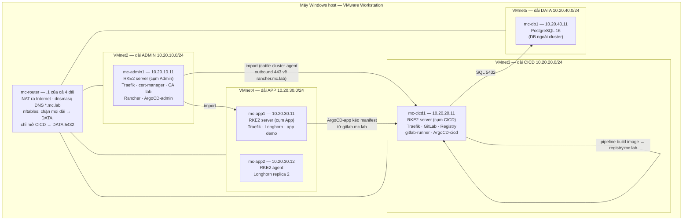

# Lab M1 — Ba cụm RKE2 + Rancher + GitLab + Longhorn trên VM Windows host

> **Vị trí của lab này:** đây là track riêng, nằm ngoài chuỗi snapshot của
> [k8s-docs/labs](../k8s-docs/labs/README.md). Lab dựng lại **toàn bộ hệ thống trong bài viết
> "3 cụm K8s"** (Admin/CICD/App, dải mạng riêng, DB ngoài cluster, Longhorn) ở quy mô homelab,
> với các sửa đổi đã rút từ nhận xét: dùng **Traefik ngay từ đầu** thay vì ingress-nginx,
> blacklist multipathd thay vì disable, `max_connections` có tính toán, PVC tối thiểu 2 replica.
>
> **Điểm bắt đầu:** máy Windows host trống, chưa có VM nào của track này.
> **Điểm kết thúc:** 3 cụm RKE2 hoạt động, Rancher quản lý cả 3, pipeline GitLab build image
> và ArgoCD deploy app end-to-end. Ngày đối chiếu phiên bản: **17/08/2026**.
>
> Lab tiếp theo của track: [Lab M2 — Capstone production HA](LAB-M2-CAPSTONE-PRODUCTION-HA.md).

---

## 1. Bức tranh toàn cảnh

Đọc kỹ sơ đồ này trước khi gõ lệnh đầu tiên. Mọi mục từ §3 trở đi chỉ là dựng dần từng khối
của đúng sơ đồ này.



Đối chiếu với thiết kế trong bài viết gốc:

| Tính chất bài viết nêu | Hiện thực trong lab |
| --- | --- |
| Cụm Admin quản lý tập trung | Rancher trên cụm Admin, import 2 cụm còn lại (§4, §5.4, §6.1) |
| Cụm CICD lưu code + triển khai | GitLab + Registry + runner Kubernetes executor (§6) |
| Cụm App phục vụ ứng dụng | Cụm 2 node chạy app demo qua ArgoCD (§5, §7) |
| Các cụm nằm trên dải mạng riêng | 4 VMnet host-only, định tuyến qua `mc-router` (§3) |
| DB trên máy chủ riêng, dải nội bộ | PostgreSQL trên `mc-db1`, firewall chỉ mở từ CICD (§3.4, §6.2) |
| Longhorn làm block storage | Longhorn trên cụm App, mặc định 2 replica (§5.3) |
| Self-signed CA + cert-manager rotate | CA lab cấp bởi cert-manager trên cụm Admin (§4.2) |
| Wildcard cert + reflector | Wildcard `*.mc.lab` từ CA lab, reflector nhân bản theo namespace (§7.1) |
| Argo instance riêng mỗi cụm | 3 ArgoCD, manual sync + server-side apply (§7.2) |

Khác biệt có chủ đích so với bài viết: dùng **Traefik từ lúc cài RKE2** (`ingress-controller:
traefik`) — tránh đúng "kiếp nạn" update/revert mà bài viết mô tả, vì ingress-nginx đã EOL
03/2026 và bị gỡ khỏi RKE2 từ v1.37.

## 2. Quy hoạch

### 2.1. Phiên bản được khóa

Track này có bảng phiên bản riêng, không dùng chung bảng A1.3 của Lab 00 (khác distro).
Giá trị đối chiếu ngày 17/08/2026; nếu kho phát hành đã đổi thì dừng, đối chiếu release notes
rồi cập nhật bảng — không âm thầm cài bản khác.

| Thành phần | Phiên bản | Ghi chú |
| --- | --- | --- |
| Ubuntu Server | 24.04.x LTS amd64 | ISO và cách verify SHA256: [Lab 00 §A1.3](../k8s-docs/labs/LAB-00-MOI-TRUONG-1.35.7.md#a13-phiên-bản-được-khóa) |
| RKE2 | `v1.35.7+rke2r1` | Kubernetes v1.35.7; ship Traefik v3.7.8; **không lên 1.36** khi còn Rancher 2.14.3 (chart khai `kubeVersion: < 1.36.0-0`) |
| Rancher | chart `2.14.3` | repo `rancher-stable`; support matrix phủ K8s 1.33–1.35 |
| cert-manager | chart `v1.21.1` | repo `jetstack` |
| Helm | 4.x (≥ 4.0) | GitLab chart 10.x yêu cầu Helm ≥ 4.0; Helm 3 hết hỗ trợ ~07/2026. Cài bản stable mới nhất, ghi version thực vào hồ sơ |
| Longhorn | chart `1.12.1` | yêu cầu K8s ≥ 1.25; V1 data engine |
| PostgreSQL | **17** (repo PGDG chính thức) | GitLab 19.x chỉ hỗ trợ PostgreSQL **17.x** (min = max = 17); gói 16 của Ubuntu Noble **không dùng được** |
| Redis | 7.x (gói Ubuntu Noble) | GitLab chart 10.x **bắt buộc** external Redis |
| MinIO server | bản mới nhất từ `dl.min.io` tại ngày cài — ghi version vào hồ sơ | GitLab chart 10.x **bắt buộc** external object storage |
| GitLab chart | `10.2.2` (GitLab `19.2.2`) | repo `https://charts.gitlab.io`; đối chiếu [version mappings](https://docs.gitlab.com/charts/installation/version_mappings/) nếu repo đã sang bản khác |
| Argo CD | `v3.5.1` | manifest install pin theo tag, không dùng `stable` trôi nổi |
| local-path-provisioner | `v0.0.37` | StorageClass cho cụm CICD (Gitaly cần PVC); trùng bản khóa ở [Lab 00 §A1.4](../k8s-docs/labs/LAB-00-MOI-TRUONG-1.35.7.md#a14-phần-stack-không-thuộc-lab-00) |
| gitlab-runner chart / reflector | **không pin cứng ở đây** | lấy bản mới nhất lúc cài bằng `helm search repo`, **ghi version thấy được vào hồ sơ lab** ở gate tương ứng |

### 2.2. VM, mạng và DNS

| VM | Dải / VMnet | IP | vCPU | RAM | Disk | Vai trò |
| --- | --- | --- | --- | --- | --- | --- |
| `mc-router` | NAT (VMnet8) + VMnet2/3/4/5 | `.1` mỗi dải | 1 | 1 GB | 20 GB | NAT, DNS, firewall giữa các dải |
| `mc-admin1` | ADMIN / VMnet2 | `10.20.10.11` | 4 | 6 GB | 50 GB | RKE2 server cụm Admin |
| `mc-cicd1` | CICD / VMnet3 | `10.20.20.11` | 4 | 8 GB | 60 GB | RKE2 server cụm CICD |
| `mc-app1` | APP / VMnet4 | `10.20.30.11` | 2 | 4 GB | 40 + 20 GB | RKE2 server cụm App |
| `mc-app2` | APP / VMnet4 | `10.20.30.12` | 2 | 4 GB | 40 + 20 GB | RKE2 agent cụm App |
| `mc-db1` | DATA / VMnet5 | `10.20.40.11` | 2 | 4 GB | 40 GB | PostgreSQL + Redis + MinIO |

Tổng 27 GB RAM cho VM. Host **tối thiểu 32 GB** (phải đóng ứng dụng nặng khi chạy đủ stack),
khuyến nghị 48 GB. Kiểm tra host bằng block PowerShell ở
[Lab 00 §A1.1](../k8s-docs/labs/LAB-00-MOI-TRUONG-1.35.7.md#a11-máy-host-windows).

Disk thứ hai 20 GB trên `mc-app1`/`mc-app2` dành riêng cho Longhorn (mount `/var/lib/longhorn`).

DNS nội bộ (dnsmasq trên `mc-router`, domain `mc.lab`):

| Tên | Trỏ về |
| --- | --- |
| `rancher.mc.lab` | `10.20.10.11` |
| `gitlab.mc.lab`, `registry.mc.lab` | `10.20.20.11` |
| `minio.mc.lab` | `10.20.40.11` |
| `app.mc.lab` | `10.20.30.11` |
| `mc-admin1.mc.lab` … `mc-db1.mc.lab` | IP node tương ứng |

**Nếu thiếu RAM** (host 32 GB): trong §8 bỏ monitoring; nếu vẫn thiếu, chấp nhận chạy cụm App
1 node + Longhorn 1 replica — ghi rõ vào hồ sơ lab rằng cấu hình này mất tính chất "2 replica
trên 2 node" và mọi kết luận về drain/eviction không còn giá trị.

#### Vì sao dùng host-only + NAT thay vì Bridged

Track này cố ý mô phỏng bốn dải mạng riêng ADMIN, CICD, APP và DATA, nên các VM workload
`mc-admin1`, `mc-cicd1`, `mc-app1`, `mc-app2` và `mc-db1` **không** gắn Bridged. Mỗi VM chỉ
gắn vào VMnet host-only đúng theo bảng trên; traffic liên dải phải đi qua `mc-router` để
`nftables` thực thi chính sách ở §3.4 và `dnsmasq` cung cấp DNS `*.mc.lab`.

Chỉ `mc-router` có một NIC NAT: adapter 1 nối VMnet8 làm uplink ra Internet; bốn adapter còn
lại nối VMnet2–VMnet5 và giữ địa chỉ `.1` của từng dải. Vì vậy NAT **không** phải network mode
của năm VM workload. Đường egress của chúng là `VM workload → gateway .1 → mc-router →
VMnet8 → Internet`. Windows host vẫn SSH trực tiếp vào từng dải qua host virtual adapter
`.254` ở §3.1, không đi qua firewall liên dải.

Khác với [Lab 00](../k8s-docs/labs/LAB-00-MOI-TRUONG-1.35.7.md#a12-ba-vm) và
[runbook VMware](../runbook-k8s-vmware.md#3-tạo-3-vm-ubuntu-2404-trên-vmware), nơi một cluster
phẳng dùng Bridged để các node xuất hiện trực tiếp trên LAN vật lý, topology này cần giữ bốn
dải tách biệt và buộc traffic liên dải đi qua router của lab. Theo tài liệu VMware, Bridged
nối VM trực tiếp vào LAN vật lý, host-only tạo private LAN giữa host và các VM, còn NAT dùng
địa chỉ của host để đi ra mạng ngoài: [Broadcom — Understanding networking types in hosted
products](https://knowledge.broadcom.com/external/article?legacyId=1006480).

#### Quan hệ với các lab Bridged đã có và vì sao không dùng VMnet1

Trong cấu hình mẫu của [Lab 00](../k8s-docs/labs/LAB-00-MOI-TRUONG-1.35.7.md#a12-ba-vm)
và [runbook VMware](../runbook-k8s-vmware.md#3-tạo-3-vm-ubuntu-2404-trên-vmware), cả hai hạ
tầng cũ đều dùng Bridged và đặt IP node trên LAN `192.168.100.0/24`. VMware Workstation mặc
định dùng VMnet0 cho Bridged. Tuy nhiên, chỉ runbook VMware pin rõ tên VMnet0 và yêu cầu bind
nó vào card vật lý; Lab 00 chỉ ghi `Network: Bridged`, không pin tên VMnet. Vì vậy, khi Lab 00
đi qua VMnet0 thì đó là ánh xạ Bridged của VMware host, không phải một giá trị được Lab 00
quy định.

VMnet1 mặc định là host-only: nó tạo private LAN giữa Windows host và các VM cùng mạng, nhưng
không nối trực tiếp VM vào LAN vật lý và không tự cung cấp Internet egress. Do đó không thay
Bridged của hai lab cũ bằng VMnet1; nếu làm vậy, topology LAN/gateway và các gate Internet sẽ
không còn đúng nếu không bổ sung một router/NAT khác nằm ngoài hai tài liệu đó.

Track M1 cũng không thể biểu diễn bốn zone ADMIN, CICD, APP và DATA bằng một VMnet1 duy nhất:
bốn zone cần bốn VMnet host-only tách biệt để traffic liên dải buộc phải đi qua `mc-router`.
Số hiệu VMnet không bắt buộc phải dùng liên tục, nên track này không dùng hoặc thay đổi VMnet1
và dành VMnet2–VMnet5 cho bốn zone. Không xóa hay cấu hình lại VMnet1 chỉ để làm lab này.

Tạo các VM của track này **không tự động thay đổi** hạ tầng Bridged cũ nếu giữ nguyên VMnet0
và cấu hình VMnet8. Track chỉ dùng VMnet8 hiện hữu làm uplink NAT của `mc-router`, không yêu
cầu đổi subnet hoặc DHCP của VMnet8. Trước khi tạo VMnet2–VMnet5, xác nhận chúng chưa được
VM/lab khác sử dụng và các dải `10.20.10.0/24`–`10.20.40.0/24` không trùng LAN, VPN,
WSL/Hyper-V hoặc route hiện có trên Windows — [bước 0 của §3.1](#31-tạo-4-vmnet-host-only)
là gate kiểm bằng lệnh cho chính việc này. Thay subnet, type hoặc DHCP của một VMnet đang
dùng sẽ ảnh hưởng mọi VM nối vào VMnet đó.

Các lab không xung đột IP theo giá trị mẫu, nhưng nếu chạy đồng thời thì vẫn cộng dồn nhu cầu
CPU, RAM và disk; riêng một cluster cũ 20 GB RAM cộng track này 27 GB RAM đã là 47 GB cho VM,
chưa tính Windows và VMware.

### 2.3. Biến đầu vào

Mọi giá trị người học phải tự điền được liệt kê ở đây, một chỗ duy nhất. **Trước khi bắt đầu
§3**, sinh sẵn toàn bộ nhóm "tự sinh" và ghi vào một file cục bộ ngoài git (ví dụ
`~/m1-secrets.env`); các mục sau chỉ tra file này. Một secret điền lệch nhau giữa hai mục
(ví dụ mật khẩu DB ở §6.2 và secret ở §6.3) sẽ fail ở gate với thông báo không nói thẳng
nguyên nhân — quy ước một-chỗ-duy-nhất này tồn tại để chặn đúng lỗi đó.

| Placeholder trong lab | Là gì | Cách sinh / lấy | Dùng ở |
| --- | --- | --- | --- |
| `<SINH-CHUỖI-NGẪU-NHIÊN-DÀI>` | token RKE2 cụm Admin | `openssl rand -hex 16` | §4.1 |
| `<TOKEN-RIÊNG-CỦA-CỤM-APP>` | token RKE2 cụm App | `openssl rand -hex 16` — **khác** token Admin | §5.1 (server và agent phải trùng nhau) |
| `<TOKEN-RIÊNG-CỦA-CỤM-CICD>` | token RKE2 cụm CICD | `openssl rand -hex 16` | §6.1 |
| `<ĐẶT-MẬT-KHẨU-BOOTSTRAP>` | mật khẩu đăng nhập Rancher lần đầu | tự đặt; đổi ngay sau lần login đầu | §4.3 |
| `<TOKEN-UI-SINH-RA>` | token import cluster | Rancher UI sinh khi tạo Import Existing | §5.4, §6.1 |
| `<MẬT-KHẨU-DB>` | mật khẩu role `gitlab` của PostgreSQL | `openssl rand -base64 24` | §6.2 và secret `gitlab-psql` ở §6.3 — **phải trùng** |
| `<MẬT-KHẨU-REDIS>` | requirepass của Redis | `openssl rand -base64 24` | §6.2 và secret `gitlab-redis` ở §6.3 — **phải trùng** |
| `<MẬT-KHẨU-MINIO>` | MINIO_ROOT_PASSWORD | `openssl rand -base64 24` | §6.2 (unit + `mc alias`) và hai secret object-storage/registry-storage ở §6.3 — **phải trùng** |
| `glrt-<TOKEN>` | runner authentication token | GitLab UI → Admin → Runners → New instance runner | §6.4 |
| `<TOKEN-argocd-read>` | deploy token đọc repo | GitLab UI → group `platform` → Deploy tokens, scope `read_repository` | §7.2 |
| `<TOKEN-registry-pull>` | deploy token pull image | như trên, scope `read_registry` | §7.2 |
| `<TOKEN-git-push>` | Personal Access Token của `root` để push code | GitLab UI → avatar root → Edit profile → Access tokens, scope `write_repository` | §7.2 |
| `<tag từ §6.4>` | tag image demo | chính là `CI_COMMIT_SHORT_SHA` của pipeline xanh đầu tiên | §7.2 |

Sang [Lab M2](LAB-M2-CAPSTONE-PRODUCTION-HA.md), các biến cùng vai trò không nằm rải trong
tài liệu nữa mà dồn vào `inventories/prod/group_vars/all_vault.yml` (ansible-vault):
token RKE2 ba cụm → `vault_rke2_token_{admin,cicd,app}`, mật khẩu DB/Redis/MinIO →
`vault_db_password`, `vault_redis_password`, `vault_minio_*`. Bảng trên chính là danh sách
khởi tạo vault của M2.

### 2.4. Quy ước khi một gate FAIL

Ba bước, áp cho mọi gate trong lab:

1. **Dừng — không làm bước kế tiếp.** Mọi mục sau đều giả định gate trước đã PASS; đi tiếp
   trên nền fail chỉ làm lỗi lan rộng và khó lần ngược.
2. **Chẩn đoán tại chỗ** theo [bảng troubleshooting §10](#10-troubleshooting-của-lab-này) và
   log của thành phần liên quan. Sửa được thì chạy lại đúng gate đó cho tới PASS.
3. **Trạng thái đã bẩn hoặc không chẩn đoán ra trong ~30 phút:** restore snapshot đầu vào
   của mục đang làm (bảng dưới) rồi làm lại **từ đầu mục đó**. Chuỗi snapshot tồn tại chính
   là để bước này rẻ.

| Gate fail ở mục | Restore về | Ghi chú |
| --- | --- | --- |
| §3 | snapshot golden của VM lỗi | hạ tầng chưa có mốc chung; VM nào hỏng làm lại VM đó |
| §4 | `m1-infra-ready` | |
| §5 | `m1-admin-ready` | cụm Admin và Rancher giữ nguyên, chỉ làm lại cụm App |
| §6 | `m1-app-ready` | |
| §7–§9 | `m1-cicd-ready` | các mục này chỉ đổi trạng thái trong cluster, thường chỉ cần xóa resource lỗi (`kubectl delete`) thay vì restore cả VM |

Restore snapshot là thao tác trên **toàn bộ** các VM có trong mốc đó (trạng thái ba cụm đan
nhau qua Rancher import — restore lệch một VM là lệch mốc).

## 3. Hạ tầng: mạng, router và các VM

### 3.1. Tạo 4 VMnet host-only

**Bước 0 — gate tiền đề, chạy TRƯỚC khi tạo bất kỳ VMnet nào** (chạy sau khi đã tạo thì
điều kiện (3) mất giá trị, vì chính các host adapter mới sẽ sinh route `10.20.x`):

```powershell
# (1) Subnet NAT của VMnet8 — mc-golden (§3.2.2) và uplink của mc-router dùng mạng này:
Get-NetIPAddress -AddressFamily IPv4 |
  Where-Object InterfaceAlias -like '*VMnet8*' |
  Select-Object InterfaceAlias, IPAddress
# ví dụ ra 192.168.229.1 → subnet NAT là 192.168.229.0/24

# (2) Dải LAN thật của host:
ipconfig | findstr /i "Default Gateway"

# (3) Route 10.20.x đã tồn tại từ trước (VPN, WSL, Hyper-V, lab khác):
Get-NetRoute -AddressFamily IPv4 |
  Where-Object DestinationPrefix -like '10.20.*' |
  Select-Object DestinationPrefix, InterfaceAlias
```

**PASS (đủ cả ba):** subnet VMnet8 ở (1) **không** bắt đầu bằng `10.20.` và **khác** dải
gateway ở (2); lệnh (3) không in ra route nào.

**FAIL ở (1) hoặc (3):** đừng sửa VMnet8 — đổi subnet/DHCP của nó ảnh hưởng mọi VM NAT hiện
có trên máy. Thay vào đó đổi quy hoạch `10.20.x` của lab này sang dải trống khác, sửa đồng
bộ: bảng §2.2, netplan §3.3, nftables + dnsmasq §3.4 và hosts file ở §3.5. **FAIL ở (2)**
(LAN trùng subnet VMnet8) nghĩa là máy bạn vốn đã có xung đột NAT tiềm ẩn ngoài phạm vi lab
— xử lý xong mới tiếp tục.

Sau khi bước 0 PASS: trên VMware Workstation mở **Edit → Virtual Network Editor → Change
Settings** (cần quyền admin), thêm 4 mạng host-only. Với **từng** VMnet: **bỏ tick "Use local DHCP service"** (IP
đặt tĩnh, DHCP của VMware chỉ gây nhiễu) và đặt subnet:

| VMnet | Subnet IP | Subnet mask | Host virtual adapter (tick Connect a host virtual adapter) |
| --- | --- | --- | --- |
| VMnet2 | `10.20.10.0` | `255.255.255.0` | host nhận `10.20.10.254` |
| VMnet3 | `10.20.20.0` | `255.255.255.0` | host nhận `10.20.20.254` |
| VMnet4 | `10.20.30.0` | `255.255.255.0` | host nhận `10.20.30.254` |
| VMnet5 | `10.20.40.0` | `255.255.255.0` | host nhận `10.20.40.254` |

Host virtual adapter cho phép Windows host SSH thẳng vào VM của từng dải **không qua router**,
nên firewall giữa các dải ở §3.4 không bao giờ khóa mất đường quản trị của bạn.

Verify trên PowerShell của host:

```powershell
Get-NetIPAddress -AddressFamily IPv4 |
  Where-Object IPAddress -like '10.20.*' |
  Select-Object InterfaceAlias, IPAddress
```

**PASS:** thấy đủ 4 adapter `VMware Network Adapter VMnet2..5` với IP `.254` của 4 dải.

### 3.2. Dựng VM gốc Ubuntu 24.04 và nhân bản 6 VM

Toàn bộ quy trình viết trọn tại đây, không tham chiếu "làm như runbook khác". Nguyên tắc:
cài Ubuntu **một lần duy nhất** trên VM gốc `mc-golden`, làm sạch và chuẩn bị chung, snapshot,
rồi full-clone ra 6 VM và tách identity từng bản. Mọi VM của lab đều là hậu duệ của một
snapshot — môi trường đồng nhất, dựng lại rẻ.

#### 3.2.1. Tải và kiểm ISO

Tải `ubuntu-24.04.x-live-server-amd64.iso` từ <https://ubuntu.com/download/server> cùng file
`SHA256SUMS` của Canonical. Kiểm trên PowerShell của host **trước khi** gắn vào VM:

```powershell
$isoPath = 'D:\ISO\ubuntu-24.04.4-live-server-amd64.iso'   # đổi theo nơi lưu
$expected = '<giá trị dòng tương ứng trong SHA256SUMS>'     # với 24.04.4, đối chiếu thêm
                                                            # bảng A1.3 của Lab 00
$actual = (Get-FileHash -Algorithm SHA256 -LiteralPath $isoPath).Hash.ToLowerInvariant()
if ($actual -ne $expected) { throw "FAIL: ISO SHA256 mismatch" }
'PASS: ISO hợp lệ'
```

#### 3.2.2. Tạo VM gốc `mc-golden`

Trên VMware Workstation:

1. **File → New Virtual Machine → Typical**.
2. Ở bước chọn nguồn cài, chọn **"I will install the operating system later"** — KHÔNG trỏ
   ISO ngay tại đây. Lý do: trỏ ISO lúc tạo VM sẽ kích hoạt **Easy Install** của VMware, nó
   tự trả lời installer bằng đáp án riêng (user, partition) và phá các lựa chọn ở bước 6.
3. Guest OS: **Linux → Ubuntu 64-bit**. Tên VM: `mc-golden`.
4. Disk: **40 GB**, *Store virtual disk as a single file* (thin — chỉ chiếm chỗ thật theo
   dung lượng dùng).
5. **Customize Hardware**: 2 vCPU, 4096 MB RAM (chỉ cho lúc cài; clone sẽ đặt lại theo bảng
   §2.2); **Network Adapter → NAT (VMnet8)** — golden dùng NAT để có DHCP + Internet lúc
   cài, tuyệt đối không đụng Bridged/VMnet0 của các cluster cũ; Firmware: **UEFI** (tab
   Options → Advanced nếu không thấy ở Hardware). Close → Finish.
6. VM Settings → CD/DVD → *Use ISO image file* → trỏ file ISO đã kiểm → tick *Connect at
   power on* → **Power On** và cài Ubuntu Server với các lựa chọn sau (mục nào không nhắc
   thì giữ mặc định):
   - *Try or Install Ubuntu Server* → ngôn ngữ/bàn phím tùy bạn.
   - Type of installation: **Ubuntu Server** (bản chuẩn, không chọn *minimized* — cần đủ
     công cụ chẩn đoán).
   - Network: để DHCP trên NIC duy nhất — PASS tại chỗ: NIC hiện IP dải NAT của VMnet8.
   - Proxy: để trống. Mirror: giữ mặc định.
   - Storage: **Use an entire disk** và **BỎ TICK "Set up this disk as an LVM group"** —
     không LVM thì bước mở rộng disk ở 3.2.5 chỉ cần `growpart` + `resize2fs`, ít tầng để
     sai hơn.
   - Profile: name `ubuntu`, server name `mc-golden`, username `ubuntu`, mật khẩu tự đặt
     (ghi vào file secrets của §2.3).
   - Ubuntu Pro: Skip. **SSH Setup: tick "Install OpenSSH server"**. Featured snaps: không
     chọn gì.
7. Cài xong → *Reboot Now* → khi VM lên lại, VM Settings → CD/DVD → bỏ tick *Connect at
   power on* (nhả ISO).

```bash
# Đăng nhập console (hoặc SSH ubuntu@<IP DHCP mà console hiển thị>) và verify nền:
lsb_release -d          # PASS: Ubuntu 24.04.x LTS
ip -br a                # PASS: một NIC (thường ens33) có IP dải NAT
lsblk                   # PASS: sda1 = ESP, sda2 = / (không có lvm)
```

#### 3.2.3. Chuẩn bị chung trên golden — làm MỘT lần, mọi clone thừa hưởng

```bash
sudo apt-get update && sudo apt-get dist-upgrade -y
# Công cụ nền: open-vm-tools (tương tác VMware), cloud-guest-utils (growpart cho 3.2.5):
sudo apt-get install -y open-vm-tools cloud-guest-utils curl
# Tắt swap vĩnh viễn — kubelet của RKE2 không chấp nhận swap:
sudo swapoff -a
sudo sed -i.bak '/\sswap\s/s/^/#/' /etc/fstab
# Đồng bộ giờ — lệch giờ làm TLS giữa các cụm chết ngầm:
sudo timedatectl set-ntp true
# Chặn cloud-init quản mạng — thiếu dòng này, sau reboot cloud-init sinh lại netplan DHCP
# và ghi đè IP tĩnh của §3.3 trên các bản clone:
echo 'network: {config: disabled}' | \
  sudo tee /etc/cloud/cloud.cfg.d/99-disable-network-config.cfg

swapon --show | wc -l                            # PASS: 0
timedatectl show -p NTPSynchronized --value      # PASS: yes
systemctl is-active open-vm-tools                # PASS: active
```

**Không cài** containerd/kubeadm/kubelet như Lab 00 — RKE2 tự mang containerd riêng; golden
càng ít thứ càng ít lệch.

#### 3.2.4. Snapshot mốc gốc

```bash
sudo shutdown -h now
```

VM tắt hẳn → chuột phải `mc-golden` → **Snapshot → Take Snapshot** → tên `golden-base`.
Snapshot lúc **powered off** để mọi clone khởi đầu từ trạng thái disk sạch, không kèm RAM
state. Từ đây không bật lại `mc-golden` nữa — nó chỉ là nguồn clone.

#### 3.2.5. Full-clone 6 VM và tùy chỉnh phần cứng từng bản

Với **từng** VM trong bảng §2.2: chuột phải `mc-golden` → **Manage → Clone** → nguồn
**An existing snapshot: `golden-base`** → **Create a full clone** (không dùng linked clone —
6 VM phải độc lập disk) → đặt đúng tên (`mc-router`, `mc-admin1`, `mc-cicd1`, `mc-app1`,
`mc-app2`, `mc-db1`).

Clone xong, **chưa bật vội** — mở VM Settings của từng bản và chỉnh theo bảng:

| VM | RAM/vCPU (theo §2.2) | Network Adapter | Disk |
| --- | --- | --- | --- |
| `mc-router` | 1 GB / 1 | adapter 1 giữ **NAT**; **Add** 4 adapter mới → *Custom* → VMnet2, VMnet3, VMnet4, VMnet5 (đúng thứ tự) | giữ 40 GB |
| `mc-admin1` | 6 GB / 4 | đổi sang *Custom* → **VMnet2** | **Expand** → 50 GB |
| `mc-cicd1` | 8 GB / 4 | *Custom* → **VMnet3** | **Expand** → 60 GB |
| `mc-app1` | 4 GB / 2 | *Custom* → **VMnet4** | giữ 40 GB + **Add → Hard Disk → SCSI → 20 GB** (disk Longhorn) |
| `mc-app2` | 4 GB / 2 | *Custom* → **VMnet4** | như `mc-app1` |
| `mc-db1` | 4 GB / 2 | *Custom* → **VMnet5** | giữ 40 GB |

Ghi chú: nút **Expand** (Hard Disk → Expand) chỉ bấm được khi VM đang tắt và bản clone chưa
có snapshot riêng — đúng trạng thái hiện tại. `mc-router`/`mc-db1` thừa hưởng disk 40 GB
thin lớn hơn con số tối thiểu ở bảng §2.2 — chấp nhận, thin không chiếm chỗ thật.

#### 3.2.6. Tách identity từng clone — qua CONSOLE VMware, từng máy một

Các VMnet host-only đã **tắt DHCP** (§3.1) nên clone chưa có IP, chưa SSH được — mọi lệnh
mục này gõ qua console VMware. Bật **từng VM một**, làm trọn các bước rồi mới sang VM kế:

```bash
# 1) Reset machine-id (tránh trùng định danh/DHCP DUID giữa các clone):
sudo truncate -s 0 /etc/machine-id
sudo rm -f /var/lib/dbus/machine-id
sudo systemd-machine-id-setup

# 2) Reset SSH host key (tránh cảnh báo trùng key khi SSH từ host):
sudo rm -f /etc/ssh/ssh_host_*
sudo dpkg-reconfigure openssh-server

# 3) Hostname — đổi đúng theo tên VM đang làm:
sudo hostnamectl set-hostname mc-router     # mc-admin1 / mc-cicd1 / mc-app1 / mc-app2 / mc-db1

# 4) Bỏ netplan DHCP do cloud-init sinh từ đời golden:
sudo mv /etc/netplan/50-cloud-init.yaml /etc/netplan/50-cloud-init.yaml.bak 2>/dev/null || true

# 5) Viết netplan IP tĩnh theo đúng mẫu của VM này ở §3.3 rồi:
sudo chmod 600 /etc/netplan/01-static.yaml
sudo netplan apply

# 6) Reboot — bắt buộc để machine-id mới và hostname áp dụng trọn:
sudo reboot
```

Riêng `mc-router` dùng mẫu netplan 5 NIC ở §3.3; nhớ đối chiếu MAC trong VM Settings với
`ip -br link` để gán đúng `ens33..ens37` theo thứ tự adapter.

#### 3.2.7. Verify từng VM sau reboot

SSH từ host vào từng máy qua host virtual adapter (ví dụ `ssh ubuntu@10.20.10.11`) — SSH
được chính là bằng chứng netplan đúng:

```bash
hostnamectl | head -1            # PASS: đúng tên máy
ip -br a                         # PASS: đúng IP tĩnh theo bảng §2.2, không còn IP DHCP
swapon --show | wc -l            # PASS: 0 (thừa hưởng từ golden)
timedatectl show -p NTPSynchronized --value   # PASS: yes
cat /etc/machine-id              # ghi lại — so 6 VM phải ra 6 giá trị KHÁC nhau
```

Riêng hai máy expand disk, nới partition rồi filesystem (không LVM nên chỉ hai lệnh):

```bash
# mc-admin1 và mc-cicd1:
lsblk                            # xác nhận: sda2 là partition / và disk đã là 50G/60G
sudo growpart /dev/sda 2
sudo resize2fs /dev/sda2
df -h / | awk 'NR==2 {print $2}' # PASS: ~49G (admin1) / ~59G (cicd1)
```

Riêng hai node App, xác nhận disk Longhorn tồn tại (chưa format — §5.2 sẽ làm):

```bash
lsblk | grep -c '^sdb'           # PASS: 1 — disk 20 GB thứ hai hiện diện
```

### 3.3. Netplan cho từng VM

Mẫu cho VM một NIC (thay IP theo bảng §2.2; gateway và DNS luôn là `.1` của dải đó):

```yaml
# /etc/netplan/01-static.yaml — ví dụ cho mc-admin1
network:
  version: 2
  ethernets:
    ens33:                      # xác nhận tên NIC bằng: ip -br link
      dhcp4: false
      addresses: [10.20.10.11/24]
      routes: [{to: default, via: 10.20.10.1}]
      nameservers:
        addresses: [10.20.10.1]
        search: [mc.lab]
```

`mc-router` có 5 NIC — NIC NAT giữ DHCP, 4 NIC còn lại đặt `.1` tĩnh **không có** route
default (default đi qua NAT):

```yaml
# /etc/netplan/01-router.yaml trên mc-router
network:
  version: 2
  ethernets:
    ens33: {dhcp4: true}                       # NAT ra Internet
    ens34: {dhcp4: false, addresses: [10.20.10.1/24]}
    ens35: {dhcp4: false, addresses: [10.20.20.1/24]}
    ens36: {dhcp4: false, addresses: [10.20.30.1/24]}
    ens37: {dhcp4: false, addresses: [10.20.40.1/24]}
```

Thứ tự `ens33..ens37` phải đối chiếu với thứ tự adapter trong VMware (`ip -br link` +
so MAC trong VM Settings). Áp dụng: `sudo netplan apply`.

**PASS trên mỗi VM:** `ip -br addr` đúng IP; `ip route | grep default` đúng gateway.

### 3.4. Router: NAT, DNS và firewall giữa các dải

Trên `mc-router`:

```bash
sudo apt-get install -y nftables dnsmasq
echo 'net.ipv4.ip_forward=1' | sudo tee /etc/sysctl.d/99-forward.conf
sudo sysctl --system | grep ip_forward     # PASS: net.ipv4.ip_forward = 1
```

`/etc/nftables.conf` — NAT ra Internet, các dải nói chuyện với nhau tự do **trừ** dải DATA:
chỉ CICD được vào cổng 5432:

```text
#!/usr/sbin/nft -f
flush ruleset

define IF_NAT   = "ens33"
define NET_DATA = 10.20.40.0/24
define NET_CICD = 10.20.20.0/24

table inet filter {
  chain forward {
    type filter hook forward priority 0; policy accept;
    ct state established,related accept
    # Dải DATA là dải nội bộ: chặn mọi dải khác, trừ CICD → PostgreSQL/Redis/MinIO.
    ip saddr $NET_CICD ip daddr $NET_DATA tcp dport { 5432, 6379, 9000 } accept
    ip daddr $NET_DATA drop
  }
}
table ip nat {
  chain postrouting {
    type nat hook postrouting priority 100;
    oifname $IF_NAT masquerade
  }
}
```

```bash
sudo systemctl enable --now nftables
sudo nft list ruleset | grep -c masquerade    # PASS: 1
```

`/etc/dnsmasq.conf` — DNS cho toàn bộ lab, forward phần còn lại ra ngoài:

```text
domain-needed
bogus-priv
listen-address=127.0.0.1,10.20.10.1,10.20.20.1,10.20.30.1,10.20.40.1
server=1.1.1.1
local=/mc.lab/
host-record=mc-admin1.mc.lab,10.20.10.11
host-record=mc-cicd1.mc.lab,10.20.20.11
host-record=mc-app1.mc.lab,10.20.30.11
host-record=mc-app2.mc.lab,10.20.30.12
host-record=mc-db1.mc.lab,10.20.40.11
address=/rancher.mc.lab/10.20.10.11
address=/gitlab.mc.lab/10.20.20.11
address=/registry.mc.lab/10.20.20.11
address=/minio.mc.lab/10.20.40.11
address=/app.mc.lab/10.20.30.11
```

Ubuntu đang chạy `systemd-resolved` chiếm cổng 53 — tắt stub listener trước khi start
dnsmasq. **Bắt buộc sửa cả `/etc/resolv.conf`**: mặc định nó là symlink tới stub
`127.0.0.53`; tắt stub listener mà giữ symlink thì chính router mất khả năng phân giải:

```bash
sudo mkdir -p /etc/systemd/resolved.conf.d
printf '[Resolve]\nDNSStubListener=no\n' |
  sudo tee /etc/systemd/resolved.conf.d/dnsmasq.conf
sudo systemctl restart systemd-resolved
# Thay symlink stub bằng file tĩnh trỏ vào dnsmasq của chính router:
sudo rm -f /etc/resolv.conf
printf 'nameserver 127.0.0.1\nsearch mc.lab\n' | sudo tee /etc/resolv.conf
sudo systemctl enable --now dnsmasq

# Gate resolver của router (lặp lại sau khi reboot router một lần để chắc cấu hình bền):
sudo ss -lntup 'sport = :53' | grep -c dnsmasq   # PASS: >= 1 — dnsmasq đang giữ cổng 53
getent hosts rancher.mc.lab                       # PASS: 10.20.10.11
getent hosts get.rke2.io | head -1                # PASS: có IP — forward ra Internet chạy
```

### 3.5. Gate hạ tầng

Chạy từ `mc-admin1` (đại diện; lặp lại nhanh trên các VM khác nếu nghi ngờ):

```bash
ping -c2 10.20.20.11 && ping -c2 10.20.30.11        # PASS: liên dải đi qua router
getent hosts rancher.mc.lab gitlab.mc.lab app.mc.lab # PASS: đúng IP bảng §2.2
curl -fsSL -m 10 -o /dev/null https://get.rke2.io && echo PASS-egress
# PASS: in "PASS-egress" — `-f` fail với mã >= 400, `-L` theo redirect, `-m 10` chặn treo;
# không so khớp chuỗi "HTTP/2 200" vì phía website đổi protocol/redirect là gate hỏng oan
nc -vzw3 10.20.40.11 5432; echo "exit=$?"            # PASS: exit KHÁC 0 — ADMIN bị chặn vào DATA
```

Từ Windows host, thêm bản ghi hosts để trình duyệt truy cập được các UI
(PowerShell **Run as Administrator**):

```powershell
Add-Content -Path C:\Windows\System32\drivers\etc\hosts -Encoding ascii -Value @(
  "10.20.10.11 rancher.mc.lab",
  "10.20.20.11 gitlab.mc.lab registry.mc.lab",
  "10.20.40.11 minio.mc.lab",
  "10.20.30.11 app.mc.lab"
)
```

**Chụp snapshot VMware cho cả 6 VM** với tên `m1-infra-ready` trước khi sang §4.

## 4. Cụm Admin: RKE2 + cert-manager + CA lab + Rancher

### 4.1. RKE2 server với Traefik ngay từ đầu

Trên `mc-admin1`. Đây là chỗ bài viết gốc vấp: cài mặc định rồi phải đổi ingress sau. Ta khai
`ingress-controller: traefik` **trước khi start** — RKE2 v1.35 ship sẵn cả hai controller và
cho chọn bằng đúng key này:

```bash
sudo mkdir -p /etc/rancher/rke2
sudo tee /etc/rancher/rke2/config.yaml >/dev/null <<'EOF'
token: <SINH-CHUỖI-NGẪU-NHIÊN-DÀI>          # openssl rand -hex 16
tls-san:
  - mc-admin1.mc.lab
  - 10.20.10.11
ingress-controller: traefik
EOF

curl -sfL https://get.rke2.io -o /tmp/rke2-install.sh
sudo INSTALL_RKE2_VERSION="v1.35.7+rke2r1" INSTALL_RKE2_TYPE="server" \
  sh /tmp/rke2-install.sh
sudo systemctl enable --now rke2-server.service
```

`rke2-server` lần đầu kéo image mất vài phút. Chuẩn bị kubectl:

```bash
mkdir -p ~/.kube && sudo cp /etc/rancher/rke2/rke2.yaml ~/.kube/config
sudo chown "$(id -u):$(id -g)" ~/.kube/config
echo 'export PATH=$PATH:/var/lib/rancher/rke2/bin' >> ~/.bashrc && source ~/.bashrc

kubectl get node
# PASS: mc-admin1 Ready, VERSION v1.35.7+rke2r1
kubectl -n kube-system get pods | grep -E 'traefik|ingress-nginx'
# PASS: có pod rke2-traefik-…; KHÔNG có dòng ingress-nginx nào
```

Ghim hành vi Traefik bằng `HelmChartConfig` (cơ chế tùy biến add-on chuẩn của RKE2 — file đặt
trong `manifests/` được tự apply): bind cổng 80/443 lên node và **khai tĩnh địa chỉ điền vào
`Ingress.status`** — fix gốc rễ cho vụ "Argo báo Progressing" trong bài viết, làm ngay từ đầu
thay vì đợi sự cố. Lưu ý vì sao dùng `ingressendpoint.ip` chứ không phải `publishedService`:
RKE2 **tắt ServiceLB mặc định**, nên Service của Traefik không bao giờ có LoadBalancer IP —
`publishedService` chỉ copy một status đang rỗng và Argo vẫn treo Progressing; khai IP tĩnh
của node cho kết quả xác định trên bare-metal:

```bash
sudo tee /var/lib/rancher/rke2/server/manifests/rke2-traefik-config.yaml >/dev/null <<'EOF'
apiVersion: helm.cattle.io/v1
kind: HelmChartConfig
metadata:
  name: rke2-traefik
  namespace: kube-system
spec:
  valuesContent: |-
    ports:
      web:
        hostPort: 80
      websecure:
        hostPort: 443
    additionalArguments:
      - "--providers.kubernetesingress.ingressendpoint.ip=10.20.10.11"
EOF

sleep 60 && curl -so /dev/null -w '%{http_code}\n' http://10.20.10.11
# PASS: 404 — Traefik trả lời trên cổng 80 của node (404 vì chưa có Ingress nào)
```

### 4.2. Helm, cert-manager và CA của lab

```bash
# Helm 4 (chart GitLab 10.x yêu cầu ≥ 4.0): cài bản stable mới nhất theo script chính thức
curl -fsSL https://raw.githubusercontent.com/helm/helm/main/scripts/get-helm-3 -o /tmp/get-helm.sh
sudo bash /tmp/get-helm.sh
helm version --short
# PASS: v4.x — GHI LẠI version thực vào hồ sơ lab; nếu script cài ra v3.x thì tải binary
# Helm 4 theo https://helm.sh/docs/intro/install/ thay vì dùng script

helm repo add jetstack https://charts.jetstack.io && helm repo update
helm install cert-manager jetstack/cert-manager \
  --namespace cert-manager --create-namespace \
  --version v1.21.1 --set crds.enabled=true
kubectl -n cert-manager get pods
# PASS: cert-manager, cainjector, webhook đều Running 1/1
```

CA gốc của lab — cert-manager tự ký và **tự gia hạn các cert lá** (Rancher, wildcard), đúng
"chiến lược quản lý cert" trong bài viết. Nói cho chính xác phạm vi tự động: chỉ leaf cert
xoay tự động; khi **root CA** hết hạn hoặc phải thay, trust store trên 6 VM, Windows host và
`registries.yaml` của containerd không tự cập nhật — phải phát hành CA mới song song CA cũ
rồi phân phối lại trust bundle bằng tay (đó là lý do CA gốc dưới đây đặt hạn 5 năm):

```bash
kubectl apply -f - <<'EOF'
apiVersion: cert-manager.io/v1
kind: ClusterIssuer
metadata: {name: selfsigned-bootstrap}
spec: {selfSigned: {}}
---
apiVersion: cert-manager.io/v1
kind: Certificate
metadata: {name: mc-lab-root-ca, namespace: cert-manager}
spec:
  isCA: true
  commonName: mc-lab-root-ca
  secretName: mc-lab-root-ca
  duration: 43800h            # 5 năm cho CA gốc của lab
  privateKey: {algorithm: ECDSA, size: 256}
  issuerRef: {name: selfsigned-bootstrap, kind: ClusterIssuer}
---
apiVersion: cert-manager.io/v1
kind: ClusterIssuer
metadata: {name: mc-lab-ca}
spec:
  ca: {secretName: mc-lab-root-ca}
EOF

kubectl get clusterissuer mc-lab-ca \
  -o jsonpath='{.status.conditions[?(@.type=="Ready")].status}{"\n"}'
# PASS: True
```

Xuất CA và **trust trên cả 6 VM** — điều kiện bài viết đã nêu để node các cụm khác join về
Rancher; đồng thời giúp lệnh import ở §5.4 dùng được bản `kubectl apply` thường thay vì bản
`curl --insecure`:

```bash
kubectl -n cert-manager get secret mc-lab-root-ca \
  -o jsonpath='{.data.ca\.crt}' | base64 -d > /tmp/mc-lab-ca.crt
# Copy tới TỪNG VM (scp vào /tmp qua IP host-only), rồi trên từng VM:
sudo cp /tmp/mc-lab-ca.crt /usr/local/share/ca-certificates/mc-lab-ca.crt
sudo update-ca-certificates
test -s /usr/local/share/ca-certificates/mc-lab-ca.crt && echo PASS-ca
# PASS trên từng VM: "1 added" ở lần đầu và dòng PASS-ca.
# `/usr/local/share/ca-certificates/mc-lab-ca.crt` là ĐƯỜNG DẪN CHUẨN của CA trên MỌI node —
# tất cả các mục sau tham chiếu đúng path này, không dùng lại /tmp.
```

Trên Windows host, muốn trình duyệt hết cảnh báo thì import `mc-lab-ca.crt` vào *Trusted Root
Certification Authorities* (tùy chọn; không ảnh hưởng gate nào).

### 4.3. Rancher với tls.source=secret + privateCA

Cấp cert cho Rancher từ CA lab rồi cài đúng mô hình bài viết dùng:

```bash
kubectl create namespace cattle-system
kubectl apply -f - <<'EOF'
apiVersion: cert-manager.io/v1
kind: Certificate
metadata: {name: tls-rancher-ingress, namespace: cattle-system}
spec:
  secretName: tls-rancher-ingress
  dnsNames: [rancher.mc.lab]
  issuerRef: {name: mc-lab-ca, kind: ClusterIssuer}
EOF
# privateCA=true yêu cầu secret tls-ca chứa cacerts.pem là CA đã ký cert trên:
kubectl -n cattle-system create secret generic tls-ca \
  --from-file=cacerts.pem=/tmp/mc-lab-ca.crt

helm repo add rancher-stable https://releases.rancher.com/server-charts/stable
helm repo update
helm install rancher rancher-stable/rancher \
  --namespace cattle-system --version 2.14.3 \
  --set hostname=rancher.mc.lab \
  --set replicas=1 \
  --set bootstrapPassword='<ĐẶT-MẬT-KHẨU-BOOTSTRAP>' \
  --set ingress.ingressClassName=traefik \
  --set ingress.tls.source=secret \
  --set privateCA=true
```

`replicas=1` là cấu hình homelab có chủ đích — đây chính là SPOF mà nhận xét đã chỉ ra ở bài
viết gốc; [Lab M2](LAB-M2-CAPSTONE-PRODUCTION-HA.md) sửa nó bằng Rancher HA 3 replica.

```bash
kubectl -n cattle-system rollout status deploy/rancher --timeout=600s
# PASS: successfully rolled out
curl -s --cacert /usr/local/share/ca-certificates/mc-lab-ca.crt https://rancher.mc.lab/healthz
# PASS: ok
```

Mở `https://rancher.mc.lab` từ host, đăng nhập bằng bootstrap password, đổi mật khẩu, xác
nhận **Server URL** là `https://rancher.mc.lab`. **PASS §4:** cụm `local` Active trong UI.

Snapshot cả 6 VM: `m1-admin-ready`.

## 5. Cụm App: RKE2 hai node + Longhorn + import vào Rancher

### 5.1. RKE2 server và agent

Trên `mc-app1` — thêm `deployment.kind: DaemonSet` cho Traefik để cả 2 node đều nhận traffic
cổng 80/443:

```bash
sudo mkdir -p /etc/rancher/rke2
sudo tee /etc/rancher/rke2/config.yaml >/dev/null <<'EOF'
token: <TOKEN-RIÊNG-CỦA-CỤM-APP>
tls-san: [mc-app1.mc.lab, 10.20.30.11]
ingress-controller: traefik
EOF
curl -sfL https://get.rke2.io -o /tmp/rke2-install.sh
sudo INSTALL_RKE2_VERSION="v1.35.7+rke2r1" INSTALL_RKE2_TYPE="server" sh /tmp/rke2-install.sh
sudo systemctl enable --now rke2-server.service

# HelmChartConfig Traefik của cụm App — khác §4.1 ở khối `deployment` (DaemonSet để CẢ HAI
# node đều nhận traffic 80/443) và ingressendpoint trỏ IP của mc-app1 (địa chỉ mà DNS
# app.mc.lab đang trỏ về):
sudo tee /var/lib/rancher/rke2/server/manifests/rke2-traefik-config.yaml >/dev/null <<'EOF'
apiVersion: helm.cattle.io/v1
kind: HelmChartConfig
metadata:
  name: rke2-traefik
  namespace: kube-system
spec:
  valuesContent: |-
    deployment:
      kind: DaemonSet
    ports:
      web:
        hostPort: 80
      websecure:
        hostPort: 443
    additionalArguments:
      - "--providers.kubernetesingress.ingressendpoint.ip=10.20.30.11"
EOF
```

Trên `mc-app2` — agent join qua cổng đăng ký 9345:

```bash
sudo mkdir -p /etc/rancher/rke2
sudo tee /etc/rancher/rke2/config.yaml >/dev/null <<'EOF'
server: https://10.20.30.11:9345
token: <TOKEN-RIÊNG-CỦA-CỤM-APP>
EOF
curl -sfL https://get.rke2.io -o /tmp/rke2-install.sh
sudo INSTALL_RKE2_TYPE="agent" INSTALL_RKE2_VERSION="v1.35.7+rke2r1" sh /tmp/rke2-install.sh
sudo systemctl enable --now rke2-agent.service
```

Trên `mc-app1` (kubectl cấu hình như §4.1):

```bash
kubectl get nodes
# PASS: mc-app1 (control-plane,etcd,master) và mc-app2 (<none>) đều Ready, cùng v1.35.7
```

### 5.2. Chuẩn bị node cho Longhorn

Trên **cả** `mc-app1` và `mc-app2`:

```bash
sudo apt-get install -y open-iscsi nfs-common
sudo systemctl enable --now iscsid
systemctl is-active iscsid            # PASS: active

# Disk thứ hai cho Longhorn (xác nhận tên disk 20GB bằng: lsblk)
sudo mkfs.ext4 /dev/sdb
sudo mkdir -p /var/lib/longhorn
echo '/dev/sdb /var/lib/longhorn ext4 defaults 0 2' | sudo tee -a /etc/fstab
sudo mount -a && findmnt /var/lib/longhorn      # PASS: đúng /dev/sdb

# multipathd chiếm device của Longhorn → BLACKLIST theo KB chính thức, không disable service:
sudo tee /etc/multipath.conf >/dev/null <<'EOF'
blacklist {
    devnode "^sd[a-z0-9]+"
}
EOF
sudo systemctl restart multipathd 2>/dev/null || true
```

Bài viết gốc disable hẳn `multipathd`; KB của Longhorn khuyến nghị blacklist — giữ được
multipath cho hệ thống nào thật sự cần nó.

### 5.3. Cài Longhorn với mặc định 2 replica

Trên `mc-app1` (cài Helm 4 bằng đúng khối lệnh ở §4.2):

```bash
helm repo add longhorn https://charts.longhorn.io && helm repo update
helm install longhorn longhorn/longhorn \
  --namespace longhorn-system --create-namespace --version 1.12.1 \
  --set defaultSettings.defaultReplicaCount=2 \
  --set persistence.defaultClassReplicaCount=2

kubectl -n longhorn-system rollout status deploy/longhorn-driver-deployer --timeout=600s
kubectl get storageclass
# PASS: longhorn (default)
```

Gate hành vi mà bài viết gặp sự cố — PVC RWO detach/re-attach khi Pod đổi node:

```bash
kubectl create ns lh-test
kubectl -n lh-test apply -f - <<'EOF'
apiVersion: v1
kind: PersistentVolumeClaim
metadata: {name: lh-pvc}
spec:
  accessModes: [ReadWriteOnce]
  resources: {requests: {storage: 1Gi}}
---
apiVersion: v1
kind: Pod
metadata: {name: lh-writer}
spec:
  nodeName: mc-app1              # ghim node để phép thử re-attach CHẮC CHẮN đổi node
  containers:
  - name: w
    image: busybox:1.37
    command: [sh, -c, "echo m1-longhorn-ok > /data/proof && sleep 3600"]
    volumeMounts: [{name: d, mountPath: /data}]
  volumes: [{name: d, persistentVolumeClaim: {claimName: lh-pvc}}]
EOF
kubectl -n lh-test wait pod/lh-writer --for=condition=Ready --timeout=300s
kubectl -n lh-test get pod lh-writer -o wide     # ghi lại NODE = mc-app1
kubectl -n lh-test delete pod lh-writer --wait
# Tạo pod thứ hai tên lh-reader: cùng manifest trên nhưng đổi name thành lh-reader,
# đổi nodeName thành mc-app2 (ép sang node còn lại — nếu không ghim, scheduler có thể đặt
# lại cùng node và phép thử không chứng minh được gì), và đổi command thành:
# ["sh", "-c", "cat /data/proof && sleep 600"]. Chờ Ready rồi:
kubectl -n lh-test get pod lh-reader -o wide     # PASS: NODE = mc-app2
kubectl -n lh-test logs lh-reader | grep -q m1-longhorn-ok && echo PASS
# PASS — volume detach khỏi mc-app1 và re-attach sang mc-app2 sạch,
# không dính MountVolume.SetUp failed
kubectl delete ns lh-test
```

Ghi nhớ vận hành (nợ của lab, trả ở M2 §12): khi rolling update node, volume 1 replica sẽ chặn
drain bởi policy mặc định `block-if-contains-last-replica` — lý do lab ép mặc định 2 replica.

### 5.4. Import cụm App vào Rancher

Rancher UI → **Cluster Management → Import Existing → Generic**, đặt tên `mc-app`. UI đưa hai
lệnh; vì CA lab đã được trust trên mọi node (§4.2), dùng bản thường trên `mc-app1`:

```bash
kubectl apply -f https://rancher.mc.lab/v3/import/<TOKEN-UI-SINH-RA>.yaml
kubectl -n cattle-system rollout status deploy/cattle-cluster-agent --timeout=300s
# PASS: cattle-cluster-agent rolled out
kubectl -n cattle-system logs deploy/cattle-cluster-agent | grep -i "connect" | tail -3
# PASS: log báo Connecting/Connected tới wss://rancher.mc.lab — agent mở outbound, không cần
# mở cổng inbound nào ở cụm App
```

**PASS §5:** Rancher UI hiện `mc-app` **Active** với 2 node. Đây chính là mảnh "downstream
import" mà cả runbook cũ lẫn nhận xét đã đánh dấu là chưa hoàn tất.

Snapshot: `m1-app-ready`.

## 6. Cụm CICD: PostgreSQL ngoài + GitLab + runner

### 6.1. RKE2 server, Helm và import

Toàn bộ chạy trên `mc-cicd1` — khối đầy đủ, không tham chiếu "làm như §4.1":

```bash
sudo mkdir -p /etc/rancher/rke2
sudo tee /etc/rancher/rke2/config.yaml >/dev/null <<'EOF'
token: <TOKEN-RIÊNG-CỦA-CỤM-CICD>          # từ bảng biến §2.3, KHÁC token Admin/App
tls-san: [mc-cicd1.mc.lab, 10.20.20.11]
ingress-controller: traefik
EOF
curl -sfL https://get.rke2.io -o /tmp/rke2-install.sh
sudo INSTALL_RKE2_VERSION="v1.35.7+rke2r1" INSTALL_RKE2_TYPE="server" sh /tmp/rke2-install.sh
sudo systemctl enable --now rke2-server.service

sudo tee /var/lib/rancher/rke2/server/manifests/rke2-traefik-config.yaml >/dev/null <<'EOF'
apiVersion: helm.cattle.io/v1
kind: HelmChartConfig
metadata:
  name: rke2-traefik
  namespace: kube-system
spec:
  valuesContent: |-
    ports:
      web:
        hostPort: 80
      websecure:
        hostPort: 443
    additionalArguments:
      - "--providers.kubernetesingress.ingressendpoint.ip=10.20.20.11"
EOF

mkdir -p ~/.kube && sudo cp /etc/rancher/rke2/rke2.yaml ~/.kube/config
sudo chown "$(id -u):$(id -g)" ~/.kube/config
echo 'export PATH=$PATH:/var/lib/rancher/rke2/bin' >> ~/.bashrc && source ~/.bashrc

kubectl get node
# PASS: mc-cicd1 Ready, VERSION v1.35.7+rke2r1
kubectl -n kube-system get pods | grep -c ingress-nginx     # PASS: 0

# Helm 4 — §6.3 cần helm trên chính node này (mỗi cụm thao tác độc lập):
curl -fsSL https://raw.githubusercontent.com/helm/helm/main/scripts/get-helm-3 -o /tmp/get-helm.sh
sudo bash /tmp/get-helm.sh
helm version --short           # PASS: v4.x — ghi version vào hồ sơ
```

Import vào Rancher: UI → **Cluster Management → Import Existing → Generic**, tên `mc-cicd`,
rồi trên `mc-cicd1`:

```bash
kubectl apply -f https://rancher.mc.lab/v3/import/<TOKEN-UI-SINH-RA>.yaml
kubectl -n cattle-system rollout status deploy/cattle-cluster-agent --timeout=300s
# PASS: rolled out
```

**PASS §6.1:** Rancher UI hiện 3 cụm: `local`, `mc-app`, `mc-cicd` — đều Active.

### 6.2. PostgreSQL + Redis + MinIO trên mc-db1

GitLab chart 10.x **bắt buộc** cả ba dependency này nằm ngoài chart. Cả ba đặt trên `mc-db1`
(4 GB RAM) — vẫn đúng tinh thần "dịch vụ dữ liệu trên máy chủ riêng, dải nội bộ" của bài
viết; production tách mỗi thứ một máy (ghi ở sổ SPOF của M2).

**PostgreSQL:**

```bash
# GitLab 19.x CHỈ hỗ trợ PostgreSQL 17.x; Ubuntu Noble chỉ đóng gói 16 → cài 17 từ repo
# PGDG chính thức của postgresql.org:
sudo apt-get install -y postgresql-common
sudo /usr/share/postgresql-common/pgdg/apt.postgresql.org.sh -y
sudo apt-get install -y postgresql-17
psql --version        # PASS: 17.x

sudo -u postgres psql <<'EOF'
CREATE ROLE gitlab LOGIN PASSWORD '<MẬT-KHẨU-DB>';
CREATE DATABASE gitlabhq_production OWNER gitlab;
\c gitlabhq_production
CREATE EXTENSION IF NOT EXISTS pg_trgm;
CREATE EXTENSION IF NOT EXISTS btree_gist;
CREATE EXTENSION IF NOT EXISTS amcheck;
EOF
```

`postgresql.conf` (thư mục `/etc/postgresql/17/main/`): nghe trên IP dải DATA và đặt
`max_connections` **theo tài liệu tuning của GitLab** — docs hiện yêu cầu tối thiểu 400 cho
external PostgreSQL; đặt 500 để có headroom. Nâng connection phải đi kèm RAM: đây là lý do
`mc-db1` được cấp 4 GB chứ không phải 2 GB, và vì sao không đặt bừa 1024 như phản xạ đầu
tiên trong bài viết gốc:

```text
listen_addresses = '10.20.40.11'
max_connections = 500
shared_buffers = 1GB
```

`pg_hba.conf` — chỉ nhận từ dải CICD (tầng 2 sau firewall của router):

```text
host gitlabhq_production gitlab 10.20.20.0/24 scram-sha-256
```

```bash
sudo systemctl restart postgresql
# Từ mc-cicd1:
sudo apt-get install -y postgresql-client
PGPASSWORD='<MẬT-KHẨU-DB>' psql -h 10.20.40.11 -U gitlab -d gitlabhq_production -c 'SHOW max_connections;'
# PASS: 500
# Từ mc-app1 (dải APP): lệnh trên phải TIMEOUT/refused — firewall §3.4 đang làm việc.
```

**Redis:**

```bash
sudo apt-get install -y redis-server
sudo sed -i \
  -e 's/^bind .*/bind 10.20.40.11 127.0.0.1/' \
  -e 's/^# requirepass .*/requirepass <MẬT-KHẨU-REDIS>/' \
  /etc/redis/redis.conf
sudo systemctl restart redis-server
# Từ mc-cicd1:
sudo apt-get install -y redis-tools
redis-cli -h 10.20.40.11 -a '<MẬT-KHẨU-REDIS>' ping     # PASS: PONG
```

**MinIO (object storage):**

```bash
sudo useradd -r -s /usr/sbin/nologin minio
sudo mkdir -p /srv/minio && sudo chown minio: /srv/minio
curl -fLo /tmp/minio https://dl.min.io/server/minio/release/linux-amd64/minio
sudo install -m 0755 /tmp/minio /usr/local/bin/minio
minio --version                       # GHI LẠI version vào hồ sơ lab

sudo tee /etc/systemd/system/minio.service >/dev/null <<'EOF'
[Unit]
Description=MinIO
After=network-online.target
[Service]
User=minio
Environment=MINIO_ROOT_USER=minio-admin
Environment=MINIO_ROOT_PASSWORD=<MẬT-KHẨU-MINIO>
ExecStart=/usr/local/bin/minio server /srv/minio --address 10.20.40.11:9000
Restart=always
[Install]
WantedBy=multi-user.target
EOF
sudo systemctl daemon-reload && sudo systemctl enable --now minio

# Tạo bucket bằng mc (MinIO client) ngay trên mc-db1:
curl -fLo /tmp/mc https://dl.min.io/client/mc/release/linux-amd64/mc
sudo install -m 0755 /tmp/mc /usr/local/bin/mc
mc alias set lab http://10.20.40.11:9000 minio-admin '<MẬT-KHẨU-MINIO>'
for b in gitlab-artifacts gitlab-lfs gitlab-uploads gitlab-packages gitlab-mr-diffs \
         gitlab-terraform-state gitlab-dependency-proxy gitlab-ci-secure-files \
         gitlab-registry gitlab-backups gitlab-tmp; do mc mb "lab/$b"; done
mc ls lab | wc -l                     # PASS: 11 bucket — docs chart yêu cầu MỖI loại dữ liệu
                                      # một bucket riêng, dùng chung sẽ hỏng backup/restore
```

### 6.3. GitLab qua Helm, ingress Traefik, DB ngoài

Trên `mc-cicd1`. Wildcard cert cho `*.mc.lab` lấy từ CA lab — cấp trên cụm Admin rồi copy
secret sang (mô phỏng "cert wildcard mua một lần" của bài viết; reflector nhân bản nội cụm ở
§7.1):

```bash
# Trên mc-admin1:
kubectl apply -f - <<'EOF'
apiVersion: cert-manager.io/v1
kind: Certificate
metadata: {name: mc-lab-wildcard, namespace: cert-manager}
spec:
  secretName: mc-lab-wildcard-tls
  dnsNames: ["*.mc.lab", "mc.lab"]
  issuerRef: {name: mc-lab-ca, kind: ClusterIssuer}
EOF
# Xuất cert/key ra file — KHÔNG copy YAML của secret (khỏi phải gọt metadata bằng tay):
kubectl -n cert-manager get secret mc-lab-wildcard-tls \
  -o jsonpath='{.data.tls\.crt}' | base64 -d > /tmp/wildcard.crt
kubectl -n cert-manager get secret mc-lab-wildcard-tls \
  -o jsonpath='{.data.tls\.key}' | base64 -d > /tmp/wildcard.key
# scp hai file vào /tmp của mc-cicd1 và mc-app1; trên máy đích kiểm trước khi dùng:
#   test -s /tmp/wildcard.crt && test -s /tmp/wildcard.key && echo PASS-files
# wildcard.key là secret: sau khi mọi secret ở cụm đích tạo xong, xóa trên CẢ nguồn lẫn đích:
#   shred -u /tmp/wildcard.key && rm -f /tmp/wildcard.crt

# Trên mc-cicd1.
# BƯỚC 0 — StorageClass: RKE2 không có default StorageClass; không có nó, PVC của Gitaly sẽ
# Pending vĩnh viễn và GitLab không bao giờ lên. Homelab dùng local-path (dữ liệu gắn node,
# không HA — chấp nhận cho lab, ghi vào sổ SPOF của M2):
kubectl apply -f https://raw.githubusercontent.com/rancher/local-path-provisioner/v0.0.37/deploy/local-path-storage.yaml
kubectl patch storageclass local-path \
  -p '{"metadata":{"annotations":{"storageclass.kubernetes.io/is-default-class":"true"}}}'
kubectl get sc
# PASS: local-path (default)

kubectl create ns gitlab
kubectl -n gitlab create secret tls mc-lab-wildcard-tls \
  --cert=/tmp/wildcard.crt --key=/tmp/wildcard.key

# Secrets cho ba dependency ngoài (giá trị khớp §6.2):
kubectl -n gitlab create secret generic gitlab-psql \
  --from-literal=password='<MẬT-KHẨU-DB>'
kubectl -n gitlab create secret generic gitlab-redis \
  --from-literal=password='<MẬT-KHẨU-REDIS>'
cat > /tmp/objstore.yaml <<'EOF'
provider: AWS
region: us-east-1
aws_access_key_id: minio-admin
aws_secret_access_key: <MẬT-KHẨU-MINIO>
endpoint: "http://10.20.40.11:9000"
path_style: true
EOF
kubectl -n gitlab create secret generic object-storage \
  --from-file=connection=/tmp/objstore.yaml
cat > /tmp/registry-storage.yaml <<'EOF'
s3:
  bucket: gitlab-registry
  accesskey: minio-admin
  secretkey: <MẬT-KHẨU-MINIO>
  regionendpoint: http://10.20.40.11:9000
  region: us-east-1
  v4auth: true
  pathstyle: true
EOF
kubectl -n gitlab create secret generic registry-storage \
  --from-file=config=/tmp/registry-storage.yaml

helm repo add gitlab https://charts.gitlab.io && helm repo update
helm show chart gitlab/gitlab --version 10.2.2 | grep -E '^(version|appVersion):'
# PASS: version 10.2.2, appVersion v19.2.2 — nếu repo không còn bản này, tra
# https://docs.gitlab.com/charts/installation/version_mappings/ và cập nhật bảng §2.1
# trước khi đi tiếp, không cài bản trôi nổi.

helm install gitlab gitlab/gitlab --namespace gitlab --version 10.2.2 --timeout 900s -f - <<'EOF'
global:
  edition: ce
  hosts: {domain: mc.lab, https: true}
  ingress:
    class: traefik
    configureCertmanager: false
    tls: {secretName: mc-lab-wildcard-tls}
  psql:
    host: 10.20.40.11
    database: gitlabhq_production
    username: gitlab
    password: {secret: gitlab-psql, key: password}
  redis:
    host: 10.20.40.11
    auth: {enabled: true, secret: gitlab-redis, key: password}
  minio: {enabled: false}                # chart 10.x: object storage bắt buộc external
  appConfig:
    object_store:
      enabled: true
      connection: {secret: object-storage, key: connection}
    artifacts: {bucket: gitlab-artifacts}
    lfs: {bucket: gitlab-lfs}
    uploads: {bucket: gitlab-uploads}
    packages: {bucket: gitlab-packages}
    externalDiffs: {bucket: gitlab-mr-diffs}
    terraformState: {bucket: gitlab-terraform-state}
    dependencyProxy: {bucket: gitlab-dependency-proxy}
    ciSecureFiles: {bucket: gitlab-ci-secure-files}
    backups: {bucket: gitlab-backups, tmpBucket: gitlab-tmp}
  registry:
    bucket: gitlab-registry
  kas: {enabled: false}
postgresql: {install: false}
nginx-ingress: {enabled: false}          # thay ingress-nginx của bundle bằng Traefik của RKE2
gitlab-runner: {install: false}          # runner cài riêng ở §6.4 theo cấu hình bài viết
prometheus: {install: false}
gitlab:
  gitaly:
    persistence: {size: 20Gi, storageClass: local-path}
  webservice: {minReplicas: 1, maxReplicas: 1}
  sidekiq: {minReplicas: 1, maxReplicas: 1}
  gitlab-shell: {minReplicas: 1, maxReplicas: 1}
registry:
  storage: {secret: registry-storage, key: config}
  hpa: {minReplicas: 1, maxReplicas: 1}
EOF
```

```bash
kubectl -n gitlab get pvc
# PASS: PVC của Gitaly Bound trên StorageClass local-path
kubectl -n gitlab get jobs | grep migrations
# PASS: job …-migrations-… Completed — schema đã vào PostgreSQL ngoài
kubectl -n gitlab get pods    # chờ webservice 2/2; lần đầu có thể 5–10 phút
curl -s -o /dev/null -w '%{http_code}\n' https://gitlab.mc.lab/users/sign_in
# PASS: 200 — không có chuỗi 5xx chập chờn vì max_connections đã nâng từ trước

# Gate memory — mc-cicd1 8 GB là mức "memory-constrained" theo requirements chính thức
# (baseline là 16 GB); hai gate này phát hiện sớm OOM thay vì để nó thành 5xx ngẫu nhiên:
kubectl -n gitlab get pods \
  -o jsonpath='{range .items[*]}{.status.containerStatuses[*].lastState.terminated.reason}{"\n"}{end}' \
  | grep -c OOMKilled
# PASS: 0 — chưa container nào bị OOMKilled
free -m | awk '/Mem:/ {print "available_MB=" $7}'
# PASS: available >= 500 MB sau khi GitLab lên đủ; thấp hơn thì tăng RAM VM (host cho phép)
# hoặc dừng ở đây chẩn đoán — đừng chạy tiếp pipeline trên node đang cạn RAM

kubectl -n gitlab get secret gitlab-gitlab-initial-root-password \
  -o jsonpath='{.data.password}' | base64 -d; echo
```

Đăng nhập `root`, tạo group `platform`, project `platform/demo-app` và project
`platform/deploy-config` (chứa manifest cho ArgoCD).

### 6.4. gitlab-runner với Kubernetes executor

GitLab UI → **Admin → CI/CD → Runners → New instance runner** → lấy token `glrt-…`. Cấu hình
dưới đây giữ tinh thần bài viết nhưng sửa các lỗi đã nhận xét: `concurrent` một chỗ duy nhất,
không bật `log_level = debug`, token khai qua `runnerToken` (field registration cũ đã
deprecated), và ghi rõ cái giá của `privileged`:

```bash
kubectl create ns gitlab-runner
kubectl -n gitlab-runner create secret generic mc-lab-ca-cert \
  --from-file=gitlab.mc.lab.crt=/usr/local/share/ca-certificates/mc-lab-ca.crt
# runner trust GitLab qua CA lab — path chuẩn có sẵn trên mc-cicd1 từ §4.2

helm search repo gitlab/gitlab-runner --versions | head -3   # GHI LẠI version
helm install gitlab-runner gitlab/gitlab-runner -n gitlab-runner -f - <<'EOF'
gitlabUrl: https://gitlab.mc.lab
runnerToken: "glrt-<TOKEN>"
certsSecretName: mc-lab-ca-cert        # CA cho RUNNER MANAGER xác thực TLS của GitLab
rbac: {create: true}
concurrent: 4
runners:
  config: |
    [[runners]]
      executor = "kubernetes"
      [runners.kubernetes]
        namespace = "gitlab-runner"
        image = "quay.io/podman/stable"
        privileged = true
        [runners.kubernetes.pod_security_context]
          run_as_user = 0
        # certsSecretName KHÔNG tự xuất hiện trong job pod — nó chỉ mount vào manager.
        # Job pod cần CA riêng để push vào registry, mount tường minh (đúng thủ thuật
        # /custom-certs của bài viết gốc):
        [[runners.kubernetes.volumes.secret]]
          name = "mc-lab-ca-cert"
          mount_path = "/custom-certs"
          read_only = true
EOF
```

> ⚠️ `privileged = true` nghĩa là job CI chạy container đặc quyền trên node CICD — rộng quyền
> hơn cả mount docker socket. Chấp nhận được trong lab một-tenant; production phải cô lập
> runner ra node/cluster riêng hoặc chuyển buildah/kaniko không đặc quyền.

```bash
kubectl -n gitlab-runner get pods      # PASS: gitlab-runner Running
# GitLab UI → Admin → Runners: PASS: runner Online
```

Pipeline demo trong `platform/demo-app` — build image bằng podman, push vào registry của
GitLab (CA lab đã nằm trong `/etc/ssl/certs` của image? — chưa; nạp CA cho podman qua biến
mount của runner):

```yaml
# .gitlab-ci.yml
build-image:
  stage: build
  image: quay.io/podman/stable
  script:
    - mkdir -p /etc/containers/certs.d/registry.mc.lab
    - cp /custom-certs/gitlab.mc.lab.crt /etc/containers/certs.d/registry.mc.lab/ca.crt
    - podman login -u gitlab-ci-token -p "$CI_JOB_TOKEN" registry.mc.lab
    - podman build -t registry.mc.lab/platform/demo-app:$CI_COMMIT_SHORT_SHA .
    - podman push registry.mc.lab/platform/demo-app:$CI_COMMIT_SHORT_SHA
```

Dockerfile demo lấy từ [`course-website/`](../course-website/) của repo này (copy vào
project) hoặc một `FROM nginx:alpine` + `COPY index.html` tối giản.

**PASS §6:** job `build-image` xanh; GitLab UI → Packages → Container Registry hiện tag mới.

Snapshot: `m1-cicd-ready`.

## 7. Cert wildcard + reflector và ArgoCD mỗi cụm

### 7.1. Reflector nhân bản wildcard cert theo namespace

Đúng thủ thuật bài viết: đổi cert một lần, mọi namespace nhận theo. Trên `mc-app1`:

```bash
helm repo add emberstack https://emberstack.github.io/helm-charts && helm repo update
helm search repo emberstack/reflector --versions | head -3    # GHI LẠI version
helm install reflector emberstack/reflector -n kube-system

# Đưa wildcard cert (cặp wildcard.crt/wildcard.key từ §6.3) vào namespace nguồn rồi gắn
# annotation:
kubectl create ns certs
kubectl -n certs create secret tls mc-lab-wildcard-tls \
  --cert=/tmp/wildcard.crt --key=/tmp/wildcard.key
kubectl -n certs annotate secret mc-lab-wildcard-tls \
  reflector.v1.k8s.emberstack.com/reflection-allowed="true" \
  reflector.v1.k8s.emberstack.com/reflection-allowed-namespaces="demo-app,.*-prod" \
  reflector.v1.k8s.emberstack.com/reflection-auto-enabled="true"

kubectl create ns demo-app --dry-run=client -o yaml | kubectl apply -f -   # idempotent
kubectl -n demo-app get secret mc-lab-wildcard-tls
# PASS: secret xuất hiện trong demo-app mà không phải copy tay
```

Giới hạn cần biết của mô hình cert này (ghi vào hồ sơ lab): reflector chỉ tự động **bên
trong một cụm**. Việc đưa wildcard từ Admin sang CICD/App ở trên là **bootstrap thủ công một
lần** — khi cert-manager trên Admin renew wildcard, secret ở CICD/App **không tự cập nhật**;
phải lặp lại bước xuất/scp/tạo secret (hoặc dựng cơ chế phân phối xuyên cụm — ngoài phạm vi
M1). Lời hứa "update một lần, đổi cert mọi nơi" của bài viết chỉ đúng trong phạm vi từng cụm.

### 7.2. ArgoCD instance riêng cho từng cụm

Cài trên **cả ba cụm** (lệnh giống nhau; chạy trên node server của từng cụm):

```bash
kubectl create namespace argocd
kubectl apply -n argocd \
  -f https://raw.githubusercontent.com/argoproj/argo-cd/v3.5.1/manifests/install.yaml
kubectl -n argocd get deploy argocd-server \
  -o jsonpath='{.spec.template.spec.containers[0].image}{"\n"}'
# PASS: image tag v3.5.1 — đúng bản pin ở bảng §2.1
kubectl -n argocd rollout status deploy/argocd-server --timeout=300s   # PASS
```

Cho ArgoCD tin GitLab (CA tự ký) — trên từng cụm:

```bash
kubectl -n argocd patch configmap argocd-tls-certs-cm --type merge \
  -p "{\"data\":{\"gitlab.mc.lab\":\"$(sed ':a;N;$!ba;s/\n/\\n/g' /usr/local/share/ca-certificates/mc-lab-ca.crt)\"}}"
kubectl -n argocd rollout restart deploy argocd-repo-server
```

**Credential trước, Application sau.** Project GitLab mặc định là private: ArgoCD không
clone được repo và cụm App không pull được image nếu chỉ có CA. Tạo hai deploy token trong
GitLab (group `platform` → Settings → Repository → Deploy tokens):

- `argocd-read` với scope `read_repository`;
- `registry-pull` với scope `read_registry`.

Rồi khai báo trên cụm App:

```bash
# Repo credential cho ArgoCD (secret kiểu declarative của Argo):
kubectl -n argocd apply -f - <<'EOF'
apiVersion: v1
kind: Secret
metadata:
  name: repo-deploy-config
  namespace: argocd
  labels: {argocd.argoproj.io/secret-type: repository}
stringData:
  type: git
  url: https://gitlab.mc.lab/platform/deploy-config.git
  username: argocd-read
  password: <TOKEN-argocd-read>
EOF

# Pull secret cho workload (namespace đã tồn tại từ phép thử reflector §7.1 — dùng dạng
# idempotent để chạy lại không lỗi AlreadyExists):
kubectl create ns demo-app --dry-run=client -o yaml | kubectl apply -f -
kubectl -n demo-app create secret docker-registry regcred \
  --docker-server=registry.mc.lab \
  --docker-username=registry-pull \
  --docker-password='<TOKEN-registry-pull>'
```

Application mẫu trên **cụm App** — trỏ về `platform/deploy-config`, **manual sync +
server-side apply** đúng như bài viết:

```bash
# Chạy trên mc-app1:
kubectl -n argocd apply -f - <<'EOF'
apiVersion: argoproj.io/v1alpha1
kind: Application
metadata: {name: demo-app, namespace: argocd}
spec:
  project: default
  source:
    repoURL: https://gitlab.mc.lab/platform/deploy-config.git
    targetRevision: main
    path: demo-app
  destination: {server: https://kubernetes.default.svc, namespace: demo-app}
  syncPolicy:
    syncOptions: [ServerSideApply=true]
    # KHÔNG có automated: sync thủ công qua UI/CLI, đổi tham số = commit lên GitLab
EOF
kubectl -n argocd get application demo-app
# PASS: Application tồn tại; SYNC STATUS có thể là Unknown/OutOfSync cho tới khi repo
# deploy-config có nội dung (transcript ở dưới) và bạn bấm sync
```

Nội dung đầy đủ của `platform/deploy-config/demo-app/`. Lưu ý mô hình storage: **web
stateless 2 replica** (trải 2 node) và **phần stateful tách riêng thành StatefulSet 1
replica** — vì PVC Longhorn mặc định là RWO, hai Pod trên hai node không thể cùng mount một
volume; đòi hỏi "2 replica + 1 PVC chung" là mâu thuẫn thiết kế, không phải bài để cố làm:

```yaml
# deployment.yaml — tầng web stateless
apiVersion: apps/v1
kind: Deployment
metadata: {name: demo-web}
spec:
  replicas: 2
  selector: {matchLabels: {app: demo-web}}
  template:
    metadata: {labels: {app: demo-web}}
    spec:
      imagePullSecrets: [{name: regcred}]
      topologySpreadConstraints:
      - maxSkew: 1
        topologyKey: kubernetes.io/hostname
        whenUnsatisfiable: DoNotSchedule
        labelSelector: {matchLabels: {app: demo-web}}
      containers:
      - name: web
        image: registry.mc.lab/platform/demo-app:<tag từ §6.4>
        ports: [{containerPort: 80}]
        resources:
          requests: {cpu: 50m, memory: 64Mi}
          limits: {memory: 128Mi}
        readinessProbe:
          httpGet: {path: /, port: 80}
        livenessProbe:
          httpGet: {path: /, port: 80}
          initialDelaySeconds: 10
---
# service.yaml
apiVersion: v1
kind: Service
metadata: {name: demo-web}
spec:
  selector: {app: demo-web}
  ports: [{port: 80, targetPort: 80}]
---
# statefulset.yaml — phần stateful minh họa Longhorn: mỗi replica một PVC riêng
apiVersion: apps/v1
kind: StatefulSet
metadata: {name: demo-data}
spec:
  serviceName: demo-data
  replicas: 1
  selector: {matchLabels: {app: demo-data}}
  template:
    metadata: {labels: {app: demo-data}}
    spec:
      containers:
      - name: recorder
        image: busybox:1.37
        command: [sh, -c, "while true; do date >> /data/heartbeat; sleep 30; done"]
        resources:
          requests: {cpu: 10m, memory: 16Mi}
          limits: {memory: 32Mi}
        volumeMounts: [{name: data, mountPath: /data}]
  volumeClaimTemplates:
  - metadata: {name: data}
    spec:
      accessModes: [ReadWriteOnce]
      storageClassName: longhorn
      resources: {requests: {storage: 1Gi}}
---
# ingress.yaml
apiVersion: networking.k8s.io/v1
kind: Ingress
metadata:
  name: demo-app
  annotations:
    traefik.ingress.kubernetes.io/router.entrypoints: websecure
    traefik.ingress.kubernetes.io/router.tls: "true"
spec:
  ingressClassName: traefik
  tls: [{hosts: [app.mc.lab], secretName: mc-lab-wildcard-tls}]
  rules:
  - host: app.mc.lab
    http:
      paths:
      - {path: /, pathType: Prefix, backend: {service: {name: demo-web, port: {number: 80}}}}
```

Registry cũng tự ký → cụm App cần trust khi pull image. CA đã nằm trong trust store OS của
node (§4.2), RKE2 dùng containerd riêng nên khai tường minh trên **cả 2 node App** rồi restart:

```bash
sudo mkdir -p /etc/rancher/rke2
sudo tee /etc/rancher/rke2/registries.yaml >/dev/null <<'EOF'
configs:
  registry.mc.lab:
    tls:
      ca_file: /usr/local/share/ca-certificates/mc-lab-ca.crt
EOF
sudo systemctl restart rke2-server   # mc-app1; mc-app2 restart rke2-agent
```

**Transcript đưa code và manifest lên GitLab** — chạy trên `mc-admin1` (hoặc bất kỳ VM nào
đã trust CA), dùng `<TOKEN-git-push>` từ bảng §2.3:

```bash
sudo apt-get install -y git
git config --global user.name pilot && git config --global user.email pilot@mc.lab

# 1) Repo demo-app: source + Dockerfile + CI
git clone "https://root:<TOKEN-git-push>@gitlab.mc.lab/platform/demo-app.git"
cd demo-app
echo '<h1>m1 demo v1</h1>' > index.html
cat > Dockerfile <<'EOF'
FROM nginx:alpine
COPY index.html /usr/share/nginx/html/index.html
EOF
# Tạo .gitlab-ci.yml với đúng nội dung khối "build-image" ở §6.4.
git add -A && git commit -m 'demo-app v1' && git push origin main

# 2) Chờ pipeline xanh (GitLab UI → project → Pipelines), rồi chốt tag một cách xác định:
TAG=$(git rev-parse --short=8 HEAD)   # CI_COMMIT_SHORT_SHA của GitLab = 8 ký tự đầu SHA
echo "$TAG"
# PASS: GitLab UI → Packages → Container Registry có image tag đúng bằng $TAG

# 3) Repo deploy-config: lưu BỐN manifest ở phần trên vào demo-app/ và điền tag thật
cd .. && git clone "https://root:<TOKEN-git-push>@gitlab.mc.lab/platform/deploy-config.git"
cd deploy-config && mkdir -p demo-app
# Tạo demo-app/deployment.yaml, service.yaml, statefulset.yaml, ingress.yaml với đúng nội
# dung bốn khối YAML ở trên, sau đó thay placeholder tag bằng tag thật:
sed -i "s|demo-app:<tag từ §6.4>|demo-app:${TAG}|" demo-app/deployment.yaml
grep -q "demo-app:${TAG}" demo-app/deployment.yaml && echo PASS-tag
git add -A && git commit -m "demo-app ${TAG}" && git push origin main
```

**Sync thủ công** (đúng mô hình bài viết — không automated):

1. Trên `mc-app1`: `kubectl -n argocd port-forward svc/argocd-server 8443:443 --address 0.0.0.0`
   rồi từ host mở `https://mc-app1.mc.lab:8443` (hoặc SSH tunnel nếu muốn gọn).
2. Đăng nhập `admin`, mật khẩu lấy bằng:
   `kubectl -n argocd get secret argocd-initial-admin-secret -o jsonpath='{.data.password}' | base64 -d`
3. Mở app `demo-app` → **SYNC** → Synchronize. (Tương đương CLI nếu đã cài `argocd`:
   `argocd app sync demo-app`.)

Gates:

```bash
kubectl -n demo-app get pods -o wide
# PASS: 2 pod demo-web Running trải trên mc-app1 và mc-app2 (topologySpreadConstraints ép),
# và pod demo-data-0 Running — không có ImagePullBackOff (regcred đúng)
kubectl -n demo-app get pvc
# PASS: data-demo-data-0 Bound, STORAGECLASS longhorn
kubectl -n demo-app get ingress demo-app -o jsonpath='{.status.loadBalancer}{"\n"}'
# PASS: {"ingress":[{"ip":"10.20.30.11"}]} — ingressendpoint (§5.1) đã điền status;
# ArgoCD báo Healthy, không cần cách "ép Healthy" bằng Lua như workaround trong bài viết
curl -s --cacert /usr/local/share/ca-certificates/mc-lab-ca.crt https://app.mc.lab \
  | grep -qi html && echo PASS
# PASS — luồng đầy đủ: GitLab CI build → registry → ArgoCD sync → Traefik → app
```

## 8. Monitoring tập trung qua Rancher (tùy chọn theo RAM)

Chỉ làm khi host còn ≥ 4 GB RAM trống thật sự (kiểm tra Task Manager trước).

1. Rancher UI → cụm `local` → **Apps → Charts → Monitoring** → Install (giữ mặc định).
2. Lặp lại trên cụm `mc-app`.
3. Gate: cụm → Monitoring → Grafana mở được qua proxy của Rancher; Prometheus targets Up.

**PASS:** xem được CPU/memory node của cả cụm Admin lẫn cụm App **từ một UI Rancher duy
nhất** — tính chất "quản lý tập trung" của bài viết, giờ có số liệu chứng minh.

Nói đúng phạm vi: đây là **xem tập trung** qua proxy của Rancher — Prometheus và dữ liệu
metric vẫn nằm trên từng cụm, chưa phải "monitoring/logging đặt trên cụm Admin" đúng nghĩa
lưu trữ tập trung như bài viết mô tả, và **logging tập trung không nằm trong M1**. Cả hai
phần đó thuộc [M2 §9](LAB-M2-CAPSTONE-PRODUCTION-HA.md). Không đủ RAM thì bỏ qua mục này và
ghi vào hồ sơ lab.

## 9. Gate cuối của Lab M1

Chạy tuần tự, tất cả phải PASS:

```bash
# 1) Ba cụm, một UI:      Rancher UI hiện local + mc-app + mc-cicd đều Active
# 2) Ingress đúng bài học: trên CẢ 3 cụm không tồn tại pod ingress-nginx nào
kubectl -n kube-system get pods | grep -c ingress-nginx    # PASS: 0 (từng cụm)
# 3) Firewall dải DATA:    từ mc-app1
nc -vzw3 10.20.40.11 5432; echo "exit=$?"                  # PASS: khác 0
# 4) DB ngoài cluster:     từ mc-db1
sudo -u postgres psql -d gitlabhq_production -c "SELECT count(*) FROM projects;"
#                                                          # PASS: >= 2 project đã tạo
# 5) End-to-end:           đẩy 1 commit đổi index.html → pipeline xanh → sync ArgoCD →
curl -s --cacert /usr/local/share/ca-certificates/mc-lab-ca.crt https://app.mc.lab \
  | grep -q '<nội dung mới>'   # PASS
# 6) Storage — PVC sống qua đời pod (chạy trên mc-app1):
BEFORE=$(kubectl -n demo-app exec demo-data-0 -- sh -c 'wc -l < /data/heartbeat')
kubectl -n demo-app delete pod demo-data-0 --wait
kubectl -n demo-app wait pod/demo-data-0 --for=condition=Ready --timeout=300s
AFTER=$(kubectl -n demo-app exec demo-data-0 -- sh -c 'wc -l < /data/heartbeat')
[ "$AFTER" -ge "$BEFORE" ] && echo PASS-storage
# PASS: in "PASS-storage" — pod thay thế (StatefulSet tạo lại cùng tên) đọc được dữ liệu cũ
```

Snapshot cuối: `m1-complete` trên cả 6 VM. Hồ sơ lab phải có: bảng version thực cài (GitLab
chart, runner chart, reflector, ArgoCD), token/mật khẩu lưu ngoài git.

Những gì lab này **cố ý chưa làm** (đúng danh sách nhận xét, trả ở
[Lab M2](LAB-M2-CAPSTONE-PRODUCTION-HA.md)): HA control plane và Rancher HA, NetworkPolicy
enforcement, backup/restore thật, nâng cấp + rollback, IaC hóa toàn bộ, alerting.

## 10. Troubleshooting của lab này

| Triệu chứng | Hướng xử lý |
| --- | --- |
| VM không có Internet | `ip route` trên VM phải default via `.1`; trên router kiểm `nft list ruleset` còn masquerade; NIC NAT của router có IP DHCP không |
| `rke2-server` không lên | `journalctl -u rke2-server -e`; sai YAML trong `config.yaml` là lỗi phổ biến nhất |
| Agent không join | token lệch, hoặc chưa mở được `https://<server>:9345` — `nc -vz <server> 9345` |
| Import Rancher treo Pending | trên cụm con: log `cattle-cluster-agent`; thường là DNS `rancher.mc.lab` hoặc CA chưa trust trên node |
| GitLab pod `Pending` | `kubectl -n gitlab describe pvc` — thường do thiếu StorageClass; xác nhận bước 0 của §6.3 (local-path default) đã chạy |
| GitLab 5xx | `kubectl -n gitlab logs deploy/gitlab-webservice-default -c webservice`; kiểm connection PostgreSQL từ §6.2; xem số connection: `SELECT count(*) FROM pg_stat_activity;` |
| Lỗi artifacts/LFS/registry push | log sidekiq/registry — thường sai secret `object-storage`/`registry-storage`, thiếu bucket, hoặc firewall CICD→DATA:9000; thử `mc ls lab` trên `mc-db1` |
| Pod không mount lại PVC Longhorn | đúng kịch bản KB multipath — xác nhận blacklist §5.2 đã áp trên **cả hai** node |
| ArgoCD app Progressing mãi | `kubectl get ingress -o yaml` xem `status.loadBalancer` — nếu rỗng, HelmChartConfig `ingressendpoint.ip` (§4.1/§5.1) chưa được apply trên cụm đó; kiểm job `helm-install-rke2-traefik` |

## 11. Nguồn chính thức

- RKE2 install & HA: <https://docs.rke2.io/install/quickstart>, <https://docs.rke2.io/install/ha>
- RKE2 ingress (chọn Traefik, HelmChartConfig): <https://docs.rke2.io/networking/networking_services>
- RKE2 v1.35 release notes: <https://docs.rke2.io/release-notes/v1.35.X>
- Migration ingress-nginx → Traefik: <https://docs.rke2.io/reference/ingress_migration>
- Rancher cài qua Helm + privateCA: <https://ranchermanager.docs.rancher.com/getting-started/installation-and-upgrade/install-upgrade-on-a-kubernetes-cluster>
- Rancher import cluster: <https://ranchermanager.docs.rancher.com/how-to-guides/new-user-guides/kubernetes-clusters-in-rancher-setup/register-existing-clusters>
- cert-manager: <https://cert-manager.io/docs/installation/helm/>
- Longhorn install + requirements: <https://longhorn.io/docs/1.12.1/deploy/install/>
- Longhorn multipath KB: <https://longhorn.io/kb/troubleshooting-volume-with-multipath/>
- GitLab chart: <https://docs.gitlab.com/charts/>, external DB: <https://docs.gitlab.com/charts/advanced/external-db/>, external Redis: <https://docs.gitlab.com/charts/advanced/external-redis/>, external object storage: <https://docs.gitlab.com/charts/advanced/external-object-storage/>, storage: <https://docs.gitlab.com/charts/installation/storage/>, version mappings: <https://docs.gitlab.com/charts/installation/version_mappings/>
- PostgreSQL tuning cho GitLab: <https://docs.gitlab.com/administration/postgresql/tune/>
- GitLab requirements (PostgreSQL 17, memory): <https://docs.gitlab.com/install/requirements/>
- GitLab chart prerequisites (Helm 4): <https://docs.gitlab.com/charts/installation/tools/>
- PGDG apt repo: <https://www.postgresql.org/download/linux/ubuntu/>
- RKE2 server config reference (ServiceLB mặc định tắt): <https://docs.rke2.io/reference/server_config>
- Traefik kubernetesIngress provider (`ingressEndpoint`): <https://doc.traefik.io/traefik/reference/install-configuration/providers/kubernetes/kubernetes-ingress/>
- local-path-provisioner: <https://github.com/rancher/local-path-provisioner>
- MinIO server: <https://min.io/docs/minio/linux/index.html>
- gitlab-runner chart + Kubernetes executor: <https://docs.gitlab.com/runner/install/kubernetes/>, <https://docs.gitlab.com/runner/executors/kubernetes/>
- Argo CD: <https://argo-cd.readthedocs.io/en/stable/getting_started/>
- Reflector: <https://github.com/emberstack/kubernetes-reflector>
