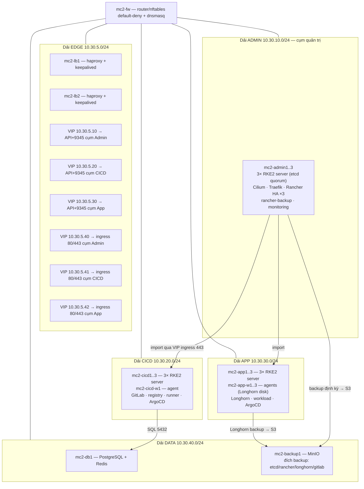

# Lab M2 — Capstone: production-like tầng Kubernetes cho nền tảng ba cụm (HA, DR, security, IaC)

> **Điều kiện tiên quyết:** hoàn thành [Lab M1](LAB-M1-BA-CUM-RKE2-RANCHER-GITLAB.md). M2
> không dạy lại cách cài từng thành phần — nó **production hóa** kiến trúc M1 theo đúng 10
> hạng mục capstone trong bản nhận xét, cộng một hạng mục CI validation cho IaC.
>
> **Định vị — đọc kỹ trước khi bắt đầu:** M2 là **capstone assignment**, không phải runbook
> chạy nguyên văn 100% như M1. Tài liệu cung cấp các artifact chịu lực (template, config
> hoàn chỉnh cho phần khó, gate); việc ráp chúng thành repo IaC chạy được là **phần bài
> làm** của người học, và §13 chấm bằng gate chứ không bằng việc đã đọc hết tài liệu.
>
> **Điểm bắt đầu:** hạ tầng mới (thuê hoặc host lớn, xem §2) — không nâng cấp tại chỗ từ VM
> của M1; M1 giữ nguyên làm môi trường đối chiếu.
> **Điểm kết thúc:** nền tảng 3 cụm HA sống sót các bài diễn tập mất node, mất control plane,
> mất nguyên cụm quản trị; backup được chứng minh bằng restore; nâng cấp được chứng minh kèm
> đường lui. Ngày đối chiếu phiên bản: **17/08/2026** — dùng chung
> [bảng version M1 §2.1](LAB-M1-BA-CUM-RKE2-RANCHER-GITLAB.md#21-phiên-bản-được-khóa), các
> khác biệt ghi ngay tại bước dùng.

---

## 1. Kiến trúc đích và khác biệt so với M1



Delta so với M1 — mỗi dòng là một gap trong bản nhận xét:

| # | M1 (homelab) | M2 (capstone) | Mục |
| --- | --- | --- | --- |
| 1 | 1 server/cụm | 3 server/cụm, etcd quorum thật | §6 |
| 2 | Rancher `replicas=1` | Rancher HA 3 replica sau VIP | §7 |
| 3 | Import 2 cụm, chưa thử phá | Import + diễn tập agent reconnect, mất cụm quản trị | §7, §11 |
| 4 | Firewall 1 rule (DATA) | Default-deny liên dải + ma trận cổng tường minh | §3 |
| 5 | CNI mặc định, không policy | Cilium + NetworkPolicy default-deny, verify allow/deny | §6, §8 |
| 6 | Monitoring tùy chọn, không alert | Monitoring mọi cụm + Alertmanager bắn alert thật | §9 |
| 7 | Không backup | etcd schedule + rancher-backup + Longhorn backup → MinIO, **restore thật** | §10 |
| 8 | Không diễn tập | 4 kịch bản DR có PASS | §11 |
| 9 | Không nâng cấp | Nâng cấp tuần tự Rancher → RKE2 + đường lui | §12 |
| 10 | Cài tay từng bước | Ansible idempotent + vault + CI validation | §4 |

### Sổ SPOF — nói thẳng những gì M2 KHÔNG làm HA

M2 là "production-like **ở tầng Kubernetes**", không phải production HA end-to-end. Các
single point of failure còn lại được liệt kê tường minh; mỗi dòng phải có quyết định trong
hồ sơ capstone (chấp nhận, hay xử lý theo hướng gợi ý):

| SPOF | Ảnh hưởng khi chết | Hướng xử lý nếu cần thật |
| --- | --- | --- |
| `mc2-fw` (router/DNS/firewall) | mất DNS và định tuyến liên dải | cặp router + VRRP, DNS secondary |
| `mc2-db1` (PostgreSQL + Redis) | GitLab ngừng hoạt động | Patroni cho PG, Redis Sentinel |
| Gitaly 1 replica trong chart | repo git ngừng đọc/ghi | Gitaly Cluster (Praefect) |
| `mc2-backup1` (MinIO) | mất **đích backup**, không mất dữ liệu đang chạy | `mc mirror` sang site thứ hai |
| Hypervisor đơn (phương án A §2) | mất toàn bộ lab | phương án B (3 node) — và backup phải nằm **ngoài** host này thì DR mới có nghĩa |
| GitLab web 2 replica | chỉ là redundancy tầng web, **không phải GitLab HA** | reference architecture Cloud Native Hybrid của GitLab |

## 2. Hạ tầng: vì sao phải thuê, và thuê gì

Tổng tài nguyên VM của M2:

| Nhóm | Số VM | vCPU/VM | RAM/VM | Disk/VM |
| --- | --- | --- | --- | --- |
| `mc2-fw` | 1 | 1 | 1 GB | 20 GB |
| `mc2-lb1..2` | 2 | 1 | 1 GB | 20 GB |
| `mc2-admin1..3` | 3 | 4 | 8 GB | 60 GB |
| `mc2-cicd1..3` + `w1` | 4 | 4 | 8 GB | 60–80 GB |
| `mc2-app1..3` + `w1..3` | 6 | 4 | 8 GB | 60 GB; riêng `w1..3` thêm 40 GB (Longhorn) |
| `mc2-db1`, `mc2-backup1` | 2 | 2 | 4 GB | 40 / 300 GB |
| **Tổng** | **18** | **~56** | **~115 GB** | **~1.3 TB** |

Ba agent `w1..3` mang disk Longhorn để chạy đúng khuyến nghị **3 replica khi có từ 3 storage
node** của Longhorn — M1 chỉ có 2 node nên phải hạ xuống 2.

Một máy Windows host thông thường (32–64 GB) không chứa nổi. Host **≥ 160 GB RAM** mới chạy
local thoải mái theo đúng mô hình VMware của M1 (thêm VMnet cho dải EDGE). Còn lại, chọn một
trong ba phương án thuê:

| Phương án | Cấu hình gợi ý | Ưu / nhược | Chi phí tham khảo |
| --- | --- | --- | --- |
| **A — 1 dedicated server chạy Proxmox VE** (khuyến nghị) | 16–24 core / **192 GB RAM** (128 GB chạy được nhưng sát trần — phải tắt bớt VM ngoài phase đang làm) / 2×1 TB NVMe. Ví dụ: Hetzner AX102/AX162, OVHcloud Advance; tại VN: server riêng Viettel IDC / FPT / VNG | Giữ nguyên thiết kế mạng ảo, snapshot được, một hóa đơn. Nhược: hypervisor là SPOF (đã ghi ở sổ SPOF §1) | ~100–200 EUR/tháng hoặc tương đương |
| B — 3 node nhỏ Proxmox cluster | 3× (8 core / 64 GB / 1 TB) | Học thêm HA tầng hypervisor, chống SPOF vật lý thật | cao hơn A |
| C — 14–17 cloud VPS + VPC | mỗi node K8s 1 VPS 4 vCPU/8 GB, private network | Nhanh, không quản hypervisor. **Nhược quan trọng:** đa số cloud chặn VRRP → keepalived VIP không chạy; phải thay VIP bằng floating IP / LB của nhà cung cấp và ghi lại khác biệt | tính theo giờ, đắt nếu treo lâu |

Ánh xạ khi dùng Proxmox (phương án A/B): mỗi VMnet của thiết kế = một Linux bridge không gắn
NIC vật lý (`vmbr10`, `vmbr20`, …); `mc2-fw` giữ nguyên vai trò router giữa các bridge —
toàn bộ §3 trở đi **không đổi lệnh nào**. Cách tạo VM Ubuntu, clone, gỡ trùng identity theo đúng
quy trình golden-clone chi tiết ở
[M1 §3.2](LAB-M1-BA-CUM-RKE2-RANCHER-GITLAB.md#32-dựng-vm-gốc-ubuntu-2404-và-nhân-bản-6-vm),
chỉ thay thao tác GUI VMware bằng thao tác Proxmox tương ứng (clone from template, resize
disk, gán bridge).

**PASS §2:** đủ **18 VM** ping được gateway dải mình, `mc2-fw` có Internet egress.

## 3. Mạng: ma trận firewall default-deny và DNS

Khác M1 (policy accept, chặn mỗi DATA), M2 chuyển `forward` sang **default drop** — mọi luồng
liên dải phải có mặt trong ma trận:

| Từ | Tới | Cổng | Lý do |
| --- | --- | --- | --- |
| mọi dải | `mc2-fw` | 53/udp,tcp | DNS |
| mọi dải | Internet | 80, 443 | kéo image, chart, package |
| EDGE (LB) | ADMIN, CICD, APP | 6443, 9345, 80, 443 | LB đẩy về backend |
| ADMIN | EDGE (VIP `.10`) | 6443, 9345 | node admin join/API qua registration address — **thiếu dòng này thì server 2/3 không join được** |
| CICD | EDGE (VIP `.20`) | 6443, 9345 | node cicd join/API |
| APP | EDGE (VIP `.30`) | 6443, 9345 | node app join/API |
| CICD, APP | EDGE (VIP `.40`, `.41`) | 443 | cattle-agent về Rancher (`.40`); ArgoCD/runner gọi GitLab/registry (`.41`) |
| CICD | DATA (`mc2-db1`) | 5432, 6379 | GitLab → PostgreSQL / Redis |
| ADMIN, APP, CICD | DATA (`mc2-backup1`) | 9000 | đẩy backup vào MinIO |
| ADMIN | EDGE (VIP `.20`, `.30`) | 6443 | kubectl/Rancher gọi API downstream **qua VIP** — đích là EDGE, không phải subnet CICD/APP (agent tunnel vẫn là outbound) |
| ADMIN | EDGE (VIP `.40`, `.41`) | 443 | Alertmanager cụm Admin → alert-sink (`.40`); ArgoCD cụm Admin → GitLab (`.41`) |

Quy ước IP dùng xuyên suốt (đây là bảng tra khi đọc mọi config): octet cuối của server là
`.11/.12/.13`, của agent là `.21/.22/.23` trong dải cụm mình; `mc2-lb1/lb2` = `10.30.5.11/.12`;
`mc2-db1` = `10.30.40.11`; `mc2-backup1` = `10.30.40.12`. `mc2-fw` kiêm **bastion và máy chạy
Ansible**: nó có chân trong mọi dải nên SSH tới 18 VM không cần rule forward nào; SSH từ ngoài
vào chỉ được phép tới chính `mc2-fw` (biến `$ADMIN_SRC`).

Ruleset đầy đủ cho `mc2-fw` (qua role `fw`; tên interface pin theo môi trường thật):

```text
#!/usr/sbin/nft -f
flush ruleset

define IF_WAN    = "ens33"
define ADMIN_SRC = <IP/dải máy quản trị SSH vào fw>
define NET_ADMIN = 10.30.10.0/24
define NET_CICD  = 10.30.20.0/24
define NET_APP   = 10.30.30.0/24
define NET_ALL   = { 10.30.5.0/24, 10.30.10.0/24, 10.30.20.0/24, 10.30.30.0/24, 10.30.40.0/24 }

table inet filter {
  chain input {
    type filter hook input priority 0; policy drop;
    iif lo accept
    ct state established,related accept
    ip saddr $NET_ALL udp dport 53 accept
    ip saddr $NET_ALL tcp dport 53 accept
    ip saddr $ADMIN_SRC tcp dport 22 accept          # bastion
    icmp type echo-request accept
  }
  chain forward {
    type filter hook forward priority 0; policy drop;
    ct state established,related accept
    ct state invalid drop
    # Internet egress cho mọi dải nội bộ (HTTP/HTTPS + NTP)
    oifname $IF_WAN ip saddr $NET_ALL tcp dport { 80, 443 } accept
    oifname $IF_WAN ip saddr $NET_ALL udp dport 123 accept
    # LB đẩy về backend ba cụm
    ip saddr 10.30.5.0/24 ip daddr { $NET_ADMIN, $NET_CICD, $NET_APP } \
      tcp dport { 6443, 9345, 80, 443 } accept
    # Node → VIP đăng ký/API của CỤM MÌNH (thiếu là server 2/3 không join)
    ip saddr $NET_ADMIN ip daddr 10.30.5.10 tcp dport { 6443, 9345 } accept
    ip saddr $NET_CICD  ip daddr 10.30.5.20 tcp dport { 6443, 9345 } accept
    ip saddr $NET_APP   ip daddr 10.30.5.30 tcp dport { 6443, 9345 } accept
    # Agent/ArgoCD/runner/Alertmanager → các VIP ingress
    ip saddr { $NET_ADMIN, $NET_CICD, $NET_APP } \
      ip daddr { 10.30.5.40, 10.30.5.41 } tcp dport 443 accept
    # Quản trị từ ADMIN tới API downstream qua VIP
    ip saddr $NET_ADMIN ip daddr { 10.30.5.20, 10.30.5.30 } tcp dport 6443 accept
    # GitLab → PostgreSQL/Redis; ba cụm → MinIO
    ip saddr $NET_CICD ip daddr 10.30.40.11 tcp dport { 5432, 6379 } accept
    ip saddr { $NET_ADMIN, $NET_CICD, $NET_APP } ip daddr 10.30.40.12 tcp dport 9000 accept
    # Mọi thứ khác: ghi log rồi drop — log chính là công cụ debug ma trận
    log prefix "fw-drop " counter drop
  }
}
table ip nat {
  chain postrouting {
    type nat hook postrouting priority 100;
    oifname $IF_WAN masquerade
  }
}
```

Trong drill §11 cần "cắt mạng tạm", thêm/xóa rule bằng `nft insert rule` / `nft delete rule`
(có handle từ `nft -a list ruleset`) thay vì sửa file — reboot là ruleset sạch trở lại.
Gate ruleset chạy **sau một lần reboot `mc2-fw`** để chứng minh cấu hình bền. DNS zone đổi thành `mc2.lab`; hostname dịch vụ trỏ về **VIP ingress của đúng cụm chứa nó**:
`rancher.mc2.lab`, `alert-sink.mc2.lab` → `.40`; `gitlab.mc2.lab`, `registry.mc2.lab` →
`.41`; `app.mc2.lab` → `.42`. Ba VIP registration trỏ theo bảng §1. Không gộp ba cụm sau một
VIP ingress chung: LB đang chạy mode TCP, không đọc Host header/SNI — gộp chung thì request
sẽ luân phiên rơi vào sai cụm.

Gate — chứng minh default-deny bằng cặp allow/deny (nguyên tắc lấy từ
[bài học Flannel/NetworkPolicy của phase 2](../runbook-k8s-vmware-phase2.md#153-lưu-ý-networkpolicy-với-flannel-phase-1):
không có test thì policy chỉ là cảm giác an toàn):

```bash
# Từ mc2-cicd1:
nc -vzw3 10.30.40.11 5432; echo "exit=$?"     # PASS: 0 — luồng có trong ma trận
# Từ mc2-app1:
nc -vzw3 10.30.40.11 5432; echo "exit=$?"     # PASS: khác 0 — luồng ngoài ma trận bị drop
# Từ mc2-app1:
nc -vzw3 10.30.10.11 22;   echo "exit=$?"     # PASS: khác 0 — SSH liên dải không mở
# Từ mc2-cicd2 (đường join của chính RKE2 — phải mở TRƯỚC khi dựng cụm ở §6):
nc -vzw3 10.30.5.20 9345;  echo "exit=$?"     # PASS: 0
nc -vzw3 10.30.5.20 6443;  echo "exit=$?"     # PASS: 0
```

## 4. IaC: Ansible + vault + CI validation

Từ M2 trở đi **cấm cài tay ở tầng OS/RKE2/LB**: mọi thứ từ §5–§6 phải ra từ playbook. Repo
`platform/capstone-iac` trên GitLab (của M1 hoặc gitlab.com), cấu trúc:

```text
capstone-iac/
├── ansible.cfg
├── inventories/prod/
│   ├── hosts.yml                 # 18 VM chia group: fw, lb, admin_servers, cicd_servers,
│   │                             # app_servers, app_agents, cicd_agents, db, backup
│   └── group_vars/
│       ├── all.yml               # dns domain, version pin RKE2/chart, CIDR các dải
│       ├── all_vault.yml         # token RKE2 từng cụm, mật khẩu DB… (ansible-vault)
│       ├── admin_servers.yml     # vip: 10.30.5.10, cluster_name: admin
│       ├── cicd_servers.yml      # vip: 10.30.5.20 …
│       └── app_servers.yml       # vip: 10.30.5.30 …
├── roles/
│   ├── common/                   # swap, NTP, CA trust, sysctl — tái dùng bài học Lab 00
│   ├── lb/                       # haproxy + keepalived template theo biến vip
│   ├── rke2_server/              # config.yaml.j2 + install idempotent
│   ├── rke2_agent/
│   └── longhorn_node/            # open-iscsi, disk, multipath blacklist (M1 §5.2)
├── playbooks/site.yml            # import_playbook theo đúng thứ tự: fw → lb → cụm
└── .gitlab-ci.yml                # validate trước khi được phép chạy
```

Hai điểm bắt buộc, rút thẳng từ mục "anti-pattern" của
[ANSIBLE-ZERO-TO-HERO §19](../ANSIBLE-ZERO-TO-HERO.md#19-các-anti-pattern-trong-code-dự-án-học-từ-lỗi):
**không `ignore_errors`**, **không hardcode** IP/user trong task — tất cả vào `group_vars`.
Task cài RKE2 phải idempotent thật:

```yaml
# roles/rke2_server/tasks/main.yaml (trích)
- name: Render RKE2 config
  ansible.builtin.template:
    src: config.yaml.j2
    dest: /etc/rancher/rke2/config.yaml
    mode: "0600"
  notify: restart rke2-server

# KHÔNG dùng `creates: /usr/local/bin/rke2` làm guard: nó chặn cài lại nhưng cũng chặn
# luôn nâng cấp khi đổi rke2_version. Guard đúng là so sánh version cài với version mong
# muốn — task chỉ chạy (và chỉ báo changed) khi hai giá trị lệch nhau:
- name: Check installed RKE2 version
  ansible.builtin.command: /usr/local/bin/rke2 --version
  register: rke2_installed
  changed_when: false
  failed_when: false

- name: Install or upgrade RKE2 server
  ansible.builtin.shell:
    cmd: >
      curl -sfL https://get.rke2.io |
      INSTALL_RKE2_VERSION={{ rke2_version }} INSTALL_RKE2_TYPE=server sh -
  when: rke2_version not in (rke2_installed.stdout | default(''))
  notify: restart rke2-server

- name: Enable rke2-server
  ansible.builtin.systemd:
    name: rke2-server
    enabled: true
    state: started
```

```yaml
# roles/rke2_server/handlers/main.yaml
- name: restart rke2-server
  ansible.builtin.systemd:
    name: rke2-server
    state: restarted
```

```jinja
{# roles/rke2_server/templates/config.yaml.j2 #}
token: "{{ vault_rke2_token }}"

server: https://{{ vip }}:9345

tls-san:
  - "{{ vip }}"
  - "{{ inventory_hostname }}.mc2.lab"
ingress-controller: traefik
cni: cilium
etcd-snapshot-schedule-cron: "{{ etcd_snapshot_cron }}"
etcd-snapshot-retention: {{ etcd_snapshot_retention }}
```

```yaml
# playbooks/site.yml — thứ tự là một phần của thiết kế, không phải tiện tay
- import_playbook: fw.yml          # mạng/DNS/firewall trước tất cả
- import_playbook: lb.yml          # VIP phải sống trước khi node đầu tiên đăng ký
- import_playbook: cluster-admin.yml
- import_playbook: cluster-cicd.yml
- import_playbook: cluster-app.yml
# Trong mỗi cluster-*.yml: play cho group server chạy `serial: 1` — server 2 chỉ join khi
# server 1 Ready; play cho agent chạy sau cùng.
```

`tls-san` gồm VIP + hostname từng node. Secrets:

```bash
ansible-vault create inventories/prod/group_vars/all_vault.yml
# vault_rke2_token_admin, vault_rke2_token_cicd, vault_rke2_token_app, vault_db_password…
```

`.gitlab-ci.yml` — hạng mục CI validation (điểm bản nhận xét thiếu, bổ sung tại đây):

```yaml
stages: [validate]
ansible-validate:
  stage: validate
  image: python:3.12-slim
  script:
    - pip install -r requirements.txt   # pin ansible + ansible-lint trong file, chốt ở lần
                                        # chạy đầu và commit — kết quả lint không được trôi
    - ansible-lint
    - echo "$ANSIBLE_VAULT_PASSWORD" > .vault-pass   # CI/CD variable dạng masked
    - ansible-playbook playbooks/site.yml -i inventories/prod/hosts.yml
      --vault-password-file .vault-pass --syntax-check
    - rm -f .vault-pass
    - "! git grep -nE 'ignore_errors: (yes|true)' -- roles playbooks"   # chặn anti-pattern
```

**Phạm vi IaC không dừng ở tầng OS/LB/RKE2.** Tầng add-on cũng phải nằm trong git, nếu
không thì capstone "viết toàn bộ bằng IaC" chỉ đúng một nửa:

- Mọi Helm values (Rancher, cert-manager, Longhorn, GitLab, runner, monitoring) và mọi
  manifest (NetworkPolicy, quota, backup CR, AlertmanagerConfig) commit vào thư mục
  `capstone-iac/deploy/`, apply qua **Argo CD của từng cụm** — UI của Rancher/GitLab chỉ dùng
  để đối chiếu, không dùng để tạo.
- **Bootstrap GitOps** (giải bài toán "ai apply ArgoCD trước khi có ArgoCD"): ArgoCD của
  từng cụm do **Ansible** cài — role `argocd_bootstrap` apply manifest pin `v3.5.1` và tạo
  repo credential. Thứ tự cố định: Ansible dựng cụm → Ansible cài ArgoCD + Secrets → ArgoCD
  sync toàn bộ phần còn lại từ `deploy/`.
- **Secrets không vào git:** mọi credential (MinIO, DB, Redis, runner, repo, registry) nằm
  trong vault; Ansible render thành Kubernetes Secret (module `kubernetes.core.k8s`)
  **trước** khi ArgoCD sync; manifest trong `deploy/` chỉ tham chiếu tên Secret. Mật khẩu
  vault phải được escrow **ngoài** hạ tầng này — mất vault password sau DR là mất toàn bộ
  secret, ghi vào hồ sơ nơi giữ.
- Hai ngoại lệ được phép thao tác UI và phải ghi vào hồ sơ: bootstrap Rancher lần đầu
  (§7) và tạo Project/User của Rancher (§8) — muốn IaC hóa nốt phần này thì dùng Rancher
  Terraform provider, ghi nhận là phần mở rộng.

**PASS §4:** (1) pipeline validate xanh; (2) `ansible-playbook site.yml` chạy lần thứ hai
kết thúc với `changed=0` trên mọi host — idempotency được chứng minh, không phải tuyên bố;
(3) gate chiều nâng cấp kiểm bằng **canary thật**, không bằng `--check`: task `shell` bị
skip trong check mode nên `--check --diff` không dự báo được install/restart. Đổi
`rke2_version` rồi chạy `ansible-playbook ... --limit mc2-cicd-w1`; PASS khi node canary lên
đúng version mới và chạy lại lần nữa cho `changed=0`.

## 5. Load balancer: haproxy + keepalived

Trên `mc2-lb1`/`mc2-lb2` (qua role `lb`). haproxy mode TCP — với **mỗi cụm** hai nhóm
frontend/backend: VIP API (6443 + 9345 → 3 server của cụm đó) và VIP ingress riêng
(80/443 → **toàn bộ node của đúng cụm đó**, Traefik chạy hostPort mọi node như M1). Mode TCP
không đọc Host header hay SNI, nên mỗi cụm bắt buộc một VIP ingress riêng — muốn gộp một VIP
cho cả ba cụm thì phải chuyển sang SNI inspection/HTTP routing, ngoài phạm vi lab này:

```text
# /etc/haproxy/haproxy.cfg (trích — cụm Admin; lặp mẫu cho CICD/App/ingress)
frontend admin_api
    bind 10.30.5.10:6443
    mode tcp
    default_backend admin_api_be
backend admin_api_be
    mode tcp
    option tcp-check
    server admin1 10.30.10.11:6443 check
    server admin2 10.30.10.12:6443 check
    server admin3 10.30.10.13:6443 check
frontend admin_reg
    bind 10.30.5.10:9345
    mode tcp
    default_backend admin_reg_be
backend admin_reg_be
    mode tcp
    server admin1 10.30.10.11:9345 check
    server admin2 10.30.10.12:9345 check
    server admin3 10.30.10.13:9345 check
```

Mẫu tương ứng cho VIP ingress (lặp cho từng cụm, đổi VIP và danh sách node):

```text
frontend admin_ingress_https
    bind 10.30.5.40:443
    mode tcp
    default_backend admin_ingress_https_be
backend admin_ingress_https_be
    mode tcp
    balance roundrobin
    server admin1 10.30.10.11:443 check
    server admin2 10.30.10.12:443 check
    server admin3 10.30.10.13:443 check
# frontend/backend :80 tương tự; cụm CICD dùng 10.30.5.41 → node 10.30.20.x,
# cụm App dùng 10.30.5.42 → node 10.30.30.x (gồm cả agents).
```

keepalived — cấu hình đầy đủ (đổi `state`/`priority` giữa hai LB; unicast để không phụ
thuộc multicast của môi trường ảo hóa):

```text
# /etc/keepalived/keepalived.conf — trên mc2-lb1 (lb2: state BACKUP, priority 100,
# unicast_src_ip/unicast_peer đảo lại)
vrrp_script chk_haproxy {
    script "/usr/bin/pgrep -x haproxy"
    interval 2
    fall 2
    rise 2
}
vrrp_instance VI_EDGE {
    state MASTER
    interface ens34                   # NIC dải EDGE — pin theo môi trường
    virtual_router_id 51
    priority 150
    advert_int 1
    unicast_src_ip 10.30.5.11         # IP chính của lb1
    unicast_peer { 10.30.5.12 }       # IP chính của lb2
    authentication {
        auth_type PASS
        auth_pass "{{ vault_vrrp_pass }}"
    }
    virtual_ipaddress {
        10.30.5.10/32
        10.30.5.20/32
        10.30.5.30/32
        10.30.5.40/32
        10.30.5.41/32
        10.30.5.42/32
    }
    track_script { chk_haproxy }
}
```

HAProxy trên node BACKUP phải bind được vào VIP chưa sở hữu — bắt buộc sysctl này trên **cả
hai LB** (thiếu nó haproxy trên lb2 không start):

```bash
echo 'net.ipv4.ip_nonlocal_bind=1' | sudo tee /etc/sysctl.d/99-haproxy-vip.conf
sudo sysctl --system | grep nonlocal_bind      # PASS: = 1
sudo haproxy -c -f /etc/haproxy/haproxy.cfg    # PASS: Configuration file is valid
sudo systemctl enable --now haproxy keepalived
```

```bash
# Gate LB — đếm ĐÚNG 6 VIP, không đếm IP chính của NIC:
for vip in 10 20 30 40 41 42; do
  ip -4 addr show | grep -q "inet 10.30.5.$vip/32" && echo "VIP .$vip"
done | wc -l
# trên lb1 PASS: 6; trên lb2 PASS: 0
sudo systemctl stop keepalived         # trên lb1 — diễn tập failover LB
# trên lb2 chạy lại vòng for đếm VIP ở trên: PASS: 6 — VIP trôi sang trong vài giây;
# kèm probe xuyên failover: curl -k https://10.30.5.40 vẫn trả lời
sudo systemctl start keepalived        # trả lại
```

## 6. Ba cụm RKE2 HA với Cilium

Chạy playbook theo thứ tự trong `site.yml`; điểm kỹ thuật của config (so với M1):

```yaml
# config.yaml.j2 — server đầu tiên mỗi cụm
token: "{{ vault_rke2_token }}"
tls-san:
  - "{{ vip }}"
  - "{{ inventory_hostname }}.mc2.lab"
ingress-controller: traefik
cni: cilium                    # thay CNI mặc định để NetworkPolicy được enforce thật
# server thứ 2, 3 và agent thêm:
# server: https://{{ vip }}:9345
```

Server 2/3 của mỗi cụm chỉ start **sau khi** server 1 Ready (serial trong playbook). Gates
cho từng cụm, chạy trên server 1:

```bash
kubectl get nodes
# PASS: đủ node Ready — admin 3, cicd 4, app 6 (3 server + 3 agent)
kubectl -n kube-system exec ds/cilium -- cilium status --brief    # PASS: OK
sudo /var/lib/rancher/rke2/bin/kubectl get pods -n kube-system | grep -c etcd-mc2   # PASS: 3
# Quorum thật — tắt tạm server 3:
#   sudo systemctl stop rke2-server   (trên server 3)
kubectl get nodes        # từ server 1, PASS: API vẫn trả lời, node 3 NotReady
#   bật lại và chờ Ready trước khi đi tiếp
```

Kubeconfig quản trị từ ngoài: sửa `server:` trong `/etc/rancher/rke2/rke2.yaml` thành
`https://<VIP>:6443` — chứng minh client đi qua LB chứ không dính một node.

Traefik của từng cụm ghim qua HelmChartConfig do role render vào
`/var/lib/rancher/rke2/server/manifests/` — nội dung như [M1 §5.1](LAB-M1-BA-CUM-RKE2-RANCHER-GITLAB.md#51-rke2-server-và-agent)
(DaemonSet + hostPort 80/443) nhưng `ingressendpoint.ip` trỏ **VIP ingress của cụm**
(`.40`/`.41`/`.42`) — status của Ingress khi đó công bố đúng endpoint mà người dùng thật đi
qua, không phải IP tình cờ của một node. Gate: `kubectl -n kube-system get pods -o wide -l
app.kubernetes.io/name=traefik` liệt kê đủ **mọi node** của cụm (DaemonSet) — khớp danh sách
backend HAProxy §5, không có node nào bị health check đánh fail vì thiếu Traefik.

Longhorn trên cụm App — mặc định Longhorn tạo disk trên **mọi node mới**, kể cả OS disk của
server; phải giới hạn tường minh vào ba agent có disk riêng:

```bash
# values (trong deploy/, apply qua Argo CD):
#   defaultSettings:
#     createDefaultDiskLabeledNodes: true
#     defaultReplicaCount: 3
#   persistence:
#     defaultClassReplicaCount: 3
# và label đúng ba node storage:
kubectl label node mc2-app-w1 mc2-app-w2 mc2-app-w3 \
  node.longhorn.io/create-default-disk=true
kubectl -n longhorn-system get nodes.longhorn.io \
  -o jsonpath='{range .items[*]}{.metadata.name}{": "}{.spec.disks}{"\n"}{end}'
# PASS: chỉ w1..3 có disk; ba server app KHÔNG có — replica không bao giờ nằm trên OS disk
```

PostgreSQL + Redis trên `mc2-db1` theo
[M1 §6.2](LAB-M1-BA-CUM-RKE2-RANCHER-GITLAB.md#62-postgresql--redis--minio-trên-mc-db1)
(qua role, không cài tay). MinIO trên `mc2-backup1` cài binary server chính thức và **chạy
HTTPS ngay từ đầu** — cấp cert `mc2-backup1.mc2.lab` từ CA lab (xuất cert/key như quy trình
wildcard của M1 §6.3), đặt vào `~minio/.minio/certs/public.crt` + `private.key` rồi start;
gate: `curl --cacert /usr/local/share/ca-certificates/mc2-lab-ca.crt
https://mc2-backup1.mc2.lab:9000/minio/health/live` trả 200. Nhờ đó mọi client S3 (etcd-s3,
rancher-backup, Longhorn, GitLab) dùng một CA thống nhất, không cần cờ insecure nào. User
riêng cho từng nguồn, bucket: `etcd-admin`, `etcd-cicd`, `etcd-app`, `rancher-backup`,
`longhorn`, `gitlab-backup`, `pg-backup`, cộng bộ bucket `gitlab-*` cho object storage của
GitLab (danh sách như M1 §6.2).

## 7. Rancher HA và import hai cụm downstream

Trên cụm Admin — khác M1 ở `replicas=3` và hostname trỏ VIP ingress; cert-manager + CA lab +
wildcard làm như [M1 §4.2](LAB-M1-BA-CUM-RKE2-RANCHER-GITLAB.md#42-helm-cert-manager-và-ca-của-lab)
(CA M2 tạo mới, trust trên 18 VM qua role `common`):

```bash
helm install rancher rancher-stable/rancher \
  --namespace cattle-system --create-namespace --version 2.14.3 \
  --set hostname=rancher.mc2.lab \
  --set replicas=3 \
  --set antiAffinity=required \
  --set bootstrapPassword='<BOOTSTRAP>' \
  --set ingress.ingressClassName=traefik \
  --set ingress.tls.source=secret \
  --set privateCA=true

kubectl -n cattle-system get pods -l app=rancher -o wide
# PASS: 3 pod Running trải trên 3 node admin khác nhau — `antiAffinity=required` ép cứng;
# mặc định của chart là `preferred`, KHÔNG bảo đảm trải đủ 3 node
```

Import `mc2-cicd` và `mc2-app` như [M1 §5.4](LAB-M1-BA-CUM-RKE2-RANCHER-GITLAB.md#54-import-cụm-app-vào-rancher).
Gate bổ sung của capstone — **reconnect**:

```bash
# Trên cụm cicd: giết agent và xem nó tự hồi
kubectl -n cattle-system delete pod -l app=cattle-cluster-agent
kubectl -n cattle-system get pods -w      # PASS: pod mới Running, UI vẫn/quay lại Active
# Kéo đứt đường mạng: trên mc2-fw, tạm drop CICD → VIP ingress 443 trong 3 phút rồi gỡ rule
# PASS: UI báo Unavailable trong lúc đứt, tự về Active sau khi gỡ — không cần re-import
```

GitLab + runner + ArgoCD ba cụm: lặp M1 §6–§7 với host `*.mc2.lab` và ba dependency ngoài
trỏ chỗ mới — PostgreSQL + Redis trên `mc2-db1`, object storage là MinIO trên `mc2-backup1`
(bộ bucket `gitlab-*`, tách khỏi các bucket backup; endpoint **HTTPS** — đưa CA lab vào các
pod Rails/registry/toolbox bằng `global.certificates.customCAs`). `webservice.minReplicas=2` chỉ là
redundancy **tầng web**; GitLab HA đầy đủ (Praefect, Redis Sentinel, PostgreSQL HA) nằm
ngoài phạm vi và đã ghi ở sổ SPOF §1. Không chép lại các bước — M1 là tài liệu tham chiếu
của phần này, values commit vào `capstone-iac/deploy/` theo quy tắc §4.

## 8. Security: Projects, RBAC tenant, quota, PSA, NetworkPolicy

Làm trên cụm `mc2-app` qua Rancher, mô phỏng một tenant `team-a`:

1. **Project** `team-a` (Rancher UI → Cluster → Projects/Namespaces → Create Project) với
   **Project Resource Quota**: CPU limit 4, memory limit 8Gi; namespace default quota bằng nửa.
2. **User + RBAC:** tạo user `dev-a` (Users & Authentication), gán **Project Member** của
   `team-a`, không gán quyền cluster.
3. **PSA:** PSA configuration template của Rancher gán ở cấp **cluster**, không phải
   project. Muốn chỉ áp `restricted` cho tenant này, dùng chuẩn Kubernetes — label thẳng
   namespace:

   ```bash
   kubectl label ns team-a-web \
     pod-security.kubernetes.io/enforce=restricted \
     pod-security.kubernetes.io/enforce-version=latest
   ```
4. Namespace `team-a-web` tạo **trong** project; **NetworkPolicy default-deny** + mở đúng luồng:

```yaml
apiVersion: networking.k8s.io/v1
kind: NetworkPolicy
metadata: {name: default-deny, namespace: team-a-web}
spec:
  podSelector: {}
  policyTypes: [Ingress, Egress]
---
apiVersion: networking.k8s.io/v1
kind: NetworkPolicy
metadata: {name: allow-ingress-and-dns, namespace: team-a-web}
spec:
  podSelector: {}
  policyTypes: [Ingress, Egress]
  ingress:
  - from:
    - namespaceSelector:
        matchLabels: {kubernetes.io/metadata.name: kube-system}   # Traefik
    ports: [{port: 80}]
  egress:
  - to:
    - namespaceSelector:
        matchLabels: {kubernetes.io/metadata.name: kube-system}
    ports: [{port: 53, protocol: UDP}, {port: 53, protocol: TCP}]
```

Gates — mỗi kiểm soát phải có một phép thử âm tính:

```bash
# RBAC: bằng kubeconfig của dev-a
kubectl auth can-i create deployment -n team-a-web     # PASS: yes
kubectl auth can-i get nodes                           # PASS: no
# Quota: tạo deployment xin vượt 8Gi → PASS: bị từ chối, kubectl describe quota nêu lý do
# PSA: pod privileged trong team-a-web → PASS: bị admission từ chối kèm thông báo restricted
# NetworkPolicy (Cilium enforce): từ pod ở namespace KHÁC
kubectl -n default run np-test --rm -it --image=busybox:1.37 --restart=Never -- \
  wget -qO- --timeout=3 http://<pod-ip-team-a-web>     # PASS: timeout — deny thật
# và từ Traefik (kube-system) request qua Ingress vẫn 200 — allow thật
```

## 9. Observability: monitoring mọi cụm + alert bắn thật

1. Cài **Monitoring** (rancher-monitoring) trên cả ba cụm — values trong
   `capstone-iac/deploy/`, apply qua Argo CD theo quy tắc §4; Rancher UI chỉ để đối chiếu.
2. Trên cụm Admin, deploy receiver tối giản và **expose qua Ingress** — Alertmanager của cụm
   App/CICD không resolve được Service DNS của cụm Admin (`sink.alert-sink.svc` chỉ có nghĩa
   nội cụm), nên endpoint liên cụm phải là hostname đi qua VIP ingress:

```bash
kubectl create ns alert-sink
kubectl -n alert-sink create deployment sink --image=mendhak/http-https-echo:37 --port=8080
kubectl -n alert-sink expose deployment sink --port=80 --target-port=8080
kubectl -n alert-sink apply -f - <<'EOF'
apiVersion: networking.k8s.io/v1
kind: Ingress
metadata:
  name: alert-sink
  annotations:
    traefik.ingress.kubernetes.io/router.entrypoints: websecure
    traefik.ingress.kubernetes.io/router.tls: "true"
spec:
  ingressClassName: traefik
  tls: [{hosts: [alert-sink.mc2.lab], secretName: mc2-lab-wildcard-tls}]
  rules:
  - host: alert-sink.mc2.lab
    http:
      paths:
      - {path: /, pathType: Prefix, backend: {service: {name: sink, port: {number: 80}}}}
EOF
# DNS đã trỏ alert-sink.mc2.lab → VIP .40 ở §3, ma trận firewall đã mở ADMIN/APP/CICD → .40:443.
# Kiểm từ một node cụm App:
curl -s --cacert /usr/local/share/ca-certificates/mc2-lab-ca.crt \
  https://alert-sink.mc2.lab/health >/dev/null && echo reachable   # PASS
```

3. Trên **từng cụm**, tạo `AlertmanagerConfig` (manifest trong git, apply qua Argo CD của
   cụm đó):

```yaml
apiVersion: monitoring.coreos.com/v1alpha1
kind: AlertmanagerConfig
metadata:
  name: node-alerts-to-sink
  namespace: cattle-monitoring-system
spec:
  route:
    receiver: alert-sink
    matchers:
    - {name: alertname, matchType: =~, value: "KubeNodeNotReady|TargetDown"}
  receivers:
  - name: alert-sink
    webhookConfigs:
    - url: https://alert-sink.mc2.lab/alert
      sendResolved: true
```

```bash
kubectl -n cattle-monitoring-system get alertmanagerconfig node-alerts-to-sink   # PASS: tồn tại
# Xác nhận Alertmanager THẬT SỰ nhặt config này (điểm hay bị bỏ qua):
kubectl -n cattle-monitoring-system get alertmanager -o yaml | grep -A3 alertmanagerConfig
# Nếu selector là nil/không khớp → set qua values của rancher-monitoring
# (alertmanager.alertmanagerSpec.alertmanagerConfigSelector) rồi sync lại; gate cuối:
kubectl -n cattle-monitoring-system get secret \
  -o name | grep generated | head -1 | xargs -I{} kubectl -n cattle-monitoring-system \
  get {} -o jsonpath='{.data.alertmanager\.yaml\.gz}' | base64 -d | zcat | grep -c alert-sink
# PASS: >= 1 — receiver đã vào config sinh ra của Alertmanager
```
4. Diễn tập — **không dùng `kubectl drain`** cho bài này: drain là thao tác chủ động, node
   vẫn `Ready`, kubelet và node-exporter vẫn chạy nên `KubeNodeNotReady`/`TargetDown` không
   chắc Firing. Giả lập chết thật bằng cách dừng kubelet:

```bash
# Trên mc2-app-w2:
sudo systemctl stop rke2-agent
# Chờ node chuyển NotReady (kubectl get nodes -w từ mc2-app1), rồi chờ Alertmanager
# hết group_wait và bắn webhook:
kubectl -n alert-sink logs deploy/sink | grep -c KubeNodeNotReady   # PASS: >= 1
# Khôi phục:
sudo systemctl start rke2-agent      # node tự Ready lại
```

**PASS §9:** ba cụm đều có Prometheus targets Up; alert `KubeNodeNotReady` thật đã ghi vào
sink trong diễn tập, kèm timestamp để đối chiếu RTO ở §11.

Gate capacity tối thiểu — chạy sau khi đủ stack, **ghi số vào hồ sơ**; sizing §2 chỉ được
coi là kiểm chứng khi có các số này:

```bash
kubectl top nodes        # từng cụm — PASS: MEMORY% < 80 trên mọi node ở trạng thái nghỉ
# Độ trễ fsync etcd (Prometheus UI của rancher-monitoring, từng cụm):
#   histogram_quantile(0.99, rate(etcd_disk_wal_fsync_duration_seconds_bucket[5m]))
#   PASS: p99 < 25ms — vượt ngưỡng là disk hypervisor không đủ cho etcd
# Thời gian rebuild replica Longhorn: đo trong drill §11.2, ghi số phút vào hồ sơ
```
(Logging tập trung — rancher-logging → Loki — là phần mở rộng tùy chọn, làm khi còn tài
nguyên; ghi hồ sơ nếu bỏ qua.)

## 10. Backup: ba tầng, chứng minh bằng restore

### 10.1. etcd snapshot của từng cụm RKE2

RKE2 có sẵn snapshot định kỳ **và upload thẳng S3** — snapshot chỉ nằm trên disk server thì
không bảo vệ được kịch bản mất nguyên cụm/hypervisor. Ghim cấu hình qua IaC vào
`config.yaml` của server (bucket `etcd-<tên cụm>` theo §6):

```yaml
etcd-snapshot-schedule-cron: "0 */6 * * *"
etcd-snapshot-retention: 10
etcd-s3: true
etcd-s3-endpoint: mc2-backup1.mc2.lab:9000
etcd-s3-endpoint-ca: /usr/local/share/ca-certificates/mc2-lab-ca.crt   # MinIO HTTPS (§6)
etcd-s3-bucket: etcd-admin        # đổi theo cụm: etcd-cicd / etcd-app
etcd-s3-access-key: "{{ vault_minio_etcd_access }}"
etcd-s3-secret-key: "{{ vault_minio_etcd_secret }}"
```

```bash
sudo rke2 etcd-snapshot save --name drill-$(date +%F)      # snapshot thủ công trước diễn tập
sudo rke2 etcd-snapshot ls                                  # PASS: có snapshot vừa tạo
# Trên mc2-backup1: mc ls lab/etcd-admin | tail -3          # PASS: object snapshot đã lên S3
```

> ⚠️ Snapshot etcd **chưa đủ để restore lên cụm dựng lại từ đầu**: dữ liệu bootstrap được
> mã hóa bằng token của cụm. Lưu `token` (giá trị trong vault §4) cùng bộ backup — mất token
> là mất khả năng restore snapshot lên server mới.

### 10.2. rancher-backup → MinIO

Cài chart **Rancher Backups** (Cluster Tools trên cụm `local`), tạo secret access-key MinIO,
rồi:

```yaml
apiVersion: v1
kind: Secret
metadata: {name: minio-rancher-creds, namespace: default}
stringData:
  accessKey: <user rancher-backup của MinIO>
  secretKey: <secret key tương ứng — từ vault>
---
apiVersion: resources.cattle.io/v1
kind: Backup
metadata: {name: rancher-daily}
spec:
  resourceSetName: rancher-resource-set-full   # BẮT BUỘC khi tạo bằng YAML
  schedule: "0 2 * * *"
  retentionCount: 7
  storageLocation:
    s3:
      endpoint: mc2-backup1.mc2.lab:9000
      bucketName: rancher-backup
      credentialSecretName: minio-rancher-creds
      credentialSecretNamespace: default
      insecureTLSSkipVerify: false
      endpointCA: <base64 của mc2-lab-ca.crt>    # hợp lệ vì MinIO chạy HTTPS (§6)
```

```bash
kubectl get backups.resources.cattle.io
# PASS: STATUS Completed; đối chiếu object xuất hiện trong bucket bằng mc/console MinIO
```

### 10.3. Longhorn, GitLab, PostgreSQL: backup và restore-verify

Backup chưa restore là backup chưa tồn tại — mục này bắt buộc restore-verify từng tầng ngay
khi thiết lập xong, không đợi tới §11.

**Longhorn:**

1. Settings → Backup Target: `s3://longhorn@us-east-1/` + secret chứa endpoint MinIO
   (`AWS_ENDPOINTS=https://mc2-backup1.mc2.lab:9000`, access/secret key, và `AWS_CERT` =
   nội dung `mc2-lab-ca.crt` vì endpoint dùng CA lab); tạo backup cho volume của app demo.
   **PASS:** backup hiện trong tab Backup và `mc ls lab/longhorn` có object.
2. **Restore-verify:** từ backup đó restore thành volume mới `restore-check`, tạo PV/PVC từ
   volume này, attach vào một pod busybox và so dữ liệu:
   `cat /data/heartbeat | tail -1` phải khớp nội dung volume gốc tại thời điểm backup.
   **PASS:** dữ liệu đọc được và đúng; xóa pod/PVC/volume `restore-check` sau khi ghi hồ sơ.

**GitLab:**

- Toolbox upload backup bằng cấu hình s3 **riêng**, không dùng lại connection của Rails —
  thiếu nó backup không lên bucket. Values + secret (trong `deploy/`):

  ```yaml
  # values: gitlab.toolbox.backups.objectStorage.config: {secret: toolbox-s3, key: config}
  # secret toolbox-s3, key "config" — định dạng s3cmd:
  # [default]
  # host_base = mc2-backup1.mc2.lab:9000
  # host_bucket = mc2-backup1.mc2.lab:9000/%(bucket)
  # use_https = True
  # access_key = <từ vault>
  # secret_key = <từ vault>
  ```

- Backup: `kubectl -n gitlab exec deploy/gitlab-toolbox -it -- backup-utility` với
  `global.appConfig.backups.bucket: gitlab-backup` (đã cấu hình từ values). **PASS:** object
  backup mới trong bucket.
- **Restore-verify** (nặng — làm một lần, xếp lịch riêng): tạo project đánh dấu
  `drill-marker`, chạy backup, xóa project, rồi
  `backup-utility --restore -t <timestamp>` theo đúng docs backup-restore của chart; secrets
  (`gitlab-secrets`) phải được backup riêng cùng lúc — thiếu nó restore xong không giải mã
  được dữ liệu. **PASS:** project `drill-marker` xuất hiện lại.

**PostgreSQL** (nằm ngoài mọi chart nên phải tự lo):

```bash
# Trên mc2-db1 — script + lịch thật (một lệnh chạy tay không phải là "cron hằng ngày"):
sudo tee /usr/local/bin/pg-backup.sh >/dev/null <<'EOF'
#!/bin/bash
set -euo pipefail
F=/var/backups/gitlab-$(date +%F).dump
sudo -u postgres pg_dump -Fc gitlabhq_production > "$F"
mc cp "$F" lab/pg-backup/ && rm -f "$F"
EOF
sudo chmod +x /usr/local/bin/pg-backup.sh
echo '15 1 * * * root /usr/local/bin/pg-backup.sh' | sudo tee /etc/cron.d/pg-backup
# Retention phía bucket: mc ilm add --expiry-days 14 lab/pg-backup
sudo /usr/local/bin/pg-backup.sh          # chạy tay lần đầu làm gate
mc ls lab/pg-backup | tail -1             # PASS: có dump hôm nay
# Restore-verify vào database nháp (không đụng production) — kéo dump TỪ MinIO về, chứng
# minh chuỗi backup→S3→restore trọn vẹn chứ không chỉ file local:
mc cp "lab/pg-backup/gitlab-$(date +%F).dump" /tmp/
sudo -u postgres createdb restore_check
sudo -u postgres pg_restore -d restore_check /tmp/gitlab-$(date +%F).dump
sudo -u postgres psql -d restore_check -c 'SELECT count(*) FROM projects;'
# PASS: số đếm hợp lý (>0, khớp số project đang có)
sudo -u postgres dropdb restore_check && rm -f /tmp/gitlab-$(date +%F).dump
```

**MinIO là SPOF của cả chuỗi backup** (sổ SPOF §1): mọi backup đang đổ về một máy trong
cùng hạ tầng. Tối thiểu phải `mc mirror` bucket sang một đích thứ hai nằm **ngoài**
hypervisor (máy khác/cloud); nếu không, kịch bản cháy host của §11 chỉ diễn được trên giấy.

## 11. Diễn tập DR — bốn kịch bản có PASS

Trước mỗi kịch bản: snapshot/ghi lại trạng thái; sau mỗi kịch bản: đưa hệ về trạng thái đủ
node rồi mới sang kịch bản kế. Với **từng** kịch bản, hồ sơ phải ghi hai con số đo được:
**RTO** — từ lúc gây sự cố đến lúc gate PASS (bấm giờ thật), và **RPO** — khoảng cách từ sự
cố về mốc backup gần nhất dùng được. Diễn tập không có số đo chỉ là demo.

### 11.1. Mất một server node (cụm App)

```bash
# Poweroff mc2-app3 từ hypervisor (không shutdown lịch sự — giả lập chết cứng)
kubectl get nodes                     # PASS: API sống (quorum 2/3), app3 NotReady
curl -sk https://app.mc2.lab          # PASS: app vẫn phục vụ
# Bật lại → PASS: node tự Ready, không thao tác tay
```

### 11.2. Drain node có volume Longhorn (trả nợ bài học M1)

```bash
kubectl drain mc2-app-w1 --ignore-daemonsets --delete-emptydir-data --timeout=300s
# Vì mọi volume có 3 replica (§6), drain phải qua được: policy mặc định
# block-if-contains-last-replica chỉ chặn khi node giữ replica CUỐI CÙNG — đúng cái bẫy
# trong bài viết gốc với volume 1 replica.
# Nói chính xác điều xảy ra với replica trên node bị drain: nó chỉ DỪNG, không tự chuyển
# sang node khác trong lúc drain; volume tụt xuống Degraded và rebuild về Healthy sau khi
# uncordon (hoặc sau replica-replenishment-wait nếu node vắng lâu). Muốn replica được evict
# chủ động ngay khi drain thì đổi node-drain-policy sang
# block-for-eviction-if-contains-last-replica — đọc trade-off trong docs trước khi đổi.
kubectl get volumes.longhorn.io -n longhorn-system -o wide
# PASS trong lúc drain: volume Degraded (không mất I/O)
kubectl uncordon mc2-app-w1
# Chờ rebuild (đo thời gian — con số này vào hồ sơ capacity §9) rồi kiểm lại:
kubectl get volumes.longhorn.io -n longhorn-system -o wide
# PASS sau uncordon: mọi volume trở về Healthy
```

### 11.3. Mất nguyên cụm quản trị — bài học đắt nhất của mô hình Rancher

```bash
# Poweroff CẢ BA mc2-admin1..3.
curl -sk https://app.mc2.lab                       # PASS: workload App vẫn chạy — Rancher
                                                   # chết KHÔNG kéo chết downstream
kubectl --kubeconfig app-direct.yaml get nodes     # PASS: kubectl trực tiếp qua VIP App vẫn OK
# Trên cụm cicd/app: log cattle-cluster-agent đang retry — ghi lại làm bằng chứng
# Bật lại 3 node admin → PASS: hai downstream tự về Active, không re-import
```

Biến thể phá hủy (làm sau cùng, khi đã quen): xóa hẳn 3 VM admin, dựng lại bằng playbook §4,
restore `rancher-backup` từ MinIO theo quy trình migration của Rancher (cài chart
rancher-backup → tạo `Restore` từ bucket → cài lại Rancher **cùng version, cùng hostname**).
**PASS:** downstream Active trở lại mà không đụng vào hai cụm kia.

### 11.4. Restore etcd (cụm CICD)

```bash
kubectl create deployment drill-victim --image=nginx -n default
sudo rke2 etcd-snapshot save --name pre-drill
kubectl delete deployment drill-victim -n default          # "sự cố"
# Restore theo quy trình chính thức — ghi rõ lệnh nào chạy trên host nào:
# [TRÊN CẢ BA mc2-cicd1..3]:
sudo systemctl stop rke2-server
# [CHỈ TRÊN mc2-cicd1] — lấy TÊN FILE THẬT của snapshot, không dùng placeholder:
SNAPFILE=$(sudo ls -t /var/lib/rancher/rke2/server/db/snapshots/ | grep pre-drill | head -1)
echo "$SNAPFILE"                       # PASS: in ra pre-drill-…
sudo rke2 server --cluster-reset \
  --cluster-reset-restore-path="/var/lib/rancher/rke2/server/db/snapshots/${SNAPFILE}"
sudo systemctl start rke2-server
kubectl get nodes                      # PASS: mc2-cicd1 Ready (đứng một mình)
# [TRÊN mc2-cicd2 RỒI mc2-cicd3 — TUẦN TỰ, node trước Ready mới sang node sau]:
sudo rm -rf /var/lib/rancher/rke2/server/db
sudo systemctl start rke2-server
# [TRÊN mc2-cicd1] sau mỗi node join lại:
kubectl get nodes                                        # PASS: node vừa join Ready
kubectl -n kube-system get pods | grep -c etcd-mc2       # PASS cuối: 3 member etcd
kubectl get deployment drill-victim -n default           # PASS: deployment "sống lại"
# Biến thể S3 (diễn tập một lần — chính là kịch bản mất disk local mà §10.1 tồn tại để đỡ):
# cluster-reset kèm --etcd-s3 --etcd-s3-endpoint=… --etcd-s3-endpoint-ca=… --etcd-s3-bucket=…
# và tên snapshot lấy từ `mc ls lab/etcd-cicd`.
```

## 12. Nâng cấp tuần tự và đường lui

Nguyên tắc thứ tự (đã ghi trong
[runbook cũ §14.7](../runbook-k8s-vmware.md#147-gate-hoàn-thành)): **Rancher trước,
Kubernetes sau**, và không bao giờ để K8s vượt trần `kubeVersion` của chart Rancher đang chạy.

1. **Backup trước:** §10.1 + §10.2 chạy tay một lượt, xác nhận Completed.
2. **Rancher patch** — không dùng `--reuse-values` (nó trộn ngầm values cũ vào chart mới,
   không audit được). Values là file trong git:

   ```bash
   helm get values rancher -n cattle-system -o yaml > deploy/rancher/values.yaml  # commit
   # Đọc release notes của ĐÚNG bản đích trước khi gõ lệnh tiếp theo.
   helm upgrade rancher rancher-stable/rancher -n cattle-system \
     --version <2.14.x+1> -f deploy/rancher/values.yaml
   ```

   Gate: 3 pod mới Ready, UI đăng nhập được, hai downstream Active. **Đường lui:** quyết
   theo release notes của bản đích, không suy từ semver — notes không ghi migration thì
   `helm rollback rancher -n cattle-system` rồi chạy lại gate; notes có migration (hoặc
   không nói rõ) thì đường lui duy nhất là restore backup §10.2. Ghi quyết định vào hồ sơ
   **trước** khi nâng.
3. **RKE2 patch, node-by-node, server trước agent.** Chốt cặp version **có thật** trước khi
   gõ lệnh — không dùng placeholder: TARGET là patch v1.35 mới nhất trong
   [release notes](https://docs.rke2.io/release-notes/v1.35.X) tại ngày nâng cấp. Nếu các
   cụm đã ở đúng patch mới nhất (khả năng cao vì baseline pin bản mới nhất), diễn tập trên
   cụm CICD: dựng lại cụm đó ở patch **liền trước** (cũng tra từ release notes — cả hai bản
   phải tồn tại) rồi nâng lên TARGET. Ghi cặp source → target vào hồ sơ.

   Server — tuần tự từng node, node trước đạt gate mới sang node sau:

```bash
sudo rke2 etcd-snapshot save --name pre-upgrade-$(hostname)
curl -sfL https://get.rke2.io -o /tmp/rke2-install.sh
sudo INSTALL_RKE2_VERSION="<TARGET>" INSTALL_RKE2_TYPE="server" sh /tmp/rke2-install.sh
sudo systemctl restart rke2-server
kubectl get node $(hostname)     # PASS: Ready + VERSION = <TARGET>
```

   Agent — chỉ bắt đầu khi **toàn bộ server** đã xong (drain trước nếu workload không chịu
   được gián đoạn; uncordon sau):

```bash
curl -sfL https://get.rke2.io -o /tmp/rke2-install.sh
sudo INSTALL_RKE2_VERSION="<TARGET>" INSTALL_RKE2_TYPE="agent" sh /tmp/rke2-install.sh
sudo systemctl restart rke2-agent
kubectl get node $(hostname)     # PASS: Ready + VERSION = <TARGET>
```

4. **Đường lui RKE2 — nói thẳng:** RKE2 không hỗ trợ downgrade binary tại chỗ. Rollback =
   restore etcd snapshot `pre-upgrade-*` (§11.4) + cài lại đúng version cũ trên node đã lỡ
   nâng. Diễn tập một lần trên cụm CICD để quy trình này nằm trong tay chứ không nằm trên giấy.

**PASS §12:** cả ba cụm cùng version mới, `kubectl get nodes` không còn version lệch; một
lần rollback Rancher và một lần restore-rollback RKE2 đã thực hiện thật.

## 13. Gate tổng — đối chiếu 10 hạng mục capstone

Tích đủ mới coi là xong M2:

- [ ] Ba cụm RKE2 HA thật (3 server/cụm, quorum chứng minh ở §6)
- [ ] Rancher HA 3 replica sau VIP (§7)
- [ ] Import 2 downstream + kiểm agent/TLS/reconnect (§7)
- [ ] Tách subnet/firewall default-deny/DNS có ma trận (§3)
- [ ] Monitoring ba cụm + alert bắn thật vào receiver (§9)
- [ ] RBAC, quota, PSA, NetworkPolicy — mỗi thứ một phép thử âm tính (§8)
- [ ] Diễn tập mất node, mất control plane, mất cụm quản trị — kèm **RTO/RPO đo thật** (§11)
- [ ] Backup **và restore-verify thật** từng tầng: etcd (kèm đích S3 + token), Rancher,
      Longhorn, PostgreSQL, GitLab (§10, §11)
- [ ] Nâng cấp tuần tự Rancher → RKE2 + rollback đã diễn tập, values từ file trong git (§12)
- [ ] Tầng OS/LB/RKE2 bằng Ansible idempotent + vault + CI validation; tầng add-on bằng
      values/manifests trong git apply qua Argo CD (§4)
- [ ] Sổ SPOF (§1) rà lại lần cuối — từng dòng có quyết định ghi hồ sơ: chấp nhận hay xử lý

Hồ sơ capstone nộp kèm: repo `capstone-iac` (pipeline xanh), bảng version thực cài, log bằng
chứng của từng diễn tập §11, và một trang "post-mortem giả định" cho kịch bản 11.3 viết bằng
chính trải nghiệm của bạn.

## 14. Quy ước gate-fail và troubleshooting

Quy ước ba bước giống [M1 §2.4](LAB-M1-BA-CUM-RKE2-RANCHER-GITLAB.md#24-quy-ước-khi-một-gate-fail):
dừng — chẩn đoán — khôi phục điểm sạch. Khác biệt của M2 nằm ở điểm khôi phục:

- M2 không có chuỗi snapshot đặt tên sẵn như M1. **Tự tạo mốc trên hypervisor** (Proxmox
  snapshot toàn bộ VM) sau khi hoàn thành mỗi mục lớn: `m2-infra` (§3), `m2-iac` (§4–§5),
  `m2-clusters` (§6), `m2-rancher` (§7), `m2-platform` (§8–§10). Gate của mục nào fail không
  chẩn đoán được → restore mốc của mục trước.
- Riêng §11 (diễn tập DR): mỗi kịch bản đã yêu cầu snapshot ngay trước khi gây sự cố. Drill
  hỏng đến mức không tự khôi phục được bằng chính quy trình DR → restore snapshot đó, ghi
  vào hồ sơ là **drill fail** kèm nguyên nhân — không tính lại RTO như thể chưa có gì xảy ra.
- Vì hạ tầng dựng bằng Ansible (§4), với lỗi ở tầng OS/RKE2/LB, phương án "xóa VM lỗi, tạo
  lại, chạy lại playbook" thường **rẻ hơn restore snapshot** — đó chính là lợi ích của IaC,
  dùng nó.

Bảng triệu chứng đặc thù của M2 (lỗi trùng với M1 tra bảng
[M1 §10](LAB-M1-BA-CUM-RKE2-RANCHER-GITLAB.md#10-troubleshooting-của-lab-này)):

| Triệu chứng | Hướng xử lý |
| --- | --- |
| Server 2/3 không join cụm | `nc -vz <VIP> 9345` từ chính node đó (rule ma trận §3 thiếu là nguyên nhân số một); token lệch giữa node; play chưa chạy `serial: 1` nên server 2 start khi server 1 chưa Ready |
| VIP không failover khi tắt lb1 | môi trường chặn VRRP (đa số cloud — xem caveat phương án C §2); `track_script` sai đường dẫn haproxy; hai node lệch `virtual_router_id` |
| etcd mất quorum (2/3 server chết) | không tự lành được — khôi phục bằng quy trình cluster-reset của §11.4 trên server còn sống |
| Downstream Unavailable kéo dài sau khi Rancher sống lại | log `cattle-cluster-agent` trên downstream; kiểm DNS `rancher.mc2.lab` → VIP `.40` và route CICD/APP → `.40:443` trong ma trận; CA chưa trust trên node |
| Alert không tới sink | thứ tự kiểm: `curl https://alert-sink.mc2.lab` từ node cụm phát alert → Alertmanager UI có alert Firing không → `AlertmanagerConfig` có được Prometheus operator nhặt không (label/namespace selector) → `group_wait` chưa hết |
| Snapshot etcd không lên S3 | `journalctl -u rke2-server | grep -i s3`; credential/bucket sai, hoặc `etcd-s3-endpoint-ca` sai đường dẫn/không phải CA đã ký cert MinIO (§6) |
| Longhorn volume Degraded lâu sau uncordon | disk node đầy hoặc `replica-replenishment-wait-interval` chưa hết; xem tab Volume → replica nào đang rebuild |
| `ansible-playbook` lần 2 vẫn `changed>0` | chạy với `--diff` xem task nào đổi; thường là task `shell` thiếu guard version/`creates` hoặc template render giá trị động — sửa task, đó là fail của gate idempotency §4 chứ không phải chuyện vặt |
| `helm upgrade` Rancher treo/từ chối | trần `kubeVersion` của chart mới vs version cụm; webhook `rancher-webhook` chưa Ready; đọc `helm history rancher -n cattle-system` trước khi làm gì tiếp |

## 15. Nguồn chính thức

Dùng chung danh sách [M1 §11](LAB-M1-BA-CUM-RKE2-RANCHER-GITLAB.md#11-nguồn-chính-thức), bổ sung:

- RKE2 HA: <https://docs.rke2.io/install/ha>
- RKE2 backup/restore etcd: <https://docs.rke2.io/datastore/backup_restore>
- RKE2 server config reference (các flag `etcd-s3-*`): <https://docs.rke2.io/reference/server_config>
- RKE2 network requirements (cổng 6443/9345): <https://docs.rke2.io/install/requirements>
- RKE2 upgrade thủ công: <https://docs.rke2.io/upgrades/manual_upgrade>
- Rancher backup/restore & migration: <https://ranchermanager.docs.rancher.com/how-to-guides/new-user-guides/backup-restore-and-disaster-recovery>
- Rancher Backup CR examples (`resourceSetName`, s3): <https://ranchermanager.docs.rancher.com/reference-guides/backup-restore-configuration/examples>
- Rancher chart options (`antiAffinity`): <https://ranchermanager.docs.rancher.com/getting-started/installation-and-upgrade/installation-references/helm-chart-options>
- Rancher PSA configuration templates: <https://ranchermanager.docs.rancher.com/how-to-guides/new-user-guides/authentication-permissions-and-global-configuration/psa-config-templates>
- Longhorn default disk / node config: <https://longhorn.io/docs/1.12.1/nodes-and-volumes/nodes/default-disk-and-node-config/>
- Rancher Projects / PSA / quota: <https://ranchermanager.docs.rancher.com/how-to-guides/advanced-user-guides/manage-projects>
- rancher-monitoring & alerting: <https://ranchermanager.docs.rancher.com/integrations-in-rancher/monitoring-and-alerting>
- Longhorn backup target: <https://longhorn.io/docs/1.12.1/snapshots-and-backups/backup-and-restore/set-backup-target/>
- Longhorn settings (replica count, node drain policy): <https://longhorn.io/docs/1.12.1/references/settings/>
- GitLab backup qua chart: <https://docs.gitlab.com/charts/backup-restore/>
- GitLab requirements & reference architectures: <https://docs.gitlab.com/install/requirements/>
- Cilium NetworkPolicy: <https://docs.cilium.io/en/stable/network/kubernetes/policy/>
- HAProxy: <https://docs.haproxy.org/>; keepalived: <https://keepalived.readthedocs.io/>
- MinIO server: <https://min.io/docs/minio/linux/index.html>
- ansible-lint: <https://ansible.readthedocs.io/projects/lint/>; ansible-vault: <https://docs.ansible.com/ansible/latest/vault_guide/index.html>
