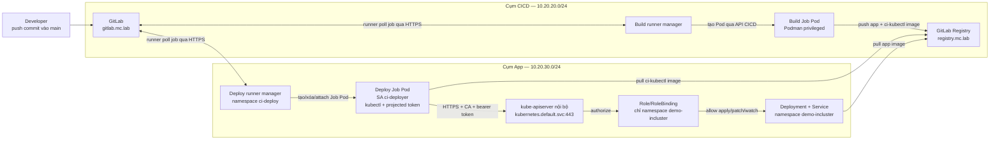

# Lab — `kubectl` trong Pod CI/CD dùng in-cluster ServiceAccount

> **Mục tiêu:** mô phỏng một kiến trúc thực tế trong đó pipeline GitLab tạo một Job Pod ngay
> trong cụm App. `kubectl` ở Job Pod không dùng kubeconfig quản trị, không nhận token dài hạn từ
> GitLab CI variable; nó xác thực bằng token của ServiceAccount được Kubernetes project vào Pod,
> rồi chỉ triển khai workload trong namespace `demo-incluster` theo RBAC tối thiểu.
>
> **Vị trí trong bộ lab:** lab độc lập nhưng tái sử dụng hạ tầng đã hoàn tất của
> [Lab M1](rke2-multi-cluster-labs/LAB-M1-BA-CUM-RKE2-RANCHER-GITLAB.md): GitLab và build runner ở cụm CICD, Registry,
> cụm App hai node, DNS `*.mc.lab`, CA lab và kết nối mạng giữa hai cụm. Lab này tạo namespace
> mới nên không tranh quyền quản lý resource `demo-app` với Argo CD của M1.
>
> **Điểm bắt đầu:** snapshot `m1-complete`, toàn bộ gate M1 §9 đang PASS.
> **Điểm kết thúc:** commit vào `platform/demo-app` được build ở cụm CICD, sau đó một Job Pod ở
> cụm App tự xác thực với API nội bộ và rollout Deployment trong `demo-incluster`.
>
> **Trạng thái kiểm chứng:** **READY FOR PILOT**. Chỉ đổi thành `READY` sau khi chạy từ
> `m1-complete`, lưu evidence của các gate dương/âm, restore snapshot và chạy lại thành công.
> Ngày đối chiếu tài liệu: **25/08/2026**.

---

## Mục lục

1. [Kiến trúc thực tế](#1-kiến-trúc-thực-tế)
2. [Cơ chế xác thực và ranh giới tin cậy](#2-cơ-chế-xác-thực-và-ranh-giới-tin-cậy)
3. [Quy hoạch và điều kiện đầu vào](#3-quy-hoạch-và-điều-kiện-đầu-vào)
4. [Tạo ServiceAccount và RBAC tối thiểu](#4-tạo-serviceaccount-và-rbac-tối-thiểu)
5. [Chuẩn bị image `kubectl` dùng trong CI](#5-chuẩn-bị-image-kubectl-dùng-trong-ci)
6. [Cài deploy runner vào cụm App](#6-cài-deploy-runner-vào-cụm-app)
7. [Khai báo workload và pipeline](#7-khai-báo-workload-và-pipeline)
8. [Gate end-to-end](#8-gate-end-to-end)
9. [Threat model và hardening](#9-threat-model-và-hardening)
10. [Troubleshooting](#10-troubleshooting)
11. [Rollback và cleanup](#11-rollback-và-cleanup)
12. [Nguồn chính thức](#12-nguồn-chính-thức)

---

## 1. Kiến trúc thực tế

### 1.1. Bức tranh toàn cảnh



### 1.2. Luồng một lần deploy

1. Developer push commit vào nhánh `main` của `platform/demo-app`.
2. Build runner trong cụm CICD tạo Build Job Pod, build app image và push tag
   `CI_COMMIT_SHORT_SHA` vào `registry.mc.lab`.
3. Deploy runner manager đang chạy trong cụm App poll GitLab bằng kết nối outbound HTTPS.
4. Runner manager yêu cầu API của **cụm App** tạo Deploy Job Pod trong `ci-deploy`, gắn
   `spec.serviceAccountName: ci-deployer`.
5. ServiceAccount admission controller thêm projected volume `kube-api-access-*`; kubelet lấy
   token có thời hạn qua TokenRequest API và mount token, CA, namespace vào Job Pod.
6. Script CI tạo kubeconfig tạm chỉ chứa đường dẫn `tokenFile` và CA đã mount, rồi chạy
   `kubectl apply` đến API nội bộ của cụm App.
7. API server xác thực identity
   `system:serviceaccount:ci-deploy:ci-deployer`, sau đó RBAC chỉ cho phép các verb đã khai báo
   trong namespace `demo-incluster`.
8. Job Pod bị runner xóa sau khi kết thúc; token bound với Pod không còn là credential dùng lâu
   dài. Không có token nào được chép vào GitLab variable hoặc commit vào Git.

### 1.3. Vì sao deploy runner phải nằm trong cụm App

In-cluster authentication luôn thuộc **cụm đã tạo Pod**:

- Pod trong cụm CICD nhận `KUBERNETES_SERVICE_HOST`, CA và token do cụm CICD cấp; identity đó
  không có giá trị đối với API của cụm App.
- Muốn deploy sang cụm App mà vẫn dùng in-cluster auth, Job Pod phải được tạo trong cụm App.
- GitLab server không cần nằm cùng cụm. Runner ở App chủ động poll GitLab qua HTTPS, nên không
  phải mở API Kubernetes ra cho GitLab hay đặt kubeconfig của App trong GitLab.

Nếu giữ mọi runner ở cụm CICD thì phải chọn cơ chế xuyên cụm khác như kubeconfig ngắn hạn/OIDC,
GitLab Agent, hoặc GitOps pull-based. Đó không còn là ví dụ in-cluster authentication thuần túy.

### 1.4. Hai ServiceAccount, hai trách nhiệm

| Identity | Pod sử dụng | Quyền |
| --- | --- | --- |
| ServiceAccount do chart tạo cho runner manager | Deployment `gitlab-runner-app` | Tạo/xóa/watch/attach Job Pod trong `ci-deploy` |
| `ci-deployer` | Từng Deploy Job Pod | Apply/watch workload trong `demo-incluster`; không quản lý Job Pod, không có verb API trực tiếp để đọc Secret |

Không gộp hai identity và tuyệt đối không bind `cluster-admin`. Runner manager cần quyền vòng đời
Job Pod; script do project kiểm soát chỉ cần quyền deploy workload mục tiêu.

---

## 2. Cơ chế xác thực và ranh giới tin cậy

### 2.1. Những gì Kubernetes mount vào Pod

Khi Pod chỉ định `serviceAccountName: ci-deployer` và không tắt automount, Kubernetes mount:

```text
/var/run/secrets/kubernetes.io/serviceaccount/
├── token       # bearer token có thời hạn, bound với Pod
├── ca.crt      # CA để xác minh TLS của kube-apiserver
└── namespace   # namespace hiện tại: ci-deploy
```

Đồng thời Pod nhận `KUBERNETES_SERVICE_HOST` và `KUBERNETES_SERVICE_PORT_HTTPS`. Lab dùng đúng
host/IP mà control plane công bố, CA đã mount và `tokenFile`; không dùng
`--insecure-skip-tls-verify`.

### 2.2. Điều `kubectl` không tự làm thay runbook

Các client library chính thức có hàm in-cluster config tự động. Với `kubectl` trong một image CI,
lab tạo kubeconfig tạm để nối ba dữ kiện đã mount:

```yaml
clusters:
  - cluster:
      server: https://${KUBERNETES_SERVICE_HOST}:${KUBERNETES_SERVICE_PORT_HTTPS}
      certificate-authority: /var/run/secrets/kubernetes.io/serviceaccount/ca.crt
users:
  - user:
      tokenFile: /var/run/secrets/kubernetes.io/serviceaccount/token
```

`tokenFile` tốt hơn chép nội dung token vào kubeconfig hoặc đưa token lên command line: kubeconfig
chỉ giữ đường dẫn đến file do kubelet quản lý và có thể đọc lại token đã rotate.

### 2.3. Authentication không thay thế authorization

Token trả lời câu hỏi “request này là ai”; RBAC trả lời “identity đó được làm gì”. Chỉ mount token
mà không có RoleBinding thì ServiceAccount gần như chỉ có quyền API discovery. Vì vậy gate của lab
phải chứng minh cả hai chiều:

- **PASS dương:** được apply/get/watch Deployment và Service trong `demo-incluster`.
- **PASS âm:** API từ chối verb trực tiếp `get secrets`, từ chối delete Deployment và từ chối
  đọc Secret ở `kube-system`.

Gate âm trên chứng minh RBAC trực tiếp, không chứng minh Secret trong namespace hoàn toàn bí mật:
identity được tạo/patch workload có thể sửa Pod template để mount một Secret cùng namespace. Rủi
ro này được chốt rõ trong [§9](#9-threat-model-và-hardening).

---

## 3. Quy hoạch và điều kiện đầu vào

### 3.1. Thành phần khóa theo baseline M1

| Thành phần | Giá trị |
| --- | --- |
| Kubernetes/RKE2 cụm App | `v1.35.7+rke2r1` theo M1 |
| `kubectl` trong CI | `v1.35.7`, copy từ `registry.k8s.io/kubectl:v1.35.7` |
| GitLab Runner chart | `0.91.2`, cùng bản với M1 §6.4 |
| Runner namespace | `ci-deploy` trên cụm App |
| Job ServiceAccount | `ci-deployer` trong `ci-deploy` |
| Workload namespace | `demo-incluster` trên cụm App |
| Runner tag | `app-incluster` |
| Build runner tag | `cicd-build` |
| Tool image | `registry.mc.lab/platform/demo-app/ci-kubectl:v1.35.7-r1` |

Không dùng `latest`. Khi baseline M1 nâng minor Kubernetes, nâng image `kubectl` theo version-skew
policy và chạy lại toàn bộ gate của lab.

### 3.2. Ranh giới sở hữu resource

| Namespace | Owner | Resource chính |
| --- | --- | --- |
| `gitlab-runner` ở cụm CICD | build runner M1 | Build Job Pod đặc quyền |
| `ci-deploy` ở cụm App | deploy runner của lab này | Runner manager, Deploy Job Pod, `ci-deployer` |
| `demo-incluster` ở cụm App | pipeline direct-deploy | Deployment `incluster-web`, Service cùng tên |
| `demo-app` ở cụm App | Argo CD M1 | Không được pipeline lab này sửa |

Không để Argo CD và pipeline `kubectl apply` cùng sở hữu một resource. Hai reconciler cùng sửa một
Deployment sẽ tạo drift và rollout lặp, không phải HA.

### 3.3. Preflight

Chạy trên `mc-app1`:

```bash
export KUBECONFIG=/etc/rancher/rke2/rke2.yaml

kubectl get node mc-app1 mc-app2
# PASS: cả hai Ready, VERSION v1.35.7+rke2r1.

kubectl get --raw='/readyz?verbose' | tail -1
# PASS: readyz check passed.

getent hosts gitlab.mc.lab registry.mc.lab
# PASS: cả hai resolve về 10.20.20.11.

curl -fsS --cacert /usr/local/share/ca-certificates/mc-lab-ca.crt \
  https://gitlab.mc.lab/-/health
# PASS: HTTP 200; output có GitLab OK.

helm version --short
kubectl version -o yaml | grep -E 'gitVersion: v1\.35\.7'
# PASS: Helm chạy được; cả client/server kubectl gate đều thấy v1.35.7.

test -r /usr/local/share/ca-certificates/mc-lab-ca.crt
grep -A3 'registry.mc.lab' /etc/rancher/rke2/registries.yaml
# PASS: CA lab tồn tại và RKE2 containerd của App đã trust registry như M1 §7.2.
```

Trên GitLab UI:

1. Project `platform/demo-app` tồn tại và pipeline build của M1 đang xanh.
2. Runner build hiện hữu được gắn tag `cicd-build`, bỏ **Run untagged jobs**.
3. Nhánh `main` là protected branch; chỉ maintainer được merge/push.
4. Deploy token `registry-pull` có duy nhất scope `read_registry` còn hiệu lực.

Nếu một gate fail, dừng tại đây và sửa M1; không tạo thêm runner trên nền cụm lỗi.

### 3.4. Quy ước khi gate FAIL

1. Dừng, không làm mục sau.
2. Chẩn đoán bằng [§10](#10-troubleshooting), sửa rồi chạy lại đúng gate.
3. Nếu trạng thái khó xác định, restore đồng bộ snapshot `m1-complete` của đủ sáu VM theo protocol
   M1 §2.4 rồi làm lại lab từ đầu.

---

## 4. Tạo ServiceAccount và RBAC tối thiểu

### 4.1. Namespace, ServiceAccount và Role

Chạy trên `mc-app1`:

```bash
kubectl apply -f - <<'EOF'
apiVersion: v1
kind: Namespace
metadata:
  name: ci-deploy
---
apiVersion: v1
kind: Namespace
metadata:
  name: demo-incluster
---
apiVersion: v1
kind: ServiceAccount
metadata:
  name: ci-deployer
  namespace: ci-deploy
automountServiceAccountToken: true
---
apiVersion: rbac.authorization.k8s.io/v1
kind: Role
metadata:
  name: ci-workload-deployer
  namespace: demo-incluster
rules:
  - apiGroups: ["apps"]
    resources: ["deployments"]
    verbs: ["create", "get", "list", "watch", "patch", "update"]
  - apiGroups: ["apps"]
    resources: ["replicasets"]
    verbs: ["get", "list", "watch"]
  - apiGroups: [""]
    resources: ["services"]
    verbs: ["create", "get", "list", "watch", "patch", "update"]
  - apiGroups: [""]
    resources: ["pods"]
    verbs: ["get", "list", "watch"]
---
apiVersion: rbac.authorization.k8s.io/v1
kind: RoleBinding
metadata:
  name: ci-workload-deployer
  namespace: demo-incluster
subjects:
  - kind: ServiceAccount
    name: ci-deployer
    namespace: ci-deploy
roleRef:
  apiGroup: rbac.authorization.k8s.io
  kind: Role
  name: ci-workload-deployer
EOF
```

RoleBinding nằm trong `demo-incluster` nhưng subject được phép nằm ở `ci-deploy`. Đây là cách cấp
quyền namespaced xuyên namespace mà không cần ClusterRoleBinding.

### 4.2. Gate RBAC trước khi có pipeline

```bash
SA='system:serviceaccount:ci-deploy:ci-deployer'

kubectl auth can-i create deployments.apps -n demo-incluster --as="$SA"
kubectl auth can-i patch deployments.apps -n demo-incluster --as="$SA"
kubectl auth can-i watch pods -n demo-incluster --as="$SA"
# PASS: cả ba dòng yes.

kubectl auth can-i delete deployments.apps -n demo-incluster --as="$SA"
kubectl auth can-i get secrets -n demo-incluster --as="$SA"
kubectl auth can-i get secrets -n kube-system --as="$SA"
kubectl auth can-i create deployments.apps -n demo-app --as="$SA"
# PASS âm: cả bốn dòng no.

kubectl get role,rolebinding -n demo-incluster
kubectl get serviceaccount ci-deployer -n ci-deploy
```

**STOP** nếu bất kỳ quyền âm nào trả `yes`. Tìm và gỡ RoleBinding/ClusterRoleBinding rộng đã cấp
ngoài lab; không bù bằng `cluster-admin` để pipeline “chạy cho được”.

### 4.3. Tạo pull Secret ngoài pipeline

Job Pod phải pull tool image riêng và workload phải pull app image riêng. Tạo hai Secret cùng dữ
liệu nhưng khác namespace; pipeline không có verb API trực tiếp để đọc/tạo/sửa chúng.

```bash
read -rsp 'Deploy token registry-pull: ' LAB_REGISTRY_TOKEN; echo

for ns in ci-deploy demo-incluster; do
  kubectl -n "$ns" create secret docker-registry regcred \
    --docker-server=registry.mc.lab \
    --docker-username=registry-pull \
    --docker-password="$LAB_REGISTRY_TOKEN" \
    --dry-run=client -o yaml | kubectl apply -f -
done

kubectl -n ci-deploy patch serviceaccount ci-deployer --type merge \
  -p '{"imagePullSecrets":[{"name":"regcred"}]}'
unset LAB_REGISTRY_TOKEN

kubectl -n ci-deploy get serviceaccount ci-deployer \
  -o jsonpath='{.imagePullSecrets[*].name}{"\n"}'
# PASS: regcred.
```

Không in Secret bằng `-o yaml`, không đặt deploy token vào `.gitlab-ci.yml`, và không cấp verb
`get` trên `secrets` cho `ci-deployer`.

---

## 5. Chuẩn bị image `kubectl` dùng trong CI

Dockerfile Kubernetes chính thức khai `ENTRYPOINT ["/bin/kubectl"]` và không cung cấp contract
“CI job image có POSIX shell”; GitLab Kubernetes executor cần shell để thực thi script. Vì vậy tạo
image nội bộ nhỏ, copy đúng binary đã pin từ image chính thức sang Alpine. Không cài `kubectl` động
ở mỗi pipeline.

Thêm file `ci/Dockerfile.kubectl` vào project `platform/demo-app`:

```dockerfile
FROM registry.k8s.io/kubectl:v1.35.7 AS kubectl

FROM alpine:3.22.1
COPY --from=kubectl /bin/kubectl /usr/local/bin/kubectl

RUN addgroup -g 65532 ci && \
    adduser -D -u 65532 -G ci -h /home/ci ci
USER 65532:65532
WORKDIR /workspace
```

Image này có `/bin/sh` từ Alpine và `kubectl v1.35.7`; không chứa kubeconfig hay token. Token chỉ
xuất hiện khi Kubernetes tạo Job Pod ở §7.

Pipeline ở §7 build và push image thành:

```text
registry.mc.lab/platform/demo-app/ci-kubectl:v1.35.7-r1
```

**Gate sau pipeline đầu tiên:** GitLab UI → Deploy → Container Registry hiện repository
`ci-kubectl` và tag `v1.35.7-r1`. Không chuyển sang tag `latest`.

---

## 6. Cài deploy runner vào cụm App

### 6.1. Tạo project runner trên GitLab

Trong `platform/demo-app`:

1. **Settings → CI/CD → Runners → New project runner**.
2. Tag: `app-incluster`.
3. Tắt **Run untagged jobs**; bật **Protected**; không cho project khác dùng runner này.
4. Tạo runner và lấy authentication token `glrt-...` một lần.

Project runner thu hẹp blast radius ở tầng GitLab: project khác không được gửi script vào Pod có
identity `ci-deployer`.

### 6.2. Cài chart trên `mc-app1`

```bash
kubectl -n ci-deploy create secret generic mc-lab-ca-cert \
  --from-file=gitlab.mc.lab.crt=/usr/local/share/ca-certificates/mc-lab-ca.crt \
  --dry-run=client -o yaml | kubectl apply -f -

helm repo add gitlab https://charts.gitlab.io --force-update
helm repo update
helm show chart gitlab/gitlab-runner --version 0.91.2 | \
  grep -E '^(version|appVersion):'
# PASS: version đúng 0.91.2; khác hoặc không tìm thấy thì STOP.

read -rsp 'Project runner token glrt-...: ' LAB_RUNNER_TOKEN; echo
helm upgrade --install gitlab-runner-app gitlab/gitlab-runner \
  -n ci-deploy --version 0.91.2 \
  --set-string runnerToken="$LAB_RUNNER_TOKEN" \
  --wait --timeout 10m -f - <<'EOF'
gitlabUrl: https://gitlab.mc.lab
certsSecretName: mc-lab-ca-cert
rbac:
  create: true
concurrent: 1
runners:
  config: |
    [[runners]]
      name = "app-incluster-deployer"
      executor = "kubernetes"
      [runners.kubernetes]
        namespace = "ci-deploy"
        image = "registry.mc.lab/platform/demo-app/ci-kubectl:v1.35.7-r1"
        privileged = false
        service_account = "ci-deployer"
        service_account_overwrite_allowed = ""
        namespace_overwrite_allowed = ""
        use_service_account_image_pull_secrets = true
        poll_timeout = 300
        [runners.kubernetes.pod_labels]
          "app.kubernetes.io/part-of" = "incluster-cicd-lab"
EOF
unset LAB_RUNNER_TOKEN
```

Ba khóa không được nới trong lab:

- `privileged = false`: deploy không cần container đặc quyền.
- `service_account_overwrite_allowed = ""`: `.gitlab-ci.yml` không được chọn ServiceAccount khác.
- `namespace_overwrite_allowed = ""`: job luôn được tạo trong `ci-deploy`.

### 6.3. Gate runner manager

```bash
kubectl -n ci-deploy rollout status deployment/gitlab-runner-app --timeout=300s
kubectl -n ci-deploy get pod -o wide

MANAGER_SA=$(kubectl -n ci-deploy get deployment gitlab-runner-app \
  -o jsonpath='{.spec.template.spec.serviceAccountName}')
echo "runner-manager-serviceaccount=$MANAGER_SA"
test "$MANAGER_SA" != 'ci-deployer'
# PASS: Deployment Available; manager SA không phải ci-deployer.
```

GitLab UI phải hiện runner `app-incluster-deployer` **Online**, locked vào project, Protected,
không chạy untagged job.

---

## 7. Khai báo workload và pipeline

### 7.1. Cấu trúc repository

```text
platform/demo-app/
├── .gitlab-ci.yml
├── ci/
│   └── Dockerfile.kubectl
├── k8s/
│   └── app.yaml
├── Dockerfile
└── index.html
```

`Dockerfile` và `index.html` giữ nguyên từ M1. Tạo `k8s/app.yaml`:

```yaml
apiVersion: apps/v1
kind: Deployment
metadata:
  name: incluster-web
  namespace: demo-incluster
  labels:
    app: incluster-web
spec:
  replicas: 2
  selector:
    matchLabels:
      app: incluster-web
  template:
    metadata:
      labels:
        app: incluster-web
    spec:
      automountServiceAccountToken: false
      imagePullSecrets:
        - name: regcred
      containers:
        - name: web
          image: registry.mc.lab/platform/demo-app:__TAG__
          ports:
            - name: http
              containerPort: 80
          readinessProbe:
            httpGet:
              path: /
              port: http
            initialDelaySeconds: 2
            periodSeconds: 5
          resources:
            requests:
              cpu: 25m
              memory: 32Mi
            limits:
              cpu: 250m
              memory: 128Mi
      topologySpreadConstraints:
        - maxSkew: 1
          topologyKey: kubernetes.io/hostname
          whenUnsatisfiable: DoNotSchedule
          labelSelector:
            matchLabels:
              app: incluster-web
---
apiVersion: v1
kind: Service
metadata:
  name: incluster-web
  namespace: demo-incluster
spec:
  selector:
    app: incluster-web
  ports:
    - name: http
      port: 80
      targetPort: http
```

Workload app không gọi Kubernetes API nên tắt `automountServiceAccountToken`. Chỉ Job Pod deploy
mới cần token.

### 7.2. Pipeline đầy đủ

Thay `.gitlab-ci.yml` bằng nội dung sau. Nếu muốn giữ job khác của M1, merge theo `stages` và giữ
nguyên hai tag runner:

```yaml
stages: [toolchain, build, deploy]

variables:
  CI_KUBECTL_IMAGE: "$CI_REGISTRY_IMAGE/ci-kubectl:v1.35.7-r1"

build-ci-kubectl:
  stage: toolchain
  tags: [cicd-build]
  image: quay.io/podman/stable:v5.8.2
  rules:
    - changes: [ci/Dockerfile.kubectl]
    - when: manual
      allow_failure: true
  script:
    - mkdir -p /etc/containers/certs.d/registry.mc.lab
    - cp /custom-certs/gitlab.mc.lab.crt /etc/containers/certs.d/registry.mc.lab/ca.crt
    - podman login -u gitlab-ci-token -p "$CI_JOB_TOKEN" "$CI_REGISTRY"
    - podman build -f ci/Dockerfile.kubectl -t "$CI_KUBECTL_IMAGE" .
    - podman push "$CI_KUBECTL_IMAGE"

build-app:
  stage: build
  tags: [cicd-build]
  image: quay.io/podman/stable:v5.8.2
  script:
    - mkdir -p /etc/containers/certs.d/registry.mc.lab
    - cp /custom-certs/gitlab.mc.lab.crt /etc/containers/certs.d/registry.mc.lab/ca.crt
    - podman login -u gitlab-ci-token -p "$CI_JOB_TOKEN" "$CI_REGISTRY"
    - podman build -t "$CI_REGISTRY_IMAGE:$CI_COMMIT_SHORT_SHA" .
    - podman push "$CI_REGISTRY_IMAGE:$CI_COMMIT_SHORT_SHA"

deploy-app-incluster:
  stage: deploy
  tags: [app-incluster]
  image:
    name: "$CI_KUBECTL_IMAGE"
    entrypoint: [""]
  needs: [build-app]
  rules:
    - if: '$CI_COMMIT_BRANCH == $CI_DEFAULT_BRANCH'
  before_script:
    - export SA_DIR=/var/run/secrets/kubernetes.io/serviceaccount
    - test -r "$SA_DIR/token" -a -r "$SA_DIR/ca.crt" -a -r "$SA_DIR/namespace"
    - export KUBECONFIG="$CI_PROJECT_DIR/.incluster-kubeconfig"
    - |
      cat > "$KUBECONFIG" <<EOF
      apiVersion: v1
      kind: Config
      clusters:
        - name: in-cluster
          cluster:
            server: https://${KUBERNETES_SERVICE_HOST}:${KUBERNETES_SERVICE_PORT_HTTPS}
            certificate-authority: ${SA_DIR}/ca.crt
      users:
        - name: pod-serviceaccount
          user:
            tokenFile: ${SA_DIR}/token
      contexts:
        - name: deploy
          context:
            cluster: in-cluster
            user: pod-serviceaccount
            namespace: demo-incluster
      current-context: deploy
      EOF
    - chmod 600 "$KUBECONFIG"
  script:
    - kubectl version -o yaml
    - kubectl auth whoami
    - test "$(kubectl auth can-i create deployments.apps -n demo-incluster)" = yes
    - test "$(kubectl auth can-i patch deployments.apps -n demo-incluster)" = yes
    - test "$(kubectl auth can-i get secrets -n demo-incluster)" = no
    - test "$(kubectl auth can-i get secrets -n kube-system)" = no
    - test "$(kubectl auth can-i delete deployments.apps -n demo-incluster)" = no
    - stat -c '%n %s bytes' "$SA_DIR/token" "$SA_DIR/ca.crt" "$SA_DIR/namespace"
    - sed "s/__TAG__/${CI_COMMIT_SHORT_SHA}/g" k8s/app.yaml | kubectl apply -f -
    - kubectl -n demo-incluster rollout status deployment/incluster-web --timeout=300s
    - kubectl -n demo-incluster get pods -l app=incluster-web -o wide
  after_script:
    - rm -f "$CI_PROJECT_DIR/.incluster-kubeconfig"
```

Không thêm lệnh `cat $SA_DIR/token`, không bật shell trace `set -x`, và không chạy `kubectl -v=7`
trở lên: log mức cao có thể làm lộ header/request nhạy cảm.

### 7.3. Chi tiết cần thấy trong log deploy

`kubectl auth whoami` phải trả identity tương đương:

```text
ATTRIBUTE   VALUE
Username    system:serviceaccount:ci-deploy:ci-deployer
Groups      [system:serviceaccounts system:serviceaccounts:ci-deploy system:authenticated]
```

Tên file token và kích thước được phép xuất hiện; **nội dung token không được xuất hiện**. Dòng
`kubectl version` phải cho client `v1.35.7` và server `v1.35.7`.

---

## 8. Gate end-to-end

### 8.1. Gate pipeline

Push commit vào protected branch `main`. Pipeline phải thể hiện đúng placement:

- `build-ci-kubectl` và `build-app` chạy trên runner tag `cicd-build` ở cụm CICD;
- `deploy-app-incluster` chạy trên runner tag `app-incluster` ở cụm App;
- deploy log hiện đúng ServiceAccount identity và ba phép thử âm đều PASS;
- không có kubeconfig/token được khai trong GitLab CI/CD Variables.

Nếu tool image chưa tồn tại và `build-ci-kubectl` bị skip, bấm chạy manual job đó một lần rồi retry
pipeline. Không đổi deploy job sang image trôi nổi để vượt gate.

### 8.2. Gate runtime trên cụm App

Chạy trên `mc-app1` sau pipeline xanh:

```bash
kubectl -n demo-incluster get deployment,replicaset,pod,service -o wide
# PASS: Deployment 2/2 Available; hai Pod Running, trải trên mc-app1 và mc-app2.

read -rp 'Nhập CI_COMMIT_SHORT_SHA của pipeline xanh: ' DEPLOYED_TAG
test -n "$DEPLOYED_TAG"
EXPECTED_IMAGE="registry.mc.lab/platform/demo-app:${DEPLOYED_TAG}"
ACTUAL_IMAGE=$(kubectl -n demo-incluster get deployment incluster-web \
  -o jsonpath='{.spec.template.spec.containers[0].image}')
echo "expected=$EXPECTED_IMAGE"
echo "actual=$ACTUAL_IMAGE"
test "$ACTUAL_IMAGE" = "$EXPECTED_IMAGE"
unset DEPLOYED_TAG EXPECTED_IMAGE ACTUAL_IMAGE

kubectl -n demo-incluster get endpointslice \
  -l kubernetes.io/service-name=incluster-web
# PASS: có hai endpoint ready=true.

kubectl auth can-i --list \
  --as=system:serviceaccount:ci-deploy:ci-deployer \
  -n demo-incluster
# PASS: không có secrets; deployments không có delete/deletecollection.
```

### 8.3. Gate chứng minh token là projected và bound với Job Pod

Trong lúc retry deploy job, chạy nhanh trên `mc-app1`:

```bash
JOB_POD=$(kubectl -n ci-deploy get pod \
  -l app.kubernetes.io/part-of=incluster-cicd-lab \
  --sort-by=.metadata.creationTimestamp \
  -o jsonpath='{.items[-1:].metadata.name}')

kubectl -n ci-deploy get pod "$JOB_POD" \
  -o jsonpath='{.spec.serviceAccountName}{"\n"}'
# PASS: ci-deployer.

kubectl -n ci-deploy get pod "$JOB_POD" -o yaml | \
  grep -A22 'kube-api-access-'
# PASS: volume type projected có serviceAccountToken, kube-root-ca.crt và downwardAPI;
# không có Secret loại kubernetes.io/service-account-token do lab tự tạo.
```

Runner thường xóa Job Pod ngay khi job xong; “NotFound” sau khi job kết thúc là hành vi dự kiến,
không phải gate fail. Không sửa runner để giữ Pod lâu chỉ nhằm lấy evidence.

### 8.4. Gate cuối

```bash
test "$(kubectl auth can-i get secrets -n demo-incluster \
  --as=system:serviceaccount:ci-deploy:ci-deployer)" = no
test "$(kubectl auth can-i delete deployments.apps -n demo-incluster \
  --as=system:serviceaccount:ci-deploy:ci-deployer)" = no
test "$(kubectl auth can-i create deployments.apps -n demo-app \
  --as=system:serviceaccount:ci-deploy:ci-deployer)" = no
kubectl -n demo-incluster wait --for=condition=Available \
  deployment/incluster-web --timeout=300s
echo 'PASS-E2E: GitLab -> App runner -> projected SA token -> RBAC -> rollout'
```

Snapshot đủ sáu VM với tên `m1-incluster-auth-ready` theo protocol M1 §2.4. Sau restore, runner
phải Online và một commit mới phải tạo được tag image mới rồi rollout lại thành công.

---

## 9. Threat model và hardening

### 9.1. Điều thiết kế này bảo vệ

- Không có kubeconfig admin hay token ServiceAccount dài hạn nằm trong GitLab database/variable.
- Xóa Job Pod làm credential bound với Pod hết hiệu lực; kubelet cũng rotate token trước khi hết
  hạn trong một job dài.
- RBAC namespaced giới hạn tác động của script CI bị lỗi hoặc bị sửa ác ý vào
  `demo-incluster`, thay vì toàn cluster.
- Build đặc quyền nằm ở cụm CICD; deploy job trong cụm App không privileged.
- Project runner, protected branch và runner tag tạo thêm ranh giới ở tầng GitLab.

### 9.2. Điều thiết kế này không tự bảo vệ

- Script đang chạy đọc được token của chính nó và có thể lạm dụng quyền trong thời gian Pod còn
  sống. Token ngắn hạn không thay thế least privilege.
- Người có quyền sửa pipeline trên protected branch tương đương người có quyền deploy trong phạm
  vi Role.
- Người có quyền đọc/exec Pod trong `ci-deploy` có thể thấy CI variables và credential mount của
  job đang chạy.
- Quyền create/patch Deployment là quyền mạnh: pipeline có thể chọn image tùy ý, sửa Pod template,
  mount một Secret cùng namespace hoặc chọn ServiceAccount mạnh hơn nếu namespace có account đó.
  Vì vậy `can-i get secrets = no` chỉ là từ chối API trực tiếp, không bảo đảm bí mật gián tiếp.
- Không có NetworkPolicy thì Job Pod có thể egress ra ngoài; lab chưa chặn đường exfiltration.
- Runner manager có quyền vòng đời Pod trong `ci-deploy`; account quản trị namespace đó là một
  trust boundary riêng.

### 9.3. Hardening production nên bổ sung

1. Tách runner theo environment (`dev`, `staging`, `prod`) và dùng ServiceAccount/Role riêng.
2. Dùng protected runner, protected branch/tag, approval và environment protection phù hợp edition
   GitLab đang dùng.
3. Áp NetworkPolicy egress cho `ci-deploy`: chỉ DNS, GitLab/Registry và Kubernetes API; kiểm chứng
   CNI enforcement trước khi coi policy là security control.
4. Bật audit log API server, theo dõi username
   `system:serviceaccount:ci-deploy:ci-deployer` và gắn correlation với GitLab job ID.
5. Dùng admission policy để chặn privileged/hostPath/hostNetwork cho Job Pod và workload.
6. Giữ namespace đích chuyên dụng, không đặt ServiceAccount đặc quyền hay Secret không liên quan
   trong đó; dùng admission policy để giới hạn ServiceAccount và loại volume mà pipeline được khai.
7. Mirror/pin image bằng digest, scan/SBOM/sign tool image; không tin tag đơn lẻ trong production.
8. Với production ưu tiên GitOps cho rollout thường xuyên; direct `kubectl` phù hợp cho lab,
   bootstrap hoặc tác vụ vận hành có ranh giới rõ.

---

## 10. Troubleshooting

| Triệu chứng | Kiểm tra và cách xử lý |
| --- | --- |
| Runner App Offline | `kubectl -n ci-deploy logs deploy/gitlab-runner-app`; kiểm DNS `gitlab.mc.lab`, CA secret và token `glrt-...` |
| Job Pending, `image pull secret not found` | `kubectl -n ci-deploy get sa ci-deployer -o yaml`; phải có `imagePullSecrets: regcred` |
| Tool image `not found` | Chạy `build-ci-kubectl` trên runner `cicd-build`; kiểm tag đúng `v1.35.7-r1` trong Registry |
| Job image chạy nhưng báo thiếu shell | Đang dùng thẳng image tối giản `registry.k8s.io/kubectl`; phải dùng image nội bộ tạo ở §5 |
| `x509: certificate signed by unknown authority` khi runner nối GitLab | Secret `mc-lab-ca-cert` sai key/path hoặc `certsSecretName` chưa gắn; rollout restart runner sau khi sửa |
| `x509` khi Job Pod gọi API | Kubeconfig phải trỏ `certificate-authority` đến `$SA_DIR/ca.crt`; không dùng CA GitLab cho kube-apiserver |
| `The connection to the server ... was refused` | Kiểm `KUBERNETES_SERVICE_HOST/PORT`; không hard-code IP `10.20.30.11` hay dùng API của cụm CICD |
| `Unauthorized` | Token file không mount/đã hết hạn hoặc Pod không dùng `ci-deployer`; kiểm `spec.serviceAccountName` |
| `Forbidden` khi apply Deployment | Xác thực đã qua nhưng Role/RoleBinding thiếu verb/resource; chạy gate §4.2, không cấp `cluster-admin` |
| `Forbidden` khi đọc Secret | Đây là PASS âm theo thiết kế; pipeline không được tự tạo/copy registry credential |
| Workload `ImagePullBackOff` | Kiểm `regcred` trong `demo-incluster` và CA registry trên cả hai node App; Secret ở `ci-deploy` không dùng chéo namespace |
| Hai Pod không trải hai node | Kiểm cả hai node Ready/capacity; `DoNotSchedule` cố ý giữ replica Pending nếu chỉ còn một topology khả dụng |
| Resource bị Argo CD đổi ngược | Pipeline đã chạm namespace/resource do Argo CD sở hữu; quay về `demo-incluster`, một resource chỉ có một reconciler |

Lệnh chẩn đoán nhanh trên `mc-app1`:

```bash
kubectl -n ci-deploy get pod,deploy,sa,role,rolebinding -o wide
kubectl -n ci-deploy logs deployment/gitlab-runner-app --tail=100
kubectl -n ci-deploy get events --sort-by=.lastTimestamp | tail -30
kubectl -n demo-incluster get all -o wide
kubectl -n demo-incluster get events --sort-by=.lastTimestamp | tail -30
kubectl auth can-i --list \
  --as=system:serviceaccount:ci-deploy:ci-deployer \
  -n demo-incluster
```

---

## 11. Rollback và cleanup

### 11.1. Rollback ứng dụng, không rollback hạ tầng runner

Lấy tag image xanh trước đó từ GitLab Registry rồi chạy bằng một commit revert trong Git. Pipeline
build/deploy lại commit đó để giữ audit trail. Không dùng `kubectl rollout undo` làm quy trình chính
vì lần `kubectl apply` sau sẽ lại áp image trong Git.

### 11.2. Cleanup toàn bộ lab

Chỉ thực hiện khi muốn xóa lab này. Trước hết pause runner trong GitLab UI và chờ không còn job:

```bash
kubectl -n ci-deploy get pod
# STOP nếu còn Job Pod Running; chỉ tiếp tục khi không còn pipeline đang chạy.

helm uninstall gitlab-runner-app -n ci-deploy
kubectl delete namespace demo-incluster
kubectl delete namespace ci-deploy
```

Sau đó xóa project runner `app-incluster` trong GitLab UI. Có thể giữ tool image để audit hoặc xóa
tag `ci-kubectl:v1.35.7-r1` qua GitLab Registry UI theo retention policy; không xóa app image còn
được Deployment/Argo CD khác sử dụng.

---

## 12. Nguồn chính thức

- Kubernetes — Accessing the API from a Pod:
  <https://kubernetes.io/docs/tasks/run-application/access-api-from-pod/>
- Kubernetes — Configure Service Accounts for Pods:
  <https://kubernetes.io/docs/tasks/configure-pod-container/configure-service-account/>
- Kubernetes — Managing Service Accounts, bound projected token và TokenRequest:
  <https://kubernetes.io/docs/reference/access-authn-authz/service-accounts-admin/>
- Kubernetes — Service Accounts:
  <https://kubernetes.io/docs/concepts/security/service-accounts/>
- Kubernetes — Using RBAC Authorization:
  <https://kubernetes.io/docs/reference/access-authn-authz/rbac/>
- Kubernetes — RBAC good practices:
  <https://kubernetes.io/docs/concepts/security/rbac-good-practices/>
- Kubernetes — kubeconfig v1 (`certificate-authority`, `server`, `tokenFile`):
  <https://kubernetes.io/docs/reference/config-api/kubeconfig.v1/>
- Kubernetes — `kubectl auth whoami`:
  <https://kubernetes.io/docs/reference/kubectl/generated/kubectl_auth/kubectl_auth_whoami/>
- Kubernetes — download/container image releases:
  <https://kubernetes.io/releases/download/>
- Kubernetes v1.35.7 — Dockerfile chính thức của image `kubectl`:
  <https://github.com/kubernetes/kubernetes/blob/v1.35.7/build/server-image/kubectl/Dockerfile>
- GitLab — Kubernetes executor, in-cluster autodiscovery, ServiceAccount và RBAC:
  <https://docs.gitlab.com/runner/executors/kubernetes/>
- GitLab — GitLab Runner Helm chart:
  <https://docs.gitlab.com/runner/install/kubernetes/>

---

*Lab thiết kế ngày 25/08/2026 cho baseline M1 RKE2/Kubernetes v1.35.7. Đây là mô hình học tập
và pilot kiến trúc; chưa phải chứng nhận production end-to-end.*
